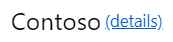
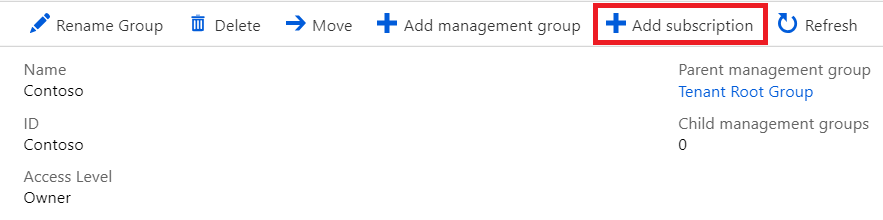

## Scenario 3: Add a subscription to the Management group

By adding a subscription to **Contoso** management group, all management configurations made at management group level will be automatically inherited to the subscription. In this case, **Contoso DevOps Group** will be automatically assigned **Reader role** at subscription level.

## Part A: Adding the subscription to the Azure Management Group

1. In the left pane of the Azure portal, click **All services**

2. Click **Management groups**

3. Click on **Contoso** management group

4. Click on **(details)** next to management group name: **Contoso**  

    

5. From the top menu click on **Add subscription**

    

6. In the Add subscription blade select **Contoso Azure Subscription** from the subscription dropdown 

7. Click on **Save**

## Part B: Check the inherited Role assignment in the Subscription

1. After **Add subscription** process succeeds click on **Contoso Azure Subscription**

2. On the left, under Overview, click on **Access control (IAM)**

3. From the top menu click on **Role assignments**

4. Check that the newly created **Role assignment** is present at subscription level, otherwise click on **Refresh**
