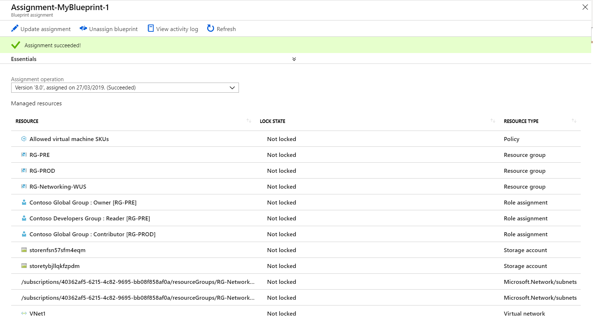

## Scenario 8: Publish and assign a Blueprint

Now that all the planned artifacts have been added to the blueprint, it's time to publish it. Publishing makes the Blueprint available to be assigned to a subscription.

## Part A: Publishing a Blueprint

1. Click on **Blueprint definitions**

1. Click the ellipsis  to the right of **MyBlueprint** and select **Publish blueprint** 

1. On the **Publish blueprint** dialog copy and paste: **1.0** for Version (letters, numbers, and hyphens with a max length of 20 characters are accepted)

1. In **Change notes** copy and paste: **First publish**

1. Click **Publish** at the bottom of the page

Now, let's assign the published blueprint to a subscription.

## Part B: Assigning a Blueprint

1. Click the ellipsis  to the right of **MyBlueprint** and select **Assign blueprint**

1. On the **Assign blueprint** blade, on the Subscription(s) dropdown select **Contoso Azure Subscription** 

> Subscription(s) field may be disabled if you selected only one subscription for Definition location when creating a new blueprint draft. If you define the blueprint Definition location to be an Azure Management Group, then you can assign the blueprint to any subscription(s) hosted inside that group. Also, if available through an Enterprise offering, a **Create new** option is displayed for creating a new subscription [(Learn more)](https://docs.microsoft.com/en-us/azure/governance/blueprints/create-blueprint-portal#create-a-blueprint)

4. For **Assignment name** copy and paste: **Assignment-MyBlueprint-1**

1. For **Location**, click and select **West US**

> Blueprints need **managed identities** for applying assignments and deploying artifacts. You can use your own managed identity or let Azure create one for you. In this step you select the location to store system created managed identity and (optional) new subscription object [(Learn more)](https://docs.microsoft.com/en-us/azure/active-directory/managed-identities-azure-resources/overview)

6. Leave default values for **Lock assignment (Don´t lock)**, **Blueprint definition version (1.0)**, and **Managed identity (System assigned)**

1. Under **Artifact Parameters** copy and paste: **["Standard_A1"]** for Allowed SKUs policy parameter

   > Note: This value must be a JSON array in brackets, for example: ["First_value","Second_value"]

8. Under **Production resource group** copy and paste: **RG-PROD** for Resource group: Name, and select **West US** for Resource group: Location

1. For **"`<user or group TBD>` : Contributor"** copy and paste: **Contoso Global Group** and then select the value from the dropdown

   > This action will ensure that this security group will always have contributor access to this resource group

10. Leave the defaults for **Storage Account**

1. Under **Pre-Production resource group** copy and paste: **RG-PRE** for Resource group: Name, and select **West US** for Resource group: Location

1. For **"`<user or group TBD>` : Owner"** copy and paste: **Contoso Global Group** and then select the value from the dropdown

1. For **"`<user or group TBD>` : Readers"** copy and paste: **Contoso Developers Group** and then select the value from the dropdown

1. Leave the defaults for **Storage Account**

1. Under **Networking resource group** copy and paste: **RG-Networking-WUS** for Resource group: Name, and select **West US** for Resource group: Location

1. For subnet1Name copy and paste: **Subnet-PROD** and for subnet2Name copy and paste: **Subnet-PRE**

1. Leave the defaults for the rest of **VNET** values and click **Assign**

## Part C: Track the deployment of a Blueprint

When a blueprint has been assigned to one or more subscriptions, two things happen:

* The blueprint is added to the **Assigned blueprints** page, listed by subscription assigned to
* The process of deploying all the artifacts defined by the blueprint begins

Now that the blueprint has been assigned to a subscription, you will verify progress of the deployment.

1. Click on **Assigned blueprints** on the left Blueprints menu

2. In the list of assignments, click on **Assignment-MyBlueprint-1** to see the assignment details

3. On the **Blueprint assignment** page, validate that all artifacts have been successfully deployed and that there have been no errors during the deployment

4. After assignment succeeds, you can review the newly created resources and assignments

> Note: It may take 5-10 mins for the deployment to complete. You can click the Refresh button to get an update on the progress

5. The recording ended, you can close the window

   > You can update the parameters and settings of an assigned blueprint by going to **Assigned blueprints**, right-clicking on the assignment and selecting **Update blueprint**. 

   > You can also edit an existing blueprint to add or remove artifacts, by going to **Blueprint definitions**, right-clicking on the blueprint and selecting **Edit blueprint**.
