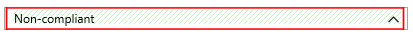

## Scenario 9: Review Policies

When a resource is non-compliant, the compliance details for that resource are available from the **Policy compliance** page. The compliance details pane includes details such as name, type, location, resource ID, compliance state and timestamp of the last evaluation for the current policy assignment. It also includes a list of reasons for the resource non-compliance

## Part A: Accessing Azure Portal

   > **Note:**  All actions that you perform in Azure require some level of permissions. These Azure Governance configurations that we are about to make require high levels of permissions, which for security reasons are not allowed for end users.
   To walk through the steps in the Lab we have created a simulation that you can click through. Follow the steps in the guide while navigating the interactive experience.

1. On the Windows desktop, click the **Compliance-and-Graph.exe** shortcut and maximize the window

## Part B: Check resource compliance

1.	In the left pane of the Azure portal, click **All services** then click **Management + governance**

2.	Click **Policy**

3.	On the **Policy Overview** blade, click the first Policy in the list: **Allowed virtual machine SKUs**

> This is the Policy created by the Blueprint assignment. It looks for resources that don’t match the allowed value.

4.	In the **Allowed virtual machine SKUs** blade, note the list of non-compliant resources. Then click on the ellipsis  to the right of the first resource in the list and select **View compliance details**

5.	In the **Compliance details** blade, note the reason for non-compliance is the current virtual machine SKU value, which is not allowed. Click on the red X  to close the Compliance details blade

6.	Close the **Allowed virtual machine SKUs** blade by clicking on the red x 

7.	On the **Policy Overview** blade, click the second Policy in the list: **Audit Storage Accounts Exposed to Public Networks**

> This is the custom Policy that we previously created and assigned. It is an Audit policy, which means that it looks for resources that match the audited value

8.	In the **Audit Storage Accounts Exposed to Public Networks** blade, note the list of non-compliant resources. Then click on the ellipsis  to the right of the first resource in the list and select **View compliance details**

9.	In the **Compliance details** blade, note the reason for non-compliance is the match in the audited value of **'networkAcls'**. Click on the red X  to close the Compliance details blade

10.	Back in the **Audit Storage Accounts Exposed to Public Networks** blade, click on the ellipsis  to the right of the first resource in the list and select **View resource**

> We will now change the audited value in this particular resource, to see how after some minutes the resource becomes compliant.

11.	On the Storage account left menu, click **Firewalls and virtual networks**

12.	Click on **Selected networks** and then click **Save**

13.	On the Storage account left menu, click **Advanced Threat Protection**

> Here we can see that Advanced Threat Protection is disabled by default. This is the value checked by the built-in policy **Deploy Advanced Threat Protection on Storage Accounts**, which we previously assigned.

14.	In the left pane of the Azure portal, click **All services** then click **Policy**

15.	On the **Policy Overview** blade, click the third Policy in the list: **Deploy Advanced Threat Protection on Storage Accounts**

16.	In the **Compliance details** blade, note the reason for non-compliance is the mismatch in the expected value of **'advancedThreatProtectionSettings/isEnabled'**, which should be **true**. Click on the red X  to close the Compliance details blade

> This is a **'Deploy'** or **'DeployIfNotExists'** Policy, which means the policy definition includes an **Effect** parameter with a value of **DeployIfNotExists**, allowing **Remediation** in case of non-compliance.

## Part C: Remediate non-compliance

Resources that are non-compliant to a **deployIfNotExists** policy can be put into a compliant state through **Remediation**. Remediation is accomplished by instructing Policy to run the **deployIfNotExists** effect of the assigned policy on your existing resources.

1.	On the top of the blade, click on **Create Remediation Task**

2.	Review the details of the remediation action, which will enable Advanced Threat Protection on non-compliant Storage accounts. When you are done, click **Remediate** at the lower-left corner of the blade

> It will take some minutes to apply the remediation tasks on non-compliant resources.

3.	When the remediation is completed, the state will change to Compliant. Click on the completed **Remediation task**

4.	On the **Remediation task** blade click on the ellipsis  to the right of the first resource in the list and select **View deployment**, to see the action performed by the remediation task

5.	On the deployment blade click on **Template**

6.	Check the JSON template deployed to update the **advancedThreatProtectionSettings/isEnabled** to a value of true

## Part D: Review change history

Change history provides details about changes detected on resources, and it shows a *visual diff* for each change. A change detection is triggered when the Resource Manager properties are added, removed, or altered.

1.	In the left pane of the Azure portal, click **All services** then click **Management + governance**

2.	Click **Policy**

3.	On the **Policy Overview** blade, click the second Policy in the list: **Audit Storage Accounts Exposed to Public Networks**

4.	Click on the compliance filter to change from Non-compliant to Compliant

5.	Click on the only compliant resource on the list

6.	On the **Resource compliance** blade, click **Change History (preview)**

7.	Click on the Change detection **Wed Apr 03 ···**

> You are presented with two JSON templates representing a *visual diff* of the resource properties. On the left, the former value of **Allow** for **networkAcls properties/defaultAction**. On the right, the value updated to **Deny** after we made the changes to the **Storage account** setting of **Firewalls and virtual networks**.

> It's also useful to understand what change altered a **previously compliant** resource to make it **non-compliant**.

