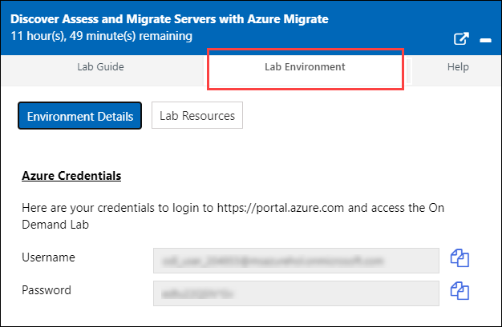
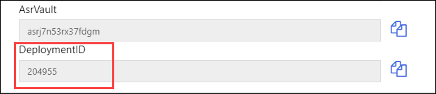
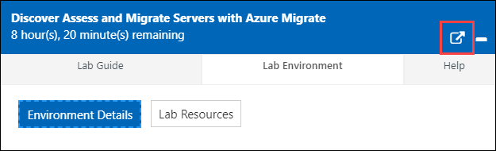
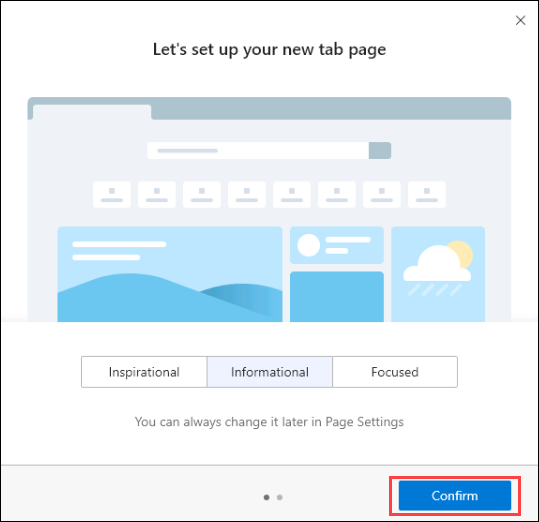
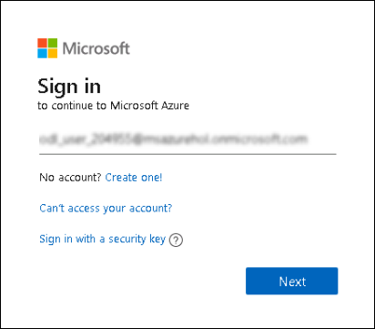
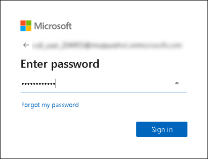

# Getting Started with Lab

1. Once the environment is provisioned, a virtual machine (HyperVHostServer) on the left and lab guide on the right will get loaded in your browser. Use this virtual machine throughout the workshop to perform the lab. 

 > **Note**: We will be referring this Virtual Machine as HyperVHost server or Jump VM throughout the lab.

2. To access the lab environment details, you can select **Lab Environment** tab as shown in the image below. Additionally, you will receive the credentials to the registered email address. If you don't see that in Inbox, check you spam folder as well.

   
 
3. You will see Suffix/DeploymentID value on **Lab Environment** tab, use it to replace where-ever you see SUFFIX or DeploymentID in lab steps.
   
   
 
4. You can also open the Lab Guide on a separate full browser tab by selcting the **Arrow** icon in upper right corner.

   
 
## Login to Azure Portal

1. Click on Azure portal shortcut placed on the desktop of the Virtual Machine ( HyperVHost Server ) on the left of the screen. This will open up an Microsoft Edge Chromium Browser.

   
   
2. Now, Edge browser welcome screen will load up, select **Get started** to continue.

   
   
3. On the next window, click on **Confirm**.

   
   
4. Now, you can close the popup which is coming up.

   
   
5. You can close the first tab with name displayed as **Microsoft Edge**.

   
   
6. On **Sign in to Microsoft Azure** tab, enter the following email/username and then click on **Next**. 
   * **Email/Username**: <inject key="AzureAdUserEmail"></inject>
   
     
     
7. Now enter the following password and click on **Sign in**.
   * **Password**: <inject key="AzureAdUserPassword"></inject>
   
     
     
8. If you see the pop-up **Stay Signed in?**, click No

9. If you see the pop-up **You have free Azure Advisor recommendations!**, close the window to continue the lab.

10. If a **Welcome to Microsoft Azure** popup window appears, click **Maybe Later** to skip the tour.
   
# Review the App

In this exercise you will review the ContosoIT web application, log a ticket with the web application and review the Hyper-V setup to validate your on-premises resources.  The goal here is to just get a sense that this is a real working application that we are going to migrate.

### Detailed steps

1. On the Desktop of your HyperVHost server, click on the **ContosoIT** shortcut and wait for the website **contosoit.contoso.com** to load.  This is a support ticket site for the Contoso company that we'll be moving.

2. Once the page loads, **click** on **Create New** to create a new ticket .

3. Fill out the ticket form and **click** on **Create**. Then select **Assign** from the options available.	

4. Minimise the browser and **click** on Windows Search button on the lower left corner.

5. Type **CMD** on the Search bar and select the App **Command Prompt** in the search results to open the command prompt.

6. Type the following command **ping contosoit.contoso.com** and hit **Enter**.

      >This is the address of the web app and resolves to **10.0.0.100** which is the on-prem IP for the webapp01 VM running on Hyper-V.

7. Minimize the command prompt and browser if not already and then **click** on **Hyper-V Manager** from the desktop. Review the application infrastructure.

	>The jumphost you are logged into is also a Hyper-V server running the infrastructure for our web app. When you click on the host name in Hyper-V manager, **<inject key="jumphostVmName" />** you will see 3 guest VM's:
     	>*  **migratenext** - Pre-deployed Azure Migrate Appliance
     	>*  **webapp01** - Windows 2008R2 Server running IIS and hosting ContosoIT web application
     	>*  **webmssql01** - Windows 2008R2 Server with SQL 2008R2 hosting the ContosoIT database

&nbsp;&nbsp;&nbsp;&nbsp;&nbsp;&nbsp;&nbsp;&nbsp;&nbsp;&nbsp;&nbsp;&nbsp;&nbsp;&nbsp;&nbsp;&nbsp;&nbsp;&nbsp;&nbsp;&nbsp;&nbsp;&nbsp;&nbsp;&nbsp;&nbsp;&nbsp;&nbsp;&nbsp;&nbsp;&nbsp;&nbsp;&nbsp;&nbsp;&nbsp;&nbsp;&nbsp;&nbsp;&nbsp;&nbsp;&nbsp;&nbsp;&nbsp;&nbsp;&nbsp;&nbsp;&nbsp;&nbsp;&nbsp;&nbsp;&nbsp;&nbsp;&nbsp;&nbsp;&nbsp;&nbsp;&nbsp;&nbsp;&nbsp;&nbsp;&nbsp;&nbsp;&nbsp;&nbsp;&nbsp;&nbsp;&nbsp;&nbsp;&nbsp;&nbsp;&nbsp;&nbsp;&nbsp;&nbsp;&nbsp;&nbsp;&nbsp;&nbsp;&nbsp;&nbsp;&nbsp;&nbsp;&nbsp;&nbsp;&nbsp;&nbsp;&nbsp;&nbsp;&nbsp;&nbsp;&nbsp;&nbsp;&nbsp;&nbsp;&nbsp;&nbsp;&nbsp;&nbsp;&nbsp;&nbsp;(2)
