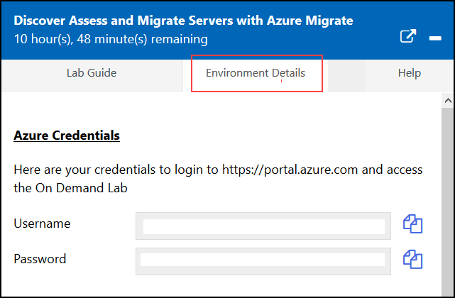
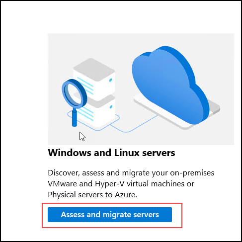
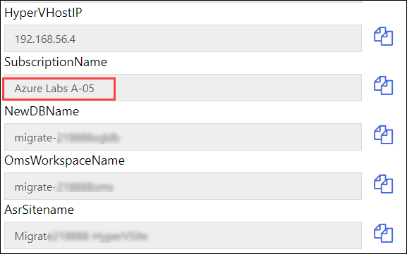
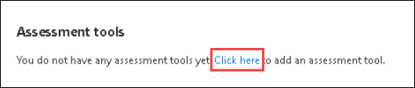
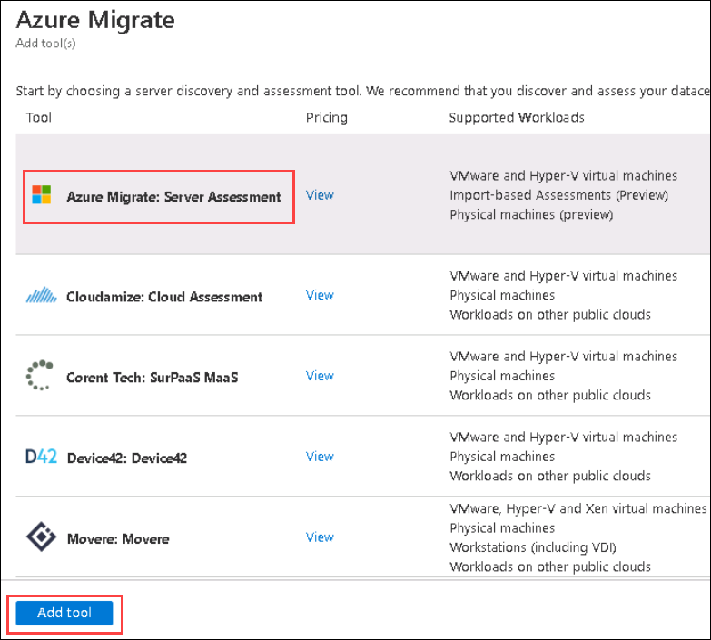

# Exercise 1: Create Migration Solution

In this exercise you will set up a new Migrate Assessment Tool and discover the VMs on your Hyper-V host with the Azure Migrate appliance.

### Task 1: Create Solution

1. On the Hyper-V host desktop, **click** on the **Azure Portal** shortcut to sign into the Azure Portal.

      - Connect with the **Azure Credentials** from **Environment Details** tab.
   

2.  On the search bar at the top of the portal, type **Migrate** and search.
3.  In the results, select **Azure Migrate** under services.
4.  On the **Get started** page, **click** on **Assess and migrate servers**.

    

5.  On the Right corner, next to **Migrate project**, Click on **(change)**.
6.  Select **Subscription** and **Existing Migrate Project** you see from each of the dropdown list.

    > You can find your susbcription name from the Environment details tab.
     
     
  
7.  And, then Click **Ok**.
8.  Under **Assessment Tools**, Click on **Click here to add an assesment tool**.

      

9.  From the **assessment tool list** tab select **Azure Migrate: Server Assessment** and click on **Add tool** on the bottom left of the blade.

    

	>This should only take about 10 seconds to complete. You will see the status in the notification bell in the top right portion of the browser. Once the deployment is successful proceed to the next steps. 

### Task 2: Deploy Azure Migrate Appliance

1. In the **Azure Migrate: Server Assessment** tile, click **Discover**.
2. On the **Discover Machines** blade, **click** on the **Are your machines virtualized?** drop-down and select **Yes, with Hyper-V**.

	>Review the steps listed here. This is the transition point from setting up the Azure resources and implementing the on-prem appliance to begin pulling data up for analysis.

3. Provide a unique name for the Azure Migrate Appliance like **migrate{DeploymentID}** and then click on **Generate key** button, copy the value of the Azure Migrate project Key. This key is used to register the appliance to the **Azure Migrate project** in the next exercise.

    

&nbsp;&nbsp;&nbsp;&nbsp;&nbsp;&nbsp;&nbsp;&nbsp;&nbsp;&nbsp;&nbsp;&nbsp;&nbsp;&nbsp;&nbsp;&nbsp;&nbsp;&nbsp;&nbsp;&nbsp;&nbsp;&nbsp;&nbsp;&nbsp;&nbsp;&nbsp;&nbsp;&nbsp;&nbsp;&nbsp;&nbsp;&nbsp;&nbsp;&nbsp;&nbsp;&nbsp;&nbsp;&nbsp;&nbsp;&nbsp;&nbsp;&nbsp;&nbsp;&nbsp;&nbsp;&nbsp;&nbsp;&nbsp;&nbsp;&nbsp;&nbsp;&nbsp;&nbsp;&nbsp;&nbsp;&nbsp;&nbsp;&nbsp;&nbsp;&nbsp;&nbsp;&nbsp;&nbsp;&nbsp;&nbsp;&nbsp;&nbsp;&nbsp;&nbsp;&nbsp;&nbsp;&nbsp;&nbsp;&nbsp;&nbsp;&nbsp;&nbsp;&nbsp;&nbsp;&nbsp;&nbsp;&nbsp;&nbsp;&nbsp;&nbsp;&nbsp;&nbsp;&nbsp;&nbsp;&nbsp;&nbsp;&nbsp;&nbsp;&nbsp;&nbsp;&nbsp;&nbsp;&nbsp;&nbsp;(3)
