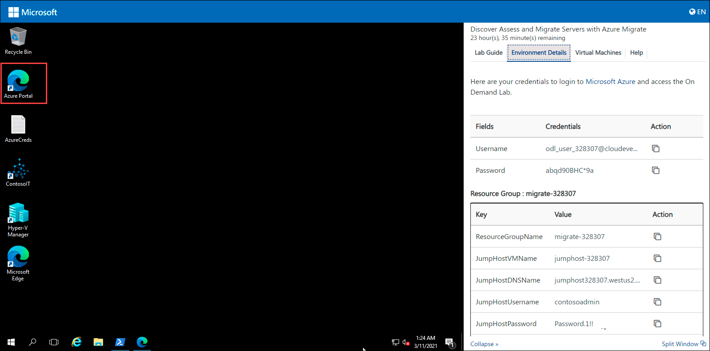
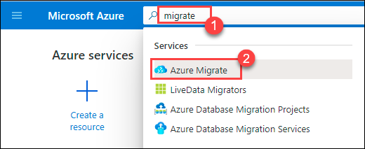
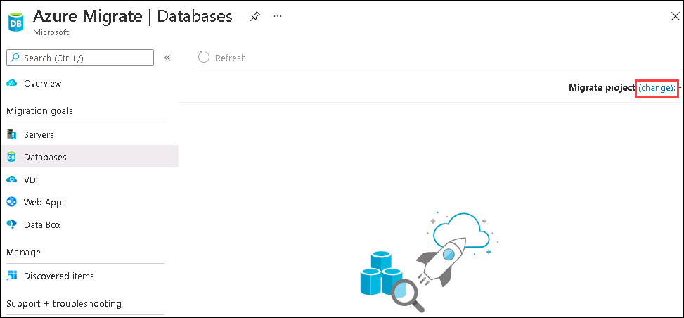
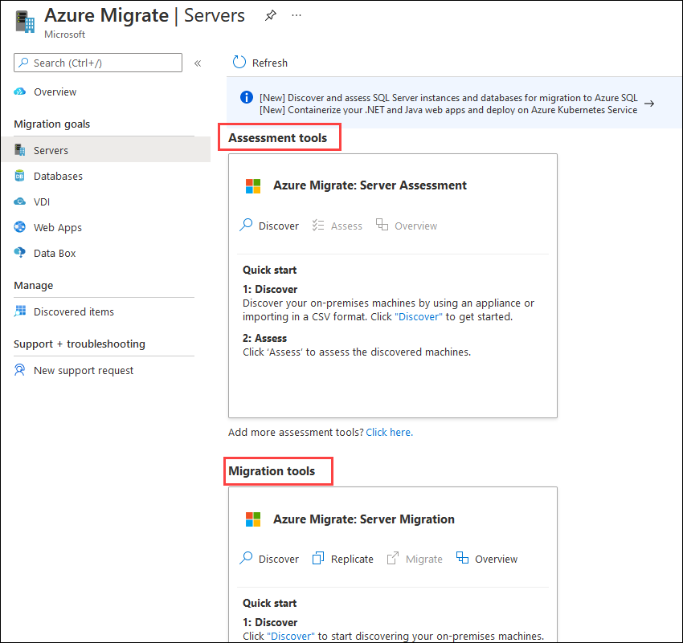
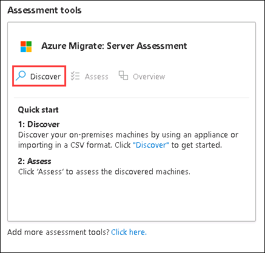
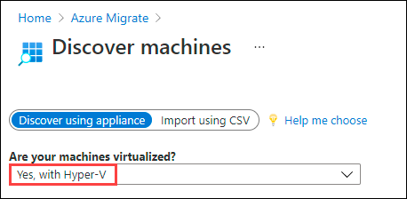

# Exercise 1: Create Migration Solution

In this exercise, you will set up the Azure Migrate project and create a key to register the  Azure Migrate appliance

### Task 1: Create Solution

1. On the Hyper-V host desktop, **click** on the **Azure Portal** shortcut to sign into the Azure Portal.

      - Connect with the **Azure Credentials** from **Environment Details** tab.

   

1.  On the search bar at the top of the portal, type **Migrate** and search.

1.  In the results, select **Azure Migrate** under services.

    

        > Note: Azure Migrate UI has changed since the time this guide was created. Some screenshots and names may vary but the steps remain the same.

1.  On the **Get started** page, **click** on **Assess and migrate servers**.

    

1.  On the Right corner, next to **Migrate project**, Click on **(change)**.

    

1.  Select **Subscription** and then select your migration project named **migrate-deploymentID**

    > You can find the DeploymentID from the Environment details tab.
    
     

    

1.  And, then Click **Ok**.

1.  Now, you will be able to see the Azure Migrate: Server Assessment and Azure Migrate: Server Migration tools for the current migration project, as shown below.

     

### Task 2: Deploy Azure Migrate Appliance

1. In the **Azure Migrate: Server Assessment** tile, click **Discover**.

   
    
1. On the **Discover Machines** blade, **click** on the **Are your machines virtualized?** drop-down and select **Yes, with Hyper-V**.

   

	>Review the steps listed here. This is the transition point from setting up the Azure resources and implementing the on-prem appliance to begin pulling data up for analysis.

1. Provide a unique name for the Azure Migrate Appliance like **migrate{DeploymentID}** and then click on **Generate key** button, copy the value of the Azure Migrate project Key. This key is used to register the appliance to the **Azure Migrate project** in the next exercise.

    

&nbsp;&nbsp;&nbsp;&nbsp;&nbsp;&nbsp;&nbsp;&nbsp;&nbsp;&nbsp;&nbsp;&nbsp;&nbsp;&nbsp;&nbsp;&nbsp;&nbsp;&nbsp;&nbsp;&nbsp;&nbsp;&nbsp;&nbsp;&nbsp;&nbsp;&nbsp;&nbsp;&nbsp;&nbsp;&nbsp;&nbsp;&nbsp;&nbsp;&nbsp;&nbsp;&nbsp;&nbsp;&nbsp;&nbsp;&nbsp;&nbsp;&nbsp;&nbsp;&nbsp;&nbsp;&nbsp;&nbsp;&nbsp;&nbsp;&nbsp;&nbsp;&nbsp;&nbsp;&nbsp;&nbsp;&nbsp;&nbsp;&nbsp;&nbsp;&nbsp;&nbsp;&nbsp;&nbsp;&nbsp;&nbsp;&nbsp;&nbsp;&nbsp;&nbsp;&nbsp;&nbsp;&nbsp;&nbsp;&nbsp;&nbsp;&nbsp;&nbsp;&nbsp;&nbsp;&nbsp;&nbsp;&nbsp;&nbsp;&nbsp;&nbsp;&nbsp;&nbsp;&nbsp;&nbsp;&nbsp;&nbsp;&nbsp;&nbsp;&nbsp;&nbsp;&nbsp;&nbsp;&nbsp;&nbsp;(3)
