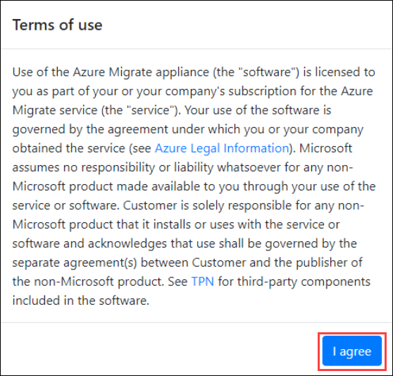
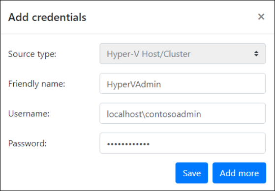
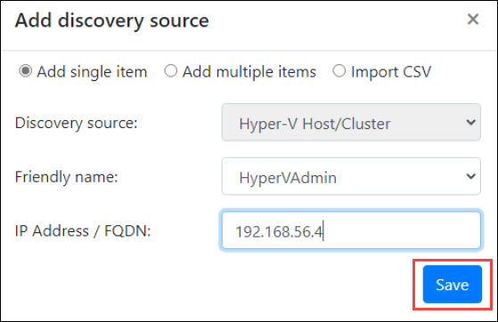
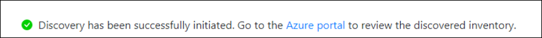

# Exercise 2: Configure Appliance

In the previous steps you set up the Azure side of the Migrate solution and ended at the point you would download and install the on-prem components.  In this exercise, you will configure the on-prem appliance and kick off a discovery to assess in Azure.

> **Note:**
 > * We downloaded and pre-staged the Azure Migrate appliance in advance to save time.  You will pick up with the appliance already running in Hyper-V ready for configuration.
 > * To paste values in the VM console in Hyper-V, after you copy something to the clipboard click **Clipboard** from the console menu and select **Type clipboard text**.

### Task 1: Configure Appliance

1. Minimize the browser and bring up the **Hyper-V Manager** console by clicking the **Hyper-V manager** icon on the HyperVserver Desktop.
1. Select the **JUMPHOST** and Double-click the **migratenext** Virtual Machine.

	>If the VM is turned off, click the **Start** icon on the top left corner to restart the machine
	
	
	
	>If the VM is locked, click the **Keyboard keys** icon in the top left or **Action** and **Ctrl+Alt+Del** and sign in with the following password: **LetsMigrate2020!**

1. **Wait** . After a minute or two, Edge windows will open showing the Azure Migrate appliance configuration wizard. If the Set up **Microsoft Edge** prompt is shown, select **OK** to accept the recommended settings. If the Microsoft Edge **Your connection isn't private** prompt is shown, select **Advanced** and then click on **Continue to win-vbjqcbhedds(unsafe)** .
   
   

   

1. Accept license terms by clicking the checkbox available under **Accept license terms** section, wait for 3-5 minutes till the updates get successfully installed.
	
	

1. If the page gets stuck on installing updates, simply refresh the tab and click on **I agree** button on the bottom *Terms of use* popup.
  
   
	
	>Note: If it prompts for Windows Credentials, provide Username : "**Administrator**" ,Password : "**LetsMigrate2020!**" 
	
	>If the continue button is not active yet, refresh the tab and accept the terms again, wait for everything to turn green and then **click** on **Continue**.
	
	>If it throws an error related to the installation of agents, click on the button to retry the installation of the agents.
	 
1. Now, provide the **Azure Migrate project key** you have generated in the previous exercise and click on **Login** .
 
   

1. Then on the tab that loads up, click **Next** after verifying code is there by default.

	

1. Provide the following email id in the Sign in blade that comes up prompting to Microsoft Azure Powershell on a remote device or service :
   * **Email/Username**: <inject key="AzureAdUserEmail"></inject>
	   
	 
	 
1. Now enter the following password and click on **Sign in**. Once logged into Azure, close only the "**Browser Tab**" where you logged in to Azure and return to the other tab.
   * **Password**: <inject key="AzureAdUserPassword"></inject>	
   
        	
   
   > Once you are back on the other tab, if you see a session timeout message at the top of the page, click on **login** again and continue with the next step.
   
      

1. Once the appliance is registered successfully you will see something like below:

     
   
1. Under *Manage credentials and discovery sources* click on **Add credentials**. Now you will be redirected to the **Add credentials** section, for the Hyper-V host credentials enter the following:
	        
      * *Friendly Name*: **HyperVAdmin**
      * *User name*: **localhost\contosoadmin**
      * *Password*: **Password.1!!**	

> To paste values in the VM console in Hyper-V, after you copy something to the clipboard click **Clipboard** from the console menu and select **Type clipboard text**. 
    
1. Click on **Save**.
 
   

1. Under *Step 2: Hyper-V host/cluster details*, click on **Add discovery source**.
1. Select **Add single item** and select HyperVAdmin value from the dropdown option of Friendly name.
1. Copy the value of **HyperVHostIP** from environment details tab and **click** on **Save**.

   

1. If the validation is successful you will see similar like the below image.

   

1. Then, **click** on **Start discovery**. It will take 2-3 minutes for initiating discovery and configuring the appliance and another 3-5 minutes to complete.

   
           
	>Note: If you get an error while trying to initiate discovery, please open a new tab and go to portal.azure.com and log in again using the Azure Credentials.
	>Note: You might see this error if your azure session logged in earlier gets expired.
	
	>When you complete the setup for the first time it will take a few minutes to discover all your VMs and begin pushing data up to the portal.  Once the appliance configuration completes you will be able to see the state of services and return to the portal to begin viewing assessment data.

1. Once the appliance configuration is completed it will look similar to the below image, minimize the browser and continue with the next exercise.

   

&nbsp;&nbsp;&nbsp;&nbsp;&nbsp;&nbsp;&nbsp;&nbsp;&nbsp;&nbsp;&nbsp;&nbsp;&nbsp;&nbsp;&nbsp;&nbsp;&nbsp;&nbsp;&nbsp;&nbsp;&nbsp;&nbsp;&nbsp;&nbsp;&nbsp;&nbsp;&nbsp;&nbsp;&nbsp;&nbsp;&nbsp;&nbsp;&nbsp;&nbsp;&nbsp;&nbsp;&nbsp;&nbsp;&nbsp;&nbsp;&nbsp;&nbsp;&nbsp;&nbsp;&nbsp;&nbsp;&nbsp;&nbsp;&nbsp;&nbsp;&nbsp;&nbsp;&nbsp;&nbsp;&nbsp;&nbsp;&nbsp;&nbsp;&nbsp;&nbsp;&nbsp;&nbsp;&nbsp;&nbsp;&nbsp;&nbsp;&nbsp;&nbsp;&nbsp;&nbsp;&nbsp;&nbsp;&nbsp;&nbsp;&nbsp;&nbsp;&nbsp;&nbsp;&nbsp;&nbsp;&nbsp;&nbsp;&nbsp;&nbsp;&nbsp;&nbsp;&nbsp;&nbsp;&nbsp;&nbsp;&nbsp;&nbsp;&nbsp;&nbsp;&nbsp;&nbsp;&nbsp;&nbsp;&nbsp;(4)
