# Exercise 2: Configure Appliance

In the previous steps you set up the Azure side of the Migrate solution and ended at the point you would download and install the on-prem components.  In this exercise, you will configure the on-prem appliance and kick off a discovery to assess in Azure.

**Tips**
  * We downloaded and pre-staged the Azure Migrate appliance in advance to save time.  You will pick up with the appliance already running in Hyper-V ready for configuration.
  * To paste values in the VM console in Hyper-V, after you copy something to the clipboard, click **Clipboard** from the console menu and select **Type clipboard text**.

    

### Task 1: Configure Appliance

1. Minimize the browser and bring up the **Hyper-V Manager** console by clicking the **Hyper-V manager** icon on the HyperVserver Desktop.

1. Select the **JUMPHOST** and Double-click the **migratenext** Virtual Machine.

    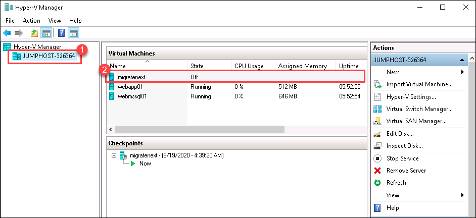

	>If the VM is turned off, click the **Start** icon on the top left corner to restart the machine
	
	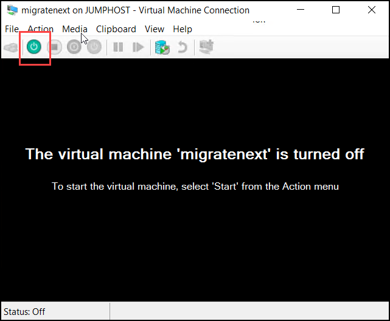
	
	>If the VM is locked, click the **Keyboard keys** icon in the top left or **Action** and **Ctrl+Alt+Del** and sign in with the following password: **LetsMigrate2021!**

1. **Wait** . After a minute or two, Edge windows will open showing the Azure Migrate appliance configuration wizard. If the Set up **Microsoft Edge** prompt is shown, select **OK** to accept the recommended settings. If the Microsoft Edge **Your connection isn't private** prompt is shown, select **Advanced** and then click on **Continue to win-vbjqcbhedds(unsafe)** .
   
   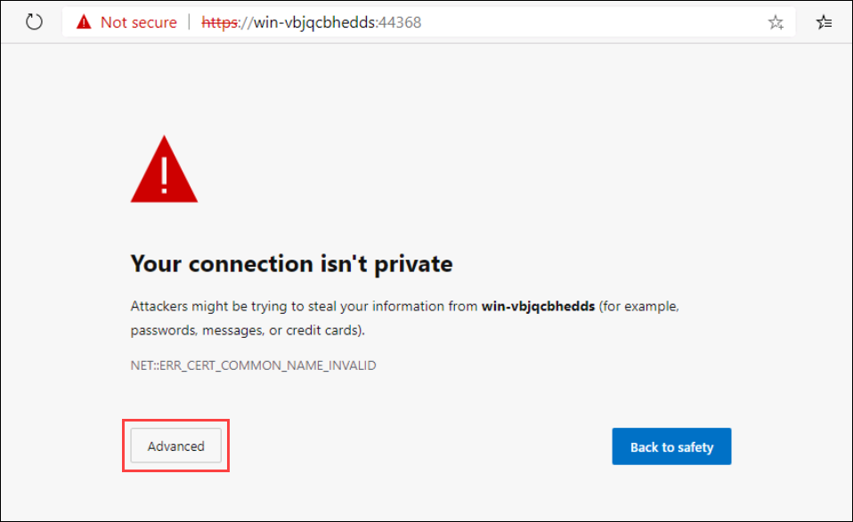

   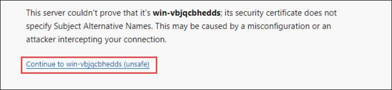

1. On opening of the appliance configuration wizard, a pop-up with the license terms will appear. Accept the terms by selecting **I agree**.
	
   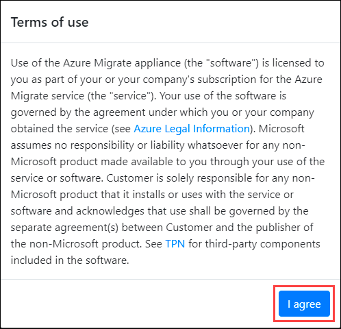

1. Under **Set up prerequisites**, the following two steps to verify Internet connectivity and time synchronization should pass automatically.
  
   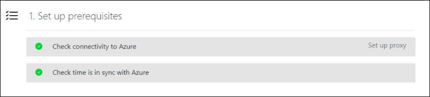
	
1. **Wait** while the wizard installs the latest Azure Migrate updates. Once the Azure Migrate updates are completed, you may see a pop-up if the management app restart is required, and if so, select Refresh to restart the app.

   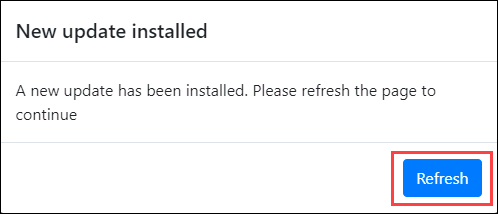

	>Note: If it prompts for Windows Credentials, provide Username : "**Administrator**" ,Password : "**LetsMigrate2021!**" 
	
	>If the continue button is not active yet, refresh the tab and accept the terms again, wait for everything to turn green and then **click** on **Continue**.
	
	>If it throws an error related to the installation of agents, click on the button to retry the installation of the agents.
	 
1. At the next phase of the wizard, **Register with Azure Migrate**, paste the **Azure Migrate project key** copied from the Azure portal earlier and click on **Login**. 

   If you do not have the key, go to **Server Assessment > Discover > Manage existing appliances**, select the appliance name you provided at the time of key generation and copy the corresponding key.
 
   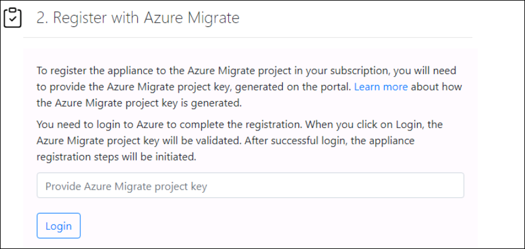

  >**Note**: To paste values in the VM console in Hyper-V, after you copy something to the clipboard click **Clipboard** from the console menu and select **Type clipboard text**. 
  
   
   
1. After you select **Login**, you will be presented with a **Continue with Azure login** pop-up . On the **Continue with Azure login** pop-up dialog, click on **Copy code & Login**.

   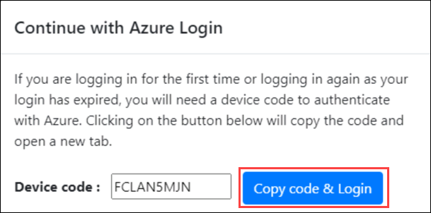
   
   This will open an Azure login prompt in a new browser tab (if it doesn't appear, make sure the pop-up blocker in the browser is disabled) paste the code and click on Next. You will then be asked for your Azure portal credentials to complete the login process.
   
   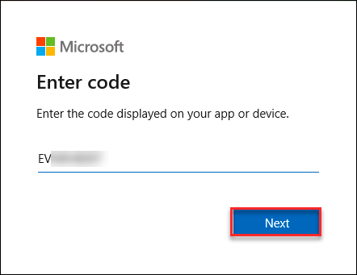

1. Provide the following email id in the Sign in blade that comes up prompting to Microsoft Azure Powershell on a remote device or service :
   * **Email/Username**: <inject key="AzureAdUserEmail"></inject>
	   
	 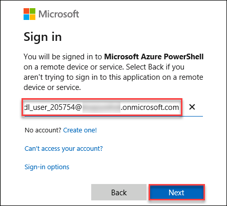
	 
1. Now enter the following password and click on **Sign in**. Once logged into Azure, close only the "**Browser Tab**" where you logged in to Azure and return to the **Azure Migrate Appliance ** tab.
   * **Password**: <inject key="AzureAdUserPassword"></inject>	
   
        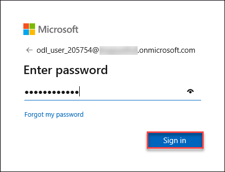	
   
   > Once you are back on the other tab, if you see a session timeout message at the top of the page, click on **login** again and continue with the next step.
   
      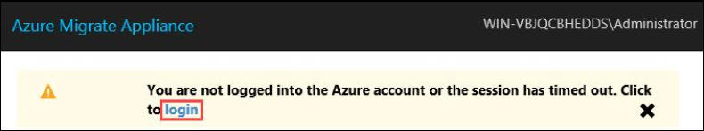

1. Once the appliance is registered successfully you will see something like below:

     
   
1. Under *Manage credentials and discovery sources* click on **Add credentials**. Now you will be redirected to the **Add credentials** section, for the Hyper-V host credentials enter the following values and click on **Save**.
	        
      * *Friendly Name*: **HyperVAdmin**
      * *User name*: **localhost\contosoadmin**
      * *Password*: **Password.1!!**	

   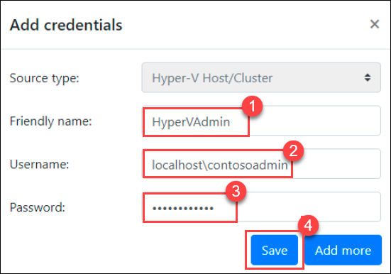
   
1. Under *Step 2: Hyper-V host/cluster details**, click on **Add discovery source**.
1. Select **Add single item** and select HyperVAdmin value from the dropdown option of Friendly name.
1. Copy the value of **HyperVHostIP** from environment details tab and **click** on **Save**.

   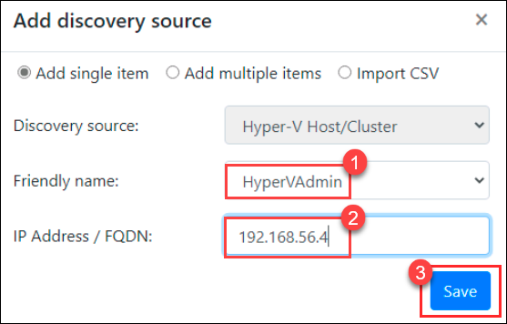

1. If the validation is successful you will see similar like the below image.

   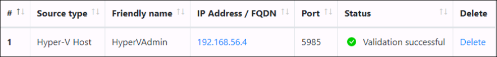

1. Then, **click** on **Start discovery**. It will take 2-3 minutes for initiating discovery and configuring the appliance and another 3-5 minutes to complete.

   
           
	>Note: If you get an error while trying to initiate discovery, Go to " Register with Azure Migrate" panel and login again using the Azure Credentials and then click on **Start discovery**

	>Note: You might see this error if your azure session logged in earlier gets expired.
	
	>When you complete the setup for the first time it will take a few minutes to discover all your VMs and begin pushing data up to the portal. Once the appliance configuration completes you will be able to see the state of services and return to the portal to begin viewing assessment data. 

1. Once the appliance configuration is completed it will look similar to the below image, minimize the browser and continue with the next exercise. Click on Azure Portal to view your discovered servers.   

   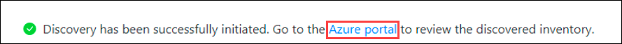

&nbsp;&nbsp;&nbsp;&nbsp;&nbsp;&nbsp;&nbsp;&nbsp;&nbsp;&nbsp;&nbsp;&nbsp;&nbsp;&nbsp;&nbsp;&nbsp;&nbsp;&nbsp;&nbsp;&nbsp;&nbsp;&nbsp;&nbsp;&nbsp;&nbsp;&nbsp;&nbsp;&nbsp;&nbsp;&nbsp;&nbsp;&nbsp;&nbsp;&nbsp;&nbsp;&nbsp;&nbsp;&nbsp;&nbsp;&nbsp;&nbsp;&nbsp;&nbsp;&nbsp;&nbsp;&nbsp;&nbsp;&nbsp;&nbsp;&nbsp;&nbsp;&nbsp;&nbsp;&nbsp;&nbsp;&nbsp;&nbsp;&nbsp;&nbsp;&nbsp;&nbsp;&nbsp;&nbsp;&nbsp;&nbsp;&nbsp;&nbsp;&nbsp;&nbsp;&nbsp;&nbsp;&nbsp;&nbsp;&nbsp;&nbsp;&nbsp;&nbsp;&nbsp;&nbsp;&nbsp;&nbsp;&nbsp;&nbsp;&nbsp;&nbsp;&nbsp;&nbsp;&nbsp;&nbsp;&nbsp;&nbsp;&nbsp;&nbsp;&nbsp;&nbsp;&nbsp;&nbsp;&nbsp;&nbsp;(4)
