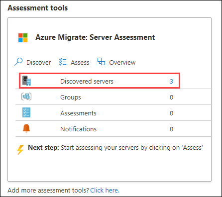
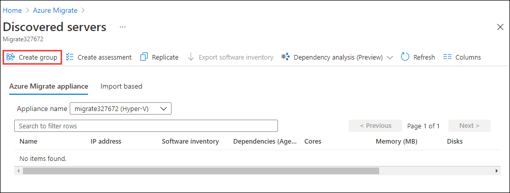
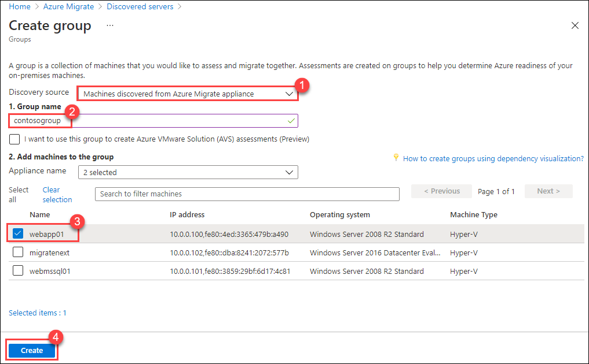

# Exercise 3: Create groups

In this exercise you will use Azure Migrate to group systems related to your application.  You can begin grouping and assessing systems without dependency agents involved, but having that deeper knowledge will allow you to fine tune the assessment down the line as it creates higher confidence with more data points reporting back to the Migrate solution.

1. Minimise the **HyperV Manger console** as well as **migratenext** Virtual Machine Connection and switch back to the already open **Azure Portal** in the HyperVHost VM.

1. Return to the **Azure Migrate - Servers** blade, then **click** on **Refresh**.

1. **Click** on the **number** next to **Discovered servers** under **Assessment Tools**.

   

1. On the **Discovered servers** page, click on **Create group**.

   

1. On the Create Group page, provide the following values and click on the **Create**

     1. Discovery Source : **Machines discovered from Azure Migrate Appliance**
     
     1. Group name : **contosogroup** 

     1. In the **Add machines to the group** section select **webapp01**.

   
   
1. Close the **Discover servers** blade by clicking on the **X** at the top right hand side of the blade

1. At the top of the **Azure Migrate - Servers** blade click **Refresh**.

   

	>The refresh for the first group may take a couple of minutes. Feel free to review other areas of the Migration Hub and return to the **Azure Migrate - Servers** page to check back.

1. Once the solution refreshes, click on **Groups** in the **Azure Migrate: Server Assessment** tile.

3. **Click** on the newly created group and review.

   > At this point we have a group that we can add or remove systems to, view dependency data if available and create assessments.

&nbsp;&nbsp;&nbsp;&nbsp;&nbsp;&nbsp;&nbsp;&nbsp;&nbsp;&nbsp;&nbsp;&nbsp;&nbsp;&nbsp;&nbsp;&nbsp;&nbsp;&nbsp;&nbsp;&nbsp;&nbsp;&nbsp;&nbsp;&nbsp;&nbsp;&nbsp;&nbsp;&nbsp;&nbsp;&nbsp;&nbsp;&nbsp;&nbsp;&nbsp;&nbsp;&nbsp;&nbsp;&nbsp;&nbsp;&nbsp;&nbsp;&nbsp;&nbsp;&nbsp;&nbsp;&nbsp;&nbsp;&nbsp;&nbsp;&nbsp;&nbsp;&nbsp;&nbsp;&nbsp;&nbsp;&nbsp;&nbsp;&nbsp;&nbsp;&nbsp;&nbsp;&nbsp;&nbsp;&nbsp;&nbsp;&nbsp;&nbsp;&nbsp;&nbsp;&nbsp;&nbsp;&nbsp;&nbsp;&nbsp;&nbsp;&nbsp;&nbsp;&nbsp;&nbsp;&nbsp;&nbsp;&nbsp;&nbsp;&nbsp;&nbsp;&nbsp;&nbsp;&nbsp;&nbsp;&nbsp;&nbsp;&nbsp;&nbsp;&nbsp;&nbsp;&nbsp;&nbsp;&nbsp;&nbsp;(5)
