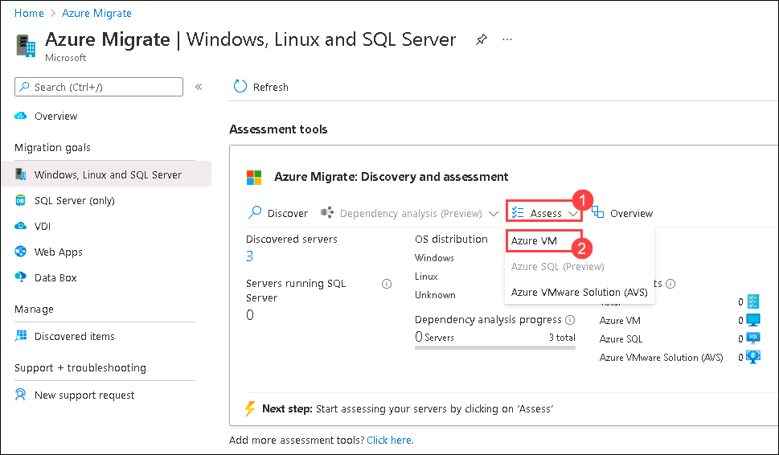
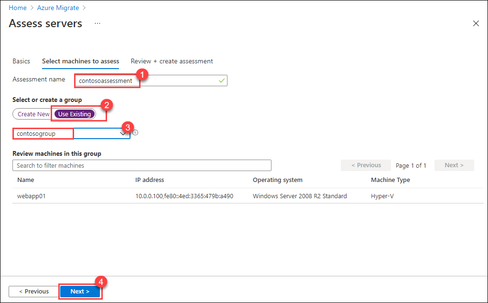
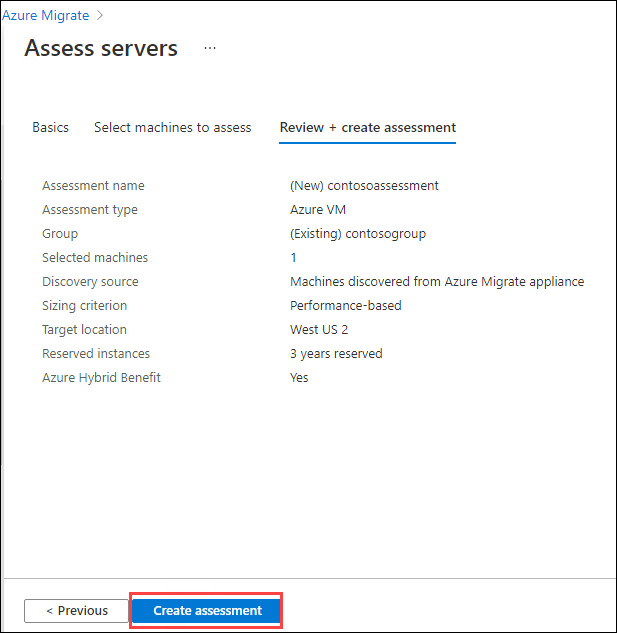
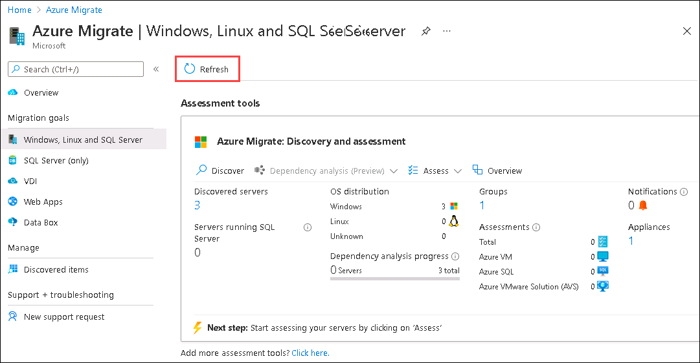
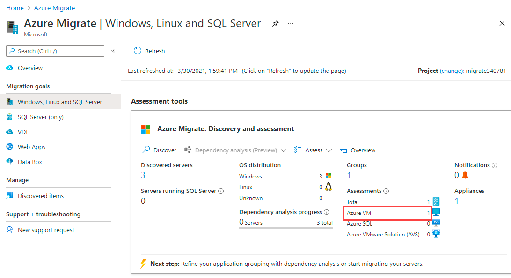
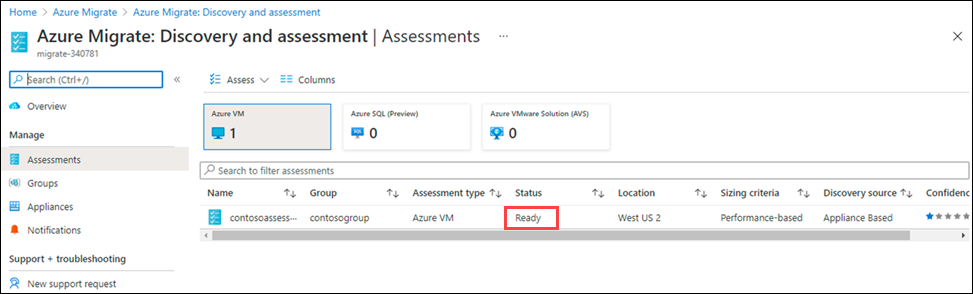
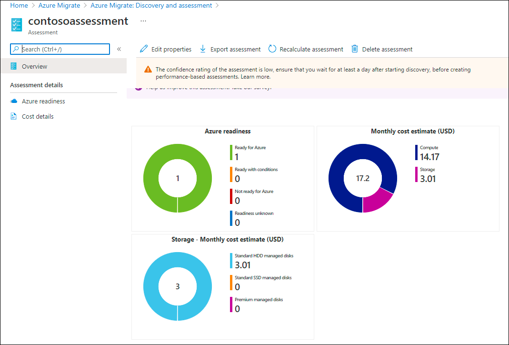

# Exercise 4: Create and Edit Assessment

Now that we've created a group for our servers we can begin our assessment.  In this exercise we'll create an assessment for the group we previously created and check out the assessment properties that allow us to fine tune the recommendations that Azure Migrate gives us.

> Tips:
 > * This is a new group in a small environment.  In a production environment you can expect to see multiple groups and hundreds of servers.  The filter fields come in handy finding groups and machines to create larger collections of systems that you may want to assess.
 > * Updates to assessment can take a minute or two before it is reflected.  Watch for the notification to know when it is ready.

### Task 1: Create Assessment

1. Return to the **Azure Migrate - Windows, Linux and SQL Server** page.

1. Under **Assessment tools**, click  on **Assess** then select **Azure VM** from the available options.

   
   
1. On the **Basics** tab of **Create assessment** blade, select **Assessment type** as **Azure VM** and **Discovery Source** as **Machines discovered from Azure Migrate Appliance** then click on **Next**.

    
  
1. On the **Select machine to assess** blade, provide the following values and click on **Next**.

    1. Enter Assessment name: **contosoassessment**
    2. Select or create group : **Use Existing**
    3. Select the group you previously created, **contosogroup**, from the drop-down 
    
    
   
1. On the **Review + create assessment** blade, Click on **Create assessment**.

   
  

### Task 2:  Manage Assessment

1. At the top of the **Azure Migrate - Windows, Linux and SQL Server** blade, **click** on **Refresh**.

   
  
1. **Click** on the number next to **Azure VM** under **Assessments**.

   
  
1. Wait for the assessment **Status** to change from **Creating** to **Ready**

   
  
1. Click on the newly created assessment

1. View the charts on cost and readiness

   

1. Click **Edit properties**

1. Click the various drop-down menus to review different assessment options

1. Review the **Azure Hybrid Benefit** option

1. Click the **X** in the top right of the portal

1. Under **Assessment details** click on Azure Readiness and Cost details and review the details

	>As you fine-tune the properties of your assessment, the assessment data will update giving you more confidence in your migration strategy. Having assessed your existing application components you will be able to move on to migration.

&nbsp;&nbsp;&nbsp;&nbsp;&nbsp;&nbsp;&nbsp;&nbsp;&nbsp;&nbsp;&nbsp;&nbsp;&nbsp;&nbsp;&nbsp;&nbsp;&nbsp;&nbsp;&nbsp;&nbsp;&nbsp;&nbsp;&nbsp;&nbsp;&nbsp;&nbsp;&nbsp;&nbsp;&nbsp;&nbsp;&nbsp;&nbsp;&nbsp;&nbsp;&nbsp;&nbsp;&nbsp;&nbsp;&nbsp;&nbsp;&nbsp;&nbsp;&nbsp;&nbsp;&nbsp;&nbsp;&nbsp;&nbsp;&nbsp;&nbsp;&nbsp;&nbsp;&nbsp;&nbsp;&nbsp;&nbsp;&nbsp;&nbsp;&nbsp;&nbsp;&nbsp;&nbsp;&nbsp;&nbsp;&nbsp;&nbsp;&nbsp;&nbsp;&nbsp;&nbsp;&nbsp;&nbsp;&nbsp;&nbsp;&nbsp;&nbsp;&nbsp;&nbsp;&nbsp;&nbsp;&nbsp;&nbsp;&nbsp;&nbsp;&nbsp;&nbsp;&nbsp;&nbsp;&nbsp;&nbsp;&nbsp;&nbsp;&nbsp;&nbsp;&nbsp;&nbsp;&nbsp;&nbsp;&nbsp;(6)
