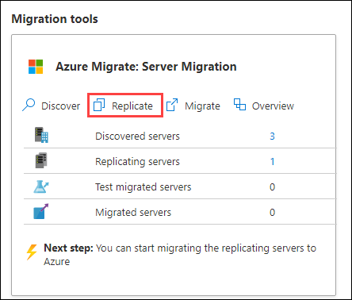
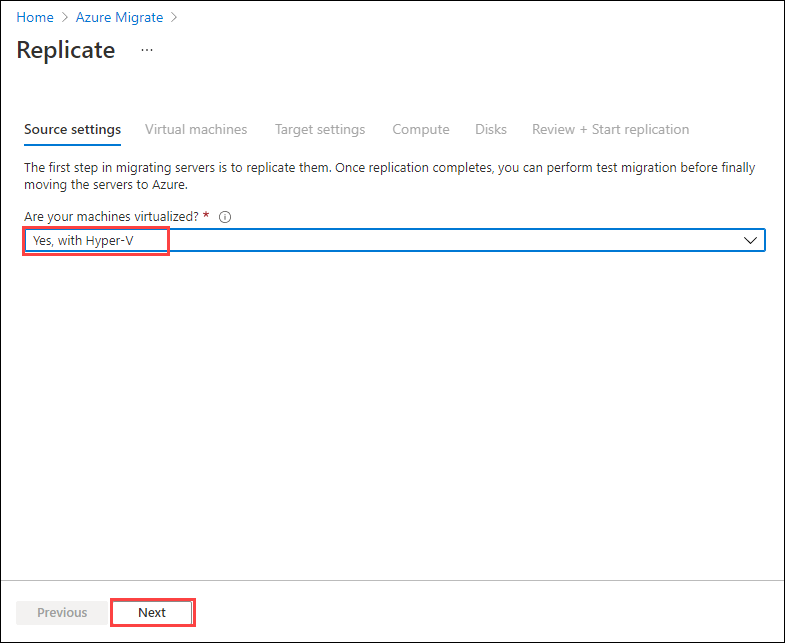
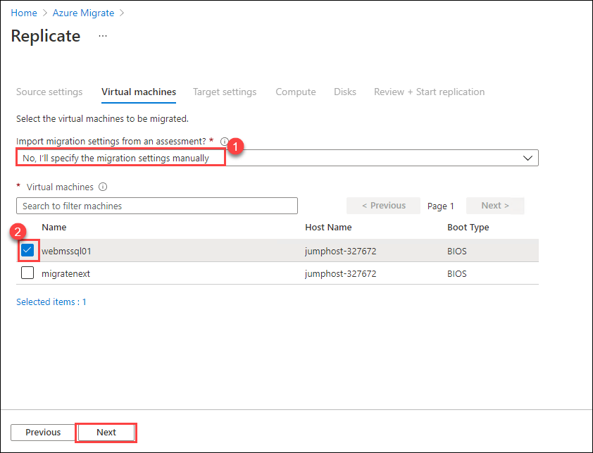
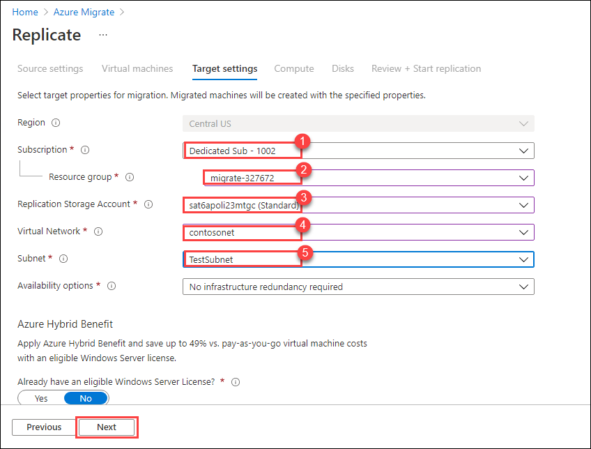
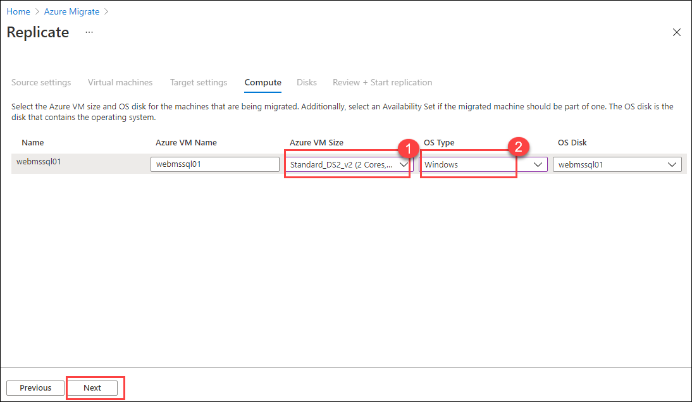

# Exercise 5: Setup replication using Azure Migrate

We've assessed our on-prem infrastructure and are ready to enable replication of a virtual machine.  In this exercise you will be configuring replication for your Windows 2008R2 web server VM on Hyper-V for failover to Azure using Azure Migrate. This will enable us to migrate the VM to an Azure IaaS VM. In the interest of time we have already setup and registered the required services to enable replication. For detailed information about preparing your environment follow the link under **Recommended help**

### Recommended help:

[Migrate on-premises machines to Azure](https://docs.microsoft.com/en-us/azure/migrate/tutorial-migrate-hyper-v)

### Task 1: Configure Replication

1. Return to the **Azure Migrate - Servers** page

1. Under **Migration Tools** click on **Replicate**

   

1. On the **Source settings** blade, select **Yes, with Hyper-V** from the dropdown under **Are you machines virtualized?** and click on **Next**

   

1. On the **Virtual machines** blade, provide the following values and click on **Next**.
   
     1. **Import migration settings from an Azure Migrate assesment** : **No, I'll specify the migration settings manually** 
     
     1. **Virtual machines** : Check the box next to **webmssql01**

   
   
    > Normally you would use the assessment data to help fill in your migration settings .

1. On the **Target settings** blade, provide the following values and click on **Next**.
 
     1. Select your **Subscription** from the dropdown list

     2. **Resource group** : Select **migrate-deploymentID** from the dropdown list

     3. **Replication Storage Account** : select the storage account starting with '**sa**' from the dropdown list 

     4. **Virtual Network** : Select **contosonet**

     5. **Subnet** : Select **TestSubnet**
     
     6. Availability Options : **No infrastructure redundancy required**

     7. Azure Hybrid Benefit : Select **No**

   
   
1. On the **Compute** blade, provide the following values and click on **Next**.

    1. **Azure VM size** : click the Azure VM size dropdown, and change the VM size to **Standard_DS2_V2**
    
    2.  **Os Type** : Select **Windows**
    
   
  
1. On the **Disks** blade, leave everything as default and click on **Next: Review + Start replication** but don't click on **Replicate** button.

1. Review the target settings

1. **Don't click on Replicate button**. We have already setup replication of a VM for you. **Hit the X** in the right corner and return to the **Azure Migrate - Servers** page 

> The link under Recommended help above provides more information on Migrating Hyper-V VMs to Azure.

&nbsp;&nbsp;&nbsp;&nbsp;&nbsp;&nbsp;&nbsp;&nbsp;&nbsp;&nbsp;&nbsp;&nbsp;&nbsp;&nbsp;&nbsp;&nbsp;&nbsp;&nbsp;&nbsp;&nbsp;&nbsp;&nbsp;&nbsp;&nbsp;&nbsp;&nbsp;&nbsp;&nbsp;&nbsp;&nbsp;&nbsp;&nbsp;&nbsp;&nbsp;&nbsp;&nbsp;&nbsp;&nbsp;&nbsp;&nbsp;&nbsp;&nbsp;&nbsp;&nbsp;&nbsp;&nbsp;&nbsp;&nbsp;&nbsp;&nbsp;&nbsp;&nbsp;&nbsp;&nbsp;&nbsp;&nbsp;&nbsp;&nbsp;&nbsp;&nbsp;&nbsp;&nbsp;&nbsp;&nbsp;&nbsp;&nbsp;&nbsp;&nbsp;&nbsp;&nbsp;&nbsp;&nbsp;&nbsp;&nbsp;&nbsp;&nbsp;&nbsp;&nbsp;&nbsp;&nbsp;&nbsp;&nbsp;&nbsp;&nbsp;&nbsp;&nbsp;&nbsp;&nbsp;&nbsp;&nbsp;&nbsp;&nbsp;&nbsp;&nbsp;&nbsp;&nbsp;&nbsp;&nbsp;&nbsp;(7)
