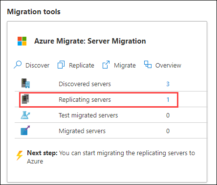
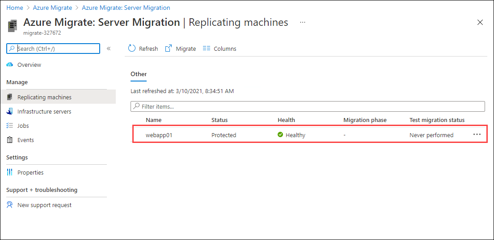
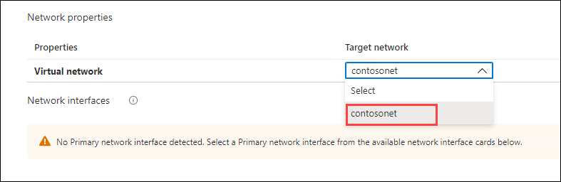
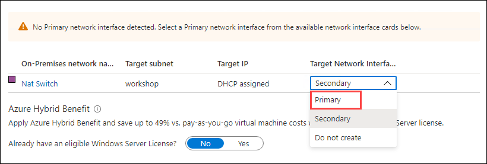
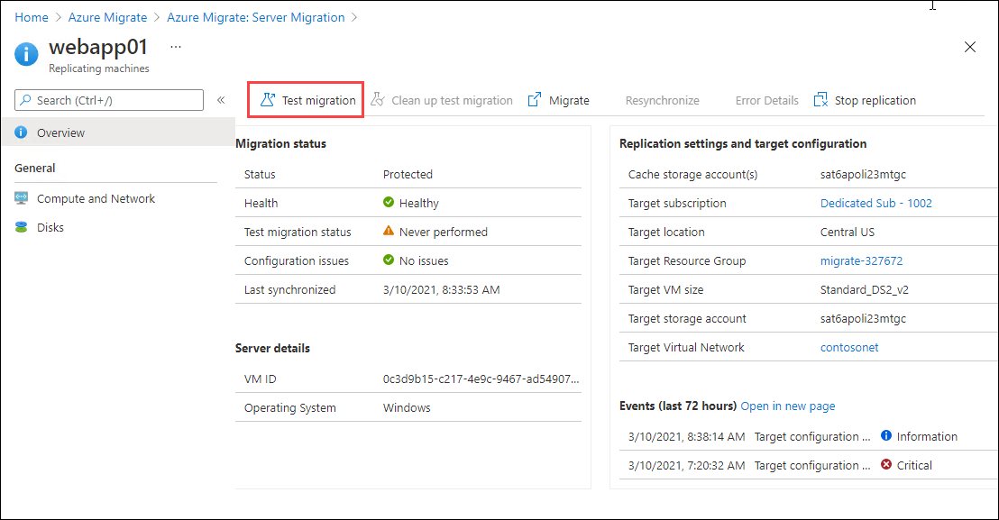
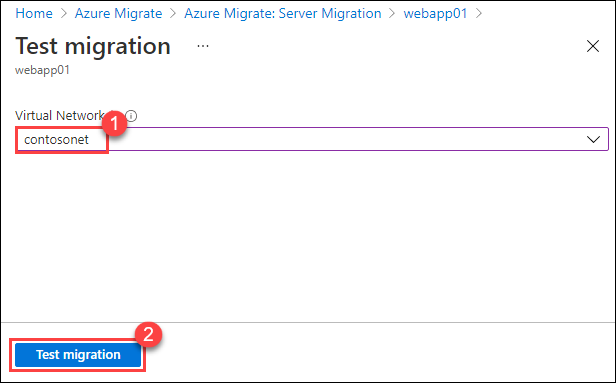
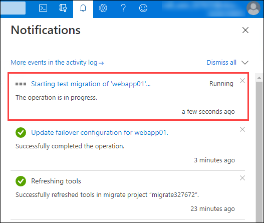

# Exercise 6: Migrate a server

1. Under **Migration tools**, Click on **Replicating servers**.

   
   
1. Click on **webapp01**

   
   
1. On the left, under **General** Click **Compute and Network**

1. Click **Edit** at the top of the blade

1. Click the **Size** dropdown and select **Standard_DS2_V2**

   
   
1. Under **Network properties**, click the **Target network** dropdown and select **Contosonet**

   

1. Under **Network interfaces**, click the **Target Network Interface Type** dropdown and select **Primary**

   

1. Click **Save** at the top of the blade

1. On the left, Click **Overview**

1. On the *Overview* blade, click **Test migration**

   

1. On the *Test migration* page, select **contosonet** from the **Virtual Network** drop-down and Click **Test migration** at the bottom

   

1. Click the **Notification Bell** icon to see the status of your failover

1. Click **Starting the test migration of 'webapp01'...** in the notification area

   
	
1. On the **Test failover** migration job blade, you can monitor the progress of the migration and verify the test migration jobs are all green. This should take less than 5 minutes to complete  

   

&nbsp;&nbsp;&nbsp;&nbsp;&nbsp;&nbsp;&nbsp;&nbsp;&nbsp;&nbsp;&nbsp;&nbsp;&nbsp;&nbsp;&nbsp;&nbsp;&nbsp;&nbsp;&nbsp;&nbsp;&nbsp;&nbsp;&nbsp;&nbsp;&nbsp;&nbsp;&nbsp;&nbsp;&nbsp;&nbsp;&nbsp;&nbsp;&nbsp;&nbsp;&nbsp;&nbsp;&nbsp;&nbsp;&nbsp;&nbsp;&nbsp;&nbsp;&nbsp;&nbsp;&nbsp;&nbsp;&nbsp;&nbsp;&nbsp;&nbsp;&nbsp;&nbsp;&nbsp;&nbsp;&nbsp;&nbsp;&nbsp;&nbsp;&nbsp;&nbsp;&nbsp;&nbsp;&nbsp;&nbsp;&nbsp;&nbsp;&nbsp;&nbsp;&nbsp;&nbsp;&nbsp;&nbsp;&nbsp;&nbsp;&nbsp;&nbsp;&nbsp;&nbsp;&nbsp;&nbsp;&nbsp;&nbsp;&nbsp;&nbsp;&nbsp;&nbsp;&nbsp;&nbsp;&nbsp;&nbsp;&nbsp;&nbsp;&nbsp;&nbsp;&nbsp;&nbsp;&nbsp;&nbsp;&nbsp;(8)
