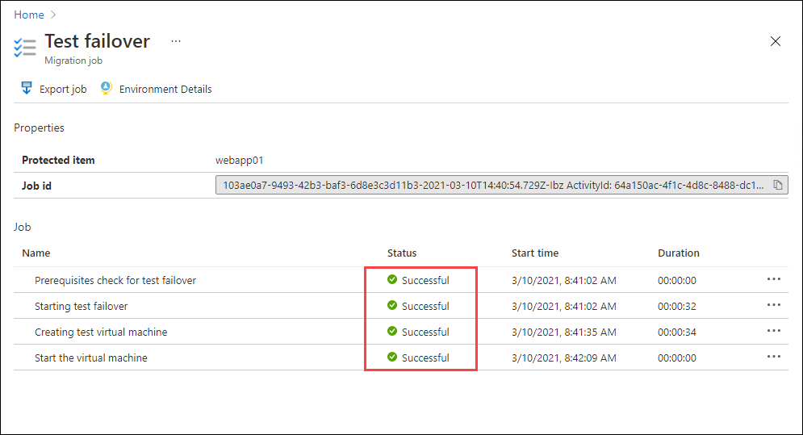
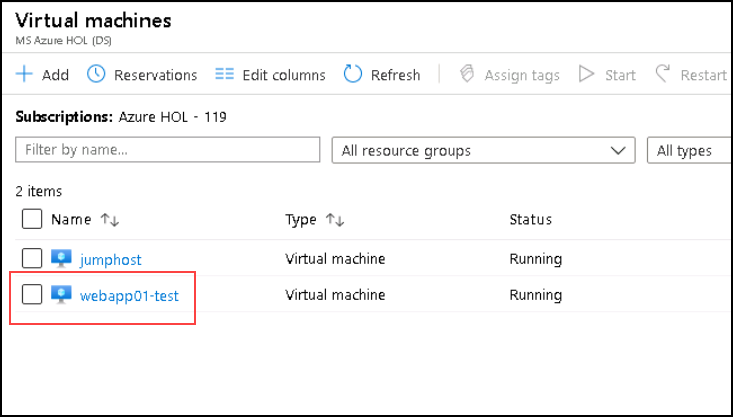

# Exercise 7: Migration Validation

At this stage we have assessed our infrastructure, replicated a VM to Azure and migrated it over into an IaaS VM.  It's time to verify our app is up and happy in its new home.

> Tips:
 > * When looking for the failed server, note that the test failover process will append **-test** to your Azure VM

### Task 1: Verify MIgration

1. Click on the *Notification Bell* at the top of the Azure portal

1. Click on *Starting test migration of webapp01*

1. On the Replicating Machines blade verify the test migration jobs are all green

   

1. If the test migration has completed, search for **Virtual Machines** on the search bar at the top of the portal 

1. On the *Virtual machines* blade, you should see one named **webapp01-test**
   
   
   
1. Click on **webapp01-test**

1. On the **Overview Page** you should see the machine status is **Running**

	>Congratulations! You have successfully migrated the Windows Server 2008R2 server to an Azure IaaS VM.

&nbsp;&nbsp;&nbsp;&nbsp;&nbsp;&nbsp;&nbsp;&nbsp;&nbsp;&nbsp;&nbsp;&nbsp;&nbsp;&nbsp;&nbsp;&nbsp;&nbsp;&nbsp;&nbsp;&nbsp;&nbsp;&nbsp;&nbsp;&nbsp;&nbsp;&nbsp;&nbsp;&nbsp;&nbsp;&nbsp;&nbsp;&nbsp;&nbsp;&nbsp;&nbsp;&nbsp;&nbsp;&nbsp;&nbsp;&nbsp;&nbsp;&nbsp;&nbsp;&nbsp;&nbsp;&nbsp;&nbsp;&nbsp;&nbsp;&nbsp;&nbsp;&nbsp;&nbsp;&nbsp;&nbsp;&nbsp;&nbsp;&nbsp;&nbsp;&nbsp;&nbsp;&nbsp;&nbsp;&nbsp;&nbsp;&nbsp;&nbsp;&nbsp;&nbsp;&nbsp;&nbsp;&nbsp;&nbsp;&nbsp;&nbsp;&nbsp;&nbsp;&nbsp;&nbsp;&nbsp;&nbsp;&nbsp;&nbsp;&nbsp;&nbsp;&nbsp;&nbsp;&nbsp;&nbsp;&nbsp;&nbsp;&nbsp;&nbsp;&nbsp;&nbsp;&nbsp;&nbsp;&nbsp;&nbsp;(9)
