# AZURE MACHINE LEARNING WORKSHOP

## **AGENDA**

1. Introduction to Azure Machine Learning

2. Create your Machine Learning Workspace

3. Create Compute

4. Create Dataset

5. Automatic Machine Learning

6. Azure Machine Learning Designer


### Introduction to Azure Machine Learning

Azure Machine Learning can be used for any kind of machine learning, from classical ml to deep
learning, supervised, and unsupervised learning. Whether you prefer to write Python or R code or zerocode/low-code options such as the designer, you can build, train, and track highly accurate machine
learning and deep-learning models in an Azure Machine Learning Workspace.

Azure Machine Learning provides all the tools developers and data scientists need for their machine
learning workflows, including:

• The [Azure Machine Learning](https://docs.microsoft.com/en-us/azure/machine-learning/tutorial-designer-automobile-price-train-score)designer (preview): drag-n-drop modules to build your experiments
and then deploy pipelines.

• Jupyter notebooks: use our [example notebooks](https://github.com/Azure/MachineLearningNotebooks) or create your own notebooks to leverage
our [SDK for Python](https://docs.microsoft.com/en-us/python/api/overview/azure/ml/?view=azure-ml-py) samples for your machine learning.

• R scripts or notebooks in which you use the [SDK for R](https://azure.github.io/azureml-sdk-for-r/reference/index.html) to write your own code, or use the R
modules in the designer.

• [Visual Studio Code extension](https://docs.microsoft.com/en-us/azure/machine-learning/tutorial-setup-vscode-extension)

• [Machine learning CLI](https://docs.microsoft.com/en-us/azure/machine-learning/reference-azure-machine-learning-cli)

• Open-source frameworks such as PyTorch, TensorFlow, and scikit-learn and many more

• You can even use [MLflow to track metrics and deploy models](https://docs.microsoft.com/en-us/azure/machine-learning/how-to-use-mlflow) or Kubeflow to [build end-to-end
workflow pipelines.](https://www.kubeflow.org/docs/azure/)


A [taxonomy](https://docs.microsoft.com/en-us/azure/machine-learning/concept-workspace) of the workspace is illustrated in the following diagram:


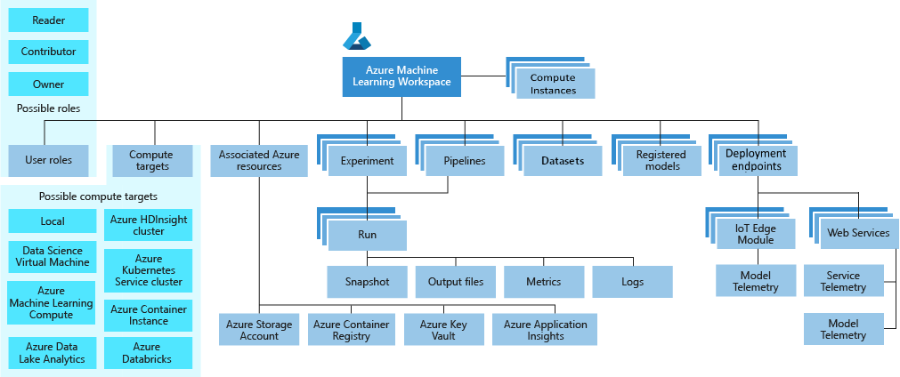


## Getting started

Launch the lab and Sign-in to [Azure Portal](portal.azure.com) using the Azure credentials provided in the lab details page.

Click on Resource groups in the Dashboard to see the resourse groups that you have access. You can see a resource group named *aml-XXXXX*. You will be using this resourse group for this lab.

### Azure Machine Learning Workspace

• In the upper-left corner of Azure portal, select **+ Create a resource**.

• Use the search bar to find **Machine Learning**

• Select **Machine Learning**

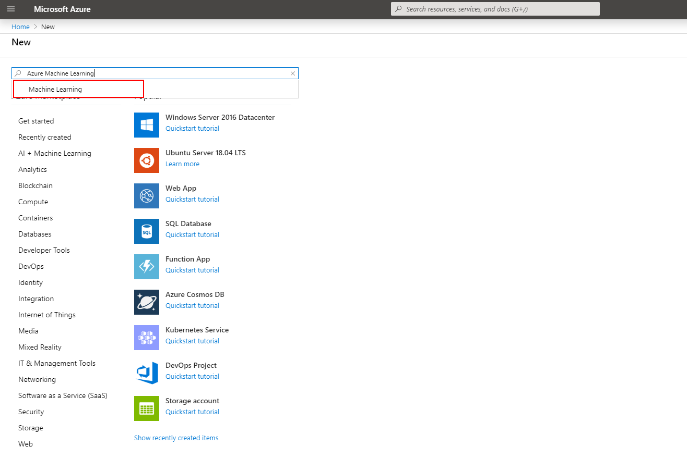

• In the **Machine Learning** pane, select **Create** to begin.

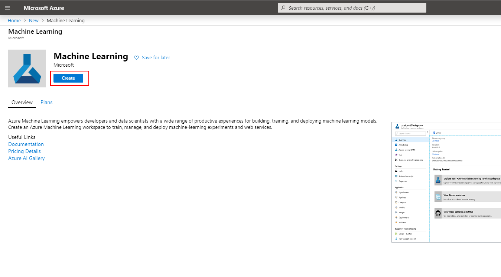

• Provide the following information to configure your new workspace.

Field | Description
----- | ---------------
Workspace name | Enter a unique name that identifies your workspace. Names must be unique across the resource group. Use a name that is easy to recall and to differentiate from workspaces created by others. The workspace name is case-insensitive.
Subscription | Select the Azure subscription that you want to use.
Resource group | Use an existing resource group in your subscription or enter a name to create a new resource group. A resource group holds related resources for an Azure solution.
Location | Select the location closest to your users and the data resources to create your workspace.                     
Workspace edition** | Select Enterprise. This workspace edition determines the features to which you'll have access and pricing. Learn more about [Basic and Enterprise edition offerings](https://docs.microsoft.com/en-us/azure/machine-learning/overview-what-is-azure-ml#sku).
                          
                          
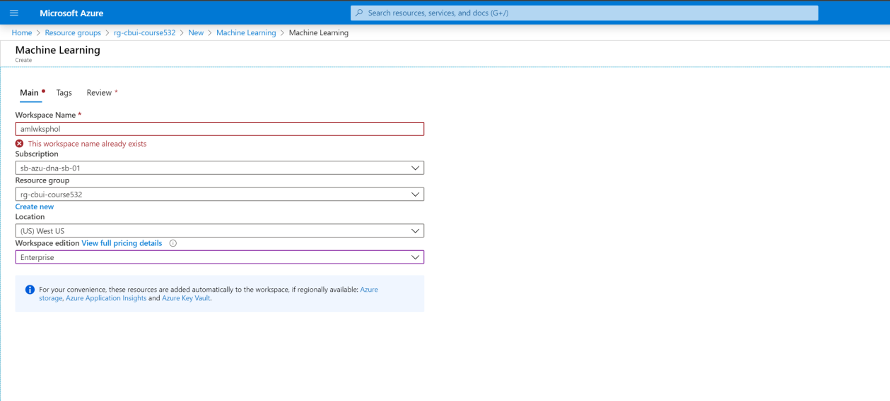

• When you're finished configuring the workspace, select **Review + Create**.

• Review the settings and make any additional changes or corrections. When you're satisfied with
the settings, select **Create**.

• To view the new workspace, select **Go to resource**

### Create Compute

**Create Compute Cluster**

An Azure Machine Learning compute instance (preview) is a fully managed cloud-based workstation for
data scientists. Compute instances make it easy to get started with Azure Machine Learning
development as well as provide management and enterprise readiness capabilities for IT administrators.
Use a compute instance as your fully configured and managed development environment in the cloud.
Compute instances are typically used as development environments. They can also be used as a
compute target for training and inferencing for development and testing. For large tasks, an [Azure
Machine Learning compute cluster](https://docs.microsoft.com/en-us/azure/machine-learning/how-to-set-up-training-targets#amlcompute) with multi-node scaling capabilities is a better compute target choice.

We will do several actions that require a compute target to be executed on. We will start by creating a
cluster of CPUs VMs.

   • Sign in at https://ml.azure.com.
       
   • Select Compute in the Assets section of the left pane.
       
   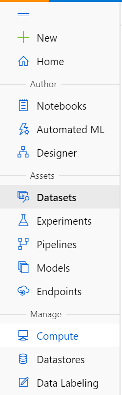
       
   • Navigate to Compute > Compute Clusters in the Manage section and click New
       
   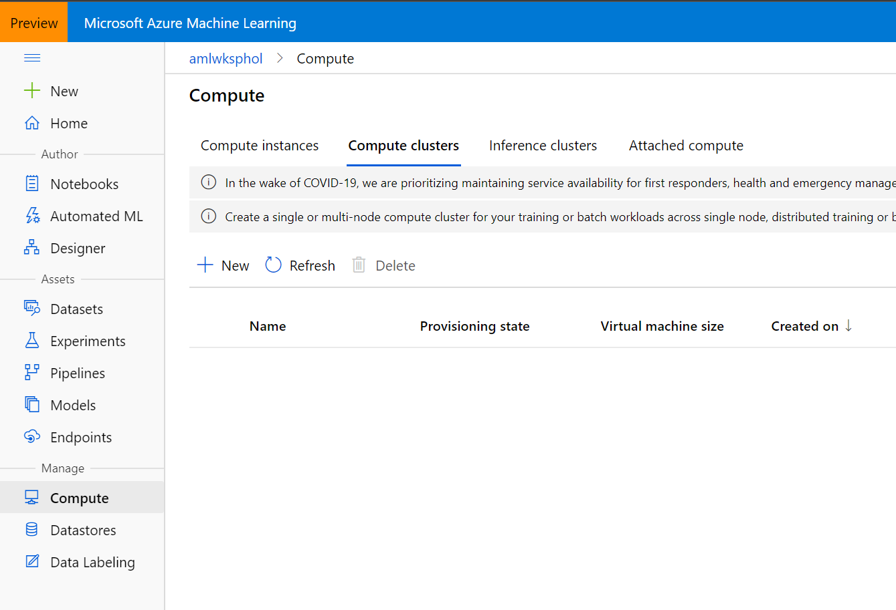
       
   • **Name** the cluster cpucluster.
 
   • Name the cluster cpucluster.
       
   • **Virtual machine**type CPU
       
   • For **machine size** choose Standard_DS2_v2.
       
   • Set the **Minimum number of nodes** to 0 and the **Maximum number of nodes** to 4. That way the
         cluster will scale automatically to up to 4 nodes as jobs require them.
       
   • Set the **Idle seconds before scaling down** to 600. That means that nodes will be kept around for
         10 minutes before they are spun down. That way, during our workshop, jobs will not have to
         wait for spin-up. Make sure that number is lower if you are using a more expensive VM size.
         
   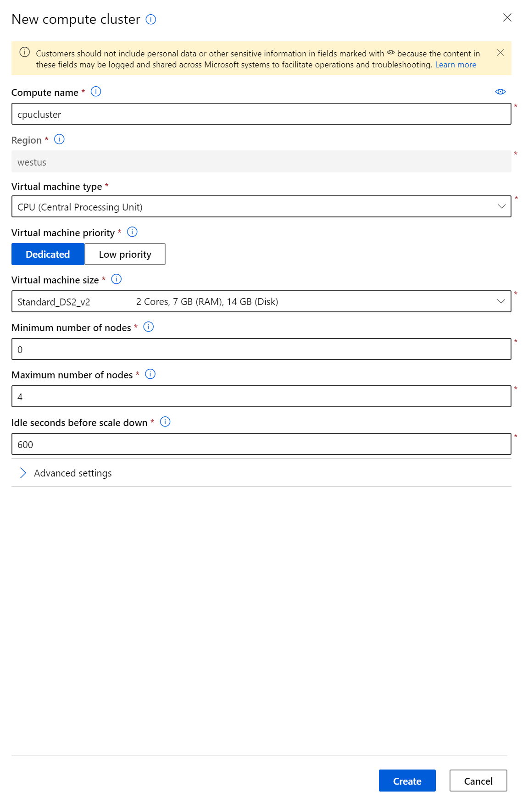
         
   • Click Create.
   
   • Wait for the provisioning state to be “Succeeded”
   
   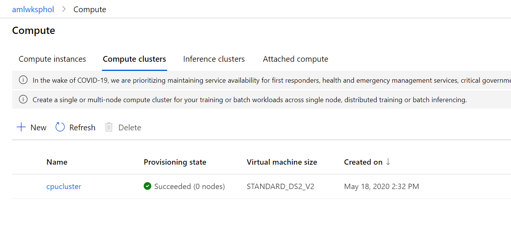
   
 
 
 **Create Compute Instance**

Next, we will create a Compute Instance. The Compute Instance will serve as an interactive workstation
in the cloud that serves as a Jupyter server, but also hosts and instance of RStudio server and can run
TensorBoard, Bokeh, Shiny or other apps used during the development work of a Data Scientist.

   • Navigate to Compute Instances tab in the Compute section and click on New
   
   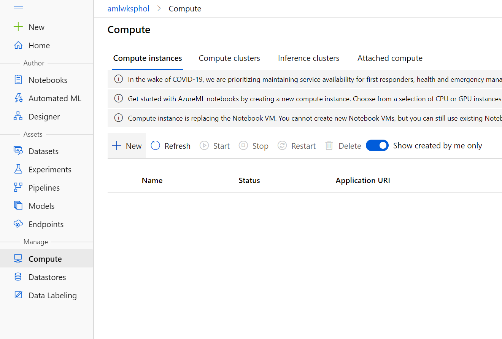
   
   • Choose some sufficiently unique name, keep the default VM type (STANDARD_DS3_V2 - a fairly
     inexpensive machine type costing).
     
   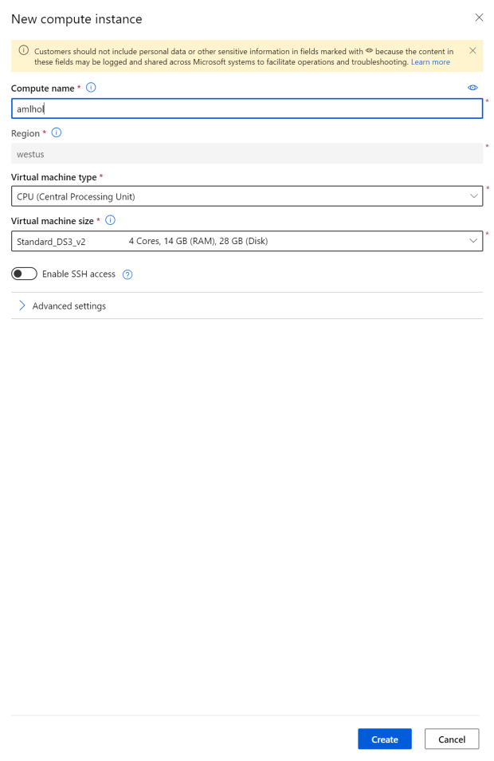
     
   • Click Create.
   
   • Wait for it to change the status to “Running”.
   
   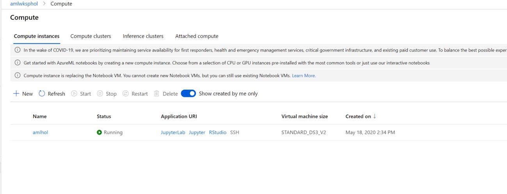
   
   • **Note that this machine will keep running until you stop it!**
   
   
### Create Dataset
   
With Azure Machine Learning datasets, you can:
   • Keep a single copy of data in your storage, referenced by datasets.

   • Seamlessly access data during model training without worrying about connection strings or data
paths.

   • Share data and collaborate with other users.
   
   
There are two dataset types, based on how users consume them in training:
   • [TabularDataset](https://docs.microsoft.com/en-us/python/api/azureml-core/azureml.data.tabulardataset?view=azure-ml-py) represents data in a tabular format by parsing the          provided file or list of files. This provides you with the ability to materialize the data into a Pandas or Spark DataFrame. You can create a TabularDataset object from .csv,      .tsv, .parquet, .jsonl files, and from SQL query results. For a complete list, see TabularDatasetFactory class.

   • The [FileDataset](https://docs.microsoft.com/en-us/python/api/azureml-core/azureml.data.file_dataset.filedataset?view=azure-ml-py) class references single or multiple files        in your datastores or public URLs. By this method, you can download or mount the files to your compute as a FileDataset object. The files can be in any format, which enables      a wider range of machine learning scenarios, including deep learning.
   
Once you have created an instance of Azure Machine Learning, select 'Launch Azure Machine Learning
studio' (or browse to [https://ml.azure.com/](https://ml.azure.com/))

By creating a dataset, you create a reference to the data source location, along with a copy of its
metadata. To create a dataset in the studio:
  
   • Sign in at https://ml.azure.com.
  
   • Select Datasets in the Assets section of the left pane.
  
  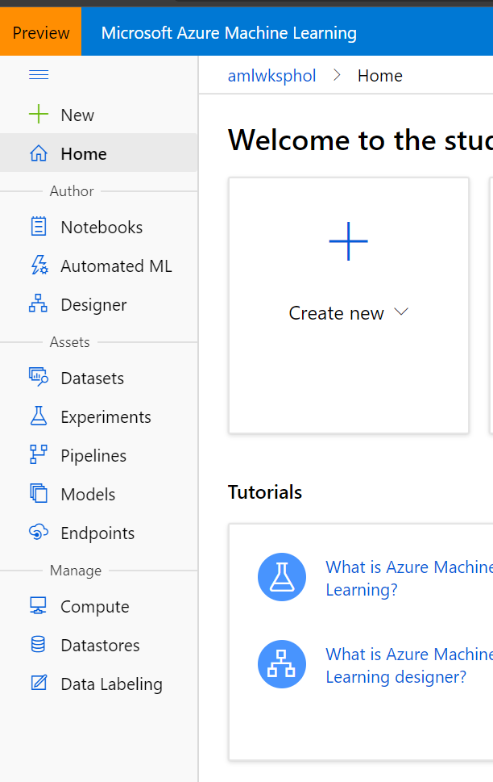
  
   • Select Create Dataset to choose the source of your dataset. This source can be local files, a
     datastore, or public URLs. For our workshop we will upload the data from local files.

  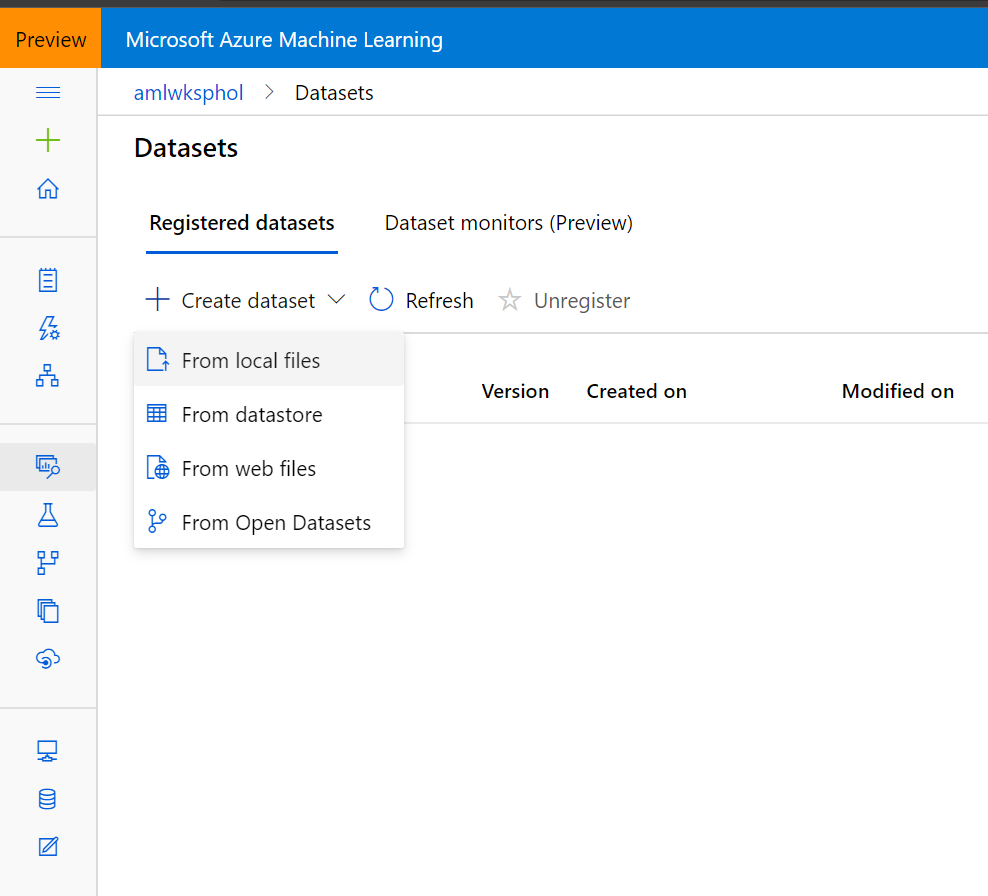
  
   • Select Tabular for Dataset type and give your dataset a name.
  
  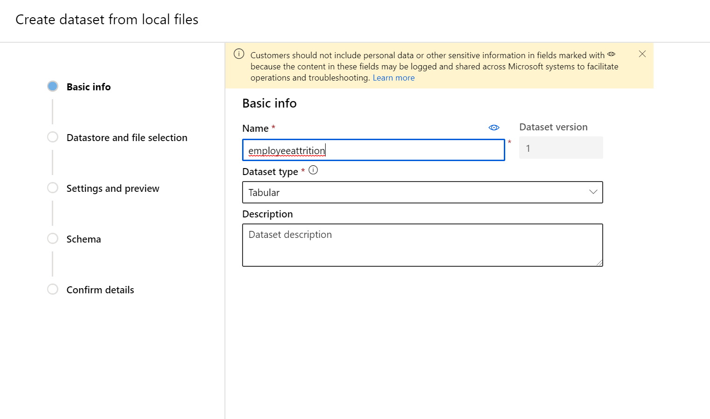
  
   • Select Next to open the Datastore and file selection form. On this form you select where to keep
     your dataset after creation, as well as select what data files to use for your dataset. Select
     Browse and upload the file from your local desktop. Keep rest of the default values.
 
  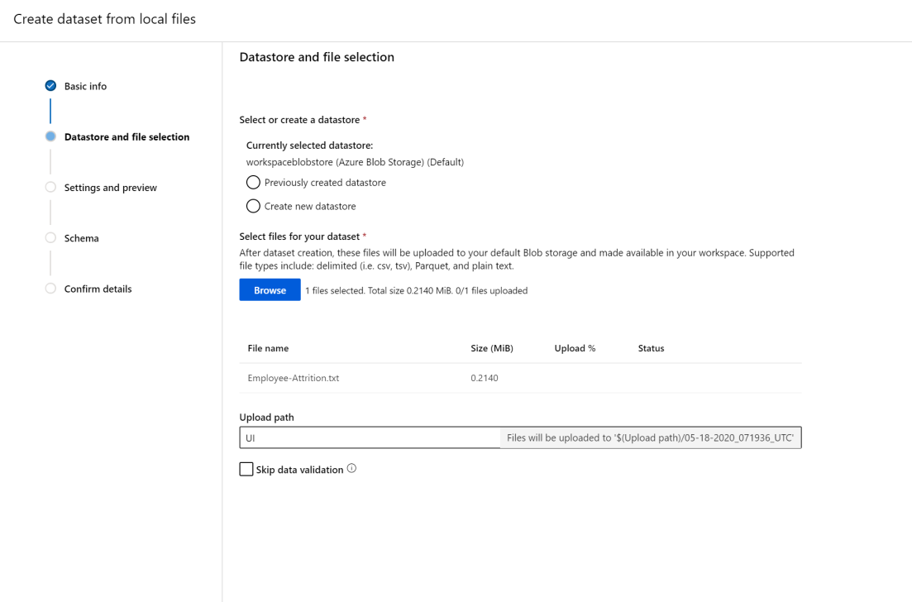
  
   • Select Next to populate the Settings and preview and Schema forms; they are intelligently
     populated based on file type and you can further configure your dataset prior to creation on
     these forms. Change the Column header to “All files have same header”. Ensure the rest of the
     setting and preview of the data.
    
   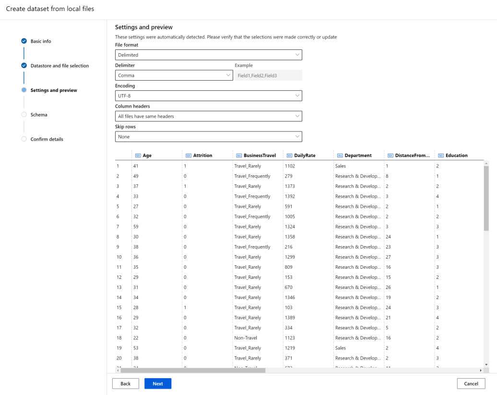
   
   • Select Next to review the Schema and Data type.
   
   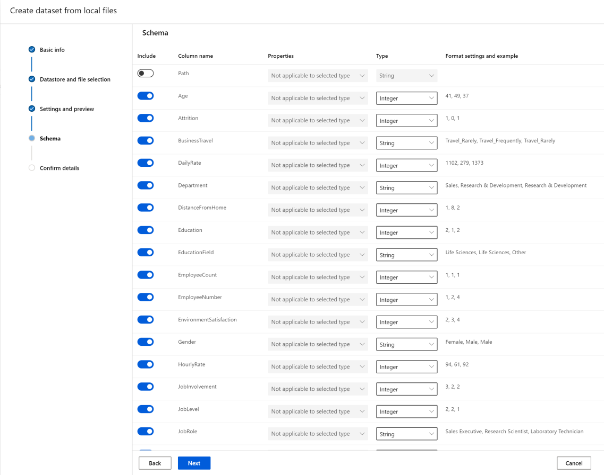
   
   • Select Next to review the Confirm details form. Check your selections and create an data profile
     for your dataset. Learn more about [data profiling](https://docs.microsoft.com/en-us/azure/machine-learning/how-to-use-automated-ml-for-ml-models#profile).
     
   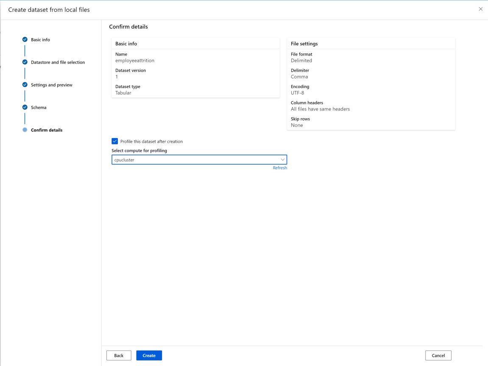
   
   • Select Create to complete your dataset creation.
   
   • Dataset should be registered and available for use.
   
   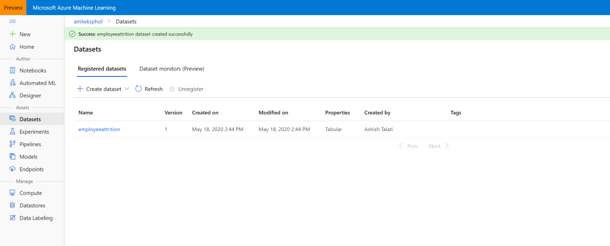
   
   • You can register a new dataset under the same name by creating a new version. A dataset
     version is a way to bookmark the state of your data so that you can apply a specific version of
     the dataset for experimentation or future reproduction. Learn more about dataset versions.

   • Once the data profile is completed (profile generation), you can get a vast variety of summary
     statistics across your data set to verify whether your data set is ML-ready. For non-numeric
     columns, they include only basic statistics like min, max, and error count. For numeric columns,
     you can also review their statistical moments and estimated quantiles.
     
     
Statistic | Description
--------- | -----------------
Feature | Name of the column that is being summarized.
Profile | In-line visualization based on the type inferred. For example, strings, booleans, and dates will have value counts, while decimals (numerics) have approximated    histograms. This allows you to gain a quick understanding of the distribution of the data.
Type distribution | In-line value count of types within a column. Nulls are their own type, so this visualization is useful for detecting odd or missing values.
Type | Inferred type of the column. Possible values include: strings, booleans, dates, and decimals.
Min | Minimum value of the column. Blank entries appear for features whose type does not have an inherent ordering (e.g. booleans).
Max | Maximum value of the column.
Count | Total number of missing and non-missing entries in the column.
Not missing count | Number of entries in the column that are not missing. Empty strings and errors are treated as values, so they will not contribute to the "not missing   count".
Quantiles | Approximated values at each quantile to provide a sense of the distribution of the data.
Mean | Arithmetic mean or average of the column.
Standard deviation | Measure of the amount of dispersion or variation of this column's data.
Variance | Measure of how far spread out this column's data is from its average value.
Skewness | Measure of how different this column's data is from a normal distribution.
Kurtosis | Measure of how heavily tailed this column's data is compared to a normal distribution.

  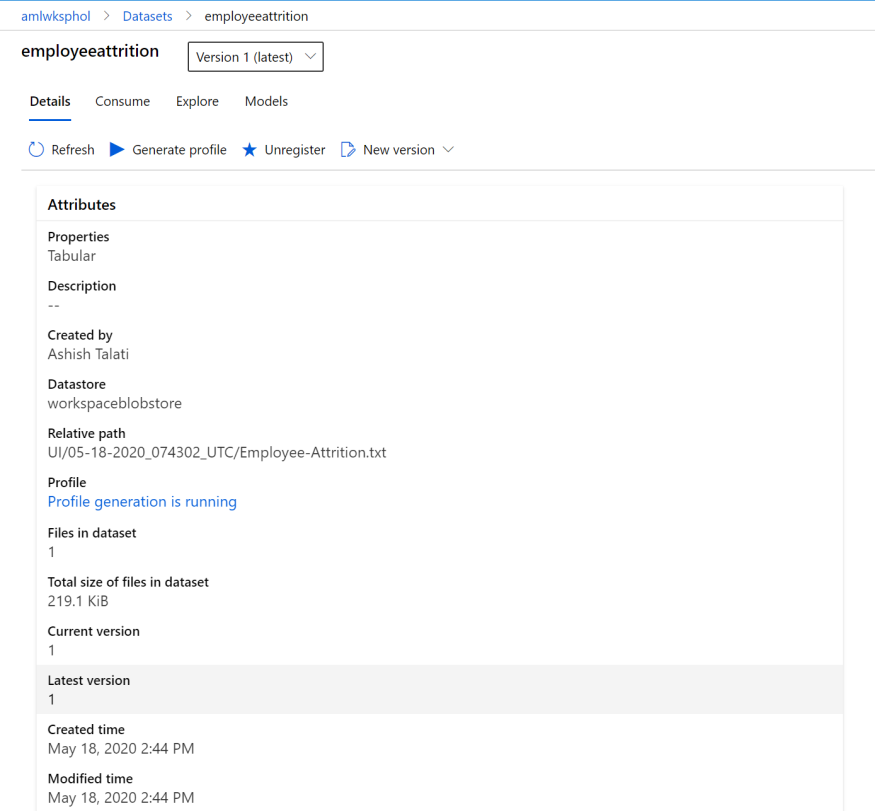

   • Now, click on the newly created dataset and click Explore. Here you can see the fields of the
     Tabular dataset.
     
   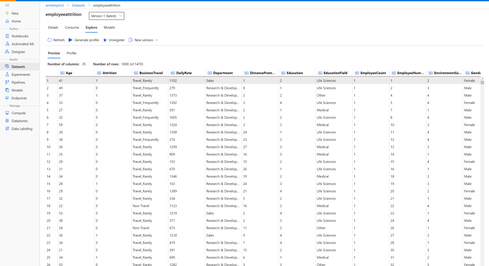
   
   To view the profile of the dataset we generated in the previous step, click the Profile tab. If you
   want to regenerate a profile (or you created the dataset without selecting the profile option), you can
   click Generate profile and select a cluster to generate profile information for the dataset.
   
   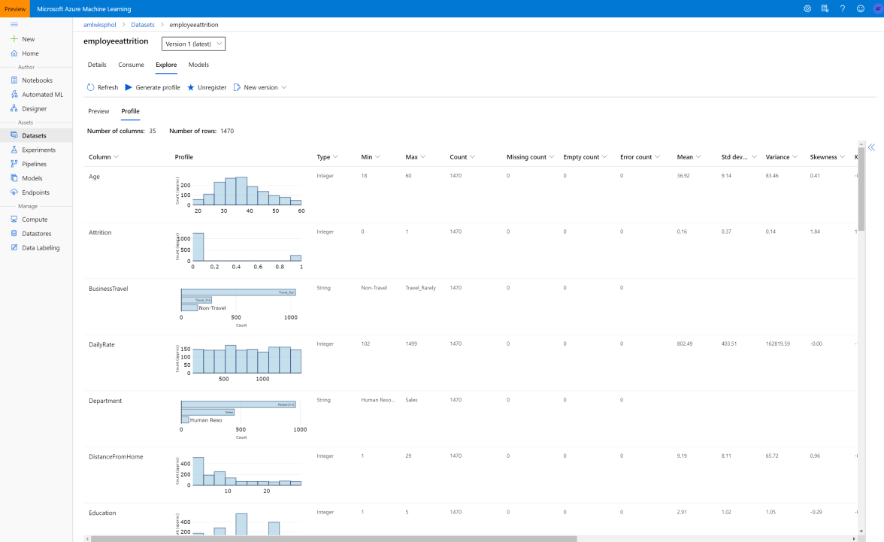
   
   • In the Consume tab we can find a short code snippet for consuming the dataset from Notebooks. 
     
   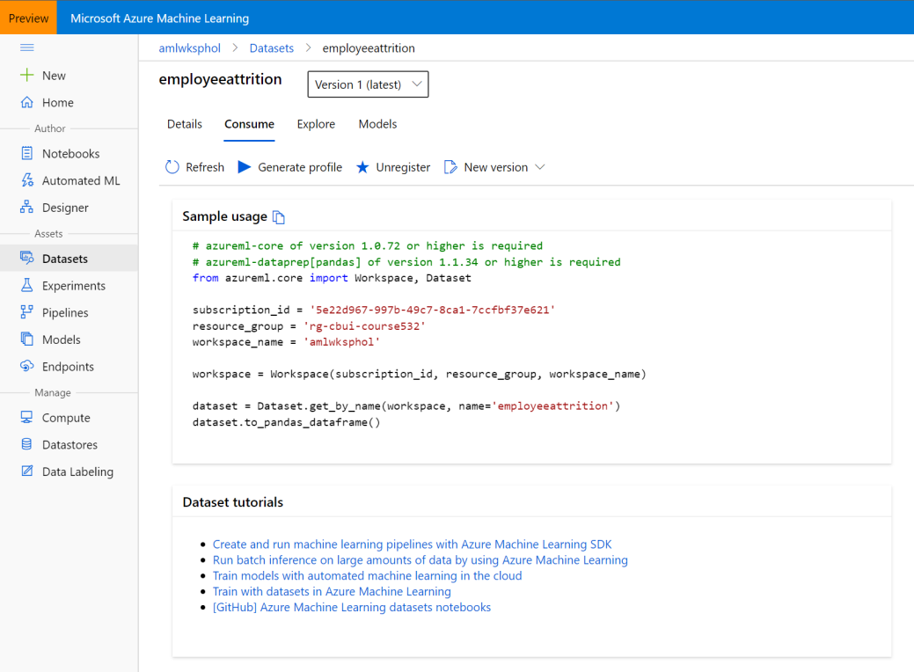
   
   • For more information on datasets, see the [how-to for more information on creating and using Datasets](https://docs.microsoft.com/en-us/azure/machine-learning/how-to-create-register-datasets).
   
  
  
  ## Automated Machine Learning
  
Automated machine learning (automated ML) builds high quality machine learning models for you by
automating model and hyperparameter selection. Bring a labelled dataset that you want to build a
model for, and automated ML will give you a high quality machine learning model that you can use for
predictions.

If you are new to Data Science, automated ML will help you get jumpstarted by simplifying machine
learning model building. It abstracts you from needing to perform model selection, hyperparameter
selection and in one step creates a high-quality trained model for you to use.

If you are an experienced data scientist, automated ML will help increase your productivity by
intelligently performing the model and hyperparameter selection for your training and generates high
quality models much quicker than manually specifying several combinations of the parameters and
running training jobs. Automated ML provides visibility and access to all the training jobs and the
performance characteristics of the models to help you further tune the pipeline if you desire.

Follow the [instructions](https://docs.microsoft.com/en-us/azure/machine-learning/how-to-use-automated-ml-for-ml-models) in the documentation for a full overview of the user interface.
                 
   • Navigate to the left pane of your workspace. Select Automated ML under the Author section.
   
   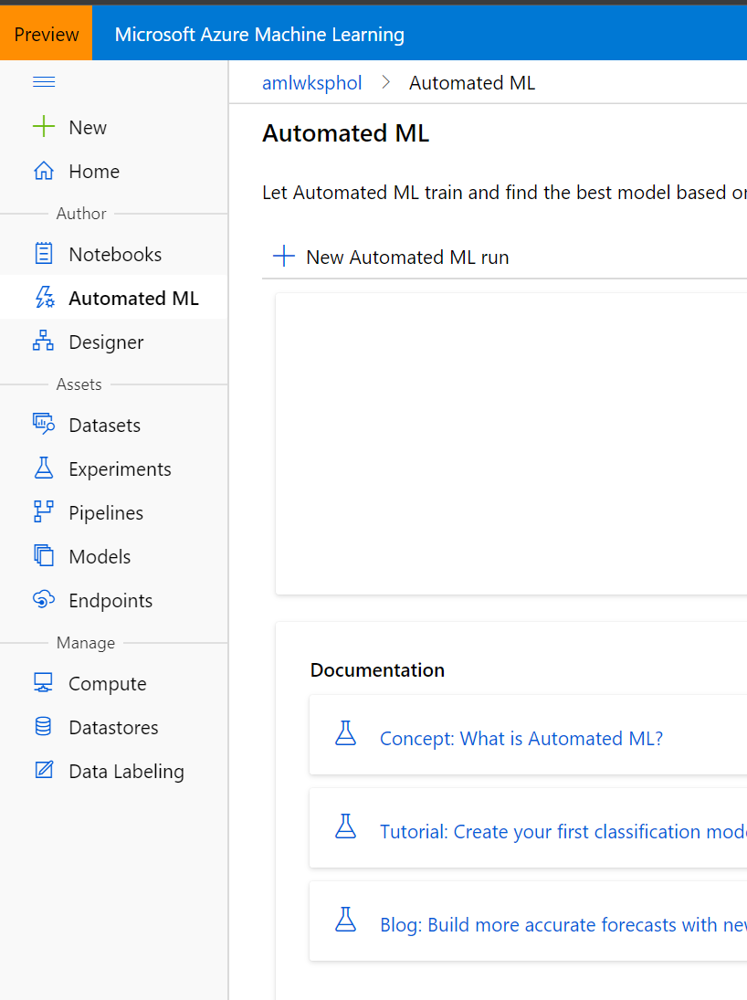
   
   • Select New Automated ML run and select the employeeattrition dataset that you had created earlier.
   
   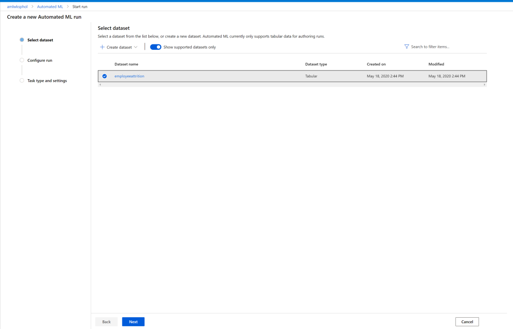
   
   • Select Next
   
   • Enter the Experiment name, select the target column Attrition (this is what we want to predict), and select the cluster cpucluster which you've created earlier.

   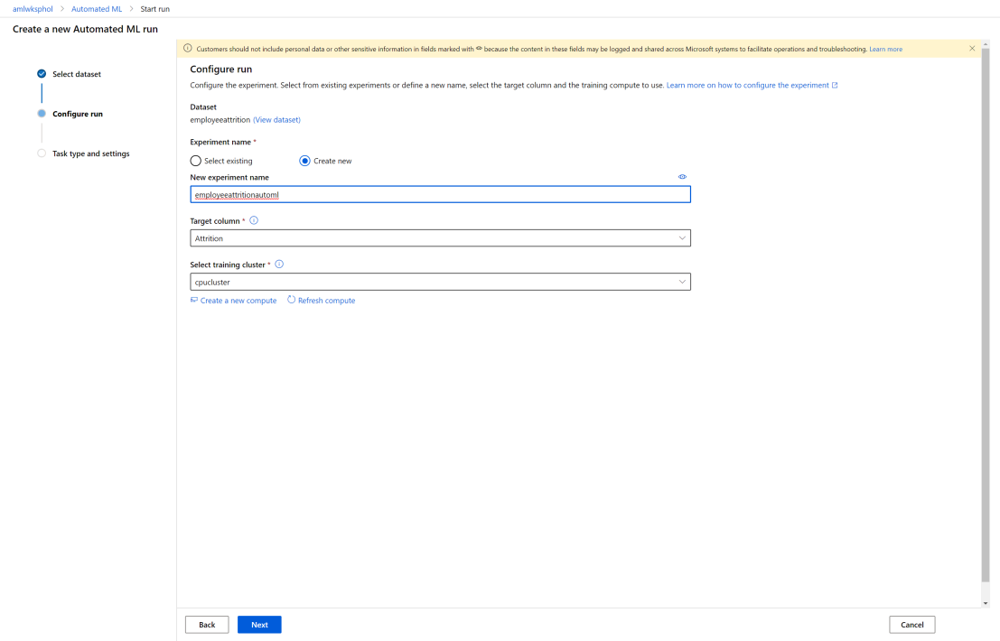
   
   • Select Next
   
   • Keep the task type as “classification”
   
   • Select view additional configuration.
   
   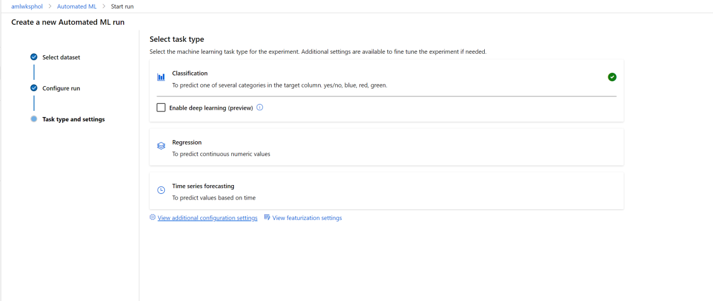
   
   • Set the Primary [metric](https://docs.microsoft.com/en-us/azure/machine-learning/how-to-configure-auto-train#primary-metric) to AUC_weighted, the training job time to 0.25        and Max concurrent iterations to 4 (sufficient for the workshop). The concurrency parameter defines how many nodes of your cluster will be used for training.
   
   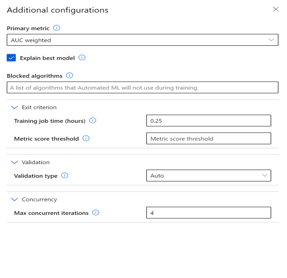
   
   • Click Save
   
   • Hit Finish and wait for the training job to start. You'll be able to see the models which are created during the run, click on any of the models to open the detailed view of      that model, where you can analyze the [graphs and metrics](https://docs.microsoft.com/en-us/azure/machine-learning/how-to-understand-automated-ml).

   • Once the run is completed( Should take about 17 minutes) , click Deploy best model to create a deployed endpoint from the model.
   
   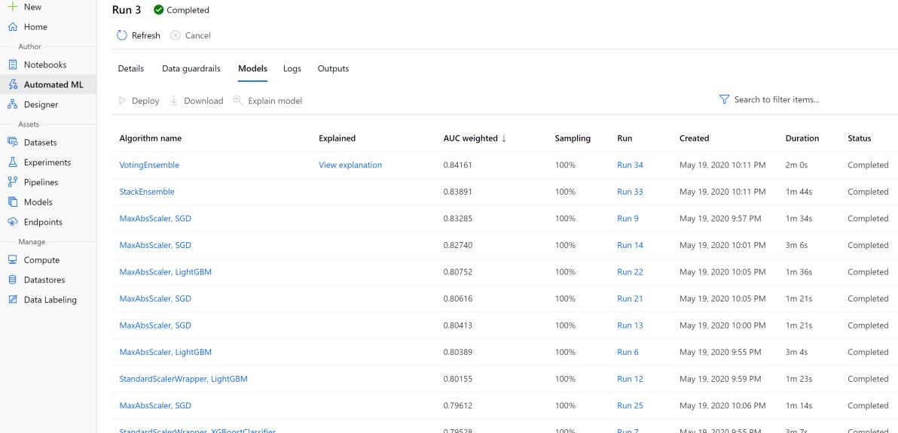
   
   • Once the model is deployed, you can consume that API in any client. For instance, you can call the API from Postman. Go to EndPoints in AML assets
   
   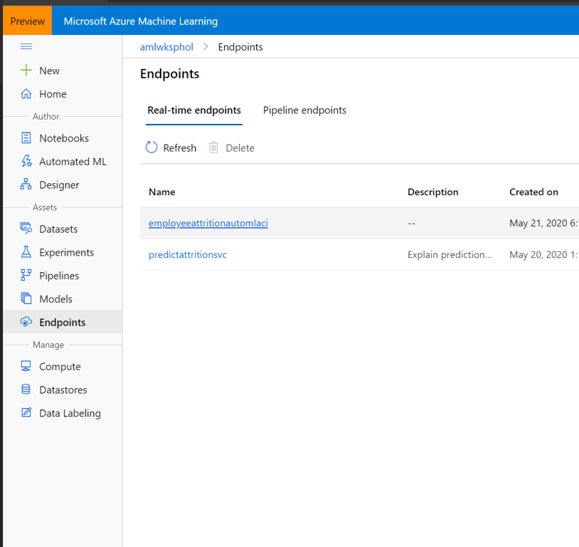
   
   • Go to consume tab and find the URL Endpoint and key(if authentication was enabled)
   
   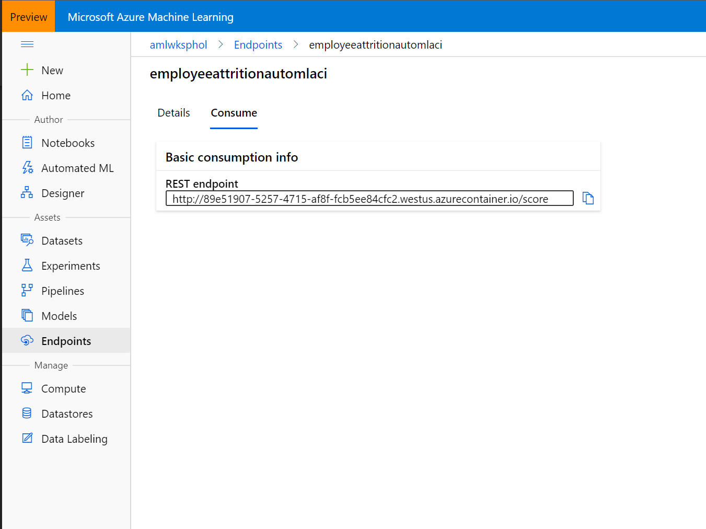
   
   • Open Postman and create a new HTTP Post for that Rest Endpoint and send following HTTP Body
   
   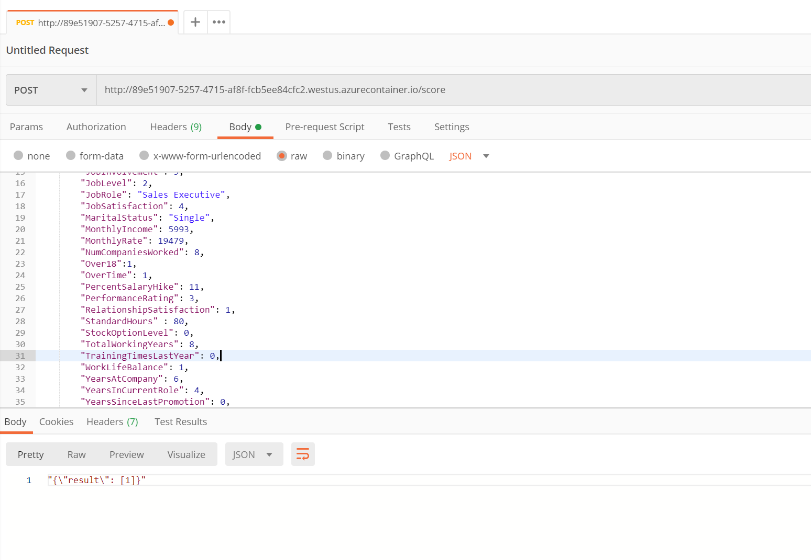
 ``` 
   {
"data": [{
"Age": 41,
"BusinessTravel": "Travel_Rarely",
"DailyRate": 1102,
"Department": "Sales",
"DistanceFromHome": 1,
"Education": 2,
"EducationField": "Life Sciences",
"EmployeeCount" : 1,
"EmployeeNumber" : 1,
"EnvironmentSatisfaction": 2,
"Gender": "Female",
"HourlyRate": 94,
"JobInvolvement": 3,
"JobLevel": 2,
"JobRole": "Sales Executive",
"JobSatisfaction": 4,
"MaritalStatus": "Single",
"MonthlyIncome": 5993,
"MonthlyRate": 19479,
"NumCompaniesWorked": 8,
"Over18":1,
"OverTime": 1,
"PercentSalaryHike": 11,
"PerformanceRating": 3,
"RelationshipSatisfaction": 1,
"StandardHours" : 80,
"StockOptionLevel": 0,
"TotalWorkingYears": 8,
"TrainingTimesLastYear": 0,
"WorkLifeBalance": 1,
"YearsAtCompany": 6,
"YearsInCurrentRole": 4,
"YearsSinceLastPromotion": 0,
"YearsWithCurrManager": 5
}]
}
```

To learn more about automated ML, see documentation [here](https://docs.microsoft.com/en-us/azure/machine-learning/concept-automated-ml).

### Optional Tasks:

   • Once your model has been deployed, follow these [instructions](https://docs.microsoft.com/en-us/power-bi/transform-model/service-machine-learning-integration) to consume the      model from Power BI.
   
   • Feature engineering: Auto ML also allows you to do feature engineering before starting the run. You can checkout this Featurization option on the start run page. 
   
   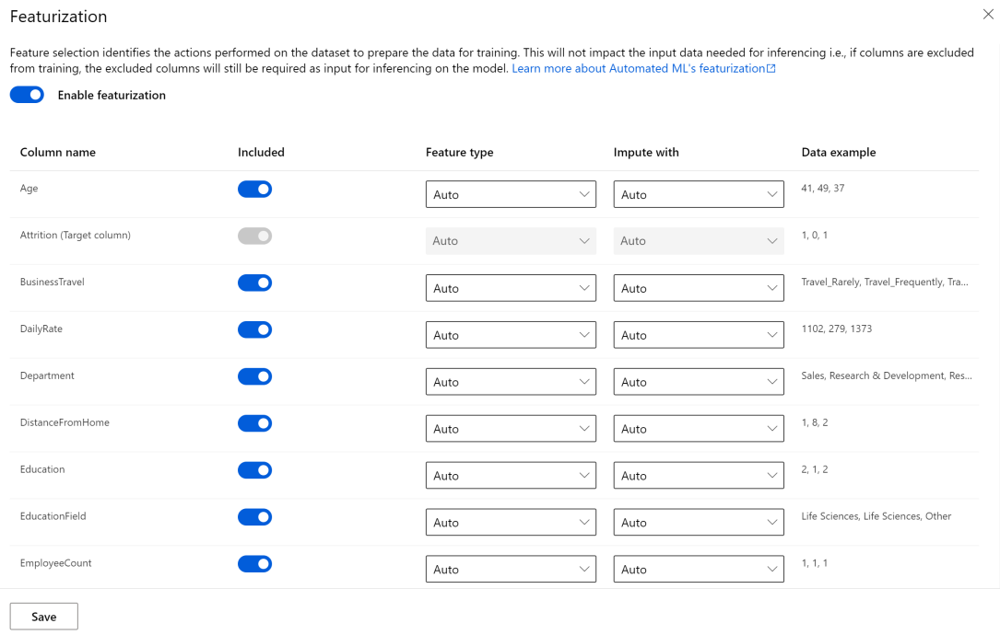
   
   Try the [sample notebooks](https://github.com/Azure/MachineLearningNotebooks/tree/master/how-to-use-azureml/automated-machine-learning).
   
  
  ## Azure Machine Learning Designer
  
  Azure Machine Learning designer lets you visually connect [datasets](https://docs.microsoft.com/en-us/azure/machine-learning/concept-designer#datasets) and [modules]               (https://docs.microsoft.com/en-us/azure/machine-learning/concept-designer#module) on an interactive canvas to create machine learning models.

  The designer uses your Azure Machine Learning workspace to organize shared resources such as:
  
   • [Pipelines](https://docs.microsoft.com/en-us/azure/machine-learning/concept-designer#pipeline)
   
   • [Datasets](https://docs.microsoft.com/en-us/azure/machine-learning/concept-designer#datasets)
   
   • [Compute resources](https://docs.microsoft.com/en-us/azure/machine-learning/concept-designer#compute)
   
   • [Registered models](https://docs.microsoft.com/en-us/azure/machine-learning/concept-azure-machine-learning-architecture#models)
   
   • [Published pipelines](https://docs.microsoft.com/en-us/azure/machine-learning/concept-designer#publish)
   
   • [Real-time endpoints](https://docs.microsoft.com/en-us/azure/machine-learning/concept-designer#deploy)
   
The designer gives you a visual canvas to build, test, and deploy machine learning models. With the
designer you can:
Drag-and-drop datasets and modules onto the canvas.
   
   • Connect the modules together to create a pipeline draft.
   
   • Submit a pipeline run using the compute resources in your Azure Machine Learning workspace.
    
   • Convert your training pipelines to inference pipelines.
   
   • Publish your pipelines to a REST pipeline endpoint to submit new pipeline runs with different parameters and datasets.
   
   • Publish a training pipeline to reuse a single pipeline to train multiple models while changing parameters and datasets.
   
   • Publish a batch inference pipeline to make predictions on new data by using a previously trained model.

   • Deploy a real-time inference pipeline to a real-time endpoint to make predictions on new data in real time.
   
   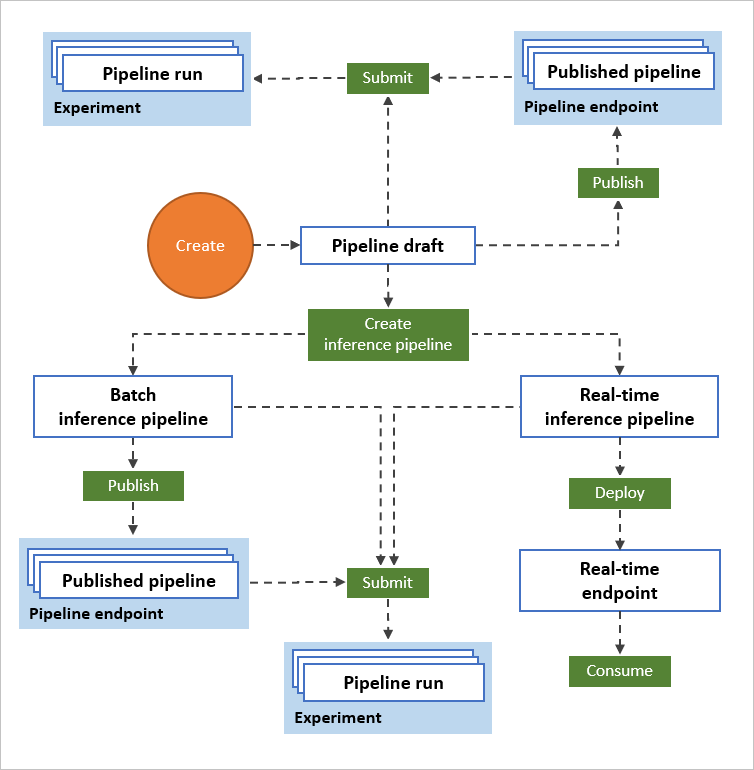
   
   • In the AML, navigate to the Designer tab under the Author section and launch it.
   
   • Create a new experiment by click +
   
   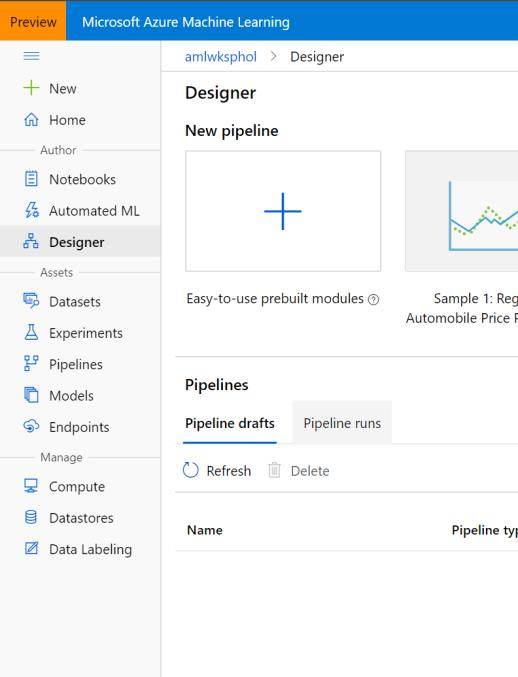
   
   • Rename the pipeline to Employee Attrition
   
   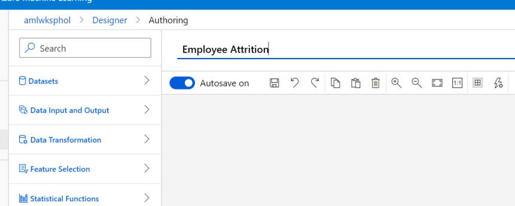
   
   • Select the compute target to the one that you created earlier. Click Save.
   
   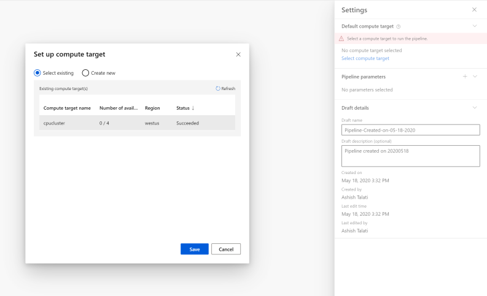
   
   • Click “X” to close the property window
   
   • Expand Datasets -> My DataSets and select employeeattrition dataset that was created earlier.
   
   • Drag the employeeatrition dataset module into the pipeline canvas
   
   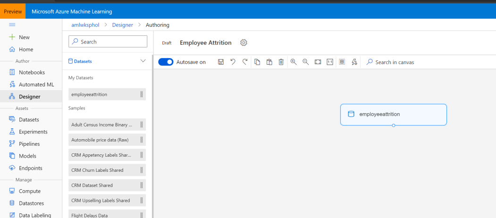
   
   • Add “Select Columns in Dataset” module to remove “EmployeeCount, EmployeeNumber, Over18 and StandardHours” columns.
   
   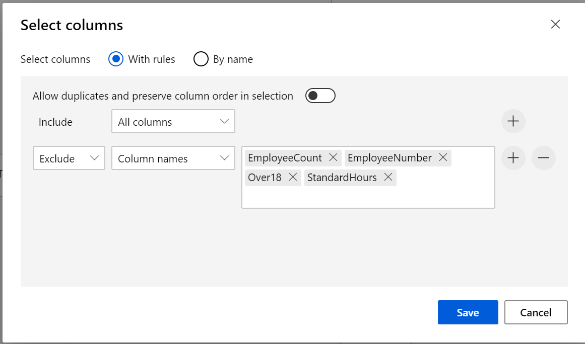
   
   • Add a Split Data module to create the training and test sets. Set the fraction of rows in the first
     output dataset to 0.7. This setting specifies that 70% of the data will be output to the left port of
     the module and the rest to the right port. We use the left dataset for training and the right one
     for testing.
     
   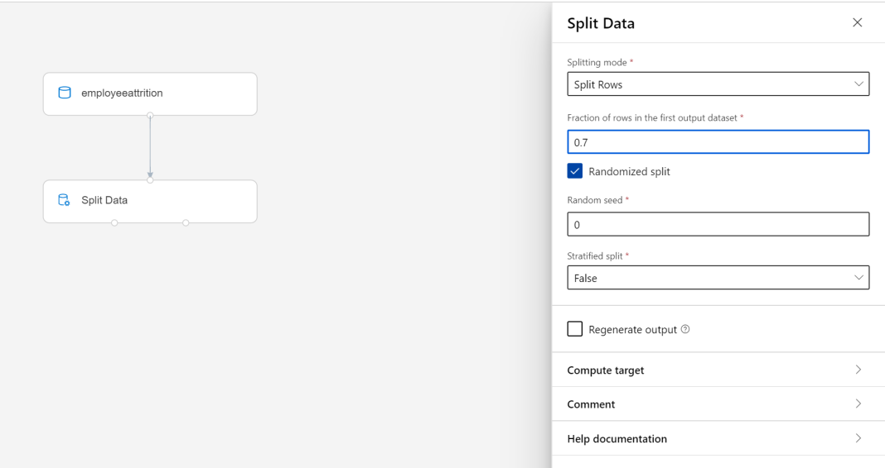
   
   
   • Add a Two-Class Logistics Regression module to initialize a boosted decision tree classifier.
  
   • Add a Train Model module. Connect the classifier from the previous step to the left input port of
     the Train Model. Connect the filtered dataset from Filter Based Feature Selection module as
     training dataset. Add the target column as Attrition in the label Column option. (**Column names:
     Attrition**) The Train Model will train the classifier.

   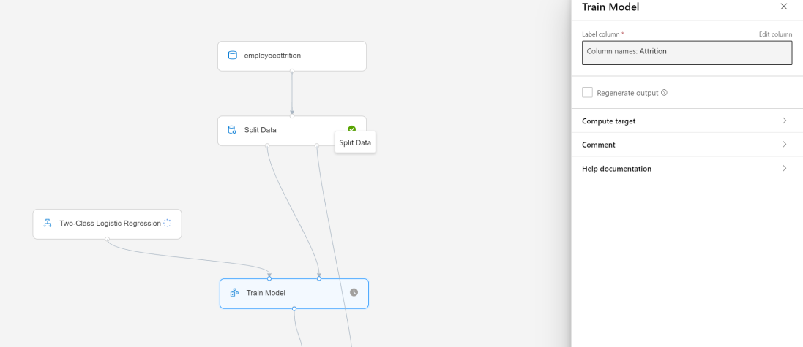
   
   • Add **Score Model** module and connect the **Train Model** module to it. Then add the test set (the
     output of Filter Based Feature Selection module which apply feature selection to test set too) to
     the **Score Model**. The **Score Model** will make the predictions. You can select its output port to
     see the predictions and the positive class probabilities.
   
   • Add an Evaluate Model module and connect the scored dataset to its left input port. To see the
     evaluation results, select the output port of the Evaluate Model module and select Visualize.
     
   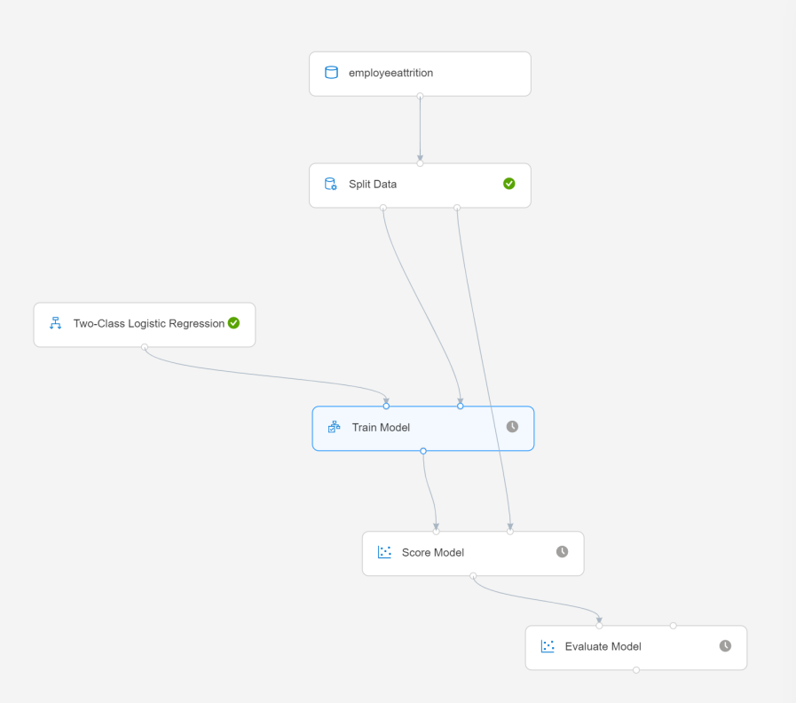
   
   • Click Submit at the top and give your experiment a name.
   
   
   
   • Once you ran the experiment, you can inspect the outputs of the individual steps - check out the
     output of the different steps, the last one by right-clicking it and selecting Visualize Scored
     dataset.
     
   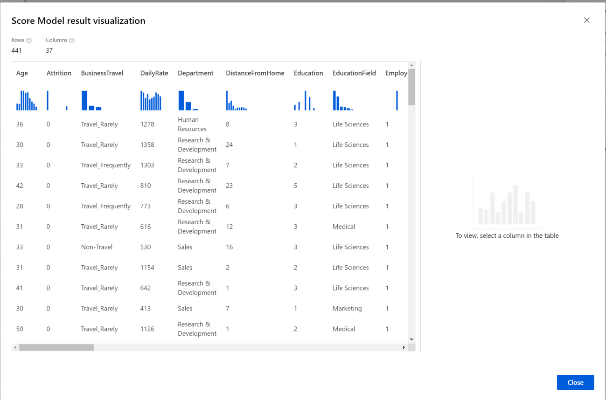
   
   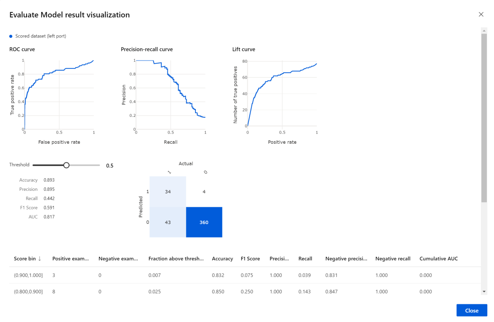
   

     
     
     
     
     
     
   
   
    
     
     
     
   
   
     
     


