# Ready Pre-day Azure Monitoring Workshop Proctor Guide

## Contents
* Challenge 1: Monitoring and Alert Rule
* Challenge 2: Monitoring and Alert Rule Automation
* Challenge 3: Azure Monitor for Containers
* Challenge 4: Application Insights
* Challenge 5: Log Analytics Query
* Challenge 6: Dashboard and Analytics
* Challenge 6a: Workbooks

## Workshop Setup
* Deploy Infra using Bash Cloud Shell and Azure CLI with an ARM Template<br/>
* Setup Azure CLI<br/>
https://docs.microsoft.com/en-us/cli/azure/install-azure-cli?view=azure-cli-latest<br/>
* Install Visual Studio Code and Extensions (depending on your tool of choice)<br/>
* Azure Resource Manager Tools - https://marketplace.visualstudio.com/items?itemName=msazurermtools.azurerm-vscode-tools<br/>
* Azure Account and Sign-In (adds the Azure Cloud Shell for Bash) - https://marketplace.visualstudio.com/items?itemName=ms-vscode.azure-account
Azure CLI Tools –
https://marketplace.visualstudio.com/items?itemName=ms-vscode.azurecli<br/>
* Download Azure Monitoring Workshop Setup Guide and follow the instructions to deploy.<br/>
https://github.com/rkuehfus/pre-ready-2019-H1/blob/master/Student/Guides/Deployment%20Setup%20Guide.docx?raw=true<br/>

## Guidance
Biggest issues I have seen when deploying the workshop are around compute quotas, changing the region to one that does not support the Azure Monitor preview, not having contributor role membership to the subscription and local machine issues.  If you run into a student who cannot seem to get her or his computer working with the Azure CLI, have them use the Azure Cloud Shell.  Remember to copy up the ARM template and parameters JSON files before kicking off the deployment.  
I highly recommend your students make sure they have an Azure Subscription they have contributor role access to before day one of the hack.<br/>

## Challenge 1: Monitoring and Alert Rule
1. Login to Azure Protal with your credention given in environment details.<br/>
2. Connect (RDP) to the Visual Studio Server (xxxxxVSSrv17) using its public IP address which is given in your pre-provisioned environment.<br/>
3. Open Visual Studio.<br/>
4. Visual Studio has view called **SQL Server Object Explorer** that can be used to add and delete SQL databases on the SQL server.<br/>
   <br/>
5. Add SQL Server from **SQL Server Object Explorer**<br/>
   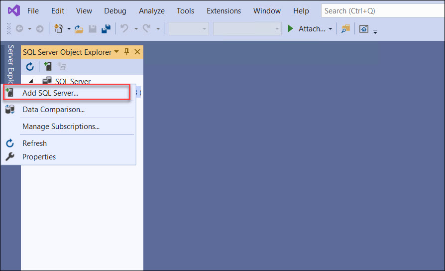<br/>
Note: Use SQL Auth with the username being sqladmin and password being whatever you used during deployment<br/>
6. Connect to the database server VM (xxxxxSqlSrv16) make sure to use below username and password to connect your SQL Server Virtual Manchine:<br/>
* Username: **sqladmin**<br/>
* Password: **demo@pass123**<br/>
   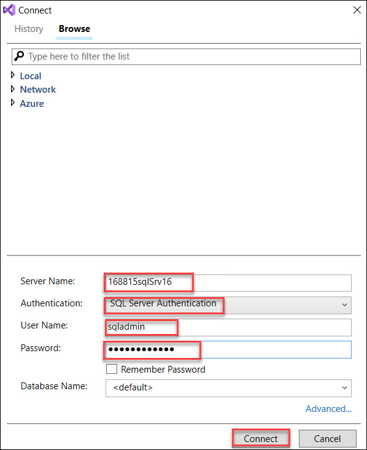<br/>
7. Once connected create a new database called **tpcc**<br/>
   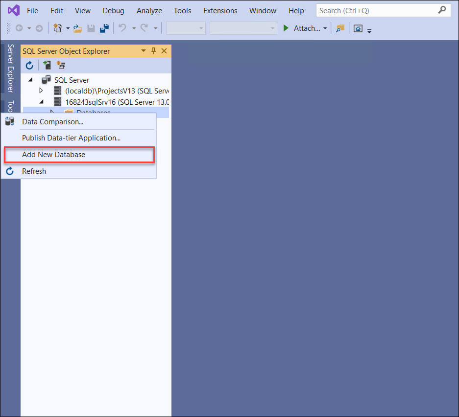<br/>
8. From the ARM template, send the below guest OS metric to Azure Monitor for the SQL Server<br/>
9. Add a Performance Counter Metric for:<br/>
Object: SQLServer:Databases<br/>
Counter: Active Transactions<br/>
Instance: tpcc<br/>
``
Hint: https://docs.microsoft.com/en-us/azure/monitoring-and-diagnostics/metrics-store-custom-guestos-resource-manager-vm<br/>
``
10. First, figure out the correct format for the counter use the run command on the SQL Server in the Azure portal<br/>
**Run the command**<br/>
`
(Get-Counter -ListSet SQLServer:Databases).Paths
`
   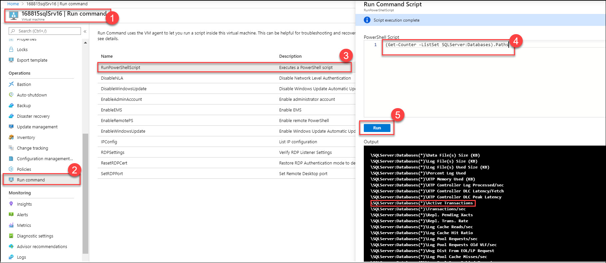<br/>
11. Once its finished, review the results (scroll up) and copy the output for the `SQLServer:Databases` counter.<br/>
`\SQLServer:Databases(*)\Active Transactions<br/>`
   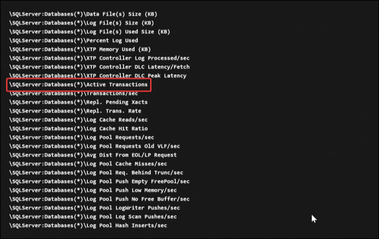<br/>
Then change it to target just your specific database<br/>
`\SQLServer:Databases(tpcc)\Active Transactions`<br/>
**Tip:** Share the following link to help lead them to how to find the counter<br/>
https://docs.microsoft.com/en-us/powershell/module/microsoft.powershell.diagnostics/get-counter?view=powershell-5.1
12. Next, Run the below command to add the collection of this counter that sends it to Azure Monitor using the Azure monitor data sink for SQL Server.<br/>
``
az vm extension set --resource-group myResourceGroup --vm-name myVMname --name IaaSDiagnostics --publisher Microsoft.Azure.Diagnostics --settings PublicConfig.json
``<br/>
   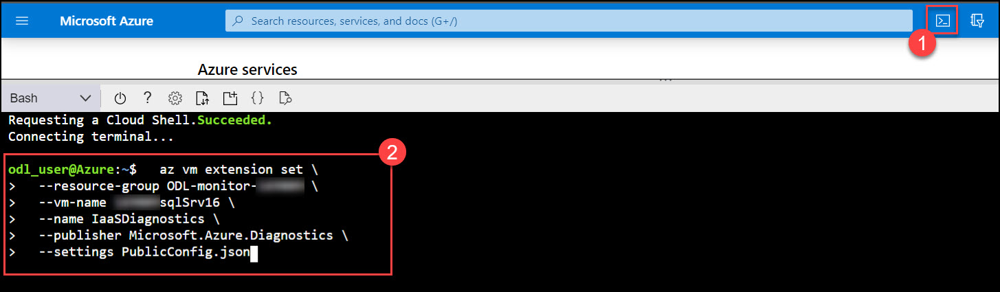<br/>
13. Once the command shows output, go to metrics and check to make sure you are seeing the new metrics.<br/>
   <br/>
   <br/>
   <br/>
**Tip**: A bunch of OS metrics are configured already under the scale set as a sample.<br/>
14. Download and Install HammerDB tool on the Visual Studio VM from below link:<br/>
www.hammerdb.com<br/>
**Note:** HammerDB does not have native support for Windows Display Scaling. This may result in a smaller than usual UI that is difficult to read over high resolution RDP sessions. If you run into this issue later, close and re-open your RDP session to the VSServer with a lower display resolution. After the RDP session connects, you can zoom into to adjust the size.<br/>
   <br/>
   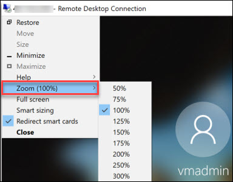<br/>
15. From the Visual Studio Server, download the latest version of **HammerDB**.<br/>
   <br/>
   <br/>
16. If you get this Security Warning, go to Internet Options and then **Security \ Security Settings \ Downloads \ File download \ Enable**.<br/>
   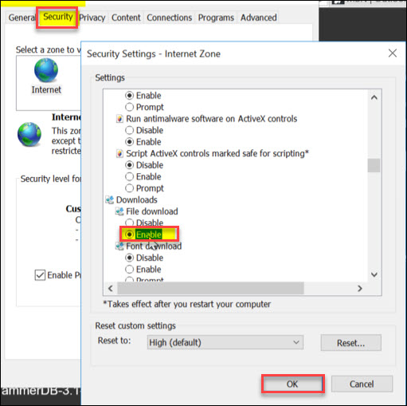<br/>
17. Click OK. Try again & Click Save and Run the warnings.<br/>
   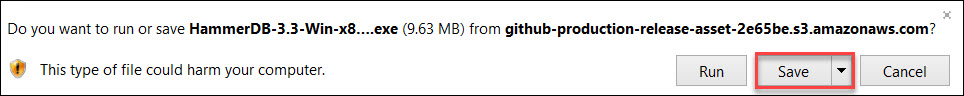<br/>
   <br/>
**Tip:** If you end up closing HammerDB you have to go to C:\Program Files\HammerDB-3.1 and run the batch file<br/>
18. Use **HammerDB** to create transaction load<br/>
19. Double click on SQL Server and click OK, and OK on the confirm popup.
   <br/>
20. Drill into SQL Server \ TPC-C \ Schema Build and double click on Options. Modify the Build Options for the following:<br/>
* **SQL Server:** Name of your SQL Server<br/>
* **SQL Server ODBC Driver:** SQL Server<br/>
* **Authentication:** SQL Server Authentication<br/>
* **SQL Server User ID:** sqladmin<br/>
* **SQL Server User Password:** demo@pass123<br/>
* **SQL Server Database:** tpcc<br/>
* **Number of Warehouses:** 50<br/>
* **Virtual Users to Build Schema:** 50<br/>
   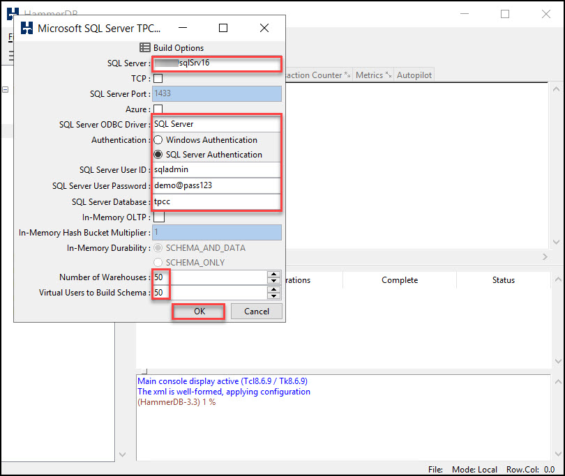<br/>
**Note:** Setting the last two at 50 should generate enough load to trip a threshold and run long enough for you to graph<br/>
20. Double click on **Build** and Click Yes to kick of a load test.<br/>
   <br/>
21. When the test is running it should like this.<br/>
   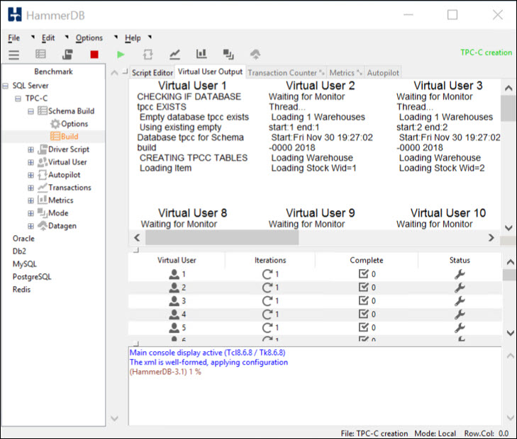<br/>
**TIP:** If you would like to run a second test you must first delete the database you created and recreate it. HammerDB will not run a test against a database that has data in it.  When you run a test is fills the database with a bunch of sample data.<br/>
22. Go Back to **Azure portal** and from **Azure Monitor** create a graph for the **SQL Server Active Transactions and Percent CPU** and pin to your Azure Dashboard.<br/>
   <br/>
23. Customize the dashboard once pinned it to a Azure Dashboard.
   <br/>
   <br/>
24. Dashboard should look something like this.<br/>
   <br/>
25. From **Azure Monitor**, create an Action group, to send email to your address<br/>
   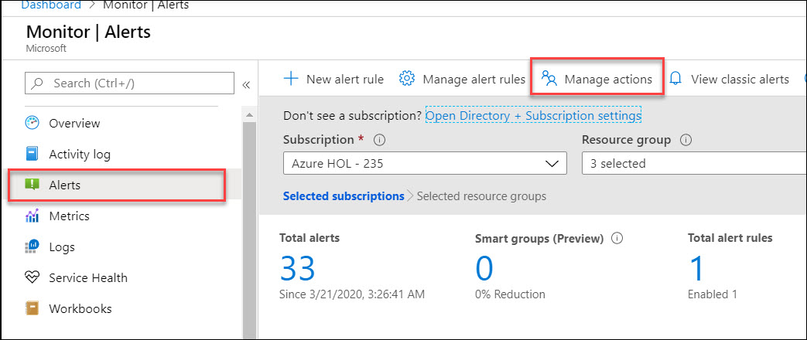<br/>
  * For creating Action Group, Click on **Add Action Group**
   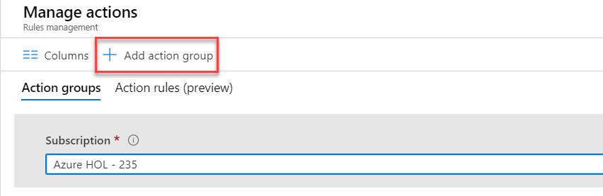<br/>
26. Give values as shown below and Click **OK**:
   <br/>
27. Create an Alert if Active Transactions goes over 40 on the SQL Server **tpcc** database.<br/>
   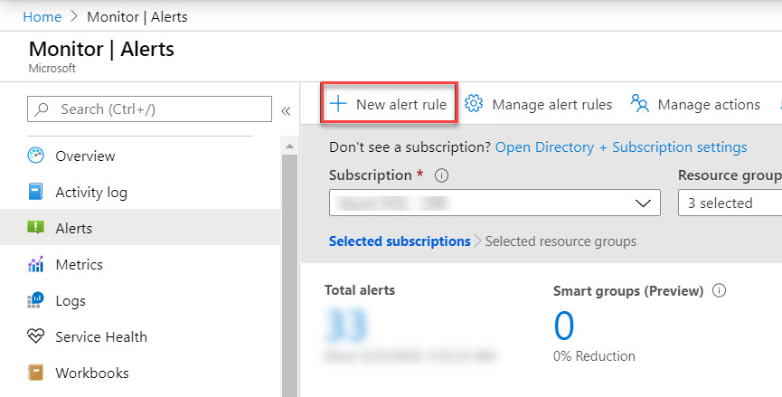<br/>
  * Select SQL Server as Resource
   <br/>
  * Add Conditon if Active Transactions goes over 40 on the SQL Server
   <br/>
   <br/>
  * Add Action Group that you created in above steps
   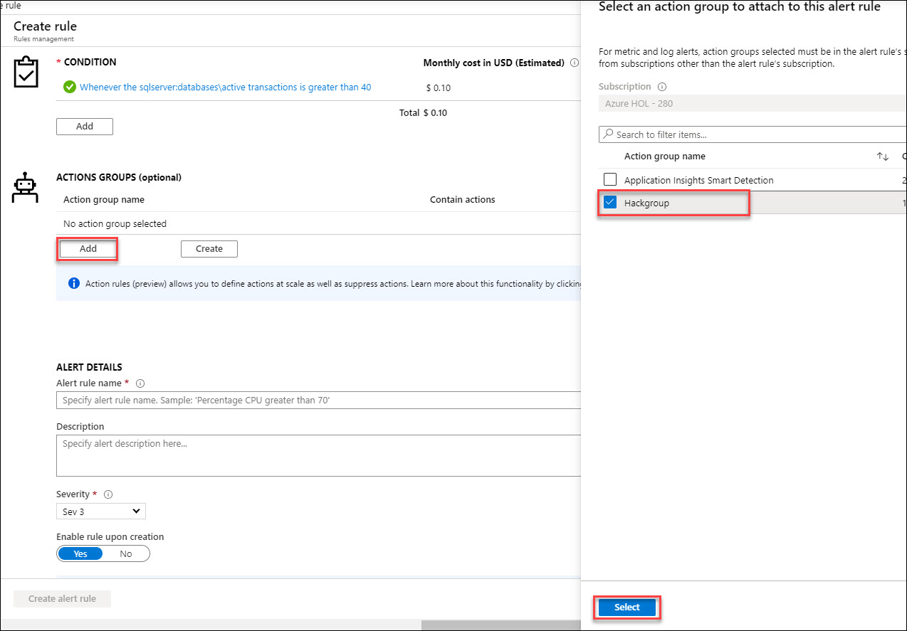<br/>
  * Give Alert Details and Click Create Alert Rule
   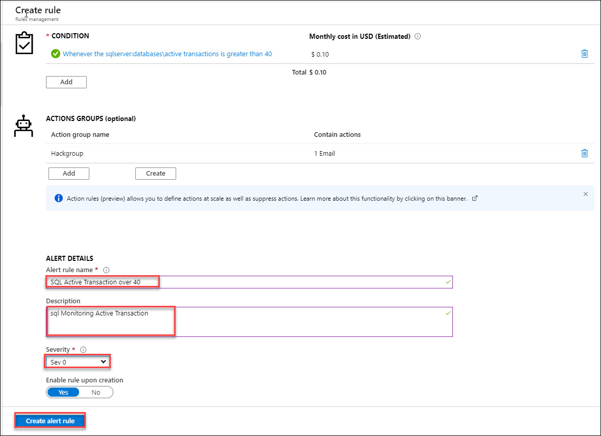<br/>
  * You will get the alert email at your email address that you provided for action group
   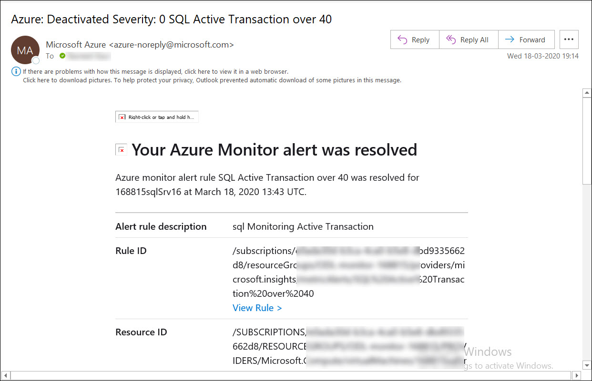<br/>
27. Create an another Alert Rule for CPU over **75%** on the **Virtual Scale Set** that emails me when you go over the threshold. First create a dashboard to watch the Scale Set CPU<br/>
28. Navigate to the folder called `Loadscripts` under the Resources folder in **Student** and copy the **cpuGenLoadwithPS.ps1** script to both instances running in the Scale Set and run them.<br/>
   <br/>
``
This may be a bit of a challenge to those not used to working with a scale set.  If your student just grabs the public IP address and then RDP to it.  They will end up on one of the instances but because they are going through the Load Balancer, they cannot control which one.  Or can they?😊
``<br/>
29. If you look at the configuration of the LB it is configured with an inbound NAT rule that will map starting at port 50000 to each instance in the Scale Set.  So if they RDP using the PIP:50000 for instance 1 and PIP:50001 for instance 2.<br/>
   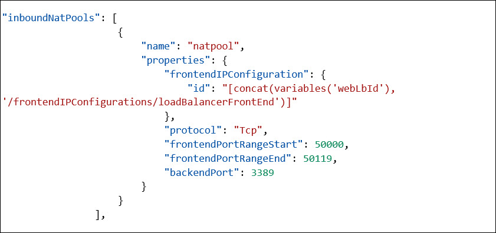<br/>
* For Example:<br/>
   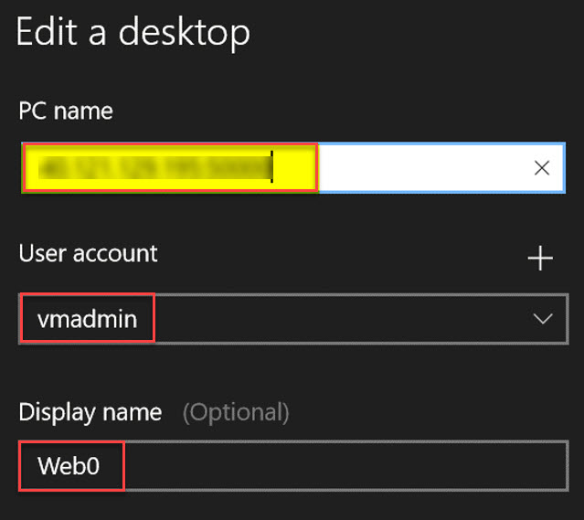<br/>
30. Jump on to both VMs in the Scale Set, Open the PowerShell ISE, Copy the script in the window and run it. You may need to run it more then once to really add the pressure. This script will pin each core on the VM no matter how many you have.<br/>
   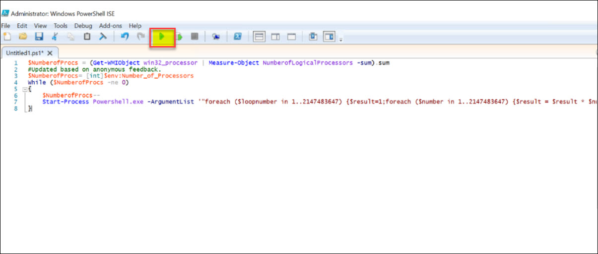<br/>
31. The trick to getting the alert to fire is to pin both instances at the same time as the CPU metric is an aggregate of the scale set. If you just max the CPU on one server to 100% the Scale Set is only at 50% and till not trip the alert threshold of 75%. Also, if they run the script and then setup the Alert Rule then to back to run another test to trip the alert, they have scaled out to a third instance and not realized it. They may need to jump on that box and max it out as well.<br/>
* First team to send me both alerts wins the challenge!!<br/>
* Good luck!

## Challenge 2: Monitoring and Alert Rule Automation

1. Update the parameters file and deployment script for the **GenerateAlertRules.json** template located in the **AlertTemplates** folder<br/>
   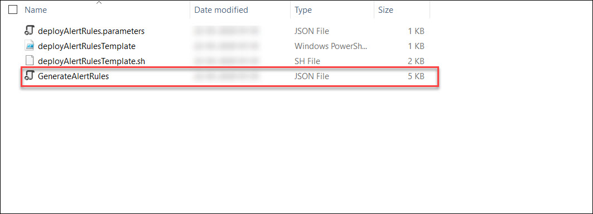<br/>
2. Add the names of your **VMs** and **ResouceId** for your Action Group<br/>
3. To find the **ResourceId** for your Action group navigate to the **Resource Group** where you are stored the action group and make sure to check off **Show hidden types**.<br/>
   <br/>
4. Click on your Action Group and copy the **ResourceId**<br/> 
   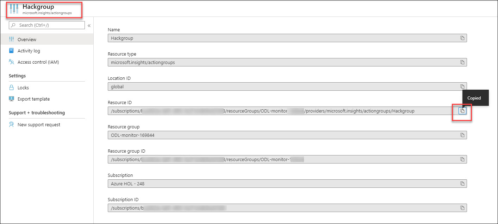<br/>
5. Then update the **deployAlertRules.parameters.json** file as it shows below<br/>
   <br/>
6. Save the parameters file and update the **deployAlertRulesTemplate.ps1** file with the name of your **Resource Group** (and save it).<br/>
7. Deploy the **GenerateAlertRules.json** template using the **PowerShell** script (deployAlertRulesTemplate.ps1).<br/>
```
#Update Path to files as needed
$template=".\AlertsTemplate\GenerateAlertRules.json"
$para=".\AlertsTemplate\deployAlertRules.parameters.json"

$job = 'job.' + ((Get-Date).ToUniversalTime()).tostring("MMddyy.HHmm")
New-AzureRmResourceGroupDeployment `
-Name $job `
-ResourceGroupName $rg.ResourceGroupName `
-TemplateFile $template `
-TemplateParameterFile $para
```
   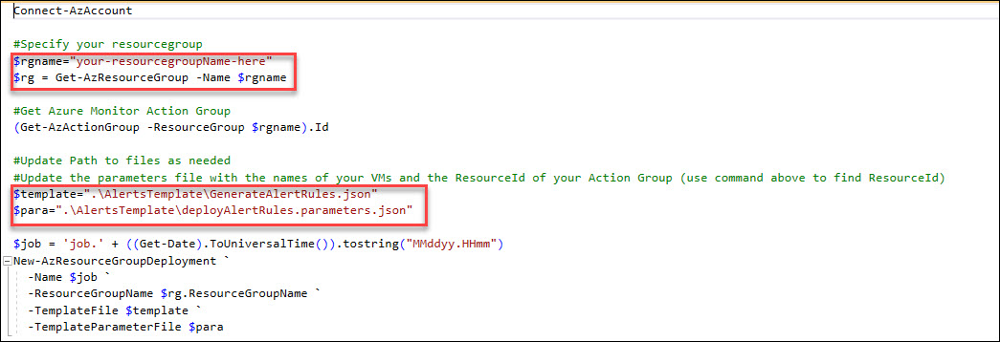<br/> 
8. Verify you have new Monitor Alert Rules in the Portal or from the command line (sample command is in the deployment script)<br/>
   <br/>
9. Modify the GenerateAlertsRules.json to include “Disk Write Operations/Sec” and set a threshold of 10<br/>
**Tip:** Go here to view the list of metrics available by resource type - https://docs.microsoft.com/en-us/azure/monitoring-and-diagnostics/monitoring-supported-metrics#microsoftcomputevirtualmachines<br/>
**Use this link to see the ARM schema-** https://docs.microsoft.com/en-us/rest/api/monitor/metricalerts/update<br/>
   <br/>
10. Rerun your template and verify your new Alert Rules are created for each of your VMs.<br/>
   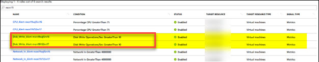<br/>
11. Create a new Action Rule that suppress alerts from the scale set and virtual machines on **Saturday** and **Sunday**.<br/>
12. In Azure Monitor, Click on Manage actions under Alert<br/>
   <br/>
13. Navigate to Action rules (preview)<br/>
   <br/>
   <br/>
14. Under Scope, click on Select a resource and make sure you have your subscription selected. Then search for the name of the resource group that was created in the deployment of the workshop. Select your resource group when it comes up. Click Done<br/>
   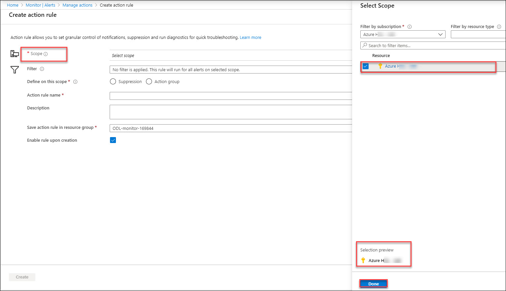<br/>
15. Under Filter Criteria, click on filters and select Resource type **Equals** Virtual Machines and Virtual Machine scales sets.<br/>
   <br/>
16. Under **Suppression Config**, click on **Configure Suppression** and configure the screen like the screen shot below.<br/>
   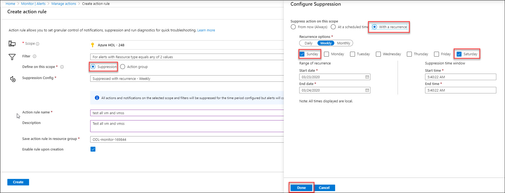<br/>
17. Add an Action Rule Name and Description, check off enable action Rule.<br/>
   <br/>
18. First team to me a screenshot of the new Alert Rules and New Action Rule wins the challenge!!<br/>
19. Good luck!<br/>

## Challenge 3: Azure Monitor for Containers

1. From your Visual Studio Server, deploy the eShoponWeb application to AKS using Dev Spaces<br/>
**Hint:** https://docs.microsoft.com/en-us/azure/dev-spaces/get-started-netcore-visualstudio<br/>
2. Make sure that Http Application Routing is enabled.<br/>
**Note:**
- To enable Http Application Routing on an existing cluster, use the command: az aks enable-addons -n {cluster_name} -g {rg_name} --addons http_application_routing<br/>
``
Sample Output:
az aks enable-addons -n 169844aksdemo -g ODL-monitor-169844 --addons http_application_routing
``
   <br/>
3. Connect to your Visual Studio Server. Install Visual Studio Tools for **Kubernetes** if you are using VS 2017. This is not needed if you are using VS 2019.<br/>
4. Navigate to **c:\eshoponweb\eShopOnWeb-master**<br/>
   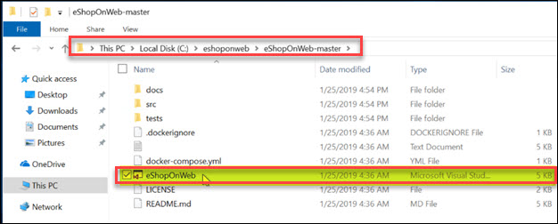<br/>
5. Double-click on **eShopOnWeb.sln** solution file and select Visual Studio 2019 when prompted.<br/>
6. Sign in to **Visual Studio**<br/>
7. Once Visual Studio opens and settles down. Change the project over to **Web** and select **Azure Dev Spaces**.<br/>
   <br/>
8. The Azure Dev Spaces login screen will appear. Make sure to select your **Subscription** and **Azure Kubernetes Service** cluster that was created during the setup.<br/>
   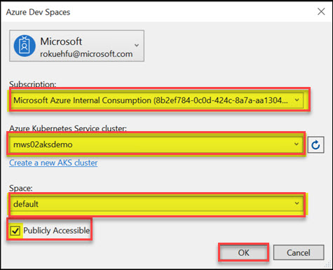<br/>
9. It’s important you check off the **Publicly Accessible** checkbox.<br/>
10. Click OK.<br/>
   <br/>
11. Click OK.<br/>
   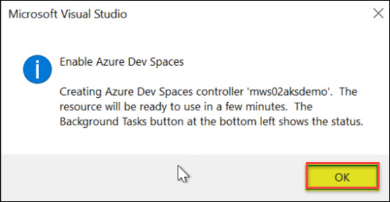<br/>
12. Click in the lower left to see the progress.<br/>
   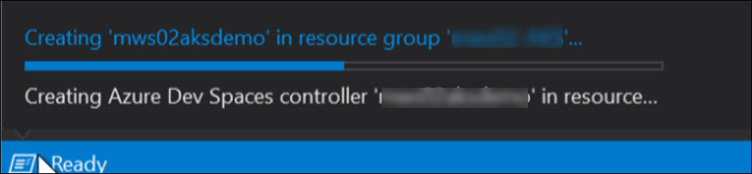<br/>
13. Don’t worry about seeing the message about the unreachable code.<br/>
   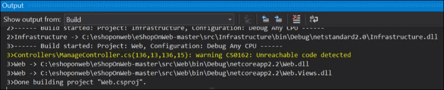<br/>
**Note:** The initial creation of the container takes a while.<br/>
14. When its complete Visual Studio will open the URL for you in the default browser.<br/>
15. Copy the URL and test it from your local machine.<br/>
   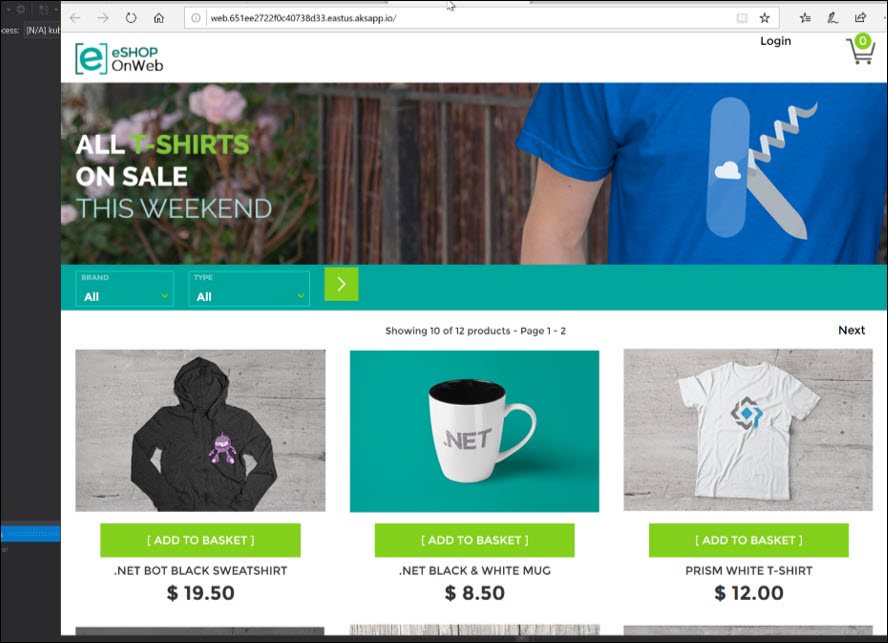<br/>
**Note:** The URL can also be found in the Output section if you scroll up.<br/>
17. You can stop the project running in Visual Studio (Shift+F5). The container will stay deployed.<br/>
18. From Azure Monitor, locate the container running the eShoponWeb application<br/>
   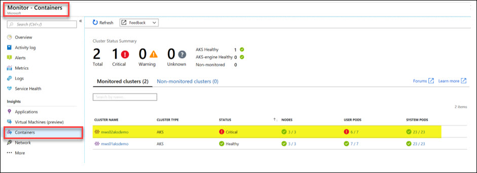<br/>
19. From the Kubernetes service you created click on Insights or you can navigate to Azure Monitor, click on Containers, and select your cluster. Or generate an exception in the eShoponWeb application<br/>
   <br/>
 **OR**<br/>
   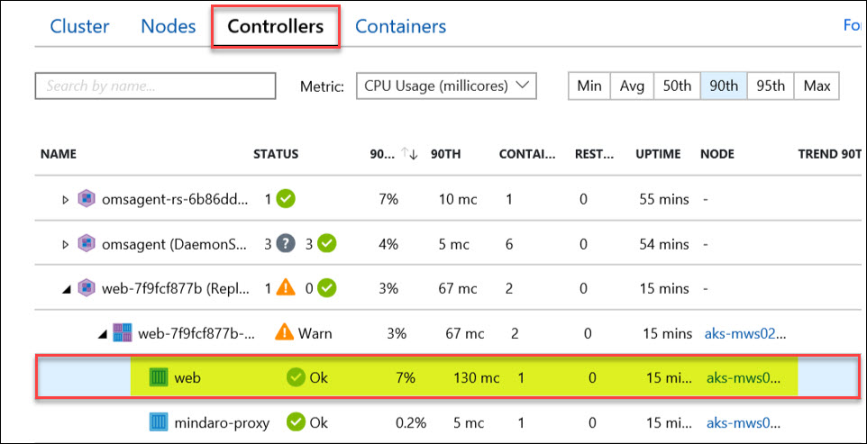<br/>
(Hint: Try to change your password)<br/>
20. Login into your webapp. Enter the user and password provided on the page.<br/>
   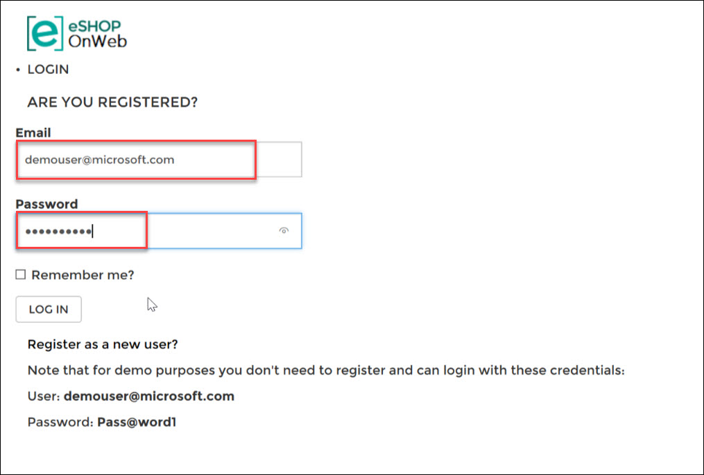<br/>
21. Click on My account<br/>
   <br/>
22. Click on Password<br/>
   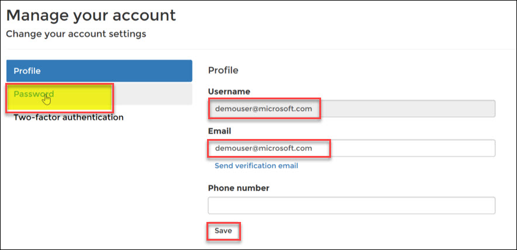<br/>
``Notice an exception is thrown``<br/>
23. Frome Azure go to Kubernetes Service, under Insight Click on the Web container and View container live logs.<br/>
   <br/>
24. Trip the password exception again once the Status has gone from Unk to Ok.<br/>
   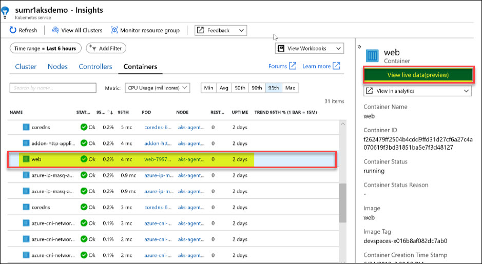<br/>
25. First person to send me a screen shot of the live log with the exception message wins the challenge
   <br/>

## Challenge 4: Application Insights 

**Note:** User Access Administrator role is required to complete the Container Insights Challenge<br/>
1. In Visual Studio, Install the Application Insights SDK in the eShopOnWeb Web Project in the Solution<br/>
2. From the Visual Studio Server, navigate to **C:\eshoponweb\eShopOnWeb-master** and double-click on eShopOnWeb.sln
   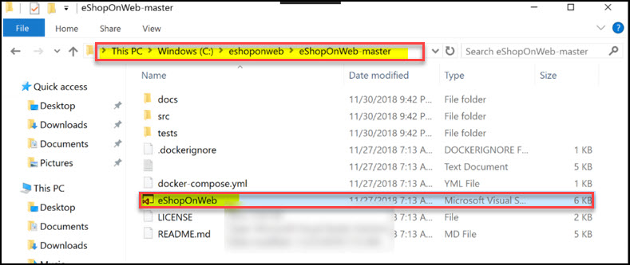<br/>
3. If this is the first time you are opening Visual Studio please log in or create an account and log in.<br/>
4. Select Web<br/>
   <br/>
5. Right-click on **Web** in **Solutions Explorer** and select properties. Under Debug unselect the checkbox for **Enable SSL**.<br/>
   <br/>
6. Click Save.<br/>
7. Click on **IIS Express** to test the eShopOnWeb application<br/>
   <br/>
8. You should see the **eShop** app open locally. Close it and let’s add the Application Insights SDK<br/>
   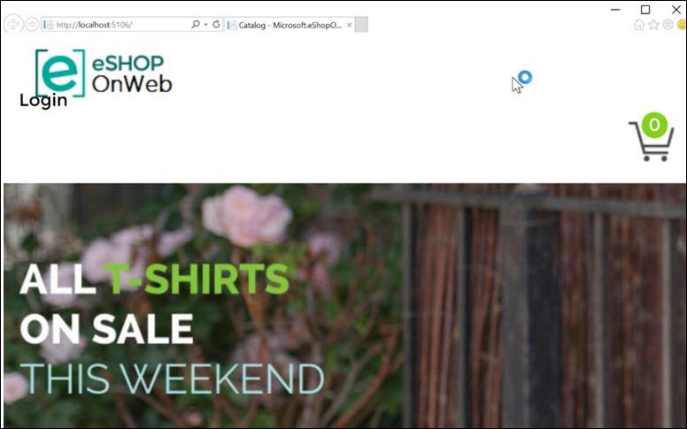<br/>
9. On the right hand side, find Web and right click, go to Add and select Application Insights Telemetry<br/>
   <br/>
10. Click get Started<br/>
   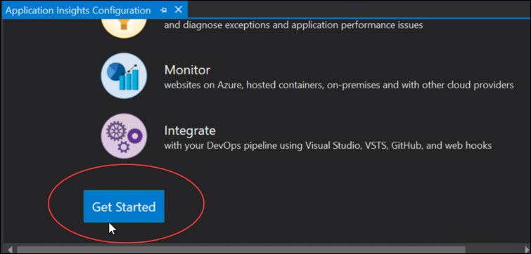<br/>
11. Select your subscription, Resource (name of your App Insights) and click Register.<br/>
   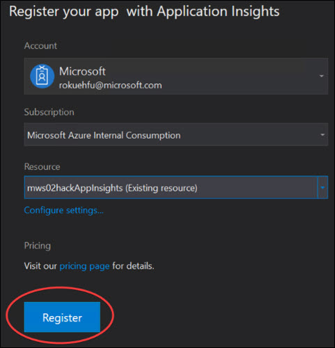<br/>
12. If prompted make sure to Add the SDK.<br/>
   <br/>
13. Run the **eShopOnWeb** Web project and check out the App Insights tooling<br/>
   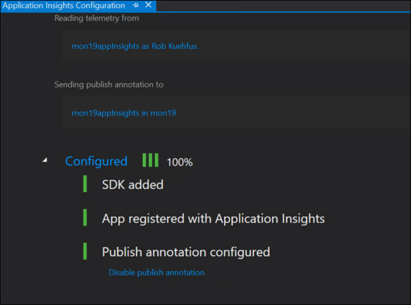<br/>
   <br/>
14. Test the application by running it and verify it’s working.<br/>
   <br/>
15. While its running you can navigate to Application Insights and view the telemetry while you are interacting with eShop running on the local machine. Add something to the shopping cart, log in and check out.<br/>
16. Stop the app and add the updated **Application Insights NuGet package to v2.5.1**<br/>
**Note:** make sure to only at this package.  Do not update everything.<br/>
17. Go to Tools, NuGet Package Manager, Manage NuGet Packages for Solution<br/>
   <br/>
18. Check off the Microsoft.ApplicationInsights package and click Update<br/>
   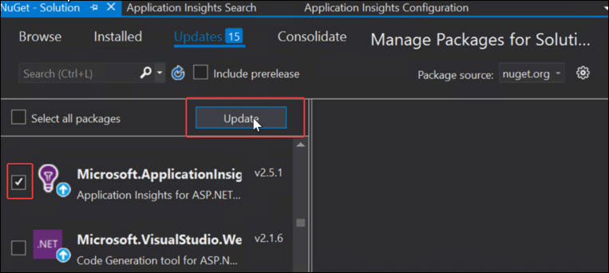<br/>
19. Click OK<br/>
   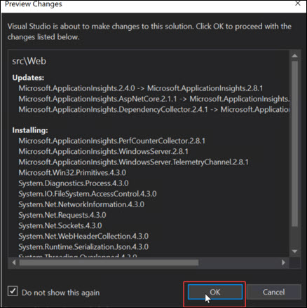<br/>
20. Click I Accept. When finished run the eShopOnWeb application again to make sure it’s working.<br/>
   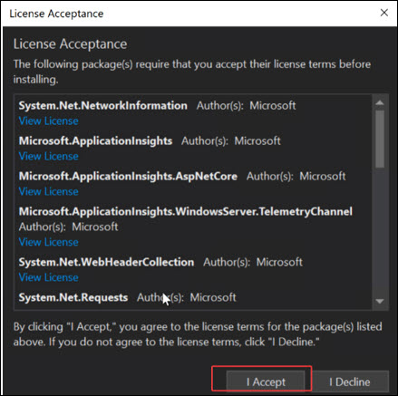<br/>
21. Publish eShopOnWeb Web project to AKS<br/>
22. Change over to Azure Dev Spaces from IIS Express and run the Web project (F5)<br/>
   <br/>
23. You can always edit some text in the site to verify that indeed the container is being update. Make sure when you run the project the browser is pointing to your URL for the container not the local host. You may need to stop it again, save the project and run it again if this happens.<br/>
24. Generate some load and check out the results<br/>
25. From your laptop or the Visual Studio Server copy the code in the **LoadScripts** folder and modify it to your URL<br/>
``
for ($i = 0 ; $i -lt 100; $i++)
{
Invoke-WebRequest -uri http:// mon19webscalesetlb.eastus.cloudapp.azure.com/
}
``
26. Run the code to generate some load on your **eShopOnWeb** site<br/>
   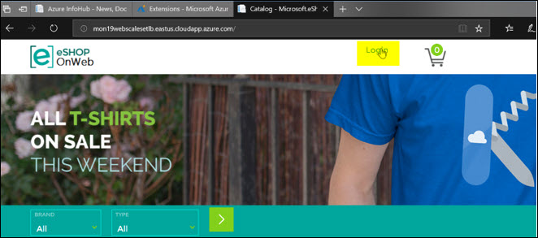<br/>
27. To trip the exception,
* Open your eShop site in your browser and login to the site<br/>
   <br/>
* Try to change your password<br/>
   <br/>
* Find the exception in App Insights<br/>
   <br/>
28. Create Alerts based on Availability and exceptions<br/>
   <br/>
29. First Team to email me an alert of the exception and a screenshot with your scaleset scale out based on the App Insights metric wins the challenge. Good luck

## Challenge 5: Log Analytics Query
Write a performance query that renders a time chart for the last 4 hours for both of the Web Servers and the SQL Server for the following perf metrics. Save each query to your favorites.
•	Processor Utilization: Processor / % Processor Time
Perf  
| where ObjectName == "Processor" and CounterName == "% Processor Time" and TimeGenerated > ago(4h) 
| summarize AVGPROCESSOR = avg(CounterValue) by bin(TimeGenerated, 5m), Computer
| sort by AVGPROCESSOR desc
| render timechart 

•	Memory Utilization: Memory / % Committed Bytes In Use
Perf  
| where ObjectName == "Memory" and CounterName == "% Committed Bytes In Use" and TimeGenerated > ago(4h) 
| summarize AVGMEMORY = avg(CounterValue) by bin(TimeGenerated, 5m), Computer
| sort by AVGMEMORY desc
| render timechart

•	Disk Utilization (IO): Disk Reads/sec and Disk Writes/sec
Perf 
| where CounterName == "Disk Reads/sec" and ObjectName == "LogicalDisk" and TimeGenerated > ago(4h) 
| summarize AvgReadsDiskIO = avg(CounterValue) by bin(TimeGenerated, 5m), Computer
| sort by AvgReadsDiskIO desc
| render timechart 

Perf 
| where CounterName == "Disk Writes/sec" and ObjectName == "LogicalDisk" and TimeGenerated > ago(4h) 
| summarize AvgDiskWritesIO = avg(CounterValue) by bin(TimeGenerated, 5m), Computer
| sort by AvgDiskWritesIO desc
| render timechart 

 
•	Create a heartbeat query for Web and SQL Server
Heartbeat
| summarize max(TimeGenerated) by Computer
| where max_TimeGenerated < ago(15m)
| count 
  

Write a performance query that renders a time chart for the last hour of the max percentage CPU usage of the AKS Cluster nodes

Solution 1 using maxif


// Declare time range variable
let timerange = 1h;
Perf
| where Computer startswith "aks" 
| where TimeGenerated > ago(timerange)
//Aggregate maximum values of usage and capacity in 1 minute intervals for each node  
| summarize CPUUsage = maxif(CounterValue, CounterName =="cpuUsageNanoCores"), 
            CPUCapacity = maxif(CounterValue,CounterName == "cpuCapacityNanoCores")  
            by bin(TimeGenerated, 1m), Computer
//Calculate Percent Usage
| extend PercentUsage = (CPUUsage / CPUCapacity) *100.0
| project TimeGenerated, PercentUsage, Computer 
| render timechart 

Solution 2 using let and join
//Store last 1hr snapshot of Perf table
let myPerf = materialize (Perf
| where Computer startswith "aks"
| where TimeGenerated > ago(1h));
//Store max CPU Usaqe per min values from Perf snapshot in usage table
let myUsage = myPerf 
| where CounterName == "cpuUsageNanoCores" 
| summarize CPUUsage = max(CounterValue) by bin(TimeGenerated, 1m), Computer;
//Store max CPU capacity per min values from Perf snapshot in capacity table
let myCapacity = myPerf 
| where CounterName == "cpuCapacityNanoCores" 
| summarize CPUCapacity = max(CounterValue) by bin(TimeGenerated, 1m), Computer;
//Join usage and capacity tables
myUsage
| join myCapacity on TimeGenerated, Computer
//Calculate percent usage
| extend PercentUsage = (CPUUsage / CPUCapacity) *100.0
| project TimeGenerated, PercentUsage, Computer 
| render timechart 

Combine infrastructure and application logs to create a single timeseries chart that includes: 
•	CPU usage from the node in your AKS cluster hosting the eshoponweb app
•	Duration of page views on your eshoponweb app hosted on the cluster

Solution 1
// Declare time range variable
let timerange = 5h;
//Find the node running your eshoponweb app container
let myNode = ContainerInventory
| where Image == "web"
| distinct Computer;
let PercentTable = Perf
| where Computer in (myNode)
| where TimeGenerated > ago(timerange)
//Aggregate maximum values of usage and capacity in 1 minute intervals for each node  
| summarize CPUUsage = maxif(CounterValue, CounterName =="cpuUsageNanoCores"), 
            CPUCapacity = maxif(CounterValue,CounterName == "cpuCapacityNanoCores")  
            by bin(TimeGenerated, 1m)
//Calculate Percent Usage and rename TimeGenerated
| extend PercentUsage = (CPUUsage / CPUCapacity) *100.0, timestamp = TimeGenerated 
| project timestamp, PercentUsage; 
//Add AppInsights Data
let AppInsights = app("kjp17hackAppInsights").pageViews
| where timestamp > ago(timerange)
| summarize responsetime = avg(duration) by bin(timestamp, 1m)
| extend responsetimeseconds = responsetime / 1000.0
| project timestamp, responsetimeseconds;
// Join Percent Usage and AppInsights
PercentTable 
| join AppInsights on timestamp
| project timestamp, PercentUsage, responsetimeseconds
| render timechart 

Solution 2 with hardcoding node name and using let and join statements
// Declare time range variable
let timerange = 5h;
//Store snapshot of Perf table for the node where the app container is running
let myPerf = materialize ( Perf
                         | where TimeGenerated > ago(timerange)
                         | where Computer == "aks-agentpool-10755307-2"
                         );
//Store Usage Values
let myUsage = myPerf 
| where CounterName == "cpuUsageNanoCores" 
| summarize CPUUsage = max(CounterValue) by bin(TimeGenerated, 1m);
//Store Capacity Values
let myCapacity = myPerf 
| where CounterName == "cpuCapacityNanoCores" 
| summarize CPUCapacity = max(CounterValue) by bin(TimeGenerated, 1m);
//Calculate Percentage and rename TimeGenerated to timestamp
let Percent = myUsage
| join myCapacity on TimeGenerated
| extend PercentUsage = (CPUUsage / CPUCapacity) *100.0, timestamp = TimeGenerated
| project timestamp, PercentUsage;
//Add AppInsights Data
let AppInsights = app("kjp17hackAppInsights").pageViews
| where timestamp > ago(timerange)
| summarize responsetime = avg(duration) by bin(timestamp, 1m)
| extend responsetimeseconds = responsetime/1000.0
| project timestamp, responsetimeseconds
| sort by timestamp asc;
// Join Percent Usage and AppInsights
Percent 
| join AppInsights on timestamp
| project timestamp, PercentUsage, responsetimeseconds
| sort by timestamp asc
| render timechart 

Challenge 6: Dashboard and Analytics

•	Deploy Grafana using Web App for Container
https://github.com/grafana/azure-monitor-datasource/blob/master/README.md
•	Hint: http://docs.grafana.org/installation/docker/
Create a Web App for Linux and configure as recommended below.

Create a new App service plan and select B1 Basic.  It’s under Dev / Test. 
 
Select Container and specify Docker Hub, Public and Grafana/Grafana for the image (this should deploy the latest version by default)
 

Should look like this when complete:
 
Click Create
After the Web App deploys, we need to configure some settings to enable Azure Monitor Plugin.
From the Azure Portal navigate to your newly created App Service, Settings, Application Settings
 
Under Always On, change the value to On.
 

Under Application Settings, click on Show Values
 
Change the value for WEBSITES_ENABLE_APP_SERVICE_STORAGE to true (from false)
Click Add new Setting and add the following:
 
Click Save
Note: For the Application settings to take effect you may need to restart your Web App
To Login to Grafana
Click on Overview and copy the URL for your Web App
 
Navigate to the URL in your browser
 
The username is “admin” lowercase and the password is whatever you configured in Application Settings.  Notice the version of Grafana as you need 5.2.0 or newer if you are querying Azure Log Analytics.
Once logged into Grafana you should notice Azure Monitor is installed
 
•	Configure the Azure Monitor Data Source for Azure Monitor, Log Analytics and Application Insights

Configure Azure Monitor data source
 
 
Fill out the Azure Monitor API Details
 
For Tenant Id, go to Azure AD, properties to find the Directory ID.
 
For Client Id, use the same client Id (Service Principal) you used in the AKS deployment for terraform.  Note: Azure best practices would be to generate a new service principal and only grant the required permissions. 
Sample: ready-mws02-aks-preday Client Id = 0bd13b1d-2ddb-41e9-a286-d81328e9a72d
For Client Secret, use the same password you set in the Azure Key Vault during the deployment
Note: Make sure to add the service principal created during the deployment to your Log Analytics as a reader
 
Click Save & Test and you should see a message like below.
 
To configure Application Insights, find your API Id and generate a key
 
Copy the Application ID and paste in Grafana.  Click on Create API Key
 
Copy the key and paste in the Grafana Application Insights Details.  Note: you cannot retrieve this key again.
Click Save & Test.  Should like this now.
 


•	Create a CPU Chart with a Grafana variable used to select Computer Name
Create a new dashboard
 
Add Graph
 
Edit the Panel Title
 
Under General change to the name to something like Computer CPU
 
Under Metrics, make sure service is Azure Log Analytics, your workspace is selected, and build out a Log Analytics query (answer query below for your reference).
 
Sample query: 
Perf                                                             
| where $__timeFilter(TimeGenerated) 
| where CounterName == "% Processor Time" and InstanceName == "_Total"
| summarize percentile(CounterValue,50) by bin(TimeGenerated, $__interval), Computer 
| order by TimeGenerated asc

Click Run to test
Now let’s make a few changes.  Click on Axes and change the Unit to percent and Y-Max to 100.
 
Run it again
 
Let’s save it by click on the disk in the upper right side.
 
Should look something like this:
 
Advanced features
 
•	Variables
Some query values can be selected through UI dropdowns, and updated in the query. 
For example, a “Computer” variable can be defined, and then a dropdown will appear on the dashboard, showing a list of possible values:
 
Now let’s add a variable that lets us select computers in the chart.  Click on the gear in the upper right corner.
 
Click on Add Variable
 
Configure the Variable to look like the screen below.  Note: In my case I make sure to specify the Workspace name as I have many workspaces and wanted to make sure we only returned values that would work in our chart.
 
Click Add.  
 
Make sure to Save your dashboard
 
Now go back and edit your Computer CPU chart to update the query to use the new variable.
 
Sample update Computer CPU query to support variable $ComputerName
Perf                                                       
| where $__timeFilter(TimeGenerated) and Computer in ($ComputerName)
| where (CounterName == "% Processor Time" and InstanceName == "_Total") or CounterName == "% Used Memory"                                       
| summarize AVGPROCESSOR = avg(CounterValue) by bin(TimeGenerated, $__interval), Computer 
| order by TimeGenerated asc

Make sure to Save
 
Try it out!
 

Try creating a variable that accepts percentiles (50, 90 and 95).


•	Annotations
Another cool Grafana feature is annotations – which marks points in time that you can overlay on top of charts.
Below, you can see the same chart shown above, with an annotation of Heartbeats. Hovering on a specific annotation shows informative text about it.

Configuration is very similar to Variables:
Click the dashboard Settings button (on the top right area), select “Annotations”, and then “+New”. 
This page shows up, where you can define the data source (aka “Service”) and query to run in order to get the list of values (in this case a list of computer heartbeats).
Note that the output of the query should include a date-time value, a Text field with interesting info (in this case we used the computer name) and possibly tags (here we just used “test”).

Add an Annotation to your chart overlaying Computer Heartbeat
 
FYI… Annotations provide a way to mark points on the graph with rich events. When you hover over an annotation you can get event description and event tags. The text field can include links to other systems with more detail.
Navigate to settings from your dashboard (the gear in the upper right), click on Annotations, Add Annotation Query
 

HINT: Use the sample Kusto/Data explorer queries to create more dashboard scenarios.
•	First Team to email me a screenshot with your chart wins the challenge.  Good luck!

 
Challenge 6a: Workbooks

Workbook documentation is available here: https://docs.microsoft.com/en-us/azure/azure-monitor/app/usage-workbooks

Navigate to your Application Insights resource in the Portal
Click on Workbooks  New
 
Click Edit in the New Workbook section to describe the upcoming content in the workbook. Text is edited using Markdown syntax.

 
Use Add text to describe the upcoming table
Use Add parameters to create the time selector
Use Add query to retrieve data from pageViews
	Use Column Settings to change labels of column headers and use Bar and Threshold visualizations.
 
Query used for section Browser Statistics
pageViews
| summarize pageSamples = count(itemCount), pageTimeAvg = avg(duration), pageTimeMax = max(duration) by name
| sort by pageSamples desc

 
Query used for Request Failures
requests
| where success == false
| summarize total_count=sum(itemCount), pageDurationAvg=avg(duration) by name, resultCode


Use Add Metric to create a metric chart

 

Change your Resource Type to Virtual Machine
 
 
 

Change the Resource Type to Log Analytics
Change your workspace to the LA workspace with your AKS container logs
 


Query used for section Disk Used Percentage
InsightsMetrics
| where Namespace == "container.azm.ms/disk" 
| where Name == "used_percent"
| project TimeGenerated, Computer, Val 
| summarize avg(Val) by Computer, bin(TimeGenerated, 1m)
| render timechart

Save your workbook.87tre
