# Challenge 1: Monitoring and Alert Rule

1. Navigate to https://github.com/rkuehfus/pre-ready-2019-H1 and download the **repository** as a zip file to your local disk<br/>
   <br/>
2. **Unzip** the contents to a local folder on your machine<br/>
   <br/>
3. Navigate to the location where you unzipped the files and open the **.\AzureMonitorHackathon-master\Student\Resources** folder in Visual Studio or Visual Studio code<br/>
```
Download Visual Studio Code: https://code.visualstudio.com/download (If you don't have visual studio code and visual studio in you local disk)
```
   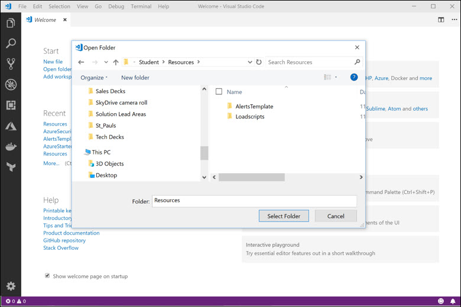<br/>
4. Login to **Azure Protal** with your credention given in environment details.<br/>
   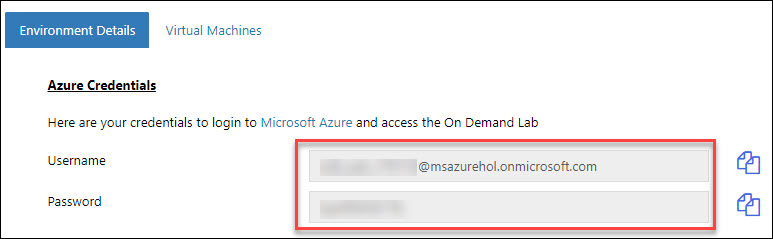<br/>
5. Connect (RDP) to the **Visual Studio Server** (xxxxxVSSrv17) using its public IP address which is given in your pre-provisioned environment. Use given username and password to connect visual studio server:<br/>
 * Username: **vmadmin**
 * Password: **demo@pass123**
6. Open Visual Studio.<br/>
7. Visual Studio has view called **SQL Server Object Explorer** that can be used to add and delete SQL databases on the SQL server.<br/>
   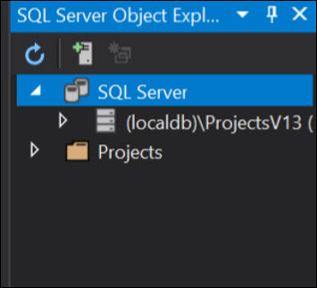<br/>
8. Add SQL Server from **SQL Server Object Explorer**<br/>
   <br/>
9. Connect to the database server VM (xxxxxSqlSrv16) make sure to use below username and password to connect your SQL Server Virtual Manchine:<br/>
 * Username: **sqladmin**<br/>
 * Password: **demo@pass123**<br/>
   <br/>
10. Once connected create a new database called **tpcc**<br/>
   <br/>
11. Using Azure CLI or Powershell, send the below guest OS metric to Azure Monitor for the SQL Server.<br/>
12. Add a Performance Counter Metric for:<br/>
 * Object: SQLServer:Databases<br/>
 * Counter: Active Transactions<br/>
 * Instance: tpcc<br/>
``
Hint: https://docs.microsoft.com/en-us/azure/monitoring-and-diagnostics/metrics-store-custom-guestos-resource-manager-vm<br/>
``
13. First, figure out the correct format for the counter use the run command on the SQL Server in the Azure portal<br/>
**Run the command**<br/>
```
(Get-Counter -ListSet SQLServer:Databases).Paths
```
   <br/>
12. Once its finished, review the results (scroll up) and copy the output for the `SQLServer:Databases` counter.<br/>
`\SQLServer:Databases(*)\Active Transactions<br/>`
   <br/>
Then change it to target just your specific database<br/>
`\SQLServer:Databases(tpcc)\Active Transactions`<br/>
**Tip:** Share the following link to help lead them to how to find the counter<br/>
https://docs.microsoft.com/en-us/powershell/module/microsoft.powershell.diagnostics/get-counter?view=powershell-5.1
13. Next, Run the below command to add the collection of this counter that sends it to Azure Monitor using the Azure monitor data sink for SQL Server.<br/>
```
Review PublicConfig.json File: https://github.com/kayodeprinceMS/AzureMonitorHackathon/blob/master/Student/Resources/PublicConfig.json
Relevant docs: https://docs.microsoft.com/en-us/azure/azure-monitor/platform/diagnostics-extension-windows-install
```
```
az vm extension set --resource-group myResourceGroup --vm-name myVMname --name IaaSDiagnostics --publisher Microsoft.Azure.Diagnostics --settings PublicConfig.json
```
   <br/>
14. Once the command shows output, go to metrics and check to make sure you are seeing the new metrics.<br/>
   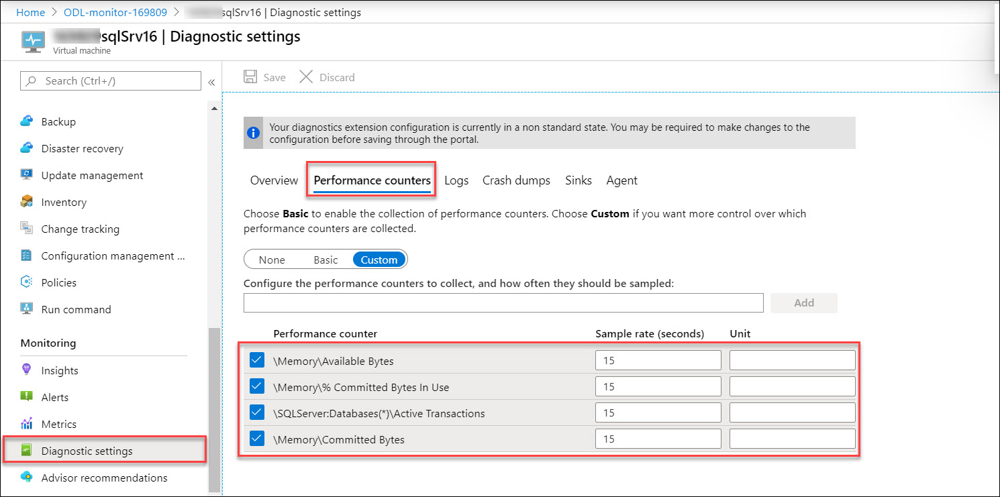<br/>
   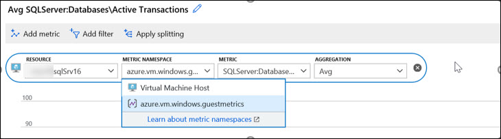<br/>
   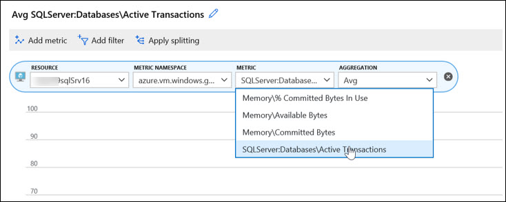<br/>
**Tip**: A bunch of OS metrics are configured already under the scale set as a sample.<br/>
15. Download and Install HammerDB tool on the Visual Studio VM from below link:<br/>
www.hammerdb.com<br/>
**Note:** HammerDB does not have native support for Windows Display Scaling. This may result in a smaller than usual UI that is difficult to read over high resolution RDP sessions. If you run into this issue later, close and re-open your RDP session to the VSServer with a lower display resolution. After the RDP session connects, you can zoom into to adjust the size.<br/>
   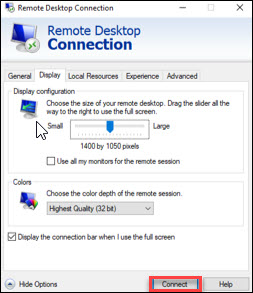<br/>
   <br/>
16. From the Visual Studio Server, download the latest version of **HammerDB**.<br/>
   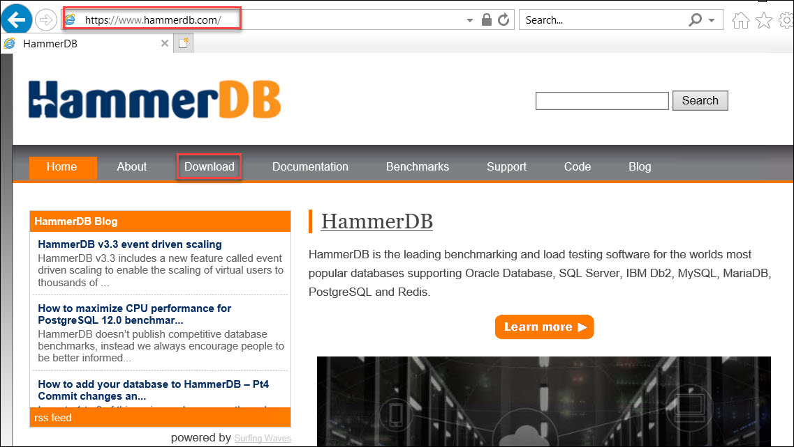<br/>
   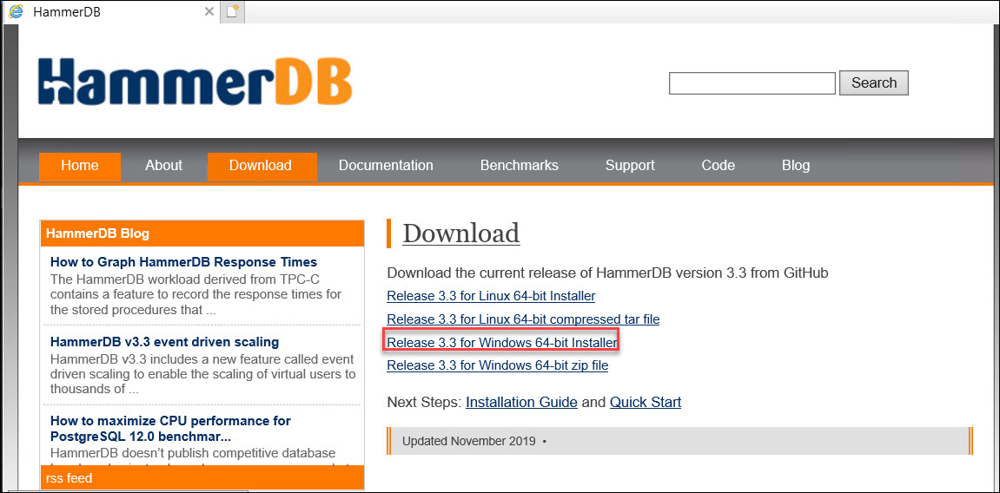<br/>
17. If you get this Security Warning, go to Internet Options and then **Security \ Security Settings \ Downloads \ File download \ Enable**.<br/>
   <br/>
18. Click OK. Try again & Click Save and Run the warnings.<br/>
   <br/>
   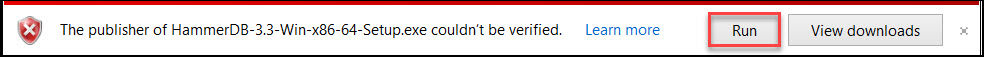<br/>
**Tip:** If you end up closing HammerDB you have to go to C:\Program Files\HammerDB-3.1 and run the batch file<br/>
19. Use **HammerDB** to create transaction load<br/>
20. Double click on SQL Server and click OK, and OK on the confirm popup.
   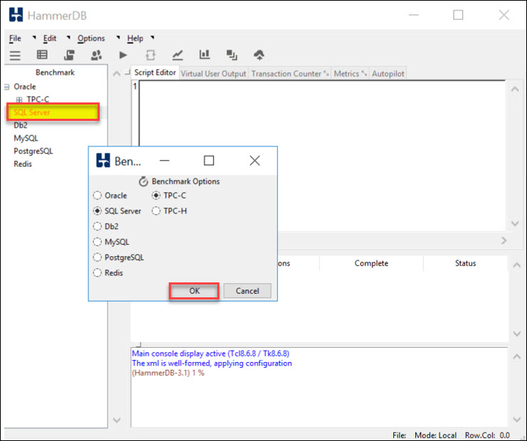<br/>
21. Drill into SQL Server \ TPC-C \ Schema Build and double click on Options. Modify the Build Options for the following:<br/>
* **SQL Server:** Name of your SQL Server<br/>
* **SQL Server ODBC Driver:** SQL Server<br/>
* **Authentication:** SQL Server Authentication<br/>
* **SQL Server User ID:** sqladmin<br/>
* **SQL Server User Password:** demo@pass123<br/>
* **SQL Server Database:** tpcc<br/>
* **Number of Warehouses:** 50<br/>
* **Virtual Users to Build Schema:** 50<br/>
   <br/>
**Note:** Setting the last two at 50 should generate enough load to trip a threshold and run long enough for you to graph<br/>
22. Double click on **Build** and Click Yes to kick of a load test.<br/>
   <br/>
23. When the test is running it should like this.<br/>
   <br/>
**TIP:** If you would like to run a second test you must first delete the database you created and recreate it. HammerDB will not run a test against a database that has data in it.  When you run a test is fills the database with a bunch of sample data.<br/>
24. Go Back to **Azure portal** and from **Azure Monitor** create a graph for the **SQL Server Active Transactions and Percent CPU** and pin to your Azure Dashboard.<br/>
   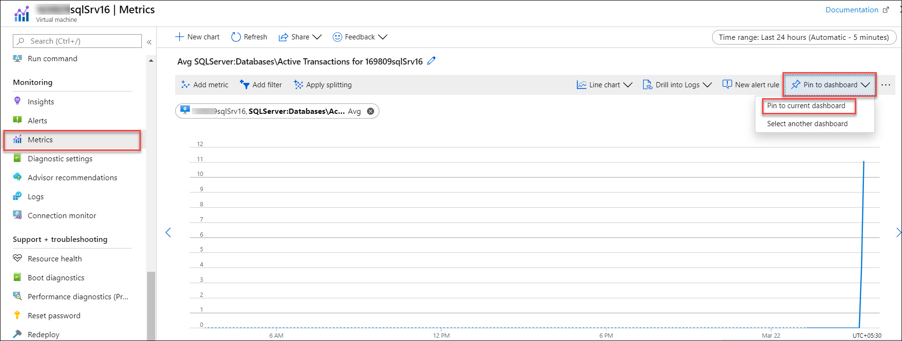<br/>
25. Customize the dashboard once pinned it to a Azure Dashboard.
   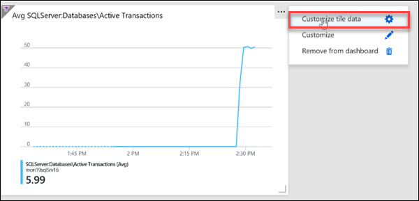<br/>
   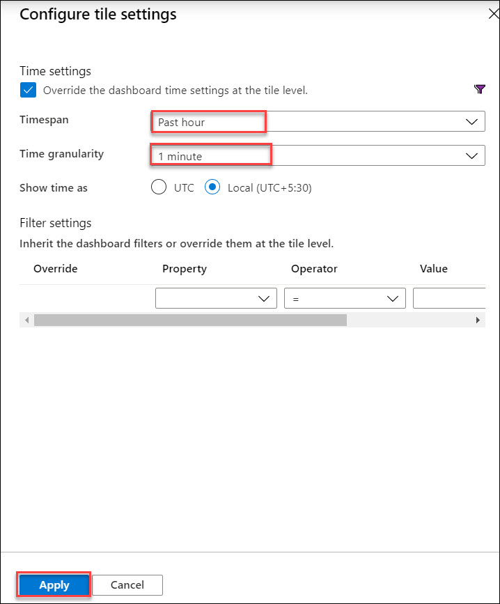<br/>
26. Dashboard should look something like this.<br/>
   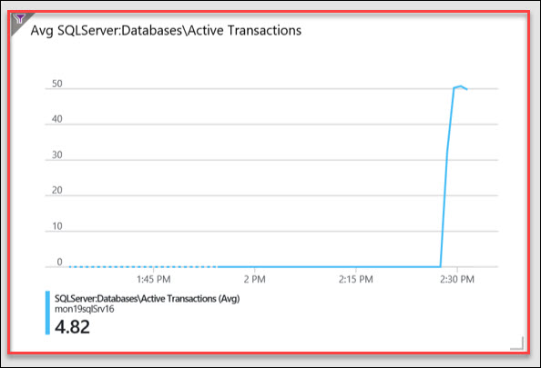<br/>
27. From **Azure Monitor**, create an Action group, to send email to your address<br/>
   <br/>
  * For creating Action Group, Click on **Add Action Group**
   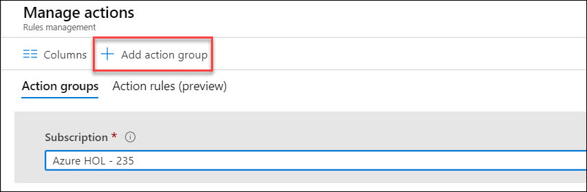<br/>
28. Give values as shown below and Click **OK**:
   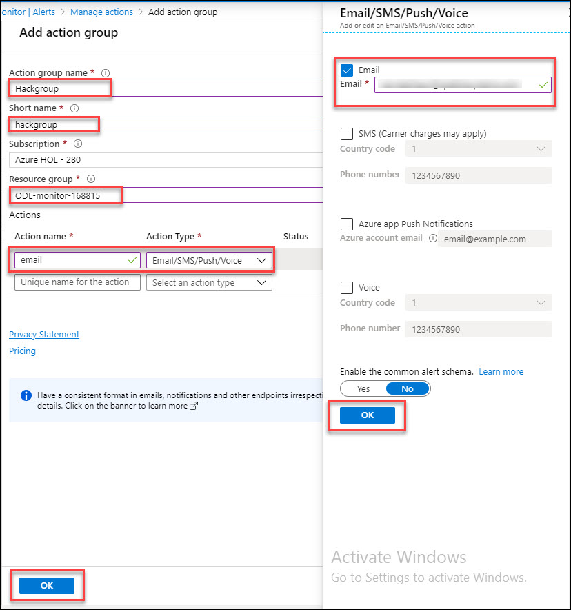<br/>
29. Create an Alert if Active Transactions goes over 40 on the SQL Server **tpcc** database.<br/>
   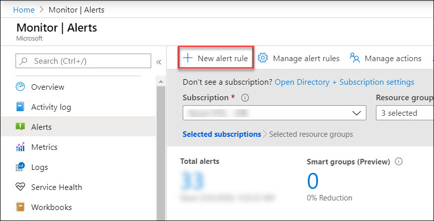<br/>
  * Select SQL Server as Resource
   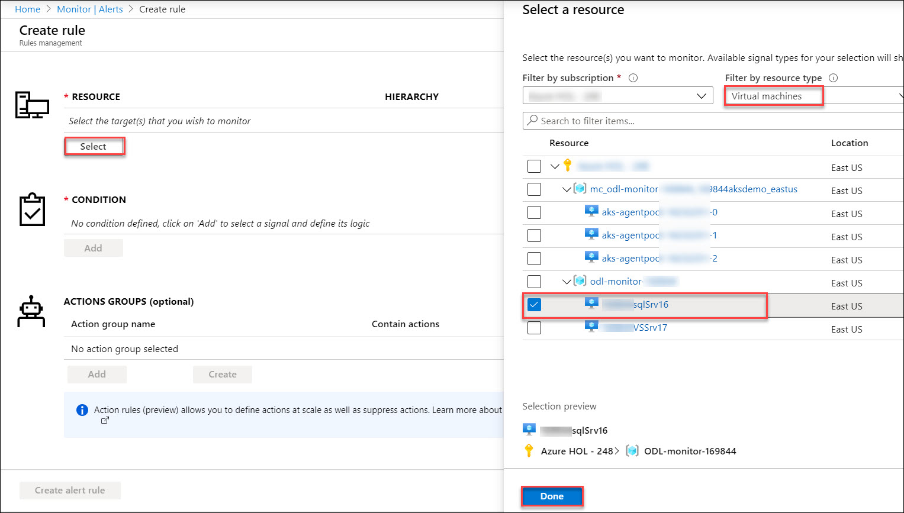<br/>
  * Add Conditon if Active Transactions goes over 40 on the SQL Server
   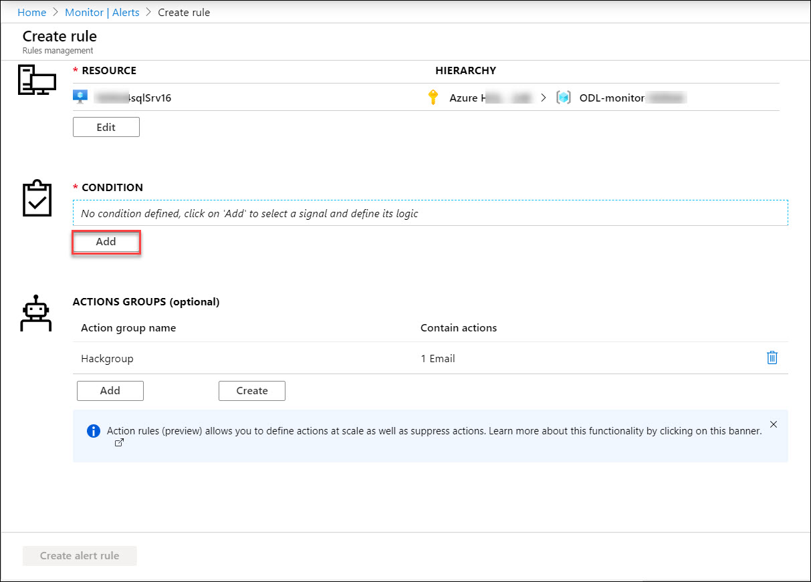<br/>
   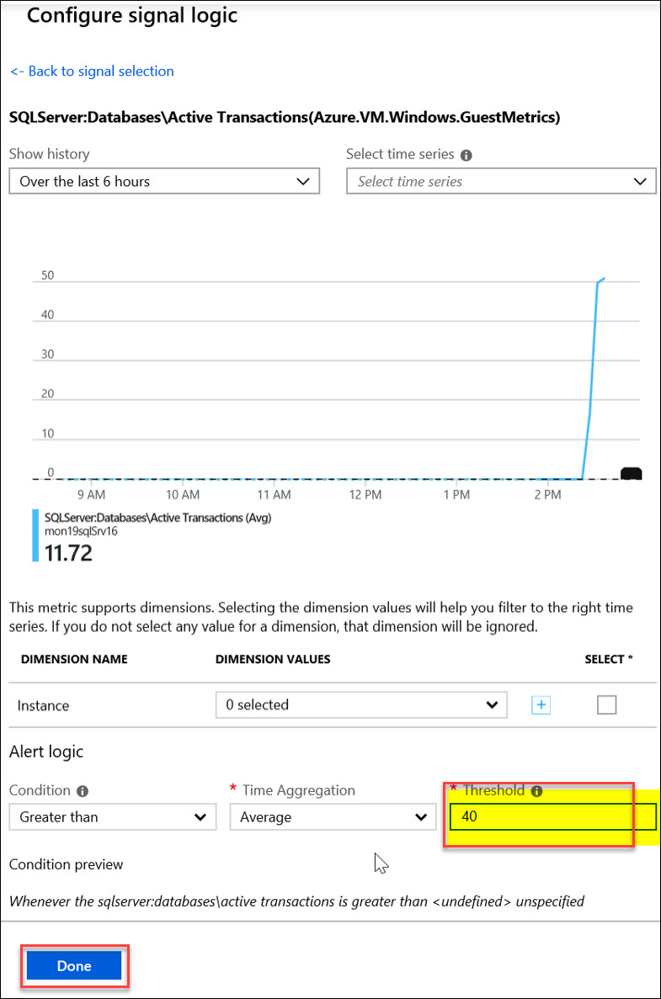<br/>
  * Add Action Group that you created in above steps
   <br/>
  * Give Alert Details and Click Create Alert Rule
   <br/>
  * You will get the alert email at your email address that you provided for action group
   <br/>
30. Create an another Alert Rule for CPU over **75%** on the **Virtual Scale Set** that emails me when you go over the threshold. First create a dashboard to watch the Scale Set CPU<br/>
31. Navigate to the folder called `Loadscripts` under the Resources folder in **Student** and copy the **cpuGenLoadwithPS.ps1** script to both instances running in the Scale Set and run them.<br/>
   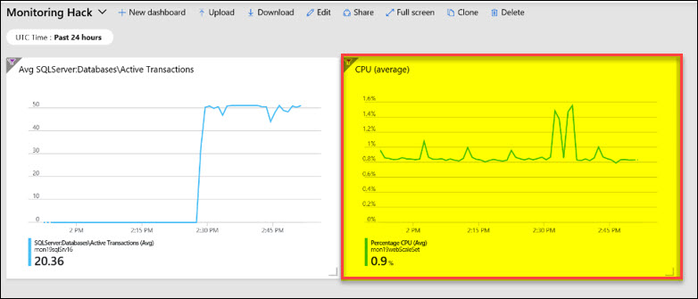<br/>
``
This may be a bit of a challenge to those not used to working with a scale set.  If your student just grabs the public IP address and then RDP to it.  They will end up on one of the instances but because they are going through the Load Balancer, they cannot control which one.  Or can they?😊
``<br/>
32. If you look at the configuration of the LB it is configured with an inbound NAT rule that will map starting at port 50000 to each instance in the Scale Set.  So if they RDP using the PIP:50000 for instance 1 and PIP:50001 for instance 2.<br/>
   <br/>
* For Example:<br/>
   <br/>
33. Jump on to both VMs in the Scale Set, Open the PowerShell ISE, Copy the script in the window and run it. You may need to run it more then once to really add the pressure. This script will pin each core on the VM no matter how many you have.<br/>
   <br/>
34. The trick to getting the alert to fire is to pin both instances at the same time as the CPU metric is an aggregate of the scale set. If you just max the CPU on one server to 100% the Scale Set is only at 50% and till not trip the alert threshold of 75%. Also, if they run the script and then setup the Alert Rule then to back to run another test to trip the alert, they have scaled out to a third instance and not realized it. They may need to jump on that box and max it out as well.<br/>
* First team to send me both alerts wins the challenge!!<br/>
* Good luck!
