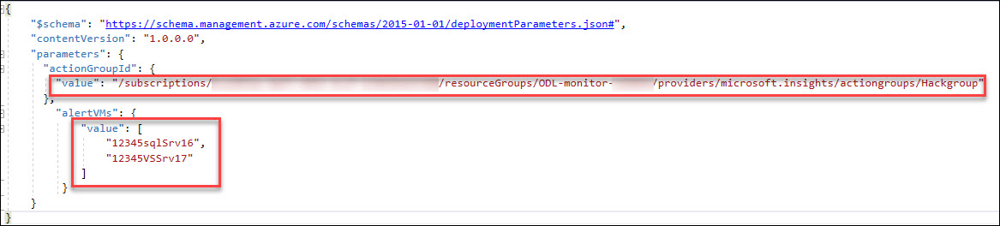
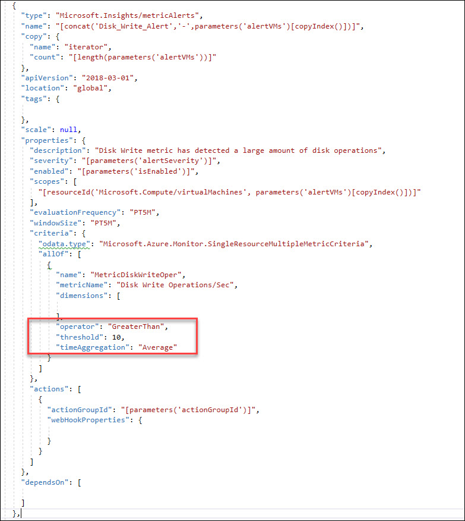

# Challenge 2: Monitoring and Alert Rule Automation

1. Update the parameters file and deployment script for the **GenerateAlertRules.json** template located in the **AlertTemplates** folder 
 
2. Add the names of your **VMs** and **ResouceId** for your Action Group 
3. To find the **ResourceId** for your Action group navigate to the **Resource Group** where you are stored the action group and make sure to check off **Show hidden types** 
 
4. Click on your Action Group and copy the **ResourceId** 
 
5. Then update the **deployAlertRules.parameters.json** file as it shows below 
 
6. Save the parameters file and update the **deployAlertRulesTemplate.ps1** file with the name of your **Resource Group** (and save it). 
7. Deploy the **GenerateAlertRules.json** template using the **PowerShell** script given below:(deployAlertRulesTemplate.ps1). 
 
8. Verify you have new **Monitor Alert Rules** in the Portal or from the command line (sample command is in the deployment script) 
 
9. Modify the **GenerateAlertsRules.json** to include “Disk Write Operations/Sec” and set a threshold of 10 
**Tip:** Go here to view the list of metrics available by resource type - https://docs.microsoft.com/en-us/azure/monitoring-and-diagnostics/monitoring-supported-metrics#microsoftcomputevirtualmachines

**Use this link to see the ARM schema-** https://docs.microsoft.com/en-us/rest/api/monitor/metricalerts/update

 
10. Rerun your template and verify your new Alert Rules are created for each of your VMs. 
 
11. Create a new **Action Rule** that suppress alerts from the scale set and virtual machines on **Saturday** and **Sunday**. 
12. In Azure Monitor, Click on Manage actions under Alert 
 
13. Navigate to Action rules (preview) 
 
 
14. Under Scope, click on Select a resource and make sure you have your subscription selected. Then search for the name of the resource group that was created in the deployment of the workshop. Select your resource group when it comes up. Click **Done** 
 
15. Under Filter Criteria, click on filters and select Resource type **Equals** Virtual Machines and Virtual Machine scales sets. 
 
16. Under **Suppression Config**, click on **Configure Suppression** and configure the screen like the screen shot below. 
 
17. Add an Action Rule Name and Description, check off enable action Rule. 
 
18. First team to me a screenshot of the new Alert Rules and New Action Rule wins the challenge!! 
19. Good luck!
