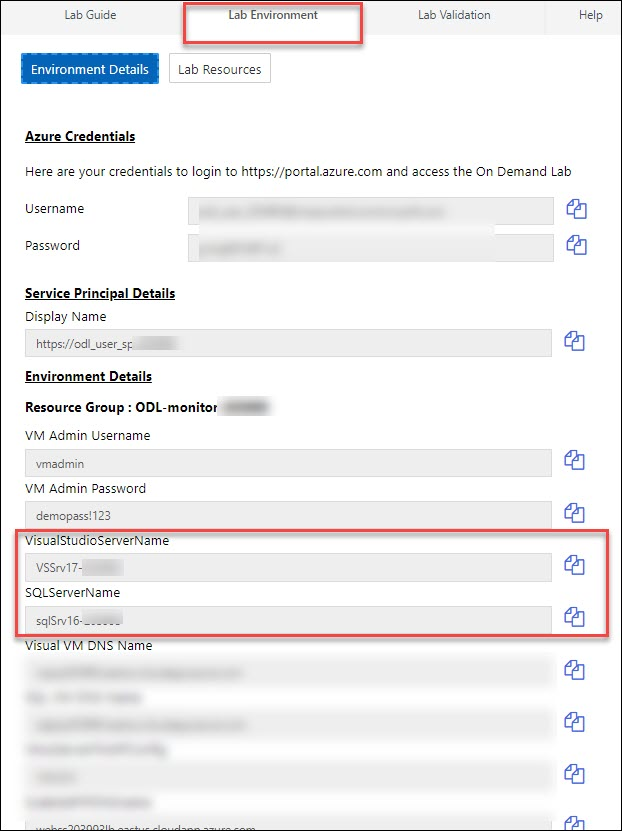
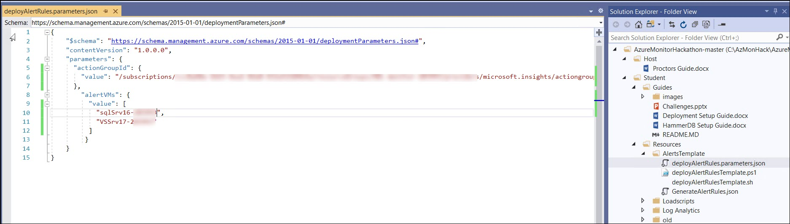
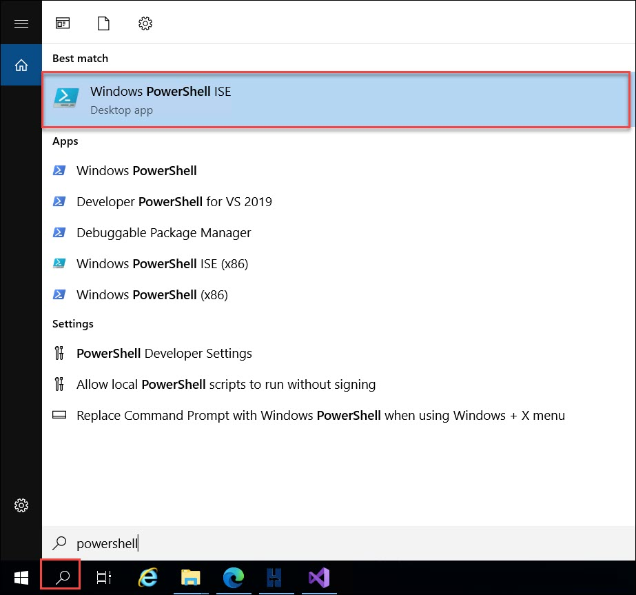
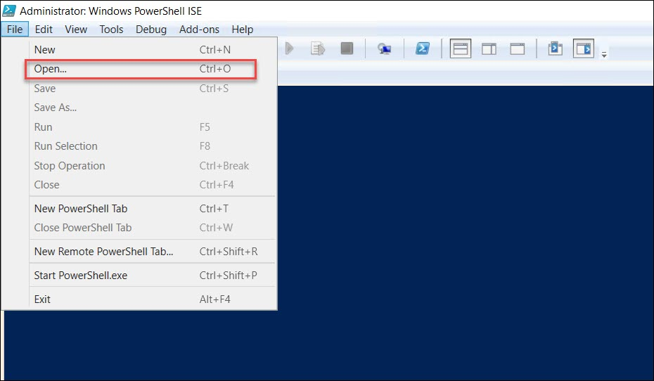
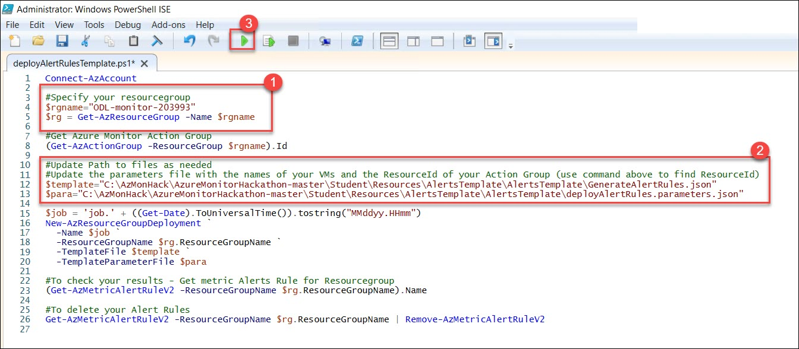
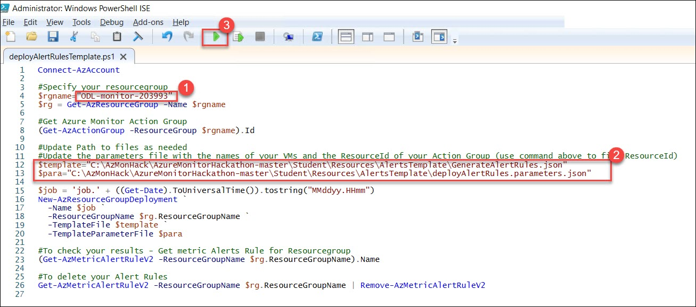
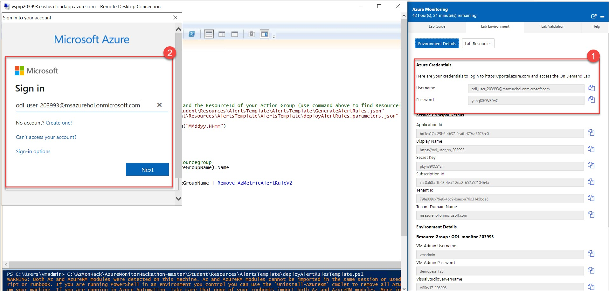

# Solution 2: Monitoring and Alert Rule Automation

1. Follow steps to update the parameters file and deployment script for the **GenerateAlertRules.json** template located in the **AlertTemplates** folder.

    

2. Get the names of your **VMs** from Lab Detials which are under environment details.

    

3. To find the **ResourceId** for your Action group navigate to the **Resource Group** where you are stored the action group and make sure to check off **Show hidden types**.

    

4. Click on your Action Group and copy the **ResourceId**.

    

5. Update the **deployAlertRules.parameters.json** with resource ID and VM's name.

    

6. Save the parameters file and follow the steps to update the **deployAlertRulesTemplate.ps1** file.

7. Will deploy the **GenerateAlertRules.json** template using the PowerShell script given in deployAlertRulesTemplate.ps1:

* Open the **Powershell ISE** in your virtual machine.

    

* Open the **deployAlertRulesTemplate.ps1** file which is under "C:\AzMonHack\AzureMonitorHackathon-master\Student\Resources\AlertsTemplate\".

    
    

* Update the rgname your **Resource Group** name and path for **$template** and **$para** as shown  below:

    ```
    #Specify your resourcegroup
    $rgname="ODL-monitor-XXXXXX"
    $rg = Get-AzResourceGroup -Name $rgname
    
    #Get Azure Monitor Action Group
    (Get-AzActionGroup -ResourceGroup $rgname).Id
    
    #Update Path to files as needed
    #Update the parameters file with the names of your VMs and the ResourceId of your Action Group (use command above to find ResourceId)
    $template="C:\AzMonHack\AzureMonitorHackathon-master\Student\Resources\AlertsTemplate\GenerateAlertRules.json"
    $para="C:\AzMonHack\AzureMonitorHackathon-master\Student\Resources\AlertsTemplate\deployAlertRules.parameters.json"
    ```

* Save the **deployAlertRulesTemplate.ps1** file and run it.

    
    
* Give the Azure Credentails and see the output.

    
    
8. Verify you have new **Monitor Alert Rules** in the Portal or from the command line (sample command is in the deployment script).

    

9. Modify the **GenerateAlertsRules.json** to include “Disk Write Operations/Sec” and set a threshold of 20.

    > **Tip:** Go here to view the list of metrics available by resource type - https://docs.microsoft.com/en-us/azure/monitoring-and-diagnostics/monitoring-supported-metrics#microsoftcomputevirtualmachines

    > **Use this link to see the ARM schema-** https://docs.microsoft.com/en-us/rest/api/monitor/metricalerts/update

    

10. Rerun your template and verify your new Alert Rules are created for each of your VMs.

    

11. Create a new **Action Rule** that suppress alerts from the scale set and virtual machines on **Saturday** and **Sunday**.

12. In Azure Monitor, Click on Manage actions under Alert

    

13. Navigate to Action rules (preview)

    <br/>

    

14. Under Scope, click on Select a resource and make sure you have your subscription selected. Then search for the name of the resource group that was created in the deployment of the workshop. Select your resource group when it comes up. Click **Done**

    

15. Under Filter Criteria, click on filters and select Resource type **Equals** Virtual Machines and Virtual Machine scales sets.

    

16. Under **Suppression Config**, click on **Configure Suppression** and configure the screen like the screen shot below.

    

17. Add an Action Rule Name and Description, check off enable action Rule.

    
