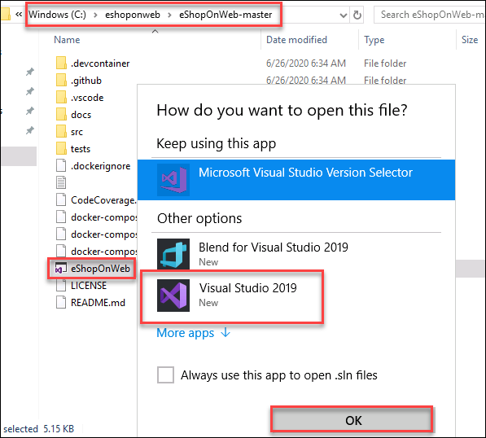
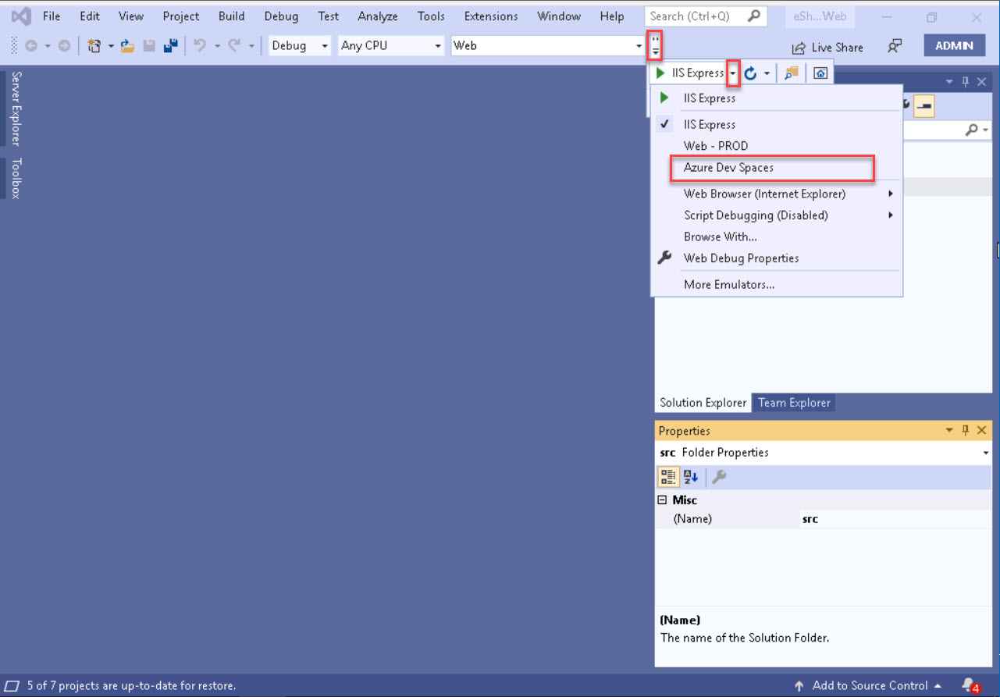
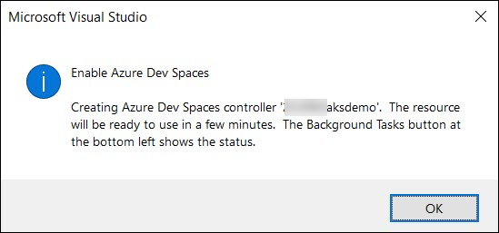
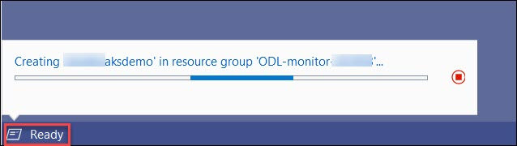
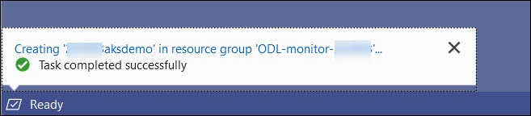
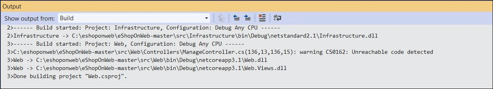
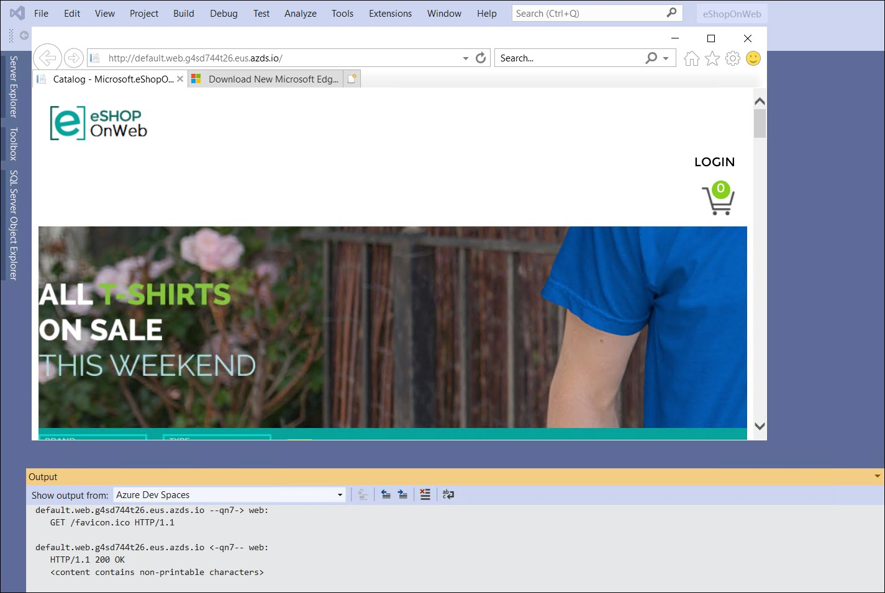

# Solution 3: Azure Monitor for Containers

 In this we will deploy the eShoponWeb application to AKS using Dev Spaces from your Visual Studio Server

    > Hint: https://docs.microsoft.com/en-us/azure/dev-spaces/get-started-netcore-visualstudio

1. Make sure that Http Application Routing is enabled.

    

2. To enable Http Application Routing on an existing cluster, use the command: th below command: (Optional: Only if http routing not enable)

    ```    
    az aks enable-addons -n {cluster_name} -g {rg_name} --addons http_application_routing
    ```

    ```
    Sample Output:
    az aks enable-addons -n 169844aksdemo -g ODL-monitor-169844 --addons http_application_routing
    ```
    
3. Now, you will open the solution file in Visual Studio.


4. Navigate to **c:\eshoponweb\eShopOnWeb-master**

    

5. Double-click on **eShopOnWeb.sln** solution file and select Visual Studio 2019 when prompted.

    

6. Sign in to **Visual Studio** using the provided Azure Credentials

7. Once Visual Studio opens and settles down. Change the project over to **Web** and select **Azure Dev Spaces**.

    

8. The Azure Dev Spaces login screen will appear. Make sure to select your **Subscription** and **Azure Kubernetes Service** cluster that was created during the setup.

    

9. It’s important you check off the **Publicly Accessible** checkbox.

10. Click **OK**.

    

11. Click **OK**.

    

12. Click on the Ready lower left to see the progress.

    
    

13. To run the project (build and deploy to the AKS cluster) and view live logs in Container Insights, the app must be running on container without VS debugging by performing a (Crtl +F5).

* Don’t worry about seeing the message about the unreachable code.

    

    > **Note:** The initial creation of the container takes a while.

14. When its complete, Visual Studio will open the URL for you in the default browser.

    


15. Copy the URL and test it from your local machine.

    > **Note:** The URL can also be found in the Output section if you scroll up.

16. You can stop the project running in **Visual Studio (Shift+F5)**. The container will stay deployed.

17. From Azure Monitor, locate the container running the eShoponWeb application

18. From the **Kubernetes** service you created click on **Insights** or you can navigate to Azure Monitor, click on Containers, and select your cluster.

    

    

  **OR**

   

    * Generate an exception in the **eShoponWeb** application

   > (Hint: Try to change your password)


19. **Login** into your webapp. Enter the user and password provided on the page.

    

20. Click on **My account**

    

21. Click on **Password**.

    

22. Notice an exception is thrown.

    

23. Frome azure portal, go to **Kubernetes Service**, under **Insight** Click on the **Web** container and View container live logs.

    

24. Trip the **password exception** again and check the live logs.

    
