# Challenge 4: Application Insights 

**Note:** User Access Administrator role is required to complete the Container Insights Challenge<br/>
1. In Visual Studio, Install the Application Insights SDK in the eShopOnWeb Web Project in the Solution<br/>
2. From the Visual Studio Server, navigate to **C:\eshoponweb\eShopOnWeb-master** and double-click on eShopOnWeb.sln<br/>
<br/>
3. If this is the first time you are opening Visual Studio please log in or create an account and log in.<br/>
4. Select Web<br/>
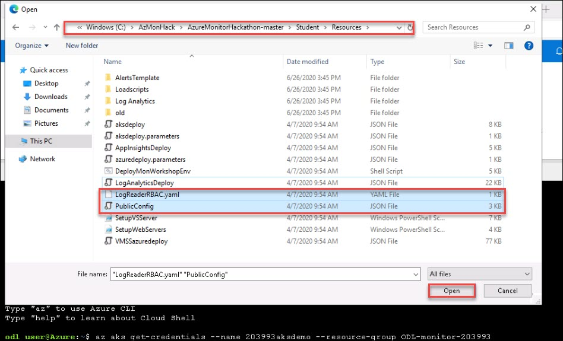<br/>
5. Right-click on **Web** in **Solutions Explorer** and select properties. Under Debug unselect the checkbox for **Enable SSL**.<br/>
 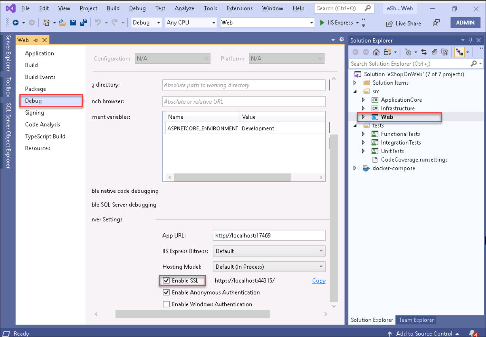<br/>
6. Click Save<br/>
7. Click on **IIS Express** to test the eShopOnWeb application<br/>
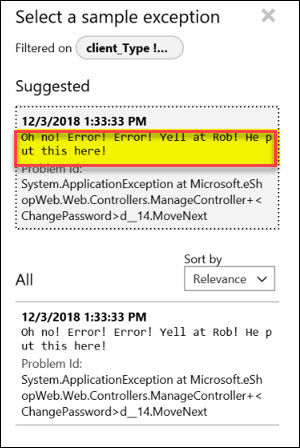<br/>
8. You should see the **eShop** app open locally. Close it and let’s add the **Application Insights SDK**<br/>
<br/>
9. Stop the app and add the updated **Application Insights NuGet package** with latest version<br/>
``
Note: Make sure to only at this package. Do not update everything.
``
10. Go to **Tools**, **NuGet Package Manager**, **Manage NuGet Packages for Solution**<br/>
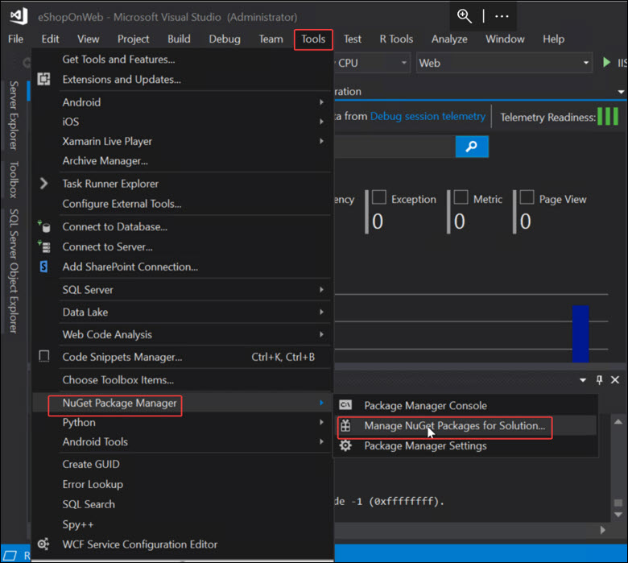<br/>
11. Check off the **Microsoft.ApplicationInsights** package and click **Install**<br/>
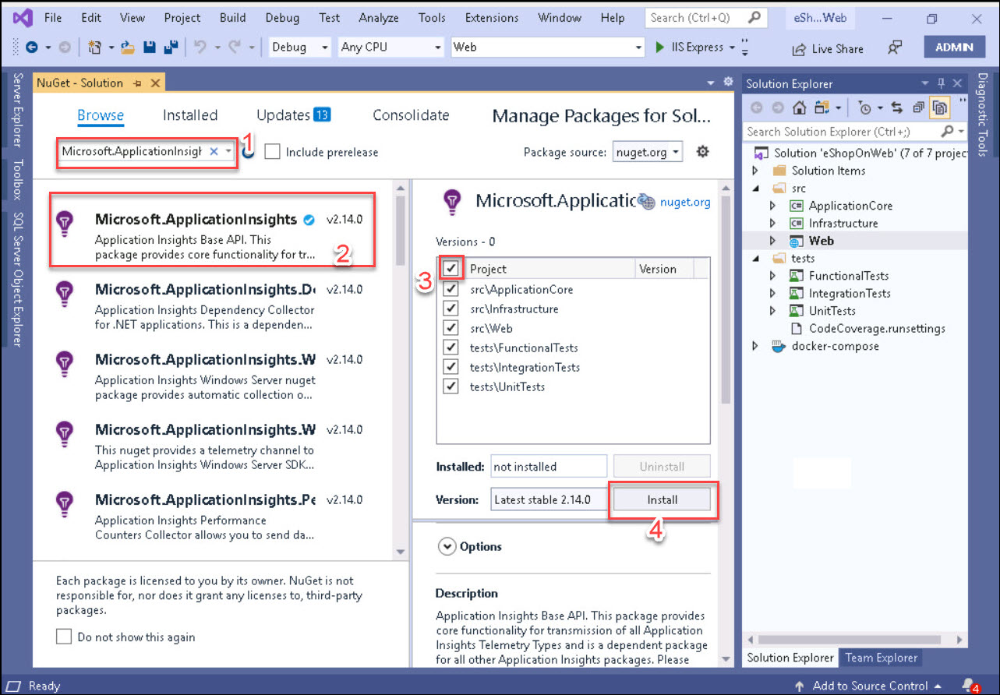<br/>
12. Click **OK**<br/>
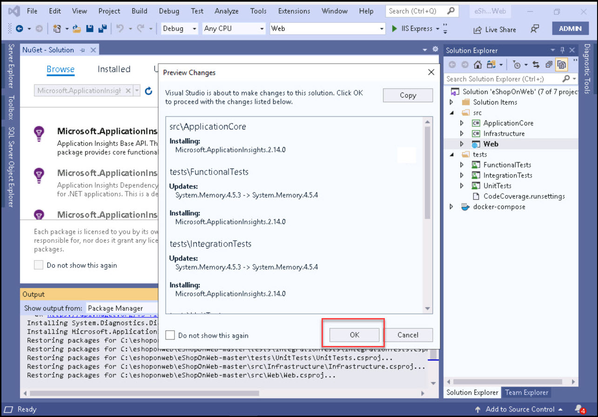<br/>
13. Click **I Accept**. When finished run the **eShopOnWeb** application again to make sure it’s working<br/>
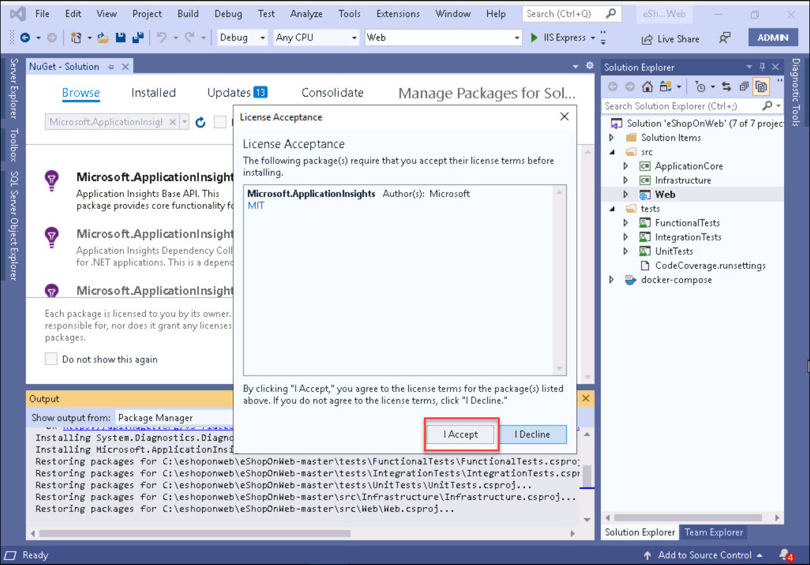<br/>
14. On the right hand side, find Web and right click, go to **Add** and select **Application Insights Telemetry**<br/>
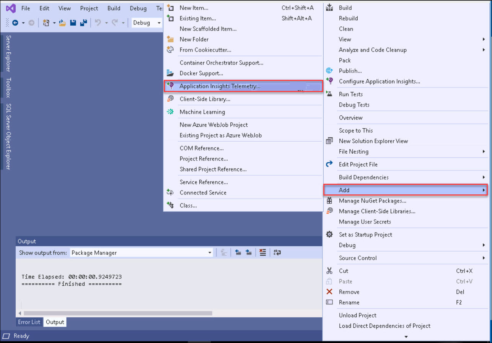<br/>
15. Configure dependency as **Azure Application Insight** and click **Next**<br/>
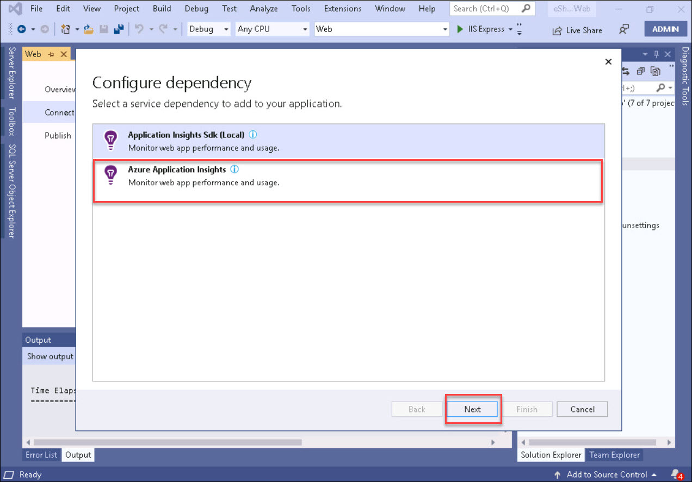<br/>
16. Select your **subscription**, **Resource** (name of your App Insights) and click **Next**<br/>
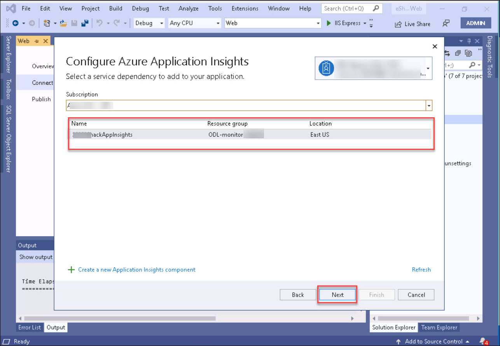<br/>
17. Configure Azure Application Insight and Click **Next**.<br/>
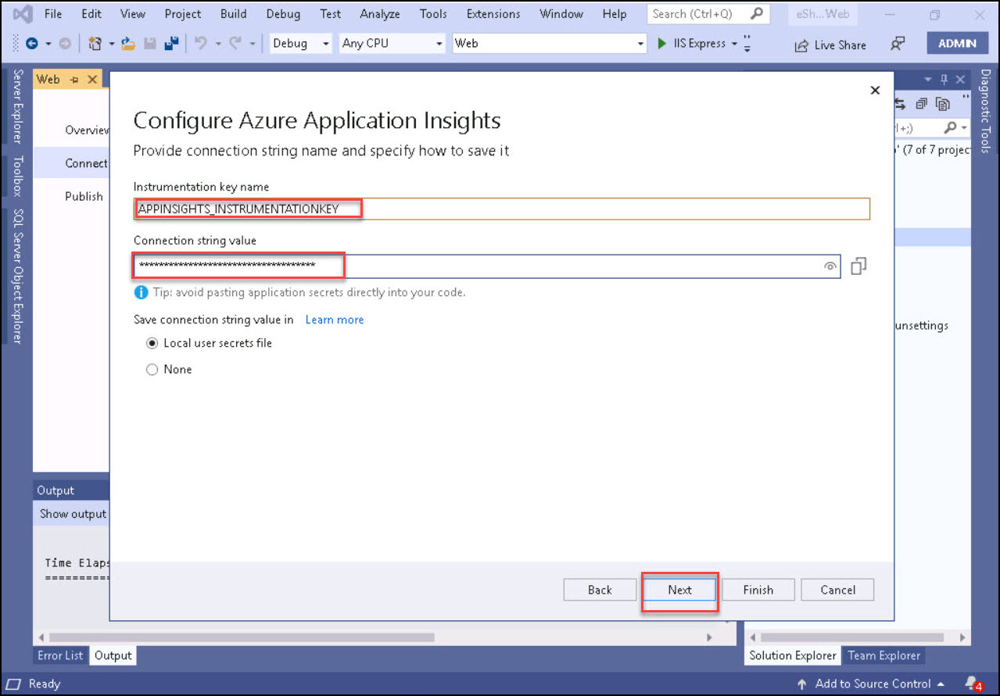<br/>
18. Click on Finish to Run the **eShopOnWeb** Web project and check out the App Insights tooling<br/>
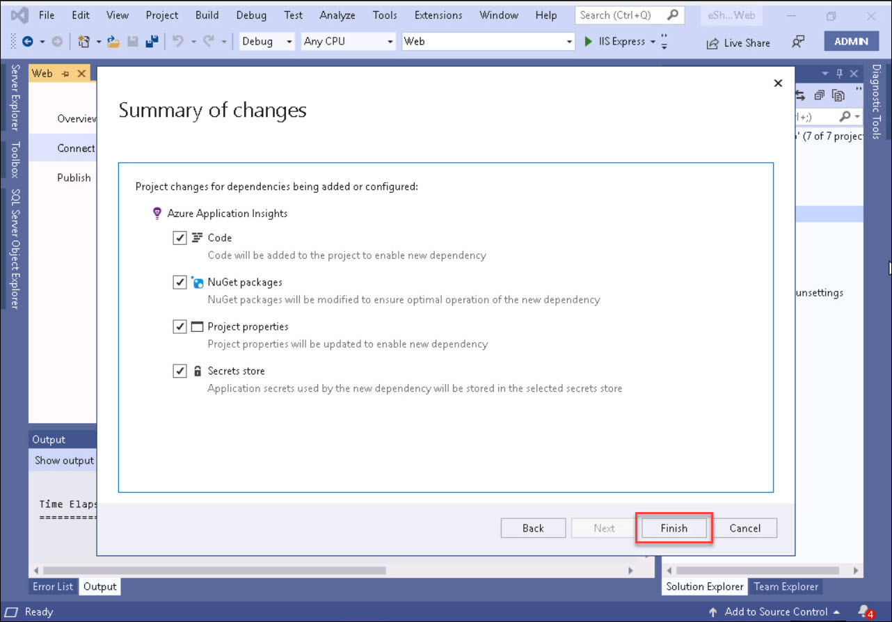<br/>
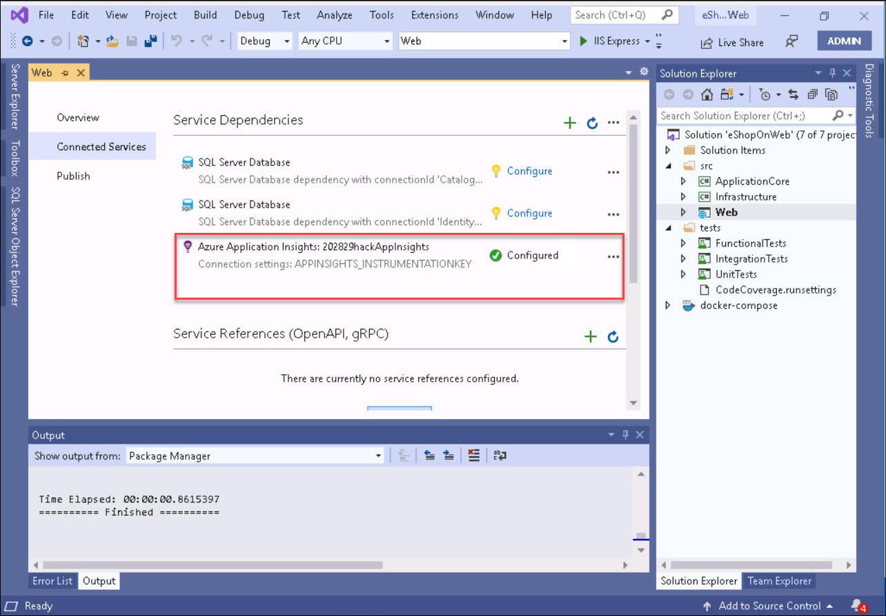<br/>
19. Test the application by running it and verify it’s working.<br/>
<br/>
20. While its running you can navigate to Application Insights and view the telemetry while you are interacting with eShop running on the local machine. Add something to the shopping cart, log in and check out.<br/>
21. Publish eShopOnWeb Web project to AKS<br/>
22. Change over to **Azure Dev Spaces** from **IIS Express** and run the **Web project (F5)**<br/>
<br/>
23. You can always edit some text in the site to verify that indeed the container is being update. Make sure when you run the project the browser is pointing to your URL for the container not the local host. You may need to stop it again, save the project and run it again if this happens<br/>
24. Generate some load and check out the results<br/>
25. From your laptop or the Visual Studio Server copy the code in the **LoadScripts** folder and modify it to your URL<br/>
```
for ($i = 0 ; $i -lt 100; $i++)
{
Invoke-WebRequest -uri http:// mon19webscalesetlb.eastus.cloudapp.azure.com/
}
```
26. Run the code to generate some load on your **eShopOnWeb** site<br/>
<br/>
27. To trip the exception:
* Open your **eShop** site in your browser and **login** to the site<br/>
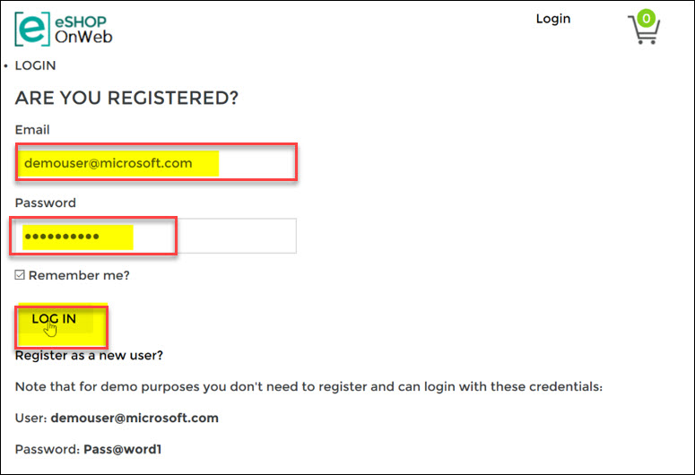<br/>
* Try to change your **password**<br/>
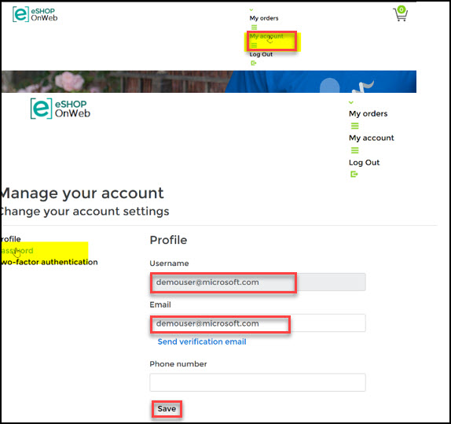<br/>
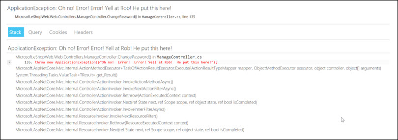<br/>
* Find the exception in **App Insights**<br/>
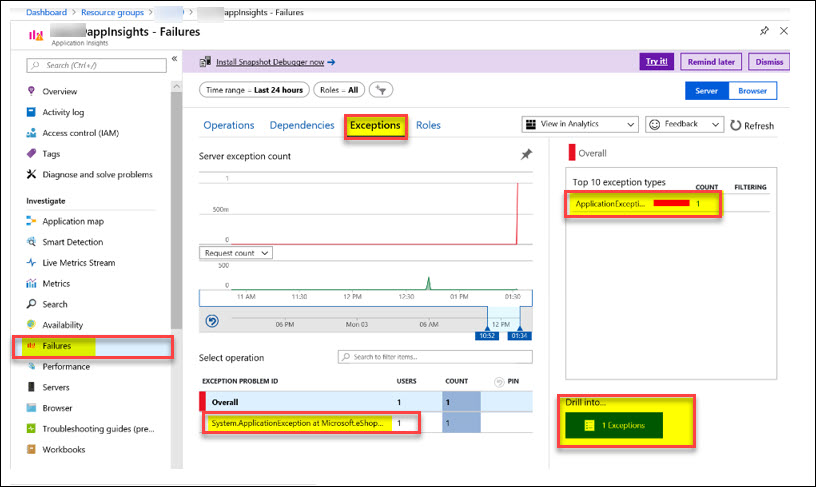<br/>
<br/>
28. Create **Alerts** based on Availability and exceptions in azure Monitor.<br/>
Create Alert Rule **Server Exceptions count over 0**.<br/>
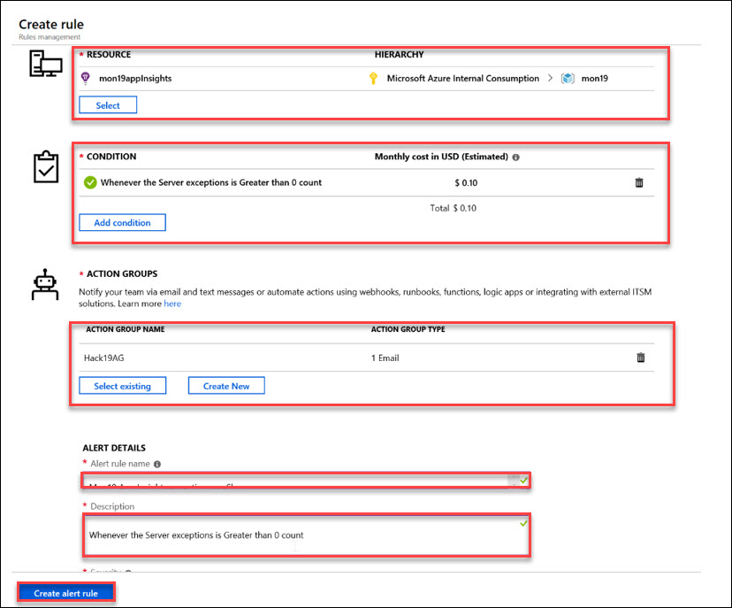<br/>
29. First Team to email me an alert of the exception and a screenshot with your scaleset scale out based on the App Insights metric wins the challenge. Good luck
