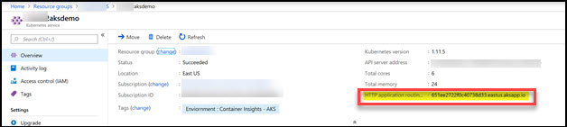
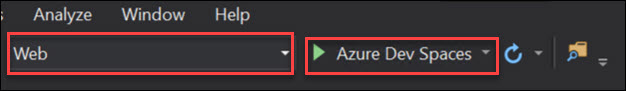
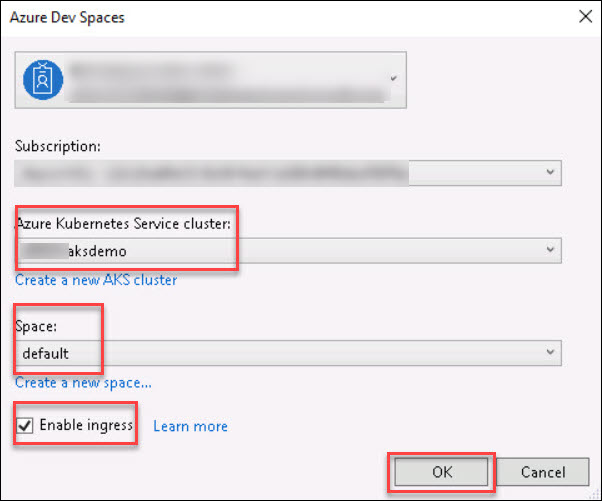
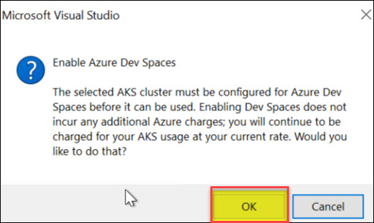
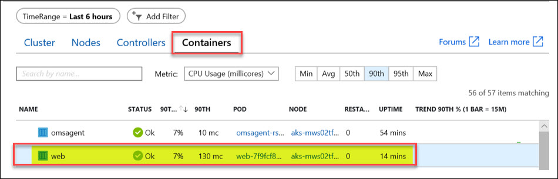
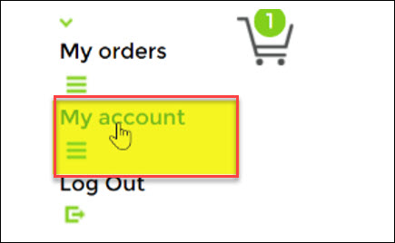
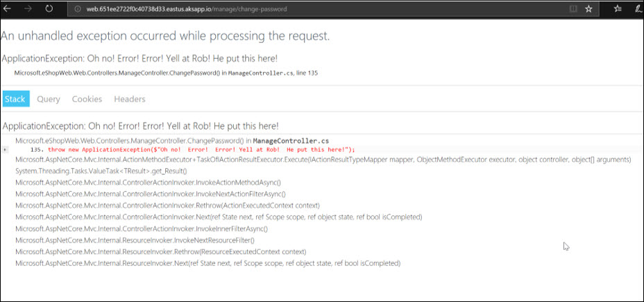
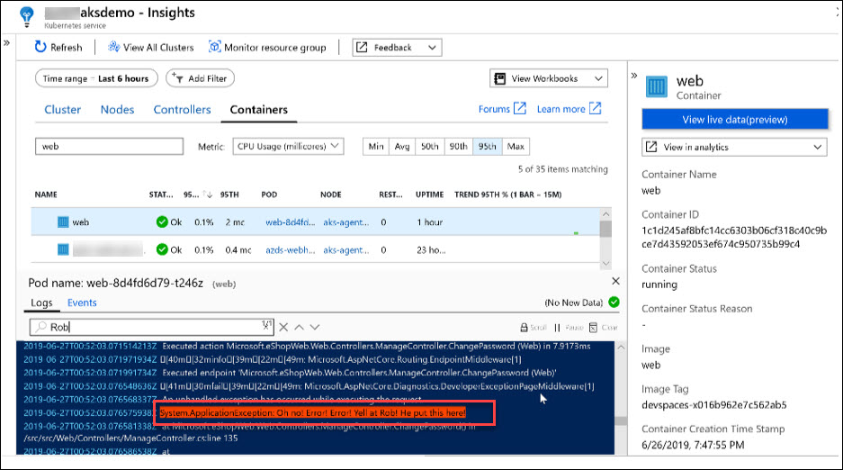

## Challenge 3: Azure Monitor for Containers

1. From your Visual Studio Server, deploy the eShoponWeb application to AKS using Dev Spaces<br/>
**Hint:** https://docs.microsoft.com/en-us/azure/dev-spaces/get-started-netcore-visualstudio<br/>
2. Make sure that Http Application Routing is enabled.<br/>
**Note:**
- To enable Http Application Routing on an existing cluster, use the command: az aks enable-addons -n {cluster_name} -g {rg_name} --addons http_application_routing<br/>
```
az aks enable-addons -n 169844aksdemo -g ODL-monitor-169844 --addons http_application_routing
```
   <br/>
3. Connect to your Visual Studio Server.<br/>
4. Navigate to **c:\eshoponweb\eShopOnWeb-master**<br/>
   <br/>
5. Double-click on **eShopOnWeb.sln** solution file and select Visual Studio 2019 when prompted.<br/>
6. Sign in to **Visual Studio**<br/>
7. Once Visual Studio opens and settles down. Change the project over to **Web** and select **Azure Dev Spaces**.<br/>
   <br/>
8. The Azure Dev Spaces login screen will appear. Make sure to select your **Subscription** and **Azure Kubernetes Service** cluster that was created during the setup.<br/>
   <br/>
9. It’s important you check off the **Publicly Accessible** checkbox.<br/>
10. Click **OK**.<br/>
   <br/>
11. Click **OK**.<br/>
   <br/>
12. Click in the lower left to see the progress.<br/>
   <br/>
13. Don’t worry about seeing the message about the unreachable code.<br/>
   <br/>
**Note:** The initial creation of the container takes a while.<br/>
14. When its complete Visual Studio will open the URL for you in the default browser.<br/>
15. Copy the URL and test it from your local machine.<br/>
   <br/>
**Note:** The URL can also be found in the Output section if you scroll up.<br/>
17. You can stop the project running in **Visual Studio (Shift+F5)**. The container will stay deployed.<br/>
18. From Azure Monitor, locate the container running the eShoponWeb application<br/>
   <br/>
19. From the **Kubernetes** service you created click on **Insights** or you can navigate to Azure Monitor, click on Containers, and select your cluster. Or generate an exception in the eShoponWeb application<br/>
   <br/>
 **OR**<br/>
   <br/>
(Hint: Try to change your password)<br/>
20. **Login** into your webapp. Enter the user and password provided on the page.<br/>
   <br/>
21. Click on **My account**<br/>
   <br/>
22. Click on **Password**<br/>
   <br/>
``Notice an exception is thrown``<br/>
23. Frome Azure go to **Kubernetes Service**, under **Insight** Click on the **Web** container and View container live logs.<br/>
   <br/>
24. Trip the password exception again once the **Status** has gone from **Unk** to **Ok****.<br/>
   <br/>
25. First person to send me a screen shot of the live log with the exception message wins the challenge
   <br/>
