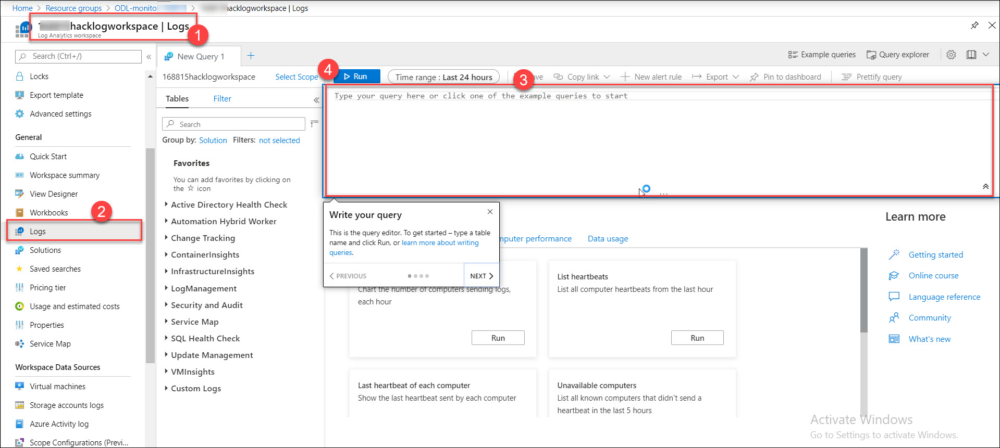
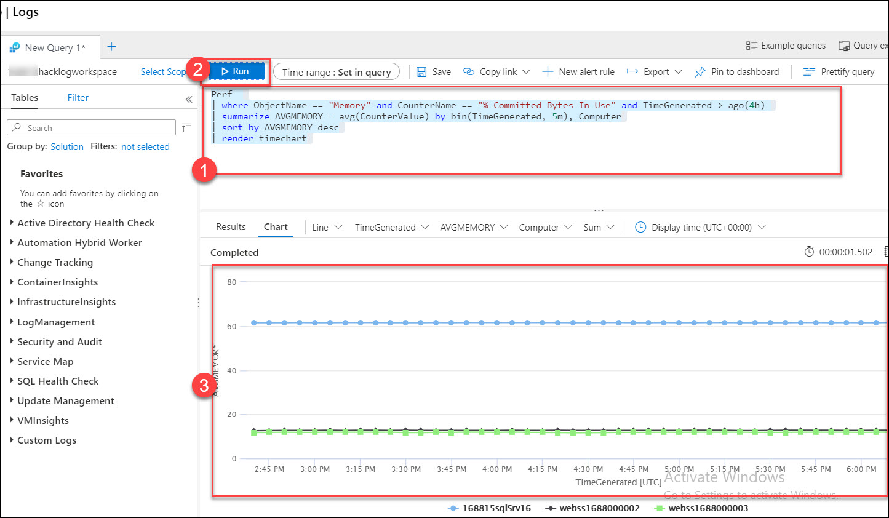
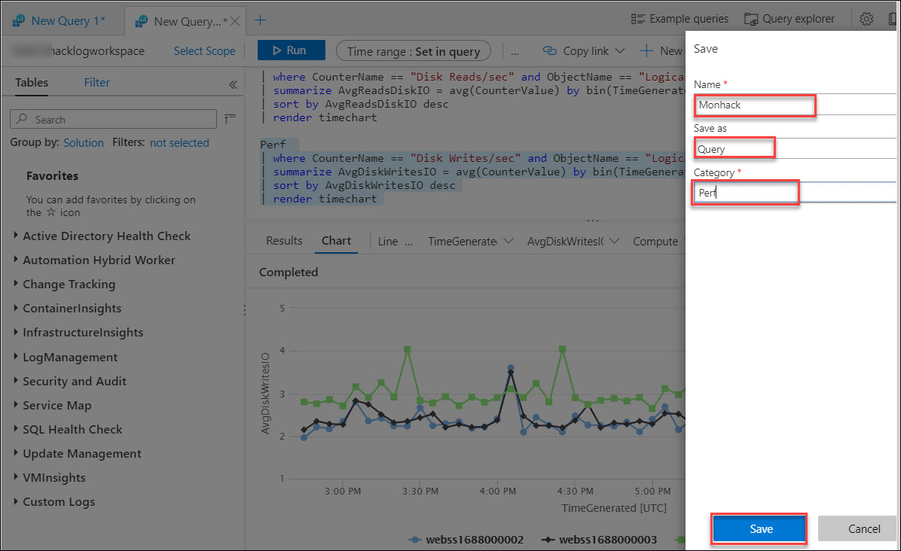
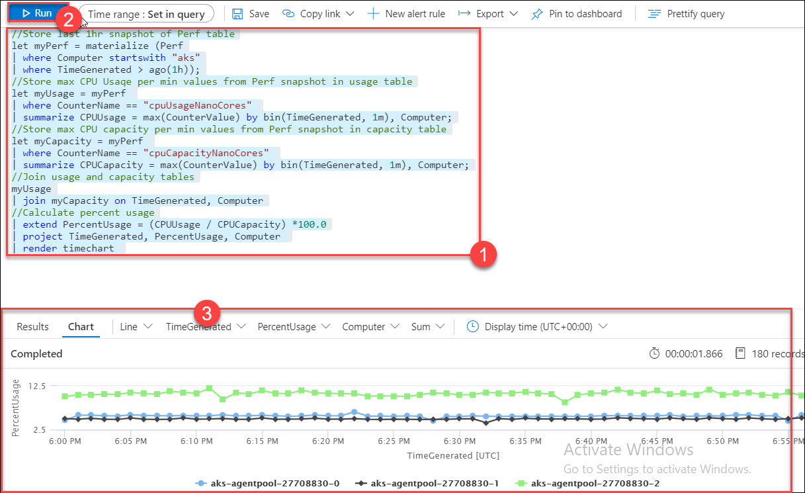

## Challenge 5: Log Analytics Query

1. Write a performance query in Azure Log Analytics that renders a time chart for the last 4 hours for both of the Web Servers and the SQL Server for the following perf metrics. Save each query to your favorites.<br/>
   <br/>
 * Processor Utilization: Processor / % Processor Time<br/>
```
Perf
| where ObjectName == "Processor" and CounterName == "% Processor Time" and TimeGenerated > ago(4h)
| summarize AVGPROCESSOR = avg(CounterValue) by bin(TimeGenerated, 5m), Computer
| sort by AVGPROCESSOR desc
| render timechart
```
   <br/>
 * Memory Utilization: Memory / % Committed Bytes In Use<br/>
```
Perf
| where ObjectName == "Memory" and CounterName == "% Committed Bytes In Use" and TimeGenerated > ago(4h)
| summarize AVGMEMORY = avg(CounterValue) by bin(TimeGenerated, 5m), Computer
| sort by AVGMEMORY desc
| render timechart
```

   <br/>
 * Disk Utilization (IO): Disk Reads/sec and Disk Writes/sec<br/>
 
```
Perf
| where CounterName == "Disk Reads/sec" and ObjectName == "LogicalDisk" and TimeGenerated > ago(4h)
| summarize AvgReadsDiskIO = avg(CounterValue) by bin(TimeGenerated, 5m), Computer
| sort by AvgReadsDiskIO desc
| render timechart
```
```
Perf 
| where CounterName == "Disk Writes/sec" and ObjectName == "LogicalDisk" and TimeGenerated > ago(4h)
| summarize AvgDiskWritesIO = avg(CounterValue) by bin(TimeGenerated, 5m), Computer
| sort by AvgDiskWritesIO desc
| render timechart
```
   <br/>
 * Save the Query<br/>
 * Create a heartbeat query for Web and SQL Server<br/>
```
Heartbeat
| summarize max(TimeGenerated) by Computer
| where max_TimeGenerated < ago(15m)
| count
```
2. Write a performance query that renders a time chart for the last hour of the max percentage CPU usage of the AKS Cluster nodes<br/>
 * Solution 1 using maxif<br/>
```
// Declare time range variable
let timerange = 1h;
Perf
| where Computer startswith "aks"
| where TimeGenerated > ago(timerange)
//Aggregate maximum values of usage and capacity in 1 minute intervals for each node
| summarize CPUUsage = maxif(CounterValue, CounterName =="cpuUsageNanoCores"),
CPUCapacity = maxif(CounterValue,CounterName == "cpuCapacityNanoCores")
by bin(TimeGenerated, 1m), Computer
//Calculate Percent Usage
| extend PercentUsage = (CPUUsage / CPUCapacity) *100.0
| project TimeGenerated, PercentUsage, Computer
| render timechart
```
   <br/>
 * Solution 2 using let and join<br/>
 ```
//Store last 1hr snapshot of Perf table
let myPerf = materialize (Perf
| where Computer startswith "aks"
| where TimeGenerated > ago(1h));
//Store max CPU Usaqe per min values from Perf snapshot in usage table
let myUsage = myPerf
| where CounterName == "cpuUsageNanoCores"
| summarize CPUUsage = max(CounterValue) by bin(TimeGenerated, 1m), Computer;
//Store max CPU capacity per min values from Perf snapshot in capacity table
let myCapacity = myPerf
| where CounterName == "cpuCapacityNanoCores"
| summarize CPUCapacity = max(CounterValue) by bin(TimeGenerated, 1m), Computer;
//Join usage and capacity tables
myUsage
| join myCapacity on TimeGenerated, Computer
//Calculate percent usage
| extend PercentUsage = (CPUUsage / CPUCapacity) *100.0
| project TimeGenerated, PercentUsage, Computer
| render timechart
```
   <br/>
3. Combine infrastructure and application logs to create a single timeseries chart that includes:<br/>
* CPU usage from the node in your AKS cluster hosting the eshoponweb app<br/>
* Duration of page views on your eshoponweb app hosted on the cluster<br/>
 * Solution 1<br/>
 ```
// Declare time range variable
let timerange = 5h;
//Find the node running your eshoponweb app container
let myNode = ContainerInventory
| where Image == "web"
| distinct Computer;
let PercentTable = Perf
| where Computer in (myNode)
| where TimeGenerated > ago(timerange)
//Aggregate maximum values of usage and capacity in 1 minute intervals for each node
| summarize CPUUsage = maxif(CounterValue, CounterName =="cpuUsageNanoCores"),
CPUCapacity = maxif(CounterValue,CounterName == "cpuCapacityNanoCores")
by bin(TimeGenerated, 1m)
//Calculate Percent Usage and rename TimeGenerated
| extend PercentUsage = (CPUUsage / CPUCapacity) *100.0, timestamp = TimeGenerated
| project timestamp, PercentUsage;
//Add AppInsights Data
let AppInsights = app("kjp17hackAppInsights").pageViews
| where timestamp > ago(timerange)
| summarize responsetime = avg(duration) by bin(timestamp, 1m)
| extend responsetimeseconds = responsetime / 1000.0
| project timestamp, responsetimeseconds;
// Join Percent Usage and AppInsights
PercentTable
| join AppInsights on timestamp
| project timestamp, PercentUsage, responsetimeseconds
| render timechart
```
 * Solution 2 with hardcoding node name and using let and join statements<br/>
```
// Declare time range variable
let timerange = 5h;
//Store snapshot of Perf table for the node where the app container is running
let myPerf = materialize ( Perf where TimeGenerated > ago(timerange) where Computer == "aks-agentpool-10755307-2" );
//Store Usage Values
let myUsage = myPerf
| where CounterName == "cpuUsageNanoCores"
| summarize CPUUsage = max(CounterValue) by bin(TimeGenerated, 1m);
//Store Capacity Values
let myCapacity = myPerf
| where CounterName == "cpuCapacityNanoCores"
| summarize CPUCapacity = max(CounterValue) by bin(TimeGenerated, 1m);
//Calculate Percentage and rename TimeGenerated to timestamp
let Percent = myUsage
| join myCapacity on TimeGenerated
| extend PercentUsage = (CPUUsage / CPUCapacity) *100.0, timestamp = TimeGenerated
| project timestamp, PercentUsage;
//Add AppInsights Data
let AppInsights = app("kjp17hackAppInsights").pageViews
| where timestamp > ago(timerange)
| summarize responsetime = avg(duration) by bin(timestamp, 1m)
| extend responsetimeseconds = responsetime/1000.0
| project timestamp, responsetimeseconds
| sort by timestamp asc;
// Join Percent Usage and AppInsights
Percent
| join AppInsights on timestamp
| project timestamp, PercentUsage, responsetimeseconds
| sort by timestamp asc
| render timechart
```
