# Solution 6: Dashboard and Analytics

* Deploy Grafana using Web App for Container https://github.com/grafana/azure-monitor-datasource/blob/master/README.md

    >  Hint: http://docs.grafana.org/installation/docker/

1. Create a Web App for Linux and configure as recommended below:

    
    

 * Create a new App service plan and select B1 Basic. It’s under Dev/Test

    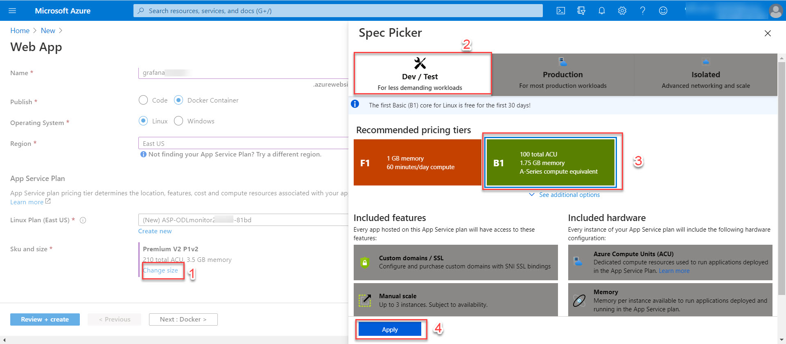
    
 * Select Container and specify Docker Hub, Public and Grafana/Grafana for the image tags (this should deploy the latest version by default)

    
    
 * Should look like this when complete:

    
    
* Click Create

2. After the Web App deploys, we need to configure some settings to enable Azure Monitor Plugin

3. From the Azure Portal navigate to your newly created App Service -> Configurations -> General Settings

4. Under **Always On**, change the value to On.

    

5. Under **Application Settings**, click on **Show Values**

    

6. Change the value for **WEBSITES_ENABLE_APP_SERVICE_STORAGE** to true (from false)

    

7. Click **Add** new Setting and add the following:

    

    

8. Click **Save**

    

    > **Note**: For the Application settings to take effect you may need to restart your Web App

9. To **Login** to Grafana

10. Click on **Overview** and copy the **URL** for your Web App

    

11. Navigate to the URL in your browser. The username is **admin** lowercase and the password is whatever you configured in Application Settings. Notice the version of Grafana as you need 5.2.0 or newer if you are querying **Azure Log Analytics**

    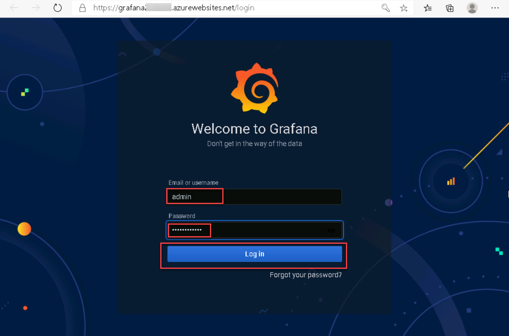

12. Once logged into **Grafana** you should notice Azure Monitor is installed

13. Configure the **Azure Monitor Data Source** for Azure Monitor, Log Analytics and Application Insights

    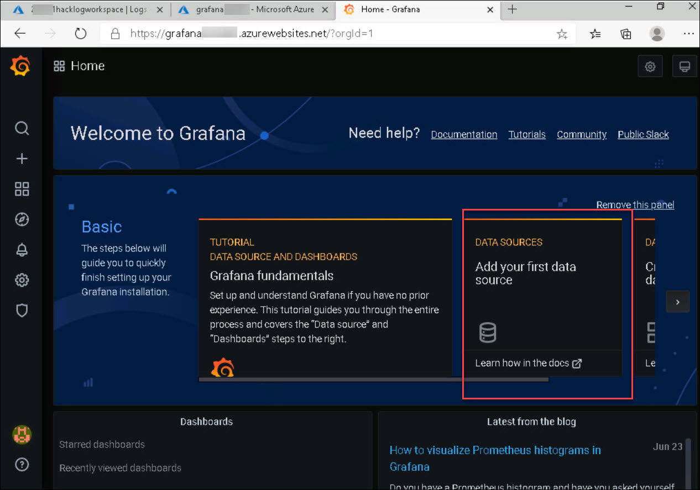

14. Configure Azure Monitor data source

    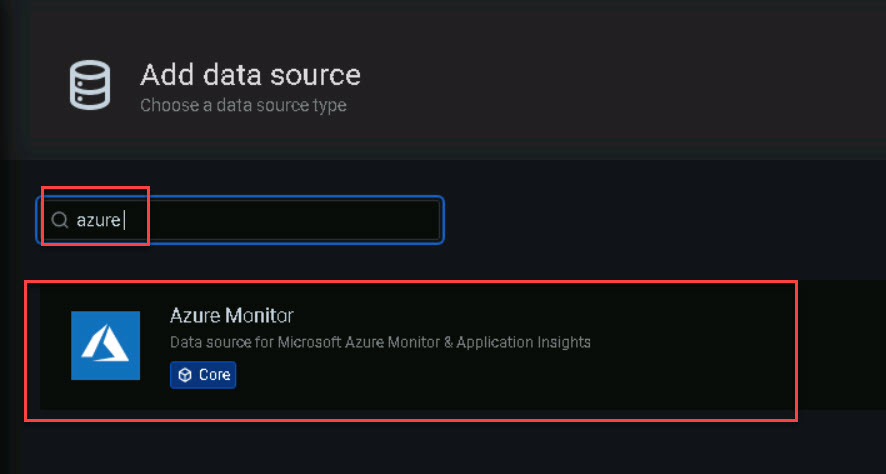

15. Fill out the Azure Monitor API Details

    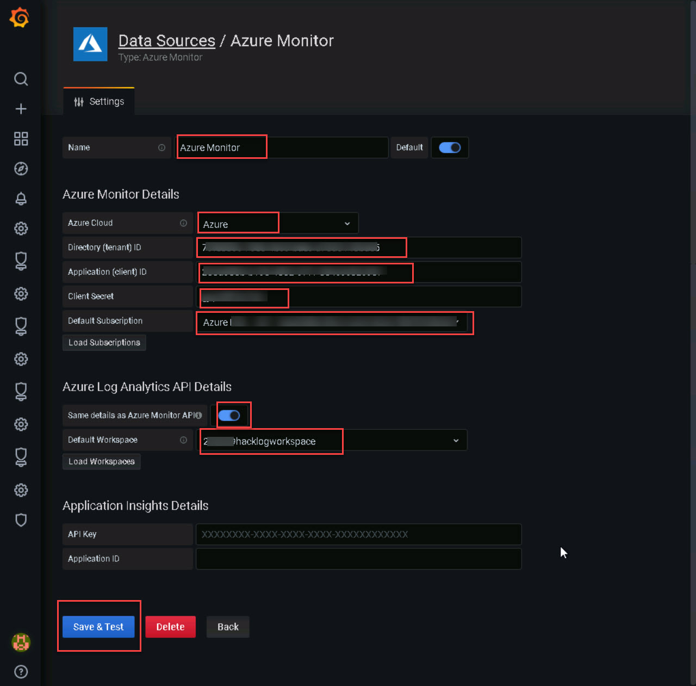

16. From your Environment Details copy the **Tenant Id**, **Application/Client Id**, **Application Secret Key** properties to find the Directory ID

    

17. Click **Save & Test** and you should see a message like below.

    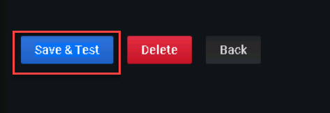

18. To configure **Application Insights**, find your **API Id** and generate a key

    

19. Copy the **Application ID** and paste in Grafana. Click on **Create API Key**

    

    

20. Copy the key and paste in the **Grafana Application Insights Details**. **Note:** You cannot retrieve this key again.

    

21. Click **Save & Test**. Should like this now.

22. Create a **CPU Chart** with a Grafana variable used to select Computer Name

23. Create a new dashboard.

    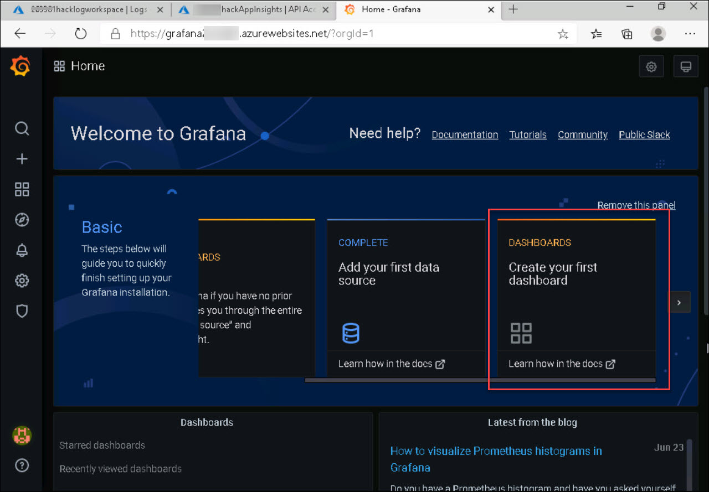
    
* click on **add new panel** to add a dashboard
    
    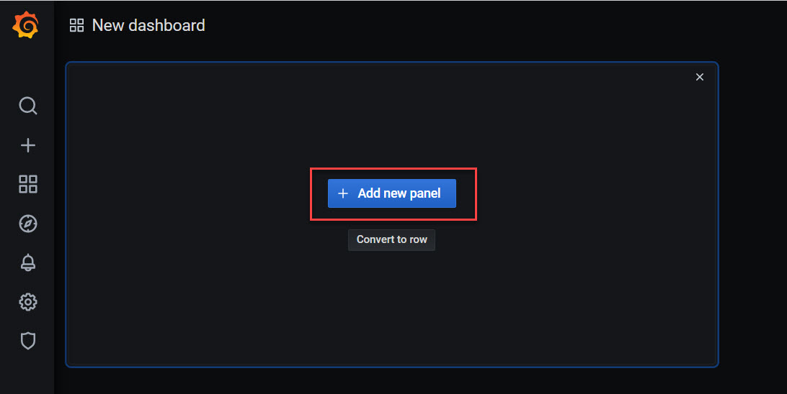 

24. Add **Graph**

    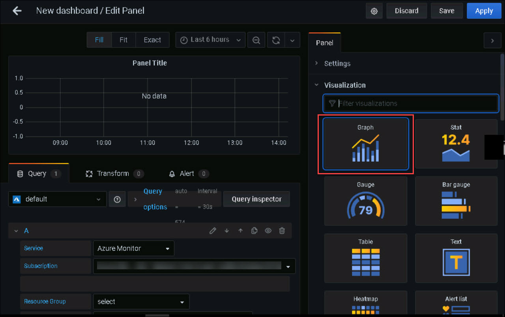

25. Edit the **Panel Title**

    

26. Under General change to the name to something like **Computer CPU**.

    

27. Under Metrics, make sure service is Azure Log Analytics, your workspace is selected, and build out a Log Analytics query (answer query below for your reference).

**Sample query:**

   ```
    Perf
    | where $__timeFilter(TimeGenerated)
    | where CounterName == "% Processor Time" and InstanceName == "_Total"
    | summarize percentile(CounterValue,50) by bin(TimeGenerated, $__interval), Computer
    | order by TimeGenerated asc
   ```

   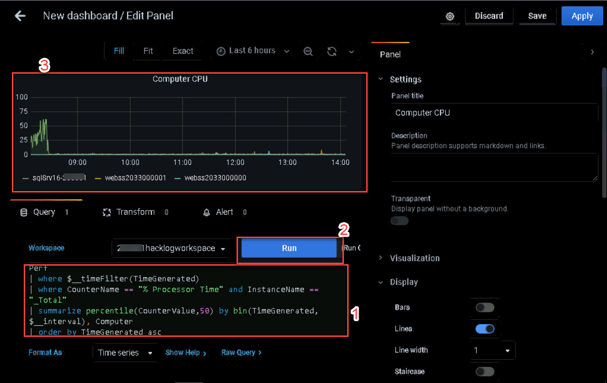

28. Click **Run** to test

29. Now let's make a few changes. Click on **Axes** and change the Unit to percent and **Y-Max** to 100. Run the query

    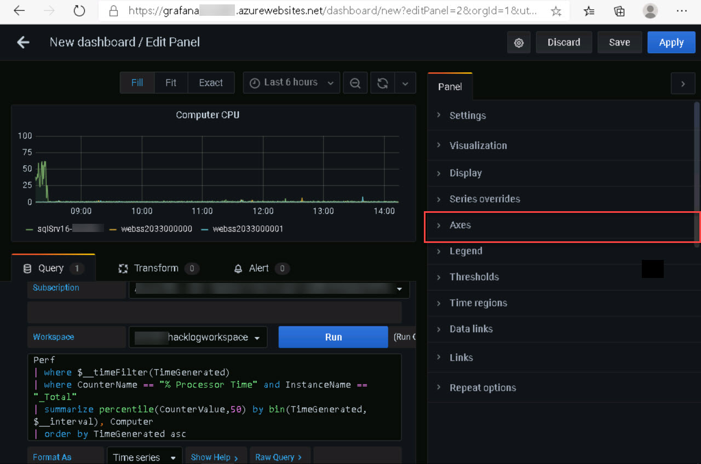

    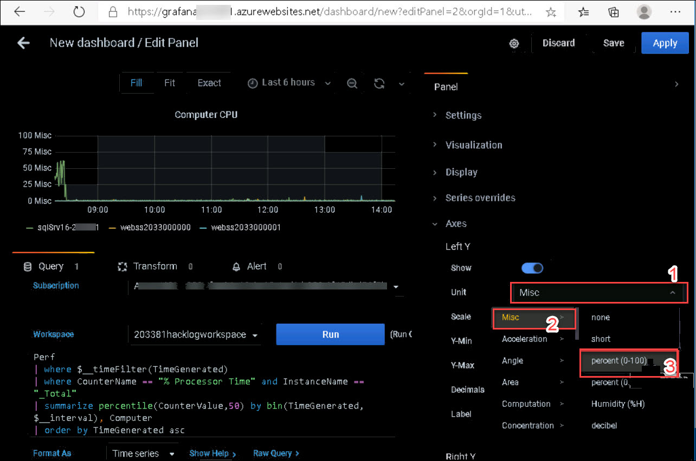

30. Let’s save it by click on the disk in the upper right side.

    

    

31. Should look something like this:

    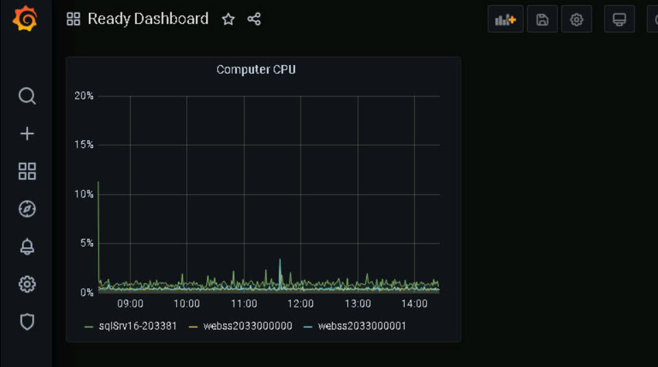

 #### Advanced features:

 * Variables

 * Some query values can be selected through **UI** dropdowns, and updated in the query.

 * For example, a **Computer** variable can be defined, and then a dropdown will appear on the dashboard, showing a list of possible values:


   


 * Now let’s add a variable that lets us select computers in the chart. Click on the gear in the upper right corner.


   

 * Click on **Add** Variable

   

32. Configure the **Variable** to look like the screen below.

    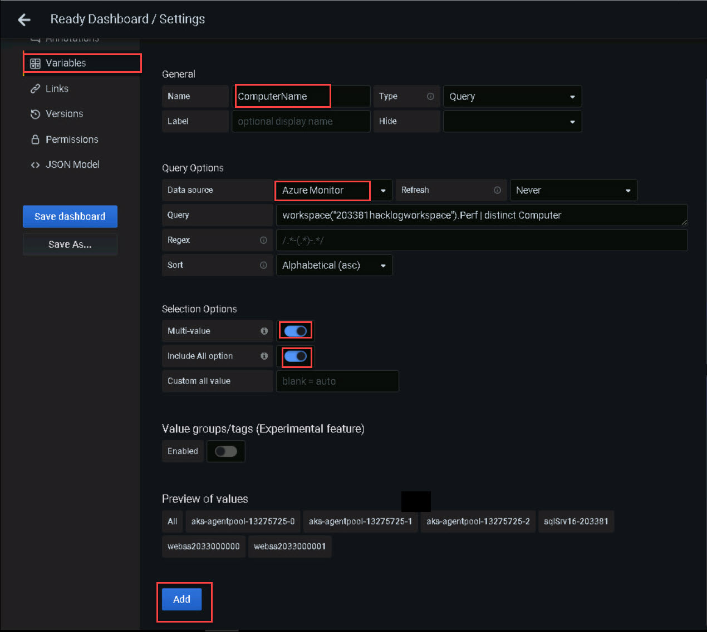


    > Note: In my case I make sure to specify the Workspace name as I have many workspaces and wanted to make sure we only returned values that would work in our chart. Click Add

33. Make sure to **Save** your dashboard

    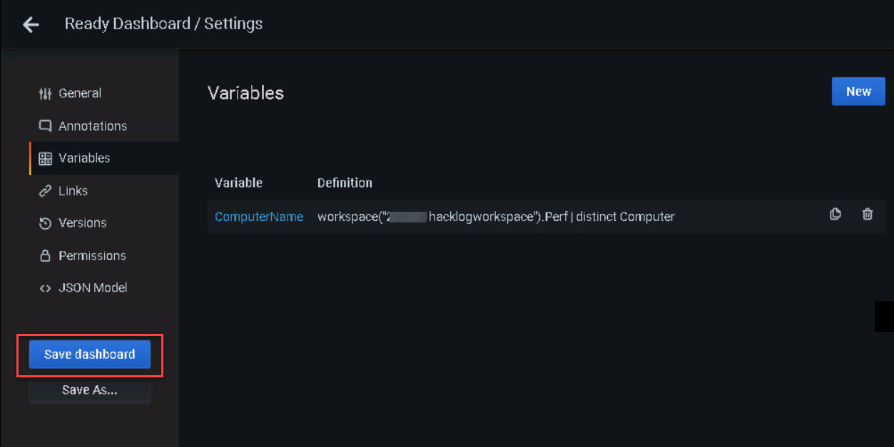

    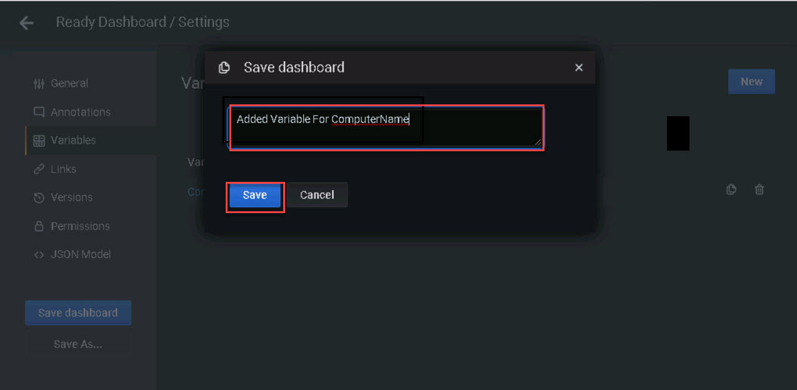

34. Now go back and edit your **Computer CPU** chart to update the query to use the new variable.

    

35. Sample update Computer CPU query to support variable **$ComputerName**

   ```
    Perf
    | where $__timeFilter(TimeGenerated) and Computer in ($ComputerName)
    | where (CounterName == "% Processor Time" and InstanceName == "_Total") or CounterName == "% Used Memory"
    | summarize AVGPROCESSOR = avg(CounterValue) by bin(TimeGenerated, $__interval), Computer
    | order by TimeGenerated asc
   ```

   

36. Make sure to **Save**

    

37. Try it out!

    

38. Try creating a variable that accepts percentiles (50, 90 and 95).

 ## Annotations:
 
   * Another cool Grafana feature is annotations – which marks points in time that you can overlay on top of charts.

   * Below, you can see the same chart shown above, with an annotation of **Heartbeats**. Hovering on a specific annotation shows informative text about it.

   * **Configuration** is very similar to Variables:

   * Click the dashboard **Settings** button (on the top right area), select **Annotations**, and then **+New**.

   * This page shows up, where you can define the data source (aka “Service”) and query to run in order to get the list of values (in this case a list of computer heartbeats).

> **Note:** that the output of the query should include a date-time value, a Text field with interesting info (in this case we used the computer name) and possibly tags (here we just used “test”).

   * Add an Annotation to your chart overlaying Computer Heartbeat
      
   

   * FYI… Annotations provide a way to mark points on the graph with rich events. When you hover over an annotation you can get event description and event tags. The text field can include links to other systems with more detail.

   * Navigate to settings from your dashboard (the gear in the upper right), click on Annotations, Add Annotation Query

   

   > HINT: Use the sample Kusto/Data explorer queries to create more dashboard scenarios.
