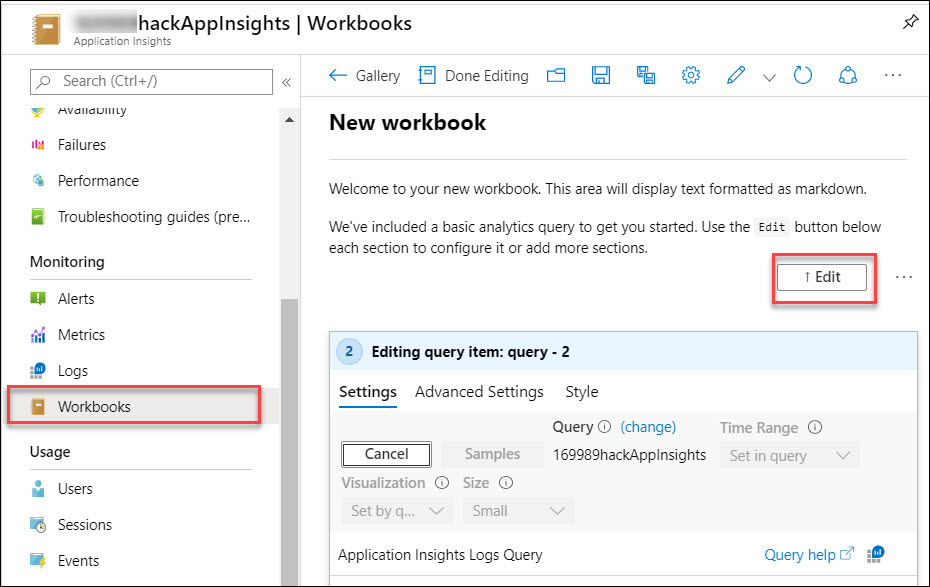
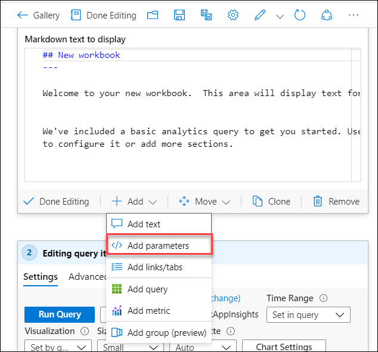
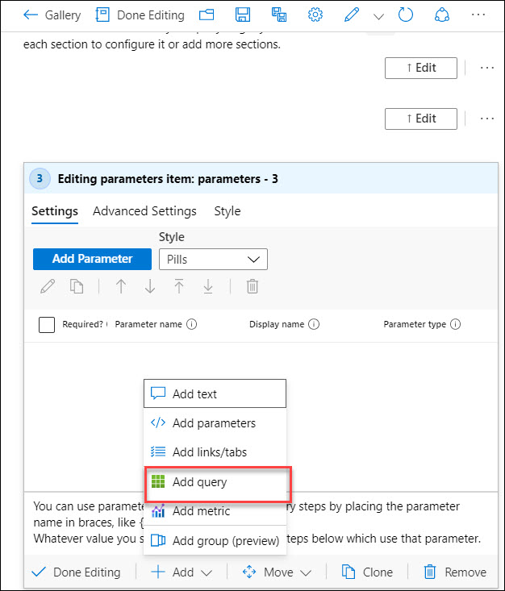
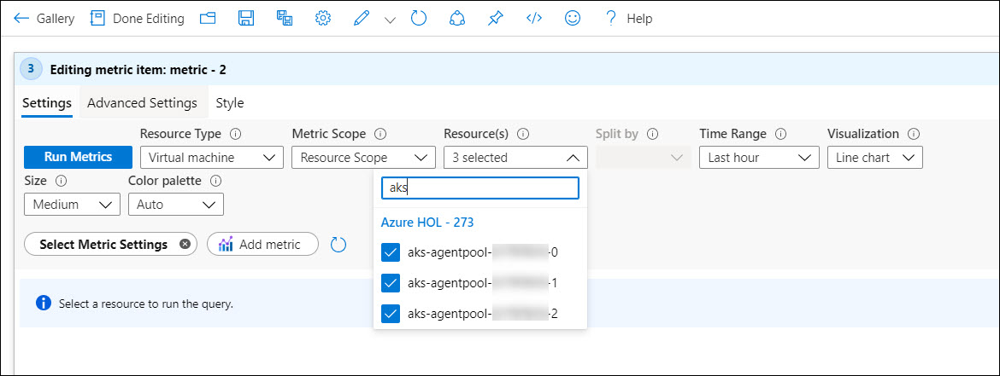
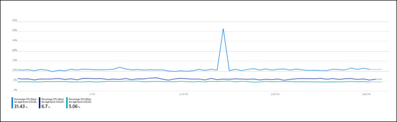

# Solution 6a: Workbooks

Workbook documentation is available here: https://docs.microsoft.com/en-us/azure/azure-monitor/app/usage-workbooks
 
1. Navigate to your **Application Insights** resource in the Azure Portal
 
2. Click on Workbooks **New**
 
      
 
3. Click **Edit** in the New Workbook section to describe the upcoming content in the workbook. Text is edited using Markdown syntax.
 
      
 
4. Use **Add text** to describe the upcoming table
 
      
 
5. Use **Add parameters** to create the time selector
 
      
 
6. Use **Add query** to retrieve data from pageViews
 
      
 
7. Use **Column** Settings to change labels of column headers and use Bar and Threshold visualizations.

 * Query used for section Browser Statistics

    ```
    pageViews
    | summarize pageSamples = count(itemCount), pageTimeAvg = avg(duration), pageTimeMax = max(duration) by name
    | sort by pageSamples desc
    ```

 * Query used for Request Failures

    ```
    requests
    | where success == false
    | summarize total_count=sum(itemCount), pageDurationAvg=avg(duration) by name, resultCode
    ```

8. Use **Add Metric** to create a metric chart
 
      
 
9. Change your Resource Type to **Virtual Machine** and check all **aks** virtual machine
 
      
 
      
 
10. Change the Resource Type to **Log Analytics**
 
      
 
11. Change your workspace to the **Log Analytics workspace** with your AKS container logs
 
      
 
 * Query used for section Disk Used Percentage
 
    ```
    InsightsMetrics
    | where Namespace == "container.azm.ms/disk" 
    | where Name == "used_percent"
    | project TimeGenerated, Computer, Val 
    | summarize avg(Val) by Computer, bin(TimeGenerated, 1m)
    | render timechart
    ```
    
12. **Save** your workbook with Name myWorkBook
 
