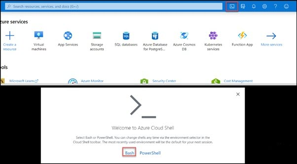
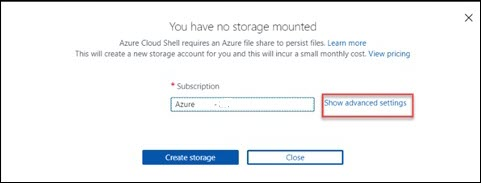
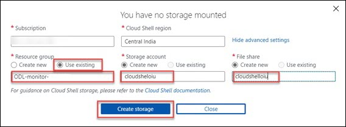
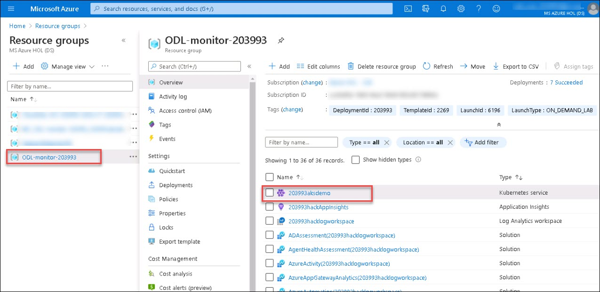
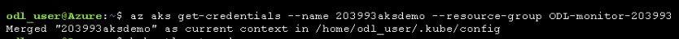
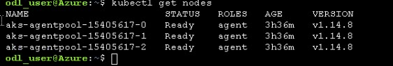
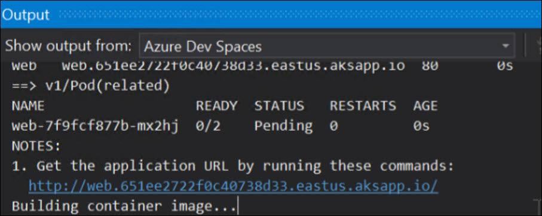
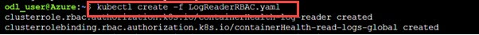

# Pre-requisites

1. Open a browser on the provided VM and Navigate to Azure Portal( https://portal.azure.com ) and login with the credentials provided under Azure Crendentials on Environment Details tab on the right.
 
   
 
    Then launch the CloudShell by clicking on the icon next to the search bar at the top of the Azure portal and Select Bash when the prompt comes up.
 
    Select Show advanced settings and proceed as shown in the below images:
 
   
 
   
 
2. For enabled Kubernetes RBAC authorization, you need to apply cluster role binding for live logs to work. Run the below commands:

* Connect to your cluster using below command:
   ```
   az aks get-credentials --name ClusterName --resource-group MyResourceGroup
   ```
 > Replace the ClusterName and MyResourceGroup with your resource group and aks cluster name given under ODL-Monitor-XXXX resource group.
 
   
   
   
   
* Use below command to test your connection:

   ```
   kubectl get nodes
   ```
   
 
4. Upload **PublicConfig.json** and **LogReaderRBAC.yaml** files to cloud shell which are under **.\AzureMonitorHackathon-master\Student\Resources**:
 
   
      
 
5. Deploy the cluster role bindings:

   ```
   kubectl create -f LogReaderRBAC.yaml
   ```

   
