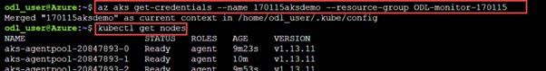
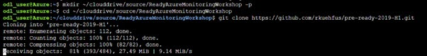

# Pre-requisites

1. Open azure portal then go to cloud shell and follow the steps:
 
    
 
    
 
    
 
2. Run below commands for connecting to cluster using below command:
 

    ```
    az aks get-credentials --name 170531aksdemo --resource-group ODL-monitor-170531
    ```

    > Replace the 170531aksdemo and ODL-monitor-170531 with your resource group and aks cluster name
 

    ```
    kubectl get nodes
    ```

    
 

4. Navigate to https://github.com/kayodeprinceMS/AzureMonitorHackathon and download the repository as a zip file to your local disk
 
    
 
5. **Unzip** the contents to a local folder on your machine
 
       
 
6. Navigate to the location where you unzipped the files and open the **.\AzureMonitorHackathon-master\Student\Resources** folder in Visual Studio or Visual Studio code
 
7. Once you download the repository, upload **PublicConfig.json** and **LogReaderRBAC.yaml** files which are under Resources folder cloud shell:
 
    
 
8. Deploy the cluster role bindings
 

    ```
    kubectl create -f LogReaderRBAC.yaml
    ```

    
 
9. Run below command to host the web app to aks cluster:
 

    ```
    mkdir ~/clouddrive/source/ReadyAzureMonitoringWorkshop -p
    cd ~/clouddrive/source/ReadyAzureMonitoringWorkshop
    git clone https://github.com/rkuehfus/pre-ready-2019-H1.git
    code .
    ```

    
 
