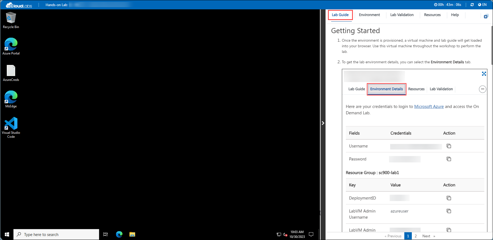
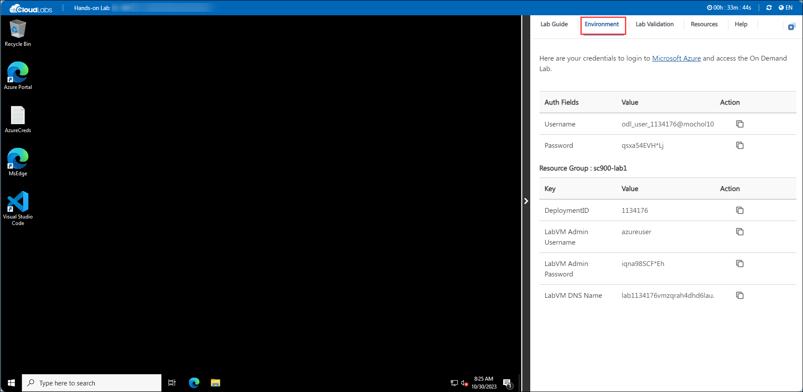
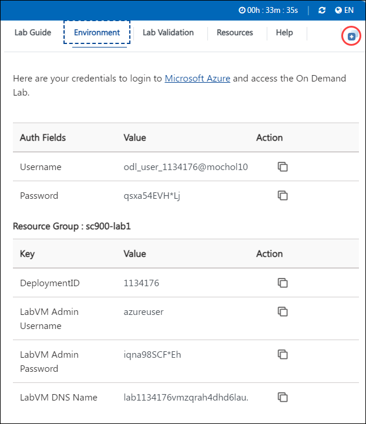
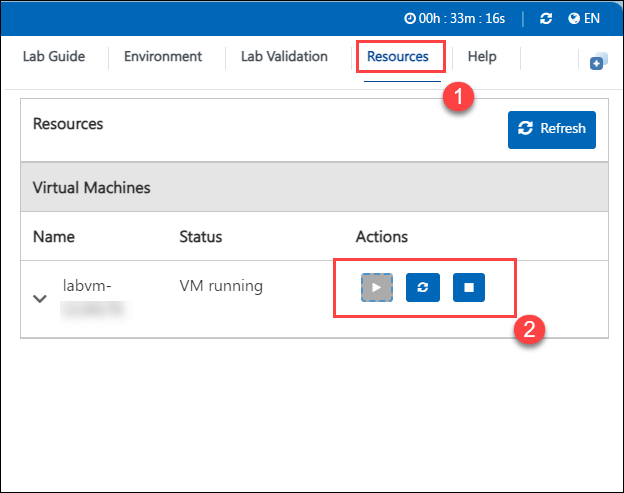
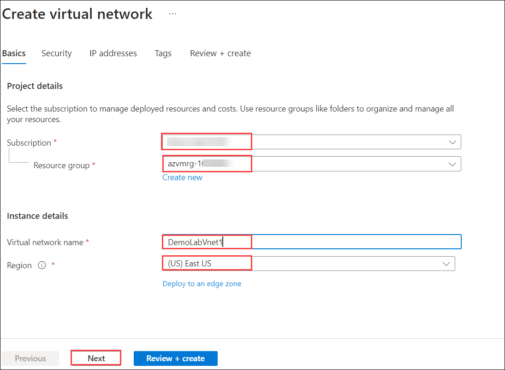
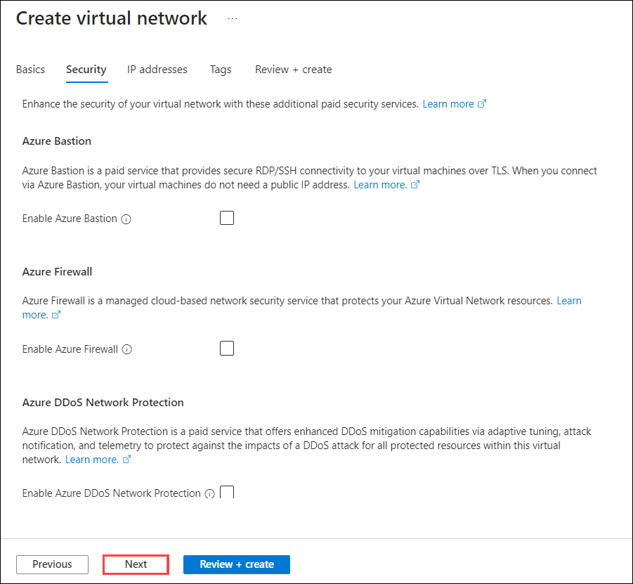
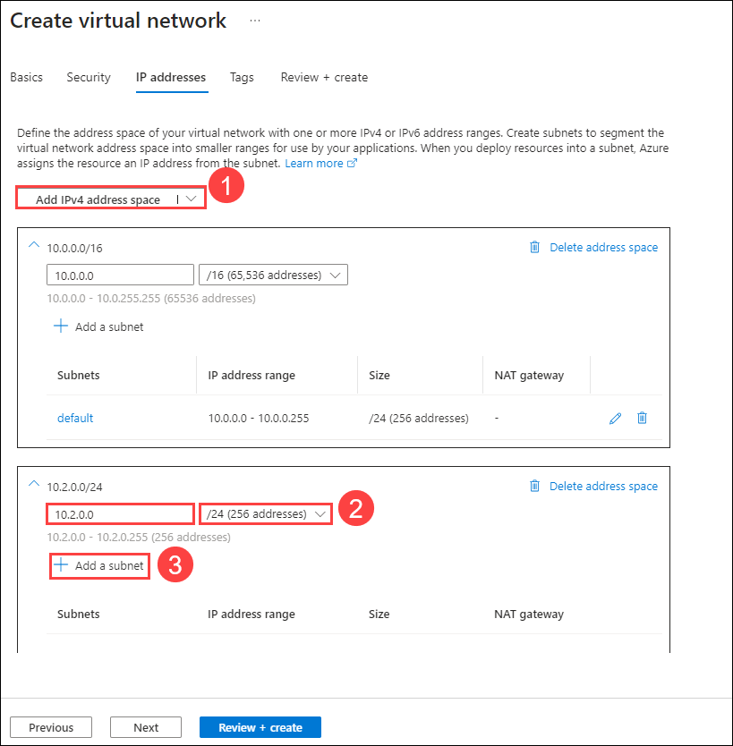
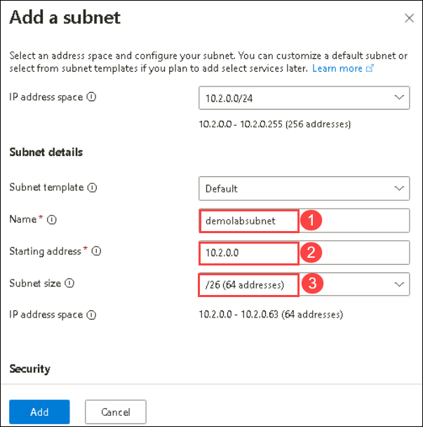

# Getting Started with Your Azure Virtual Machine and Compute Workshop
 
Welcome to your Azure Virtual Machine and Compute workshop! We've prepared a seamless environment for you to explore and learn about deploying an Azure-based windows virtual machine, install a basic webpage, and monitor VM performance. Let's begin by making the most of this experience:
 
## Accessing Your Lab Environment
 
Once you're ready to dive in, your virtual machine and lab guide will be right at your fingertips within your web browser.

 

### Virtual Machine & Lab Guide
 
Your virtual machine is your workhorse throughout the workshop. The lab guide is your roadmap to success.
 
## Exploring Your Lab Resources
 
To get a better understanding of your lab resources and credentials, navigate to the **Environment Details** tab.
 

 
## Utilizing the Split Window Feature
 
For convenience, you can open the lab guide in a separate window by selecting the **Split Window** button from the Top right corner.
 

 
## Managing Your Virtual Machine
 
Feel free to start, stop, or restart your virtual machine as needed from the **Resources** tab. Your experience is in your hands!
 
 
 
## Let's Get Started with Azure Portal
 
1. On your virtual machine, click on the Azure Portal icon as shown below:
 
.png)

 
2. You'll see the **Sign into Microsoft Azure** tab. Here, enter your credentials:
 
   - **Email/Username:** <inject key="AzureAdUserEmail"></inject>

 
3. Next, provide your password:
 
   - **Password:** <inject key="AzureAdUserPassword"></inject>

 
4. If prompted to stay signed in, you can click "No."
 
5. If a **Welcome to Microsoft Azure** pop-up window appears, simply click "Maybe Later" to skip the tour.
 
6. Now you can see Azure Portal Dashboard, click on **Resource groups** from the Navigate panel to see the resource groups.

**Note**: Ensure to perform all the lab steps in the RG named **azvmrg-<inject key="Deployment ID" enableCopy="false"/>**

7. Click "Next" from the bottom right corner to embark on your Lab journey!

.png)

Now you're all set to explore the powerful world of technology. Feel free to reach out if you have any questions along the way. Enjoy your workshop!

## **Scenario 1 - Building a Virtual Network**
An **Azure virtual network** (VNet) is a representation of your own **network**  in the cloud. It is a logical isolation of the **Azure** cloud dedicated to your subscription. You can fully control the IP address blocks, DNS settings, security policies and route tables within this **network.** [Learn more](https://docs.microsoft.com/en-us/azure/virtual-network/virtual-networks-overview).

### **Building a Virtual Network**

1. Click on **+ Create a resource**.

    
    
2. In the search box, type **Virtual Network** and select to open it.

     
     
3. Click on the **Create** button.

      
      
4. On the **Create virtual network** blade, enter the following information:
    
    -  Subscription: **Select your subscription (1)**.
    
    -  Resource group: Select the exisiting resource group named **azvmrg-<inject key="Deployment ID" enableCopy="false"/> (2)**
    
    -  Name: **DemoLabVnet1 (3)**
    
    > **Note:** If the portal advises the name is not unique, simply adjust the name. Once you create a unique name that is available, you will see a check mark at the end of the **Name** field.

    -  Region: Select the region you are using to perform the lab **(4)**.

    -  Click on **Next (5)**

   
    
5. Click on **Next**. Now on the **Create virtual network - Security** tab leave the default option for **Azure BastionHost** ,**Azure Firewall** and **Azure DDoS Network Protection** , then click on **Next**.

    

6. On the **Create virtual network - IP Addresses** tab, click on **Add IPv4 address space (1),** enter **10.2.0.0** and select **/24(256 addresses) (2)** from the drop down. Then, select **Add subnet (3)**.
 
   

7.  On **Add subnet** tab enter the following details and click **Add (3)**.
   
      - Name: **demolabsubnet (1)**
      
      - Subnet address range: **10.2.0.0 (2)**
      
      - Subnet size : Select **/26(64 addresses) (3)** from the drop down.
      
      - Click on **Add Subnet**. 

     

8. Click on **Review + Create**.
