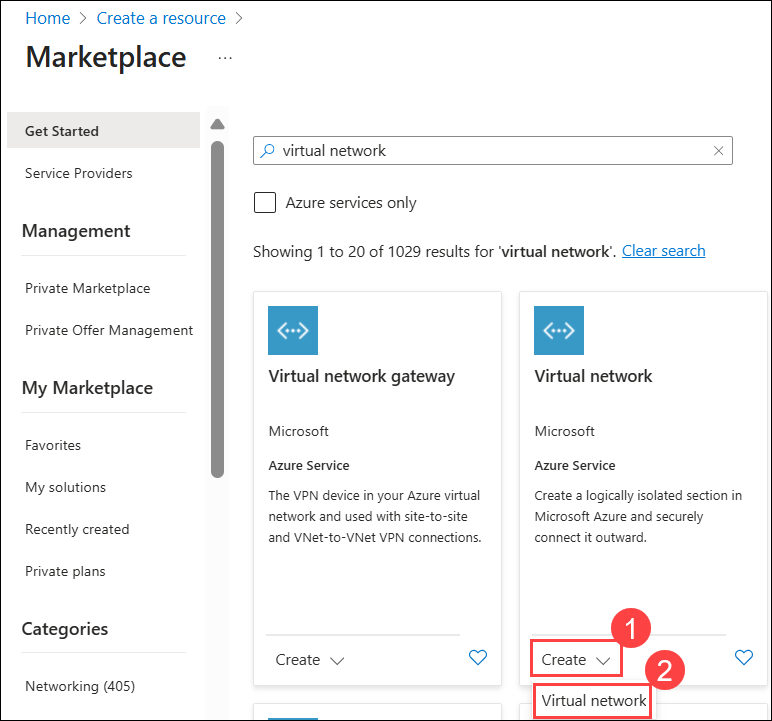
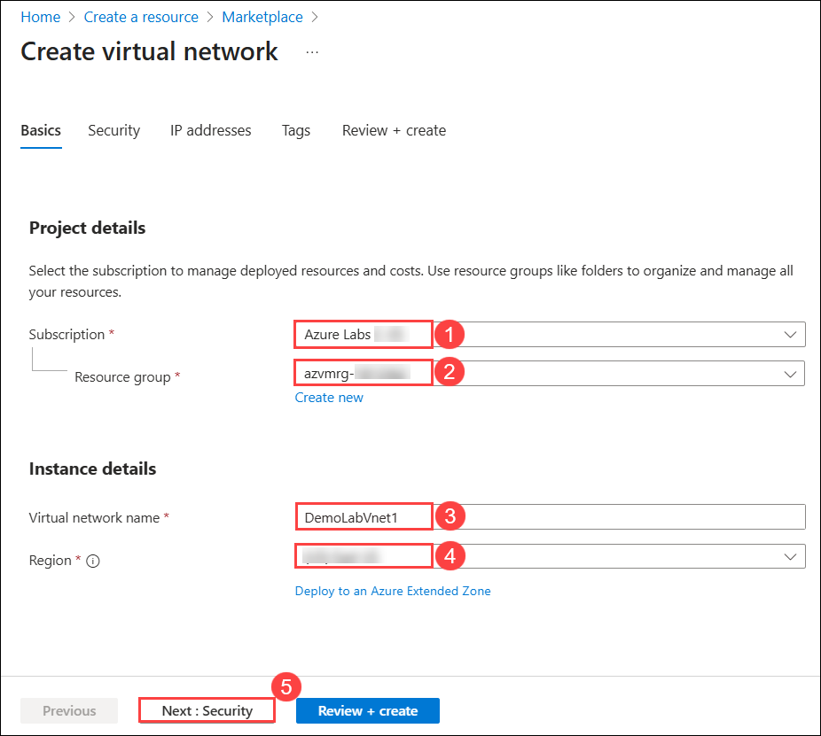
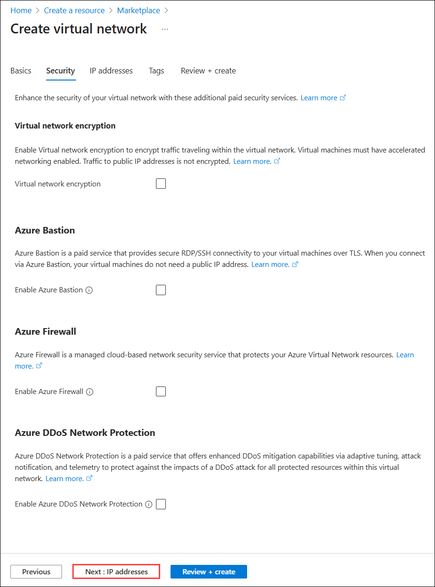
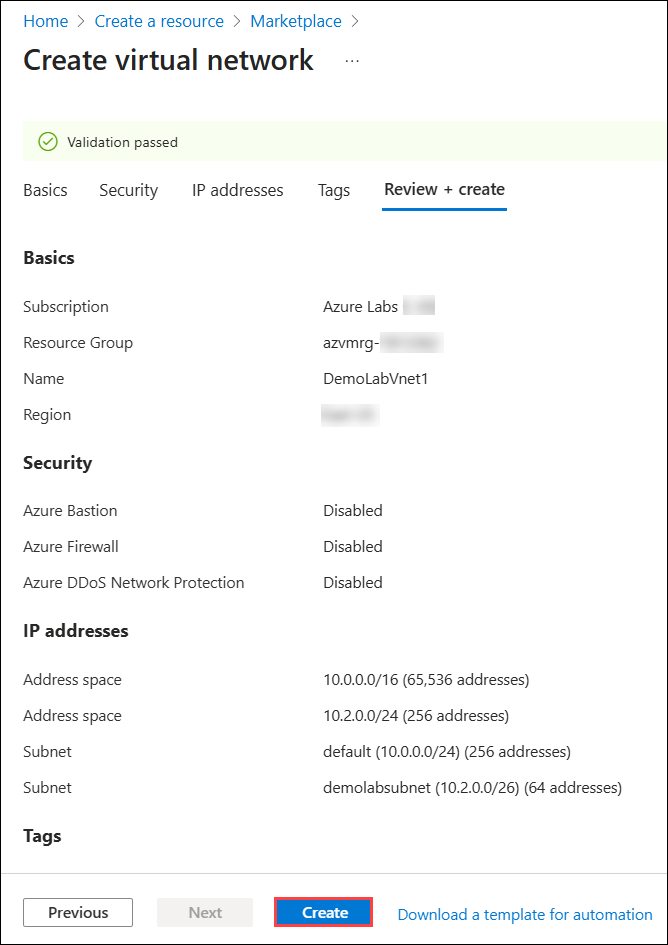

# Lab 01 - Building a Virtual Network

### Estimated Duration: 30 Minutes

## Lab Scenario

You are a Cloud Administrator for Contoso Ltd., tasked with creating a secure and isolated networking environment in Azure for upcoming application deployments. In this lab, you will design and build an Azure Virtual Network (VNet) from scratch using the Azure portal. You will configure custom IP address ranges, create a dedicated subnet, and validate the deployment to ensure that it meets your organization’s networking requirements. This virtual network will serve as the foundation for securely hosting virtual machines, application services, and other Azure resources in future projects. [Learn more](https://docs.microsoft.com/en-us/azure/virtual-network/virtual-networks-overview).

### Objectives

In this lab you will complete the following task:

- Task 1: Building a Virtual Network

### Task 1: Building a Virtual Network

In this task, you will create an Azure Virtual Network (VNet) from the Azure portal. You will define the network’s basic settings, configure IP address space, and create a dedicated subnet to segment resources. This will establish a secure and isolated environment for hosting Azure services and enable controlled connectivity between them.

1. On the Azure portal, click on **+ Create a resource**.

    
    
2. In the search box, type **Virtual Network (1)** and select **Virtual Network (2)** to open it.

     
     
3. Select **Create (1)** drop down and then choose **Virtual network (2)** from the options.

      
      
4. On the **Basics** tab of Create virtual network blade, enter the following information:
    
    -  Subscription: **Accept default subscription (1)**.
    
    -  Resource group: Select the exisiting resource group named **azvmrg-<inject key="Deployment ID" enableCopy="false"/> (2)**
    
    -  Name: **DemoLabVnet1 (3)**
    
       > **Note:** If the portal advises the name is not unique, simply adjust the name. Once you create a unique name that is available, you will see a check mark at the end of the **Name** field.

    -  Region: Select **<inject key="Region" enableCopy="false"/>** **(4)**.

    -  Click on **Next : Security (5)**.

       
    
5. Now on the **Security** tab of Create virtual network blade, `leave all the options as default`, then click on **Next : IP addresses**.

    

6. On the **IP addresses** tab of Create virtual network blade, click on **Add IPv4 address space (1)** and in the second box enter **10.2.0.0** and select **/24 for 256 addresses (2)** from the drop down. Then, select **Add a subnet (3)**.
 
   

7.  On **Add a subnet** tab enter the following details: 

      - Subnet Purpose: **Leave the default one**
   
      - Name: **demolabsubnet (1)**

      - IPv4 address range: Select **10.2.0.0/24 (2)** from the drop down
      
      - Starting address: **10.2.0.0 (3)**
      
      - Size : Select **/26 (64 addresses) (4)** from the drop down.
      
      - Click on **Add (5)**. 

        

8. Click on **Review + create**.
     
9. Review the configuration and select **Create**.

    

10. Wait for the deployment to complete.

    

> **Congratulations** on completing the task! Now, it's time to validate it. Here are the steps:
> - If you receive a success message, you can proceed to the next task.
> - If not, carefully read the error message and retry the step, following the instructions in the lab guide. 
> - If you need any assistance, please contact us at cloudlabs-support@spektrasystems.com. We are available 24/7 to help you out.    

<validation step="2c2d3a0e-0590-4a36-9c5f-20f1da567eab" />

    
## Summary

In this hands-on lab, you set up a secure Azure Virtual Network for resource connectivity.

### Now, click on **Next** from the page navigation bar at the end of the lab guide page to proceed to the next page

   
