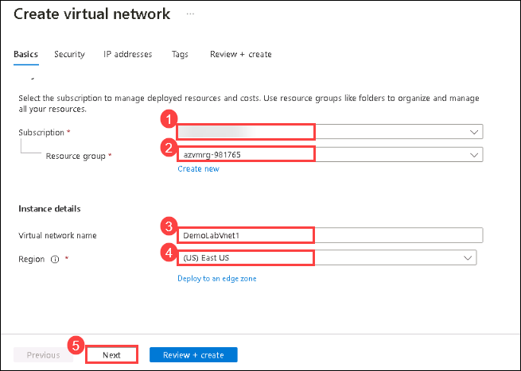
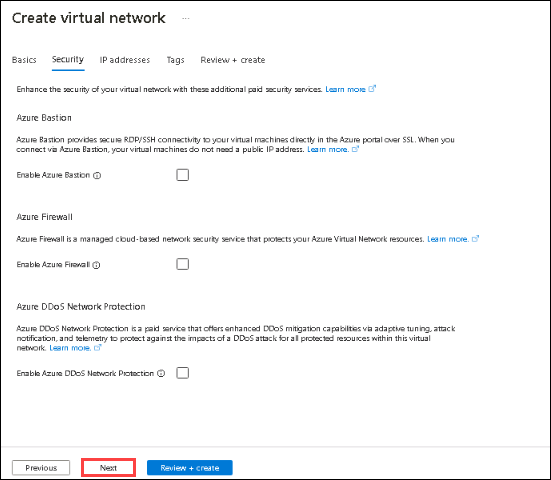
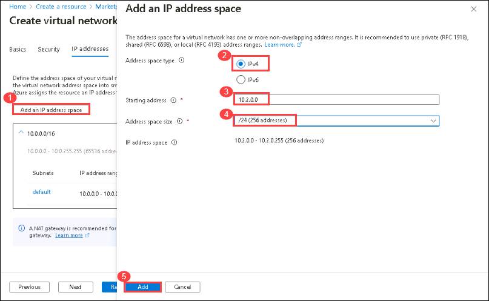
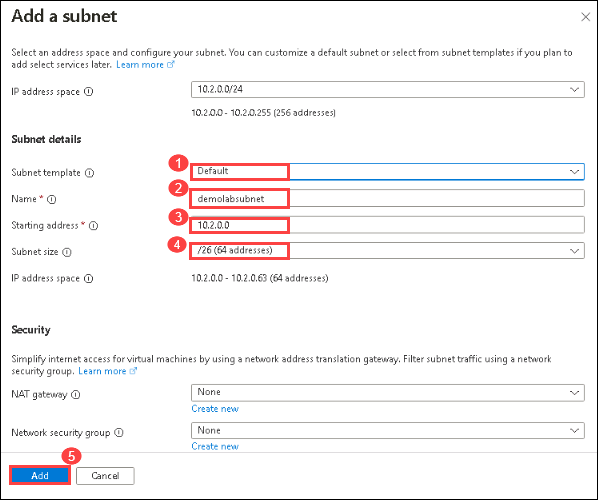
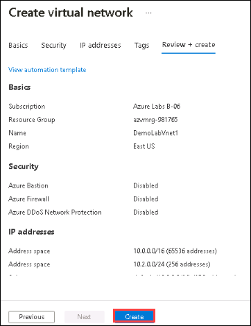

## **Getting Started**

1. In the virtual machine (VM) on the left, click on the Azure portal desktop icon or navigate to https://portal.azure.com/ from **Microsoft edge**.

    

1. On the **Sign in to Microsoft Azure** window, you will see the login screen, enter the following username **<inject key="AzureAdUserEmail" />** and Password **<inject key="AzureAdUserPassword" />** and Click on **Sign in**

2. If you see the pop-up  **Stay Signed in?**, click **No**

3. If you see the pop-up **You have free Azure Advisor recommendations!** , close the window to continue the lab. 

4. If a **Welcome to Microsoft Azure** popup window appears, click **Maybe Later** to skip the tour.

1. Now you can see Azure Portal Dashboard, click on **Resource groups** from the Navigate panel to see the resource groups.

    

**Note**: Ensure to perform all the lab steps in the RG named **azvmrg**

## **Scenario 1 - Building a Virtual Network**
An **Azure virtual network** (VNet) is a representation of your own **network**  in the cloud. It is a logical isolation of the **Azure** cloud dedicated to your subscription. You can fully control the IP address blocks, DNS settings, security policies and route tables within this **network.** [Learn more](https://docs.microsoft.com/en-us/azure/virtual-network/virtual-networks-overview).

### **Building a Virtual Network**

1. Click on **+ Create a resource**.

    
    
3. In the search box, type **Virtual Network** and select to open it.

     
     
4. Click on the **Create** button.

      
      
6. On the **Create virtual network** blade, enter the following information:
    
    -  Subscription: **Select your subscription (1)**.
    
    -  Resource group: Select the exisiting resource group named **azvmrg (2)**
    
    -  Name: **DemoLabVnet1 (3)**
    
    > **Note:** If the portal advises the name is not unique, simply adjust the name. Once you create a unique name that is available, you will see a check mark at the end of the **Name** field.

    -  Region: Select the region you are using to perform the lab **(4)**.

    -  Click on **Next (5)**

        
    
1. On the **Create virtual network - Security** tab leave the default option for **DDoS Protection** and **firewall**, then click on **Next**.

     

1. On the **Create virtual network - IP Addresses** tab, click on **Add an IP address space (1)** enter the following information. Then, select **Add (5)**.
 
      - Address space Type: **IPv4 (2)** 
      
      - Starting address: **10.2.0.0 (3)**
      
      - Address space size : from the drop down menu select **/24 (4)**  

        

1.  On the **Create virtual network - IP Addresses** tab, click on **+ Add a subnet** and on the **Add a Subnet**, enter the following information. Then, select **Add (5)**.

      - Subnet Template: **Default (1)**
      
      - Name: **demolabsubnet (2)**
      
      - Starting address: **10.2.0.0 (3)**
      
      - Subnet size: from the drop down menu select **/26 (4)**  

        

1.  Select **Review + Create**.
     
8. Review the configuration and select **Create**.

    

This completes this scenario. Click **Next** to go to the next scenario.
