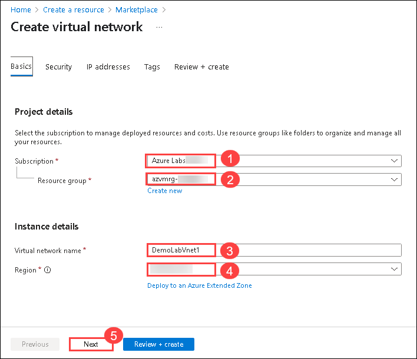
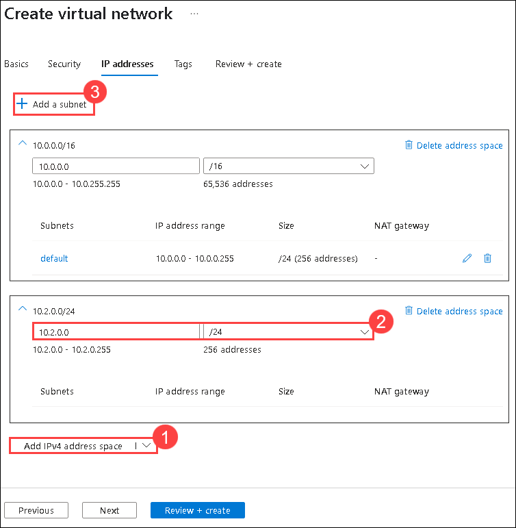
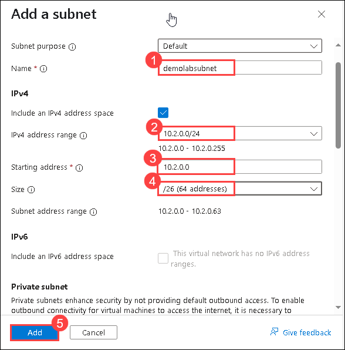
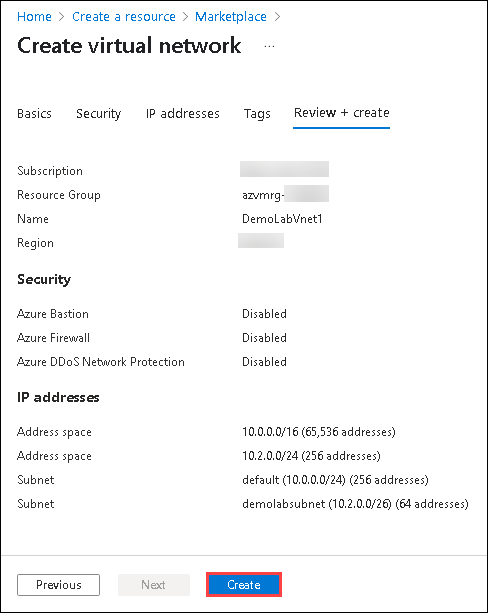
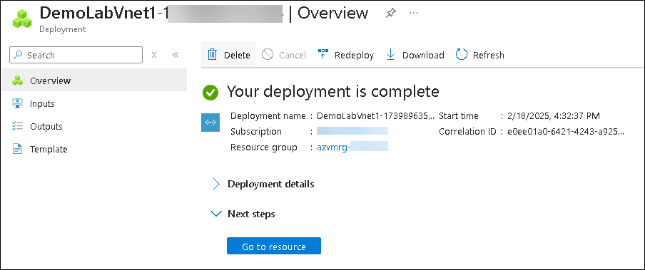

# Lab 01 - Building a Virtual Network

### Estimated Duration: 30 minutes

## Overview

An **Azure virtual network** (VNet) is a representation of your own **network**  in the cloud. It is a logical isolation of the **Azure** cloud dedicated to your subscription. You can fully control the IP address blocks, DNS settings, security policies and route tables within this **network.** [Learn more](https://docs.microsoft.com/en-us/azure/virtual-network/virtual-networks-overview).

### **Building a Virtual Network**

1. Click on **+ Create a resource**.

    
    
2. In the search box, type **Virtual Network (1)** and select **Virtual Network (2)** to open it.

     
     
3. Select **Create (1)** drop down and then choose **Virtual network (2)** from the options.

      
      
4. On the **Create virtual network** blade, enter the following information:
    
    -  Subscription: **Accept default subscription (1)**.
    
    -  Resource group: Select the exisiting resource group named **azvmrg-<inject key="Deployment ID" enableCopy="false"/> (2)**
    
    -  Name: **DemoLabVnet1 (3)**
    
       > **Note:** If the portal advises the name is not unique, simply adjust the name. Once you create a unique name that is available, you will see a check mark at the end of the **Name** field.

    -  Region: Select **<inject key="Region" enableCopy="false"/>** **(4)**.

    -  Click on **Next (5)**

       
    
5. Now on the **Create virtual network - Security** tab leave all the options as default, then click on **Next**.

    

6. On the **Create virtual network - IP Addresses** tab, click on **Add IPv4 address space (1)** and in the second box enter **10.2.0.0** and select **/24(256 addresses) (2)** from the drop down. Then, select **Add subnet (3)**.
 
   

7.  On **Add subnet** tab enter the following details: 
   
      - Name: **demolabsubnet (1)**

      - IPv4 address range: Select **10.2.0.0/24 (2)** from the drop down
      
      - Starting address: **10.2.0.0 (3)**
      
      - Size : Select **/26(64 addresses) (4)** from the drop down.
      
      - Click on **Add (5)**. 

        

8. Click on **Review + Create**.
     
9. Review the configuration and select **Create**.

    

10. Wait for the deployment to complete.

    

<validation step="2c2d3a0e-0590-4a36-9c5f-20f1da567eab" />

> **Congratulations** on completing the task! Now, it's time to validate it. Here are the steps:
> - If you receive a success message, you can proceed to the next task.
> - If not, carefully read the error message and retry the step, following the instructions in the lab guide. 
> - If you need any assistance, please contact us at cloudlabs-support@spektrasystems.com. We are available 24/7 to help you out.
    
## Summary

In this hands-on lab, you set up a secure Azure Virtual Network for resource connectivity.

### You have successfully completed the lab
