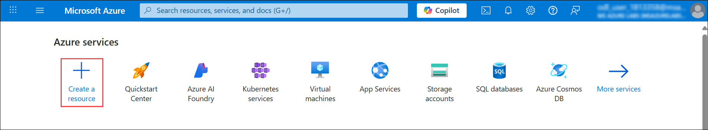
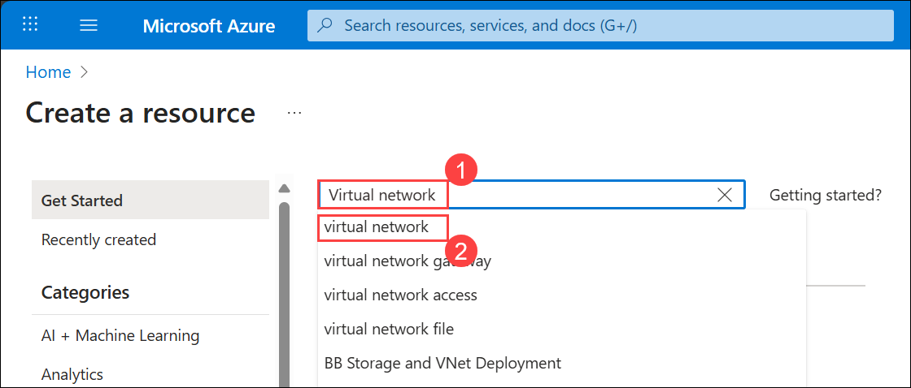
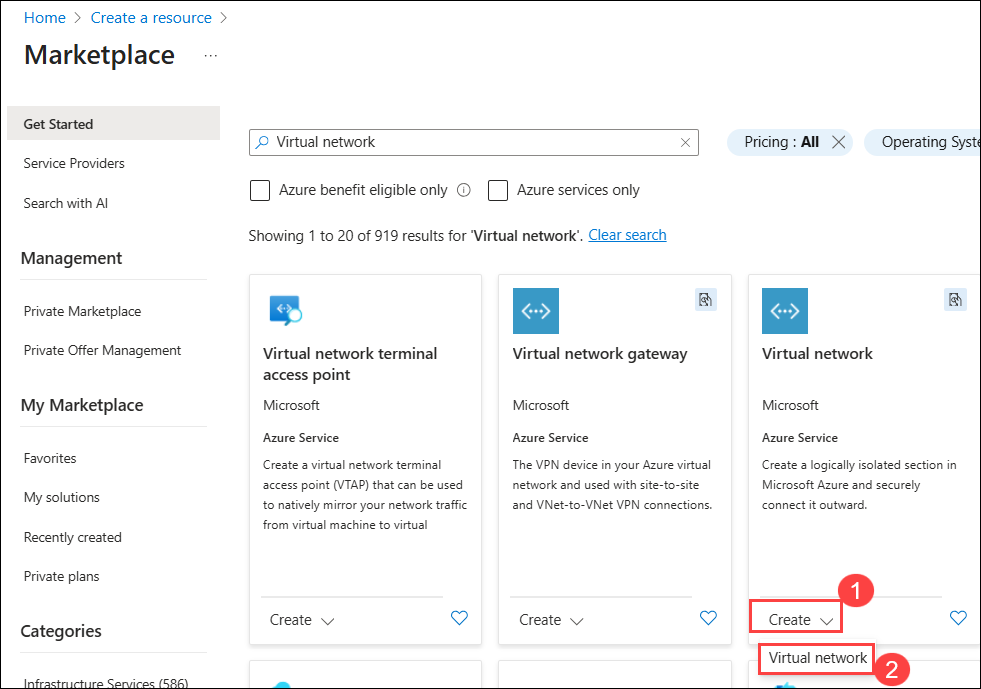
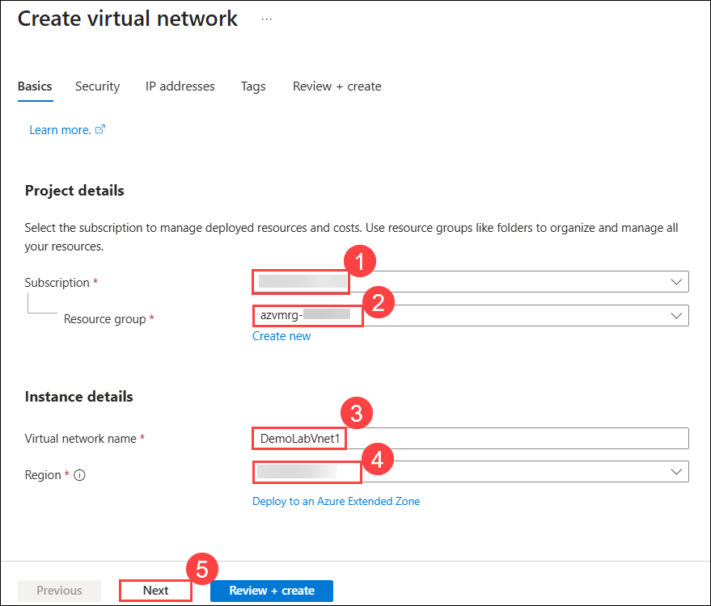
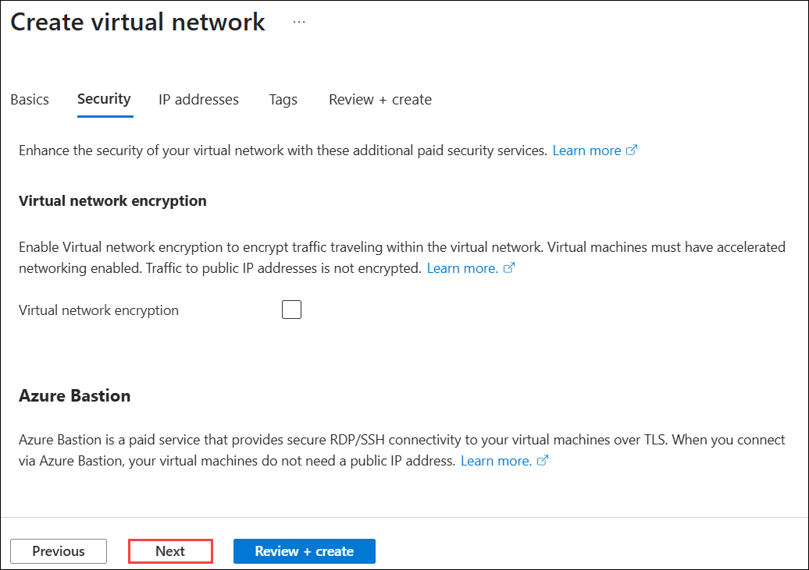
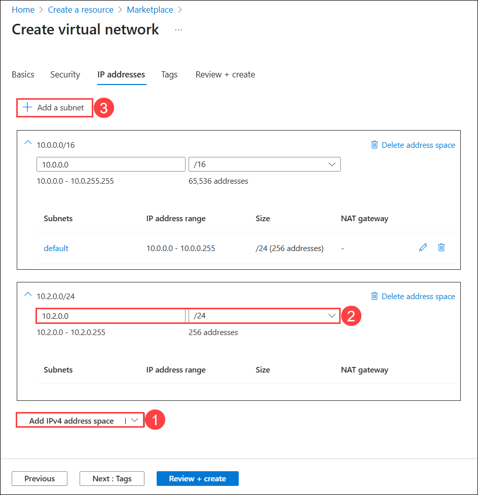
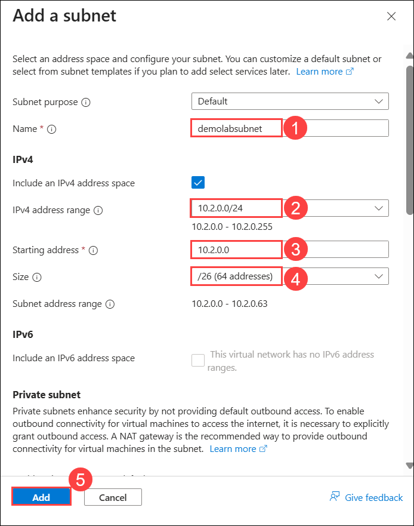
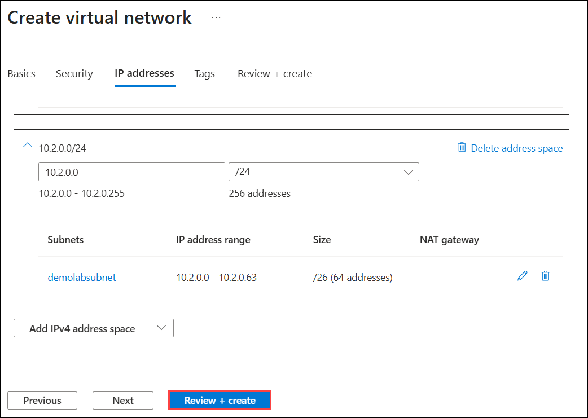
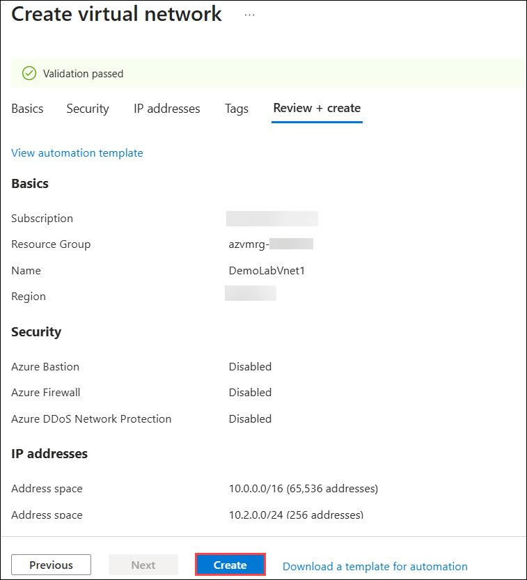
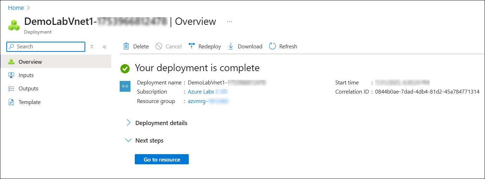

# Lab 01: Building a Virtual Network

## Estimated Duration: 30 Minutes

## Overview

In this lab, you will build and configure an Azure Virtual Network (VNet) to establish a secure and isolated networking environment for future application deployments. You will define custom IP address ranges, create a dedicated subnet, and configure network settings through the Azure portal. This VNet will provide the foundation for hosting virtual machines, application services, and other Azure resources, enabling controlled connectivity and ensuring alignment with organizational networking requirements.

## Lab Objective

You will be able to complete the following task:

- Task 1: Building a Virtual Network

## Task 1: Building a Virtual Network

In this task, you will create an Azure Virtual Network (VNet) in the Azure portal by configuring basic settings, defining IP address space, and creating a subnet to establish a secure, isolated environment for Azure services.

1. In the **Azure portal**, under **Azure services**, click on **+ Create a resource**.

    
    
2. In the search box, type **Virtual network (1)** and select **virtual network (2)** from the results to open it.

     
     
3. Under **Virtual network**, click the **Create (1)** dropdown and select **Virtual network (2)** from the list.

      
      
4. On the **Basics** tab of *Create virtual network* blade, provide the following information:
    
    -  Subscription: Keep the default **Subscription (1)**.
    
    -  Resource group: Select the existing resource group **azvmrg-<inject key="Deployment ID" enableCopy="false"/> (2)**
    
    -  Name: **DemoLabVnet1 (3)**
    
       > **Note:** If the portal advises the name is not unique, simply adjust the name. Once you create a unique name that is available, you will see a check mark at the end of the **Name** field.

    -  Region: Select **<inject key="Region" enableCopy="false"/>** **(4)**.

    -  Click on **Next (5)**.

       
    
5. On the **Security** tab, keep all options at their **default** settings, then click **Next**.

    

6. On the **IP addresses** tab, scroll down and click **Add IPv4 address space (1)**. In the second box, enter **10.2.0.0** and select **/24 for 256 addresses (2)** from the dropdown. Next, scroll up and click **+ Add a subnet (3)**.

    

7.  On **Add a subnet** tab, provide the following details: 

      - Name: Enter **demolabsubnet (1)**.

      - Include an IPv4 address range: **Keep the checkbox selected.**

      - IPv4 address range: Select **10.2.0.0/24 (2)** from the drop down
      
      - Starting address: Enter **10.2.0.0 (3)**
      
      - Size : Select **/26 (64 addresses) (4)** from the drop down.

      - Leave all remaining settings to their default values.
      
      - Click on **Add (5)**. 

        

8. From the bottom, click on **Review + create**.
     
    

9. Review the configuration carefully, and once verified, click on **Create** to deploy the virtual network.

    

10. Wait for the deployment to complete.

    

>**Congratulations** on completing the Task! Now, it's time to validate it. Here are the steps:
> - Hit the Validate button for the corresponding task. If you receive a success message, you have successfully validated the lab. 
> - If not, carefully read the error message and retry the step, following the instructions in the lab guide.
> - If you need any assistance, please contact us at cloudlabs-support@spektrasystems.com.  

<validation step="2c2d3a0e-0590-4a36-9c5f-20f1da567eab" />

## Summary

In this lab, you have completed the following:

- Built a Virtual Network.

## You have successfully completed the lab. Now, click on **Next >>** from the lower right corner to proceed on to the next lab.

