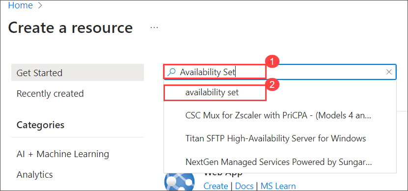
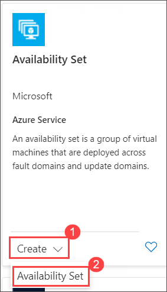
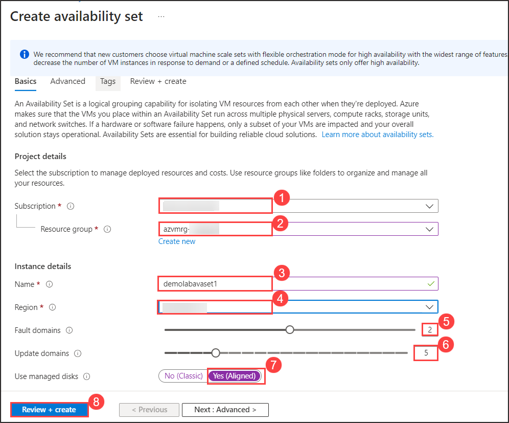
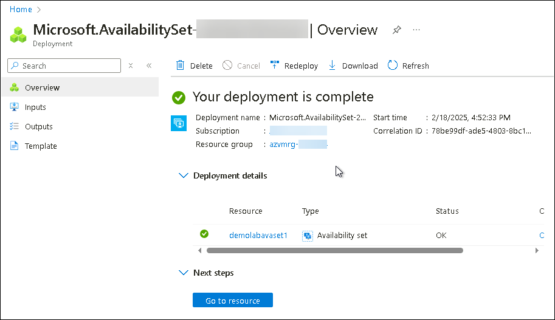

# Lab 02 - Create an Azure Availability Set

### Estimated Duration: 30 minutes

## Overview

An **Azure Availability Set** is a logical grouping of virtual machines (VMs) in Azure. When you create VMs within an **Availability Set**, the Azure platform distributes the placement of those VMs across the underlying infrastructure. During planned maintenance on the Azure platform, or in the event of an unexpected fault in the underlying hardware/infrastructure, **Availability Sets** ensure that at least one VM remains operational. To learn more about **Azure Availability Sets** [click here.](https://learn.microsoft.com/en-us/azure/virtual-machines/availability-set-overview)

### Create an Azure Availability Set

1. Click on the   menu icon at the upper left corner of the Azure portal.

2. Click on **+ Create a resource**

    
   
3. On the **New** blade, type <copy> **Availability Set(1)** </copy> in the _Search the Marketplace_ search window and select **Availability Set (2)**.

    
    
4. Select **Create (1)** drop down and then choose **Availability Set (2)** from the options.

     
    
5. On the **Basics** tab of **Create a availability set**, enter the following information:

      - For **Subscription** field **Accept default subscription (1)** 
      - In the **Resource group (2)** field, select the existing resource group named **azvmrg-<inject key="Deployment ID" enableCopy="false"/>** from the dropdown menu
      - On the **Instance details (3)** section, type <copy>**demolabavaset1**</copy> in the name field
      - In the **Region (4)** dropdown menu, select **<inject key="Region" enableCopy="false"/>**.
      - Verify that **Fault domains (5)** is set to **2**

         > **Note:** Virtual machines in the same **Fault domain** share a common power source and physical network switch.

      - Verify that **Update domains (6)** is set to **5**

         > **Note:**  Virtual machines in the same **Update Domain** will be restarted together during planned maintenance. Azure never restarts more than one **Update Domain** at a time.

      - Select **Yes (Aligned) (7)** under **Use managed disks** 

          > **Note:** Azure Managed Disks simplifies disk management for Azure IaaS VMs by managing the storage accounts associated with the VM disks. You only have to specify the type (Premium or Standard) and the size of disk you need, and Azure creates and manages the disk for you. [Learn more](https://docs.microsoft.com/en-us/azure/storage/storage-managed-disks-overview)

      - Click on **Review + create (8)** to review the configurations made.

        
     
14. Click on **Create** to deploy the Availability set.

    > **Note:** You can check the status of the deployment by clicking on the notification (Bell) icon at the top of the page.

       

15. Wait for the deployment to complete.

    

<validation step="c08da951-00f1-455e-8236-e18bace20c34" />

> **Congratulations** on completing the task! Now, it's time to validate it. Here are the steps:
> - If you receive a success message, you can proceed to the next task.
> - If not, carefully read the error message and retry the step, following the instructions in the lab guide. 
> - If you need any assistance, please contact us at cloudlabs-support@spektrasystems.com. We are available 24/7 to help you out.
    

## Summary 

In this hands-on lab, you created Azure availability set and configured Azure VMs for high availability and fault tolerance.

### You have successfully completed the lab
