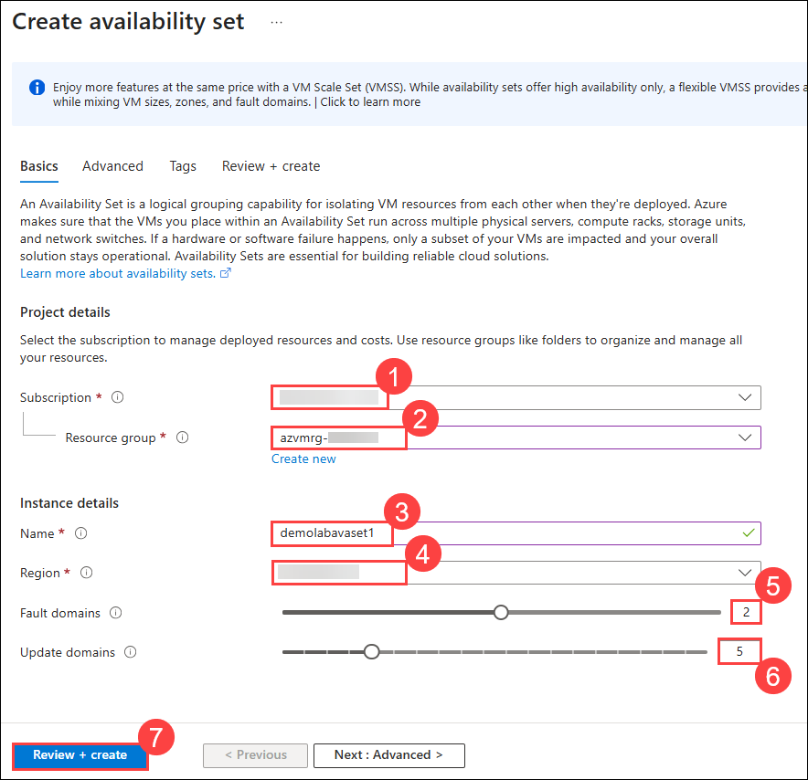
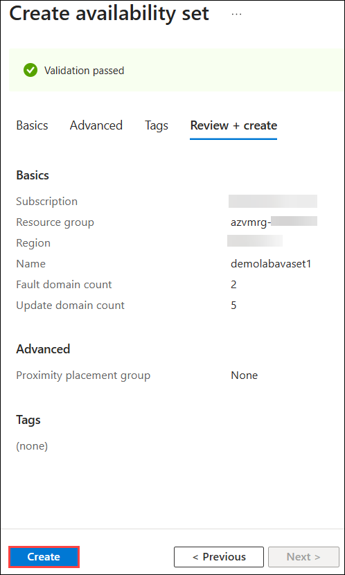

# Lab 02: Create an Azure Availability Set

### Estimated Duration: 30 Minutes

## Overview

In this lab, you will create and configure an Azure Availability Set to improve the resilience and uptime of critical workloads hosted on virtual machines. You will define fault domains and update domains to ensure that VMs are distributed across isolated hardware resources, minimizing the risk of simultaneous downtime during planned maintenance or unexpected failures. This setup provides fault tolerance, enhances high availability, and ensures that your organization’s applications remain operational under various infrastructure scenarios.

## Lab objective

You will be able to complete the following task:

- Task 1: Create an Azure Availability Set

## Task 1: Create an Azure Availability Set

In this task, you will create an Azure Availability Set to distribute VMs across multiple fault and update domains. This setup helps ensure high availability by minimizing downtime during maintenance or hardware failures.

1. Click on the **Hamburger menu (1)** at the upper left corner of the **Azure portal** and click on **+ Create a resource (2)**.

    
   
1. On the **Create a resource** blade, search for **Availability Set (1)** in the search bar and select **availability set (2)** from the results.

    
    
1. Under **Availability Set**, select **Create (1)** drop down and choose **Availability Set (2)** from the options.

     

1. Click on **Create** under **Availibility set** section to begin the setup. 

     
    
1. On the **Basics** tab of **Create availability set**, provide the following information:

      - **Subscription:** Keep the default **Subscription (1)**.

      - **Resource group:** Select the existing resource group **azvmrg-<inject key="Deployment ID" enableCopy="false"/>**  **(2)** from the drop-down menu.

      - **Name:** Enter **demolabavaset1 (3)**.

      - **Region:** Select **<inject key="Region" enableCopy="false"/>** **(4)**.

      - Verify that **Fault domains (5)** is set to **2**.

         > **Note:** Virtual machines in the same **Fault domain** share a common power source and physical network switch.

      - Verify that **Update domains (6)** is set to **5**.

         > **Note:**  Virtual machines in the same **Update Domain** will be restarted together during planned maintenance. Azure never restarts more than one **Update Domain** at a time.

      - Click on **Review + create (7)** to review the configurations made.

        
     
1. Click on **Create** from bottom-left corner to deploy the **Availability set**.

     

      >**Note:** You can check the status of the deployment by clicking on the notification (Bell) icon at the top of the page.

1. Wait for the deployment to complete.

    

>**Congratulations** on completing the Task! Now, it's time to validate it. Here are the steps:
> - Hit the Validate button for the corresponding task. If you receive a success message, you have successfully validated the lab. 
> - If not, carefully read the error message and retry the step, following the instructions in the lab guide.
> - If you need any assistance, please contact us at cloudlabs-support@spektrasystems.com. 

<validation step="c08da951-00f1-455e-8236-e18bace20c34" />

## Summary

In this lab, you have completed the following:

- Created an Azure Availability Set.

### You have successfully completed the lab. Now, click on **Next >>** from the lower right corner to proceed on to the next lab.

