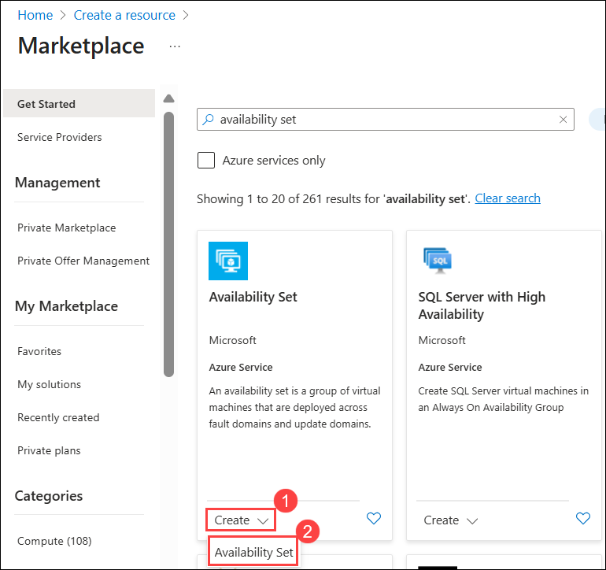
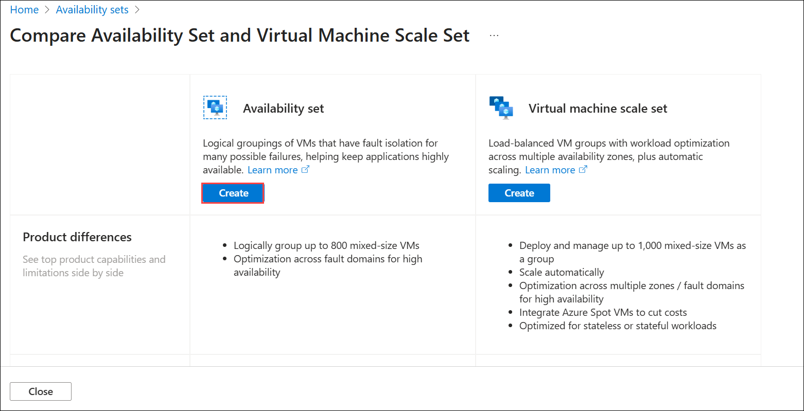
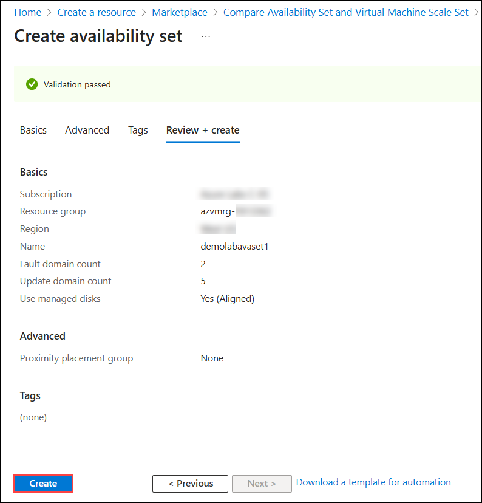

# Lab 02 - Create an Azure Availability Set

### Estimated Duration: 30 Minutes

## Lab Scenario

You are a Cloud Administrator for Contoso Ltd., tasked with improving the resilience and uptime of critical applications hosted on Azure virtual machines. To ensure these workloads remain operational during planned maintenance or unexpected hardware failures, you will implement an Azure Availability Set. In this lab, you will create and configure an availability set with defined fault domains and update domains, ensuring that virtual machines are distributed across isolated hardware resources. This setup will provide fault tolerance and help meet your organization’s high-availability requirements.

An **Azure Availability Set** is a logical grouping of virtual machines (VMs) in Azure. When you create VMs within an **Availability Set**, the Azure platform distributes the placement of those VMs across the underlying infrastructure. During planned maintenance on the Azure platform, or in the event of an unexpected fault in the underlying hardware/infrastructure, **Availability Sets** ensure that at least one VM remains operational. To learn more about **Azure Availability Sets** [click here.](https://learn.microsoft.com/en-us/azure/virtual-machines/availability-set-overview)

### Objectives

In this lab you will complete the following task:

- Task 1: Create an Azure Availability Set

### Task 1: Create an Azure Availability Set

In this task, you will create an Azure Availability Set to distribute VMs across multiple fault and update domains. This setup helps ensure high availability by minimizing downtime during maintenance or hardware failures.

1. Click on the **Hamburger menu (1)** at the upper left corner of the Azure portal and click on **+ Create a resource (2)**.

    
   
1. On the **Create a resource** blade, type <copy> **Availability Set (1)** </copy> in the _Search the Marketplace_ search window and select **availability set (2)**.

    
    
1. Select **Create (1)** drop down and then choose **Availability Set (2)** from the options.

     

1. Select **Create** under Availibility Set. 

     
    
1. On the **Basics** tab of **Create a availability set**, enter the following information:

      - For **Subscription** field **Accept default subscription (1)** 
      - In the **Resource group (2)** field, select the existing resource group named **azvmrg-<inject key="Deployment ID" enableCopy="false"/>** from the dropdown menu.
      - On the **Instance details** section, type <copy>**demolabavaset1 (3)**</copy> in the Name field.
      - In the **Region (4)** dropdown menu, select **<inject key="Region" enableCopy="false"/>**
      - Verify that **Fault domains (5)** is set to **2**.

         > **Note:** Virtual machines in the same **Fault domain** share a common power source and physical network switch.

      - Verify that **Update domains (6)** is set to **5**.

         > **Note:**  Virtual machines in the same **Update Domain** will be restarted together during planned maintenance. Azure never restarts more than one **Update Domain** at a time.

      - Select **Yes (Aligned) (7)** under **Use managed disks**. 

          > **Note:** Azure Managed Disks simplifies disk management for Azure IaaS VMs by managing the storage accounts associated with the VM disks. You only have to specify the type (Premium or Standard) and the size of disk you need, and Azure creates and manages the disk for you. [Learn more](https://docs.microsoft.com/en-us/azure/storage/storage-managed-disks-overview)

      - Click on **Review + create (8)** to review the configurations made.

        
     
1. Click on **Create** to deploy the Availability set.

    > **Note:** You can check the status of the deployment by clicking on the notification (Bell) icon at the top of the page.

       

1. Wait for the deployment to complete.

    

> **Congratulations** on completing the task! Now, it's time to validate it. Here are the steps:
> - Hit the Validate button for the corresponding task. If you receive a success message, you can proceed to the next task.
> - If not, carefully read the error message and retry the step, following the instructions in the lab guide. 
> - If you need any assistance, please contact us at cloudlabs-support@spektrasystems.com. We are available 24/7 to help you out.    

<validation step="c08da951-00f1-455e-8236-e18bace20c34" />

    
## Summary 

In this hands-on lab, you created an Azure availability set and configured Azure VMs for high availability and fault tolerance.

### Click on **Next** from the page navigation bar at the end of the lab guide page to proceed to the next page

   
