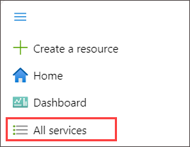
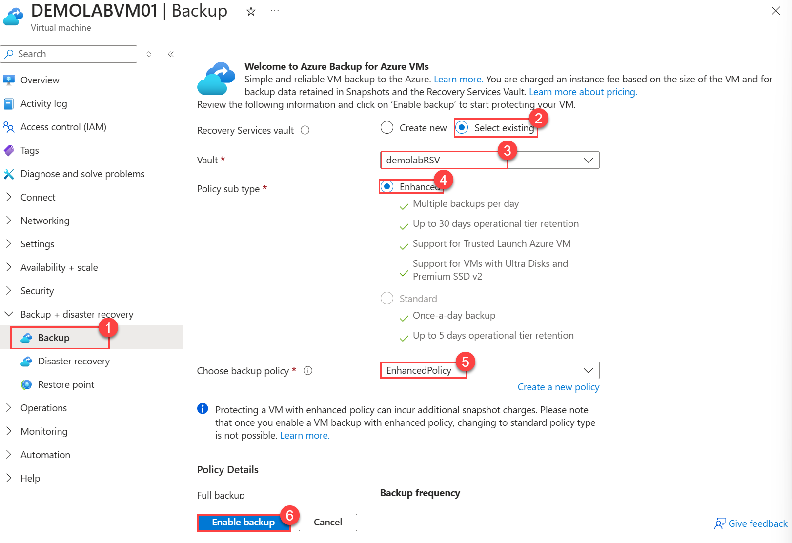

## **Scenario 4 - Backup and Recovery**
A virtual machine is protected by a locally redundant storage account, which means that it is replicated and only accessible to Microsoft in the event of a datacenter outage. In this lab, we will configure a separate backup of the VM that will be user-accessible for recovery.

This lab uses the **Azure Backup Recovery Services Vault** to back up the virtual machine with the configured policy, and will be charged as per-backup pricing. A Recovery Services vault is a logical container that stores the backup data for each protected resource, such as Azure VMs. When you enable a **Virtual Machine Backup** and the backup job for a protected resource runs, it creates a recovery point inside the Recovery Services vault. You can then use one of these recovery points to restore data to a given point in time.

 To learn more about **Azure Backup Recovery Services Vault** follow the link. [Learn more](https://docs.microsoft.com/en-us/azure/backup/backup-azure-arm-vms). 

#### **Create a Recovery Services vault**

 1. Click on the  menu icon at the upper left corner of the Azure portal.
 
 2. Then click on **All Services**.

    
 
 4. On the **All Services** blade, search for <copy> **Recovery (1)** </copy> and select **Recovery Services vaults (2)**.

     
    
 5. On the **Recovery Services vaults** blade, click **+ Create**.

    
 
 6. In the Create Recovery Services vault blade:
 
     - For Subscription field **Accept default subscription (1)**.
 
     - Select the existing resource group named **azvmrg-<inject key="Deployment ID" enableCopy="false"/> (2)** from the dropdown menu
 
     - Provide the Vault name as <copy>**demolabRSV**</copy> **(3)**
 
     - **Region:** Select **<inject key="Region" enableCopy="false"/>** **(4)**
 
     - Click on **Review + Create (5)**.
  
     

7. Then Click **Create**.

8. While the RSV deploys, click **All resources** in the **Favorites** menu.

#### **Enable Virtual Machine Backup**

8. On the **All resources** blade and Select **DEMOLABVM01**.

   

10. In the left pane under **Backup + disaster recovery**, click on **Backup**(1). On the **DEMOLABVM01-Backup** blade then under the **Recovery services vault** blade:

    - on the right side **Select existing (2)** radio button .

    - select <copy>**demolabRSV**</copy> **(3)**.
   
    - Select **Enhanced (4)** for **Policy sub type**.

    - Choose the **EnhancedPolicy (5)** from **Choose backup policy** dropdown menu.
    
    - Click on **Enable Backup (6)**.
   
      

    > **Note:** You can check the status of the **Backup Recovery Services Vault** deployment by clicking on the notification icon. 
    
This completes this scenario. Click **Next** to go to the next scenario.
