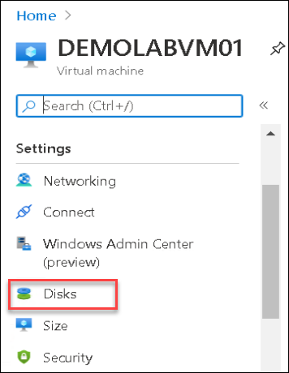
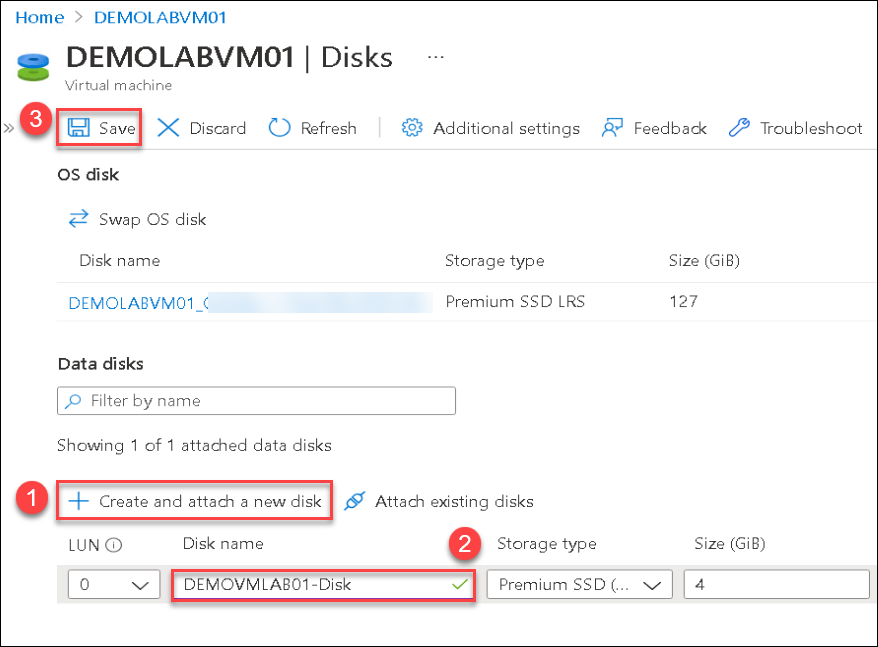
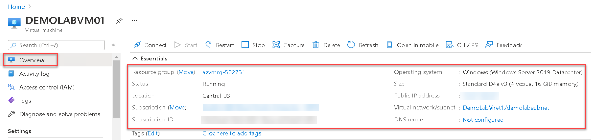
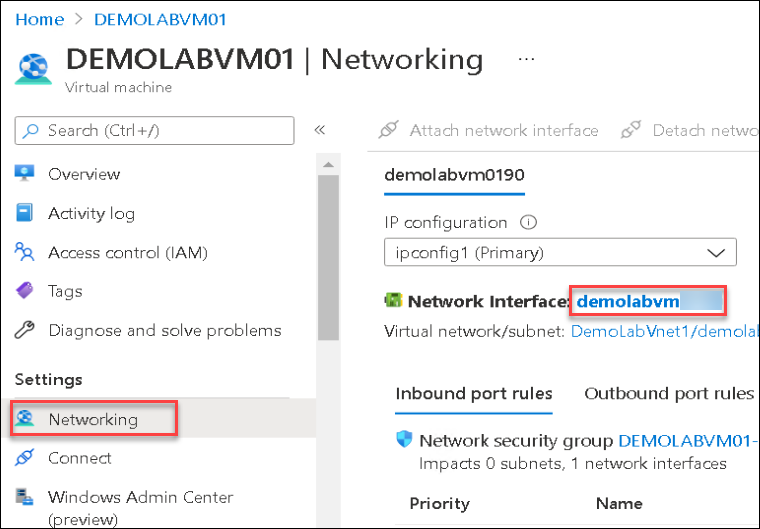
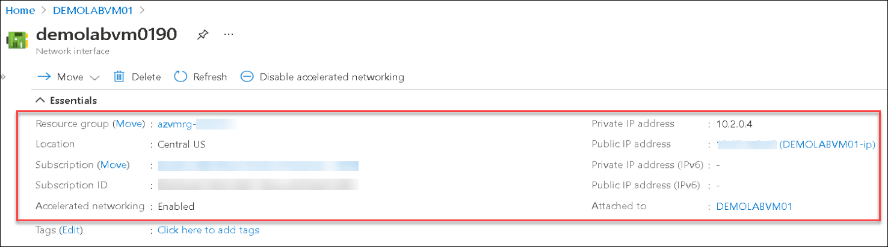

## **Scenario 5 - Virtual Machine Data Disk and Overview**
In this scenario, you will attach a data disk to the VM you just created and review the information available on the virtual machine and virtual network you just created. 

#### **Attach a data disk**
Data disks should be used in any situation where permanent data storage is needed. Data disks work with the operating system and temporary disks created with an Azure VM providing additional disk capacity for persistent storage of data. An Azure managed data disk is a virtual hard disk (VHD). You can think of it like a physical disk in an on-premises server except it is virtualized. Azure managed disks are stored as page blobs, which are a random IO storage object in Azure. A managed disk is an abstraction over page blobs, blob containers, and Azure storage accounts. With managed disks, all you have to do is provision the disk, and Azure takes care of the rest. 

1. From the All resources blade select the virtual machine **DEMOLABVM01**.

2. In the left pane of **DEMOLABVM01** under **Settings**, click on **Disks**.

   

3. On the **DEMOLABVM01-Disks** blade under the **Data disks** section:
 
    - select **+ Create and attack a new disk**(1).

    - Under the **Data disk name**, provide the name as <strong><copy>**DEMOVMLAB01-Disk**</copy></strong>(2) and leave other options as default.
    
    - click **Save**(3) to add the new managed disk

   

    > **Note:** You can create managed disks from a snapshot of an existing disk, a blob in a storage account, or create a new, empty disk.

#### **Virtual Machine - Overview**
Azure Virtual Machines (VM) is one of several types of on-demand, scalable computing resources that Azure offers. Typically, you choose a VM when you need more control over the computing environment than the other choices offer.

4. On the **All resources** blade, click **DEMOLABVM01**

5. On the **DEMOLABVM01** blade in the right pane, note that you can view the following information about the VM:

    - Resource group
    - Status
    - Location
    - Subscription
    - Subscription ID
    - Computer name
    - Operating system
    - Size
    - Public IP address (if assigned)
    - Virtual network/subnet
    - DNS name (if assigned)

    
   
    > **Note:** In the Overview section make sure that the status of virtual machine is Running.

#### **Network Interface - Overview**
An Azure VM must be a member of an Azure Virtual Network which enables many types of Azure resources, to securely communicate with each other, the internet, and on-premises networks. 

6. In the left pane of the **DEMOLABVM01** blade, click **Networking** under **Settings**. On the **DEMOLABVM01 - Networking** blade, click the Network Interface name beginning with **demolabvm** in the top pane.

    

7. On the **Network interface** blade, note that you can view the following information about the network interface:

    - Resource group
    - Location
    - Subscription name
    - Subscription ID
    - Private IP address
    - Virtual network/subnet
    - Public IP address (if assigned)
    - Network security group (if assigned)
    - VM attached to

    

This completes this scenario. Click **Next** to go to the next scenario.
