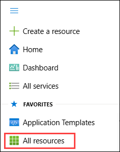
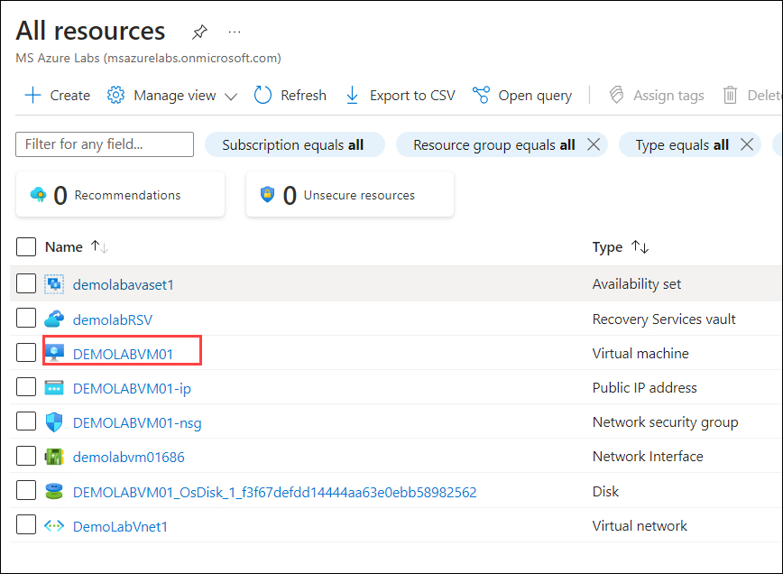
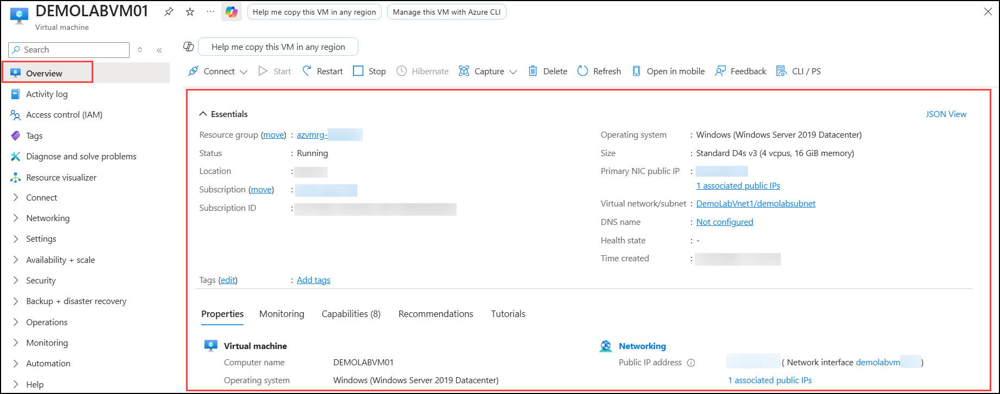
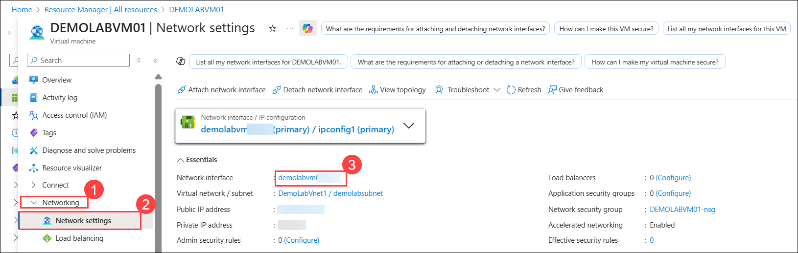
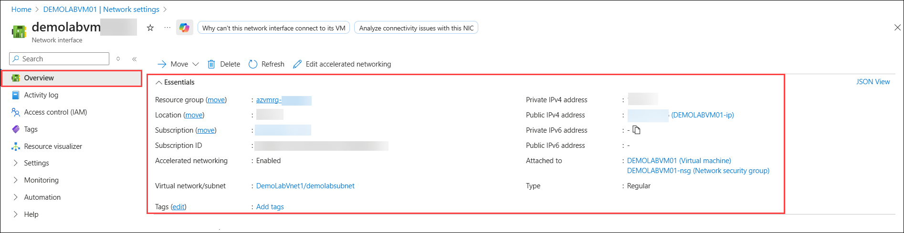

# Lab 05: Virtual Machine Data Disk and Overview

## Estimated Duration: 30 Minutes

## Overview

In this lab, you will enhance an Azure virtual machine by attaching a managed data disk to provide additional persistent storage for application workloads. You will then review the Virtual Machine Overview to verify key configuration details such as status, location, and IP settings, and examine the Network Interface Overview to confirm connectivity and security group associations. This setup ensures durable storage, optimized resource management, and clear visibility into the VM’s configuration and network integration.

## Lab objectives

You will be able to complete the following tasks:

- Task 1: Attach a data disk
- Task 2: Virtual Machine - Overview
- Task 3: Network Interface - Overview

## Task 1: Attach a data disk

In this task, you will attach a managed data disk to an existing virtual machine. This provides additional persistent storage for your workloads, separate from the OS disk, ensuring data remains available even if the VM is redeployed.

Data disks should be used in any situation where permanent data storage is needed. Data disks work with the operating system, and temporary disks created with an Azure VM provide additional disk capacity for persistent storage of data. An Azure managed data disk is a virtual hard disk (VHD). You can think of it like a physical disk in an on-premises server, except it is virtualized. Azure managed disks are stored as page blobs, which are random IO storage objects in Azure. A managed disk is an abstraction over page blobs, blob containers, and Azure storage accounts. With managed disks, all you have to do is provision the disk, and Azure takes care of the rest.

1. Click on the **Hamburger menu (1)** at the upper left corner of the **Azure portal**, then select **All resources (2)** under **Favorites**.

    

1. From **All resources**, select the virtual machine **DEMOLABVM01**.

    

1. From the left navigation pane, expand **Settings (1)** and select **Disks (2)**. Under the **Data disks** section, perform the following steps.
 
    - Select **+ Create and attach a new disk (3)**.

    - Under the **Disk name**, provide the name as <strong><copy>**DEMOVMLAB01-Disk**</copy></strong> **(4)** and leave other options as default.
    
    - Click **Apply (5)**  to add the new managed disk.

      

      > **Note:** You can create managed disks from a snapshot of an existing disk, a blob in a storage account, or create a new, empty disk.
      
> **Congratulations** on completing the task! Now, it's time to validate it. Here are the steps:
> - Hit the Validate button for the corresponding task. If you receive a success message, you can proceed to the next task.
> - If not, carefully read the error message and retry the step, following the instructions in the lab guide. 
> - If you need any assistance, please contact us at cloudlabs-support@spektrasystems.com. We are available 24/7 to help you out.        

<validation step="9041be99-07c1-4c7d-bd75-39f3eedf30d4" />

## Task 2: Virtual Machine - Overview

In this task, you will explore the Overview section of a virtual machine in Azure. This view provides key details such as resource group, status, location, IP address, and network configuration, helping you quickly assess the VM’s setup and state.

Azure Virtual Machines (VMs) are one of several types of on-demand, scalable computing resources that Azure offers. Typically, you choose a VM when you need more control over the computing environment than the other choices offer.

1. Click on the **Hamburger menu (1)** at the upper left corner of the **Azure portal**, then select **All resources (2)** under **Favorites**.

    

1. From **All resources**, select the virtual machine **DEMOLABVM01**.

    

2. On the **DEMOLABVM01** blade in the right pane, go to the **Overview** section and note that you can view the following information about the VM:

   - Resource group
   - Status
   - Location
   - Subscription
   - Subscription ID
   - Computer name
   - Operating system
   - Size
   - Public IP address (if assigned)
   - Virtual network/subnet
   - DNS name (if assigned)

      
   
      > **Note:** In the Overview section, make sure that the status of the virtual machine is Running.

## Task 3: Network Interface - Overview

In this task, you will review the Overview section of a virtual machine’s network interface. This provides key networking details such as IP addresses, virtual network, subnet, and associated security groups, helping you understand the VM’s connectivity and security configuration.

An Azure VM must be a member of an Azure Virtual Network, which enables many types of Azure resources to securely communicate with each other, the internet, and on-premises networks. 

1. From the left navigation pane, expand **Networking (1)** and select **Network settings (2)**. Under **Essentials**, click the **Network Interface** name starting with **demolabvm(3)**.

    

1. On the **Network interface** blade, go to the **Overview** section and note that you can view the following information about the network interface:

    - Resource group
    - Location
    - Subscription name
    - Subscription ID
    - Private IP address
    - Virtual network/subnet
    - Public IP address (if assigned)
    - Network security group (if assigned)
    - VM attached to

        

## Summary

In this lab, you have completed the following:

- Attached a data disk.

- Explored the Virtual Machine overview.

- Reviewed the Network Interface overview.

## You have successfully completed the lab. Now, click on **Next >>** from the lower right corner to proceed on to the next lab.

