# Lab 06: Connect to the VM and Install IIS

### Estimated Duration: 45 Minutes

## Overview

You are a Cloud Administrator for Contoso Ltd., responsible for deploying and configuring application hosting environments in Azure. One of your newly created Windows virtual machines must be set up as a basic web server to host internal and external applications. In this lab, you will update the Network Security Group to allow HTTP traffic on port 80, prepare Azure Cloud Shell for PowerShell access, and connect to the VM via Remote Desktop Protocol (RDP). Once connected, you will install Internet Information Services (IIS), verify that the default website is accessible, and deploy a custom HTML page displaying the VM name. This configuration will enable Contoso to serve web content reliably from the Azure-hosted VM. 

## Lab Objectives

You will be able to complete the following tasks:

- Task 1: Update Inbound security rules
- Task 2: Prepare Azure Cloud Shell
- Task 3: Connect to the VM
- Task 4: Verify Internet Information Services
- Task 5: Load a web page and monitor the VM

## Task 1: Update Inbound security rules

In this task, you will create a Inbound security rule that enables HTTP traffic (port 80) from the internet, allowing Azure Cloud Shell or any web client to connect to the VM over port 80.

 1. On the **Network interface blade**, click on **DEMOLABVM01-nsg** Network security group.
 
    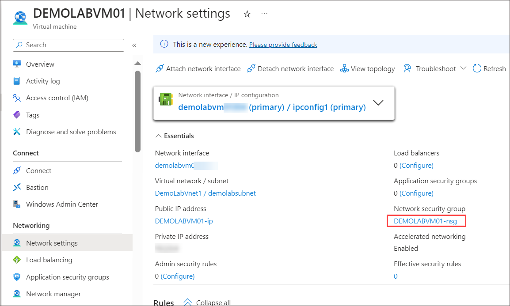
    
    >**Note:** If you are unable to see Network Security Group in Overview, click on **See more**.
 
 2. From the left navigation pane, expand **Settings (1)** and select **Inbound security rules (2)**. Click **+ Add (3)** from the top menu bar.

    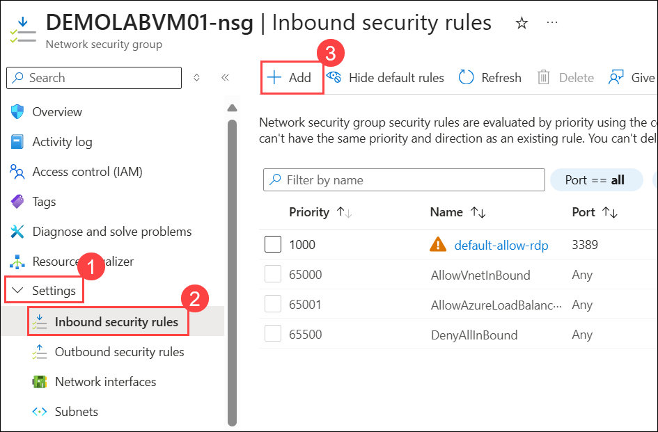
 
 3. On the **Add inbound security rule** blade, enter the required details and leave all other fields at their default values.
 
     - **Destination port ranges:** Set **80 (1)**.
 
     - **Name:** Enter **demolabrule (2)**.
 
     - Click **Add (3)**

       

> **Congratulations** on completing the task! Now, it's time to validate it. Here are the steps:
> - Hit the Validate button for the corresponding task. If you receive a success message, you can proceed to the next task.
> - If not, carefully read the error message and retry the step, following the instructions in the lab guide. 
> - If you need any assistance, please contact us at cloudlabs-support@spektrasystems.com. We are available 24/7 to help you out.    

<validation step="ac29a4b2-b781-47ed-b706-536023ac7b14" />

## Task 2: Prepare Azure Cloud Shell

In this task, you will set up Azure Cloud Shell for the first time by creating and mounting a storage account and file share. This ensures your scripts and files are saved for future Cloud Shell sessions.

1. In the **Home** of Azure Portal, click on **Virtual machines**.
 
     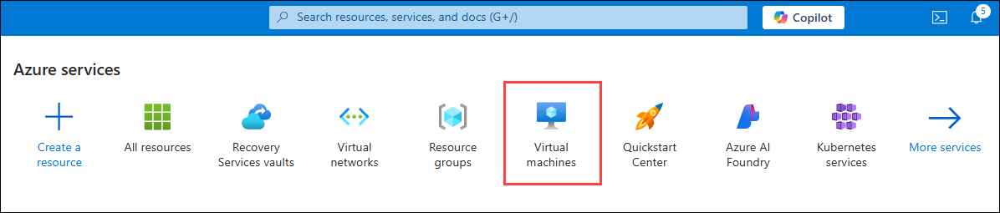

1. On the **Virtual machines** blade, click on **DEMOLABVM01** virtual machine.

     
 
 1. In the **DEMOLABVM01** virtual machine pane, verify that the status of the VM is **Running (1)**. If the status is still creating, wait until the status changes to Running before completing the remaining steps.  In the **blue ribbon** at the top, click on the **Cloud Shell icon (2)**.

    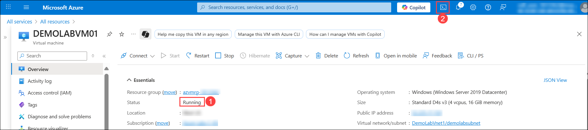

    > **Note:** If you are not able to find the Cloud Shell icon, from the top navigation bar, click on the More portal tools icon  and select Cloud shell.

1. On the **Welcome to Azure Cloud Shell** blade, click on **PowerShell**.

   

1. On the **Getting Started** panel, select **Mount storage account (1)** then select the **Storage account subscription (2)** and click **Apply (3)**.

    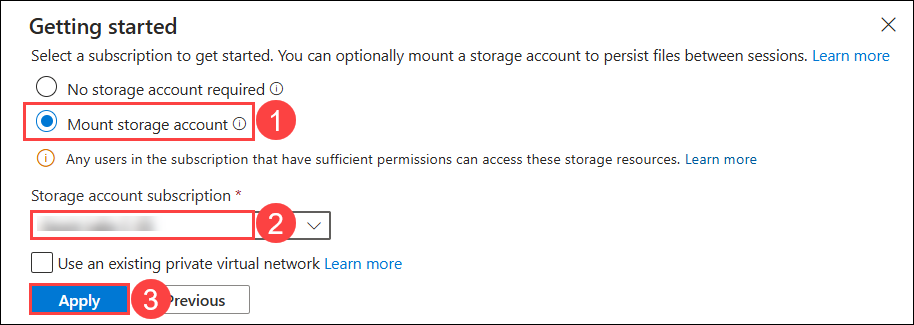

    > **Note:** Azure Cloud Shell requires a file share to be mounted to your resource group to persist files used during the session. After initial use, this fileshare will be available for future Cloud shell session.

1. On the **Mount Storage Account** panel, Select **I want to create a storage account (1)** and click **Next (2)**.

     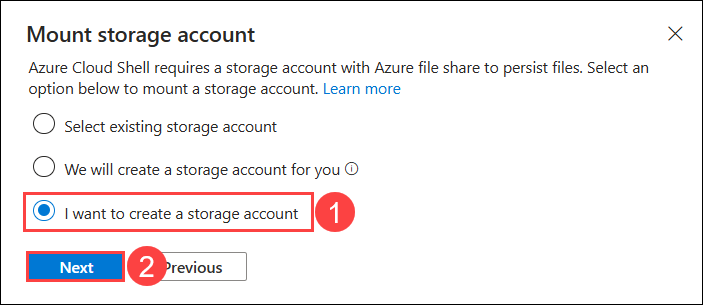

1. On the **Create storage account** panel, follow the steps below:
   
    - **Subsciption:** Select available **Subscription (1)**.
   
    - **Resource group:** Select the resource group **azvmrg-<inject key="Deployment ID" enableCopy="false"/>** **(2)**.

    - **Region:** Select **West US** **(3)** from the drop-down.

    - **Storage account name:** Enter the name **demolabstorage<inject key="Deployment ID" enableCopy="false"/>** **(4)**.
    
    - **File share:** Enter <copy>**demolab**</copy> **(5)**.
      
    - Click **Create (6)**. 

      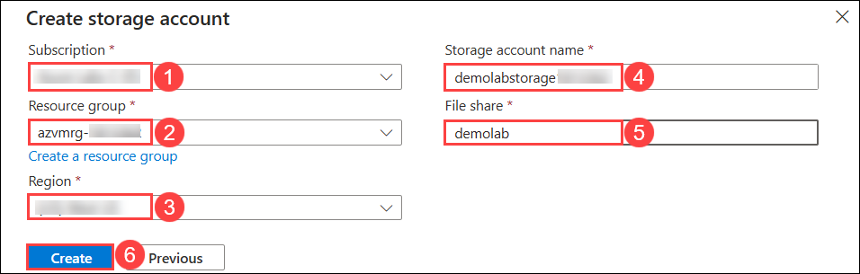

1. Wait for the storage account to finish provisioning. This may take around 2–3 minutes. You can proceed to the next step only after it is ready.      

     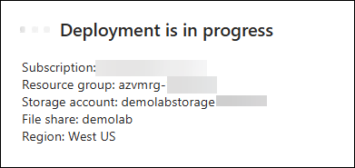

1. Run the following command in Cloudshell to check the status of the created VM.

    ```
    Get-AzVM -Name "DEMOLABVM01"
    ```

    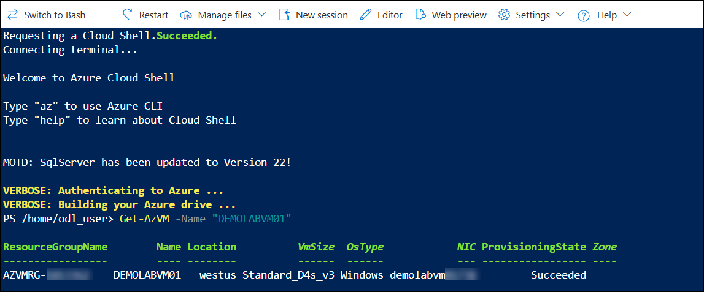    

    >**Note:** After running the command to check the status of created VM, please minimize the **Azure Cloud Shell window**.

## Task 3: Connect to the VM

In this task, **within the JumpVM**, you will connect to the VM using Remote Desktop, log in with the provided credentials, and use PowerShell to install the Web-Server feature. This prepares the VM to host and serve web pages.

1. Go to **azvmrg-<inject key="Deployment ID" enableCopy="false"/>** Resource group and select **DEMOLABVM01** virtual machine.

1. From the **DEMOLABVM01** overview page copy the **Public IP address** of the virtual machine.

    

1. To launch the **VM** using a remote desktop connection follow the below instructions:  

    - On your **Jump-VM**, click on **start (1)** and search for **Remote desktop (2)**. Then click on **Remote Desktop Connection (3)**.

      

    - On the Remote desktop connection window paste the **Public IP address (1)** of the virtual machine we copied in *Step 2* and click on **Connect (2)**.

      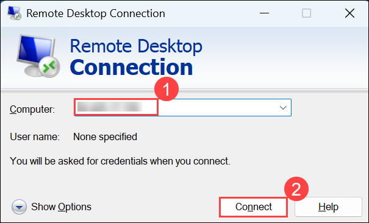

    - Enter the following credentials and click on **OK (3)** to log in to the RDP session.

      - Username: **demouser** **(1)**
      - Password: **Password.1!!** **(2)**

        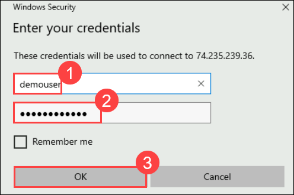    

    - Click **Yes** on pop-up.

      

1. While in the RDP session, close any pop-up windows that appear.

    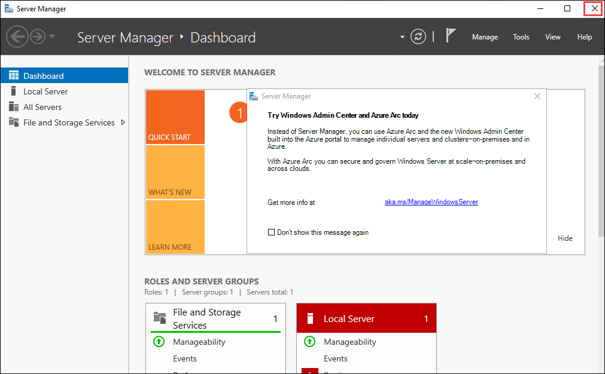

1. Click on **Start (1)** and type **Windows PowerShell (2)** and select **Windows PowerShell (3)** and choose **Run as a administrator (4)**.

    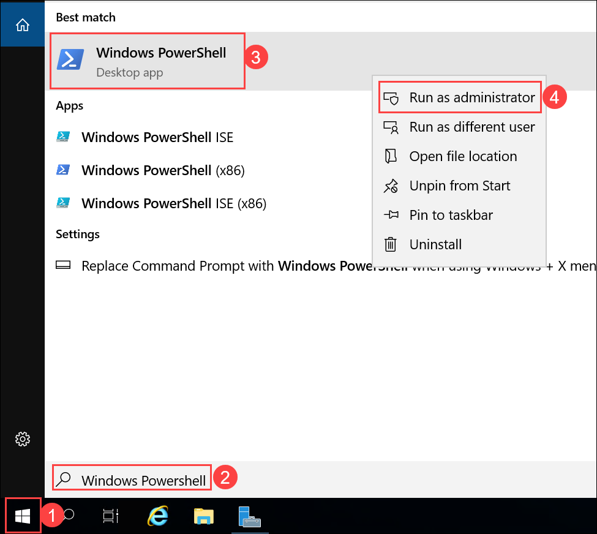

1. Run the following commands in Powershell.

     ```
     Install-WindowsFeature -Name Web-Server
     ```

     > **Note:** You have just invoked a PowerShell command to enable the Web-Server feature on the new VM that you just created. Now you will verify the web server is active and install a simple web page.
    
     > 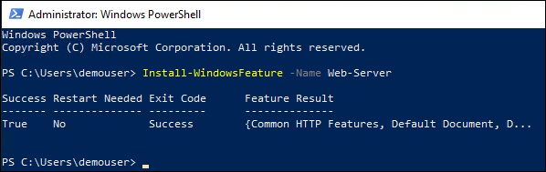

## Task 4: Verify Internet Information Services

In this task, you will verify that IIS is running on the VM by opening a browser in the connected session, entering the VM’s public IP address, and confirming the IIS Welcome Screen appears.

1. On the `DEMOLABVM01` virtual machine, open **Microsoft Edge** from the desktop.

    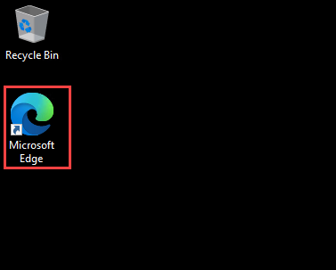

1. In the **address bar**, paste the **Public IP address (1)** of `DEMOLABVM01` that you have copied in `Task 3` and press **Enter**. The **Windows Server Internet Information Services Welcome Screen (2)** should appear.

    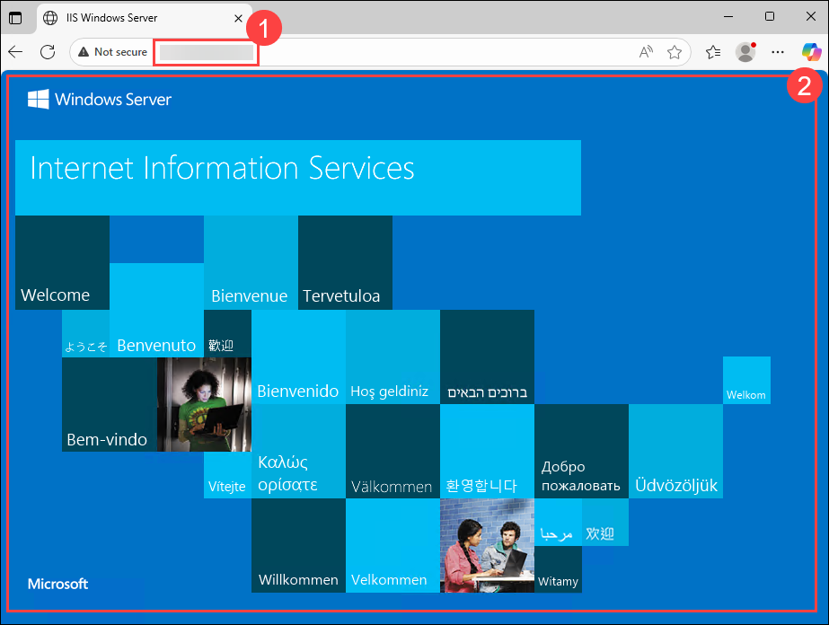

## Task 5: Load a web page and monitor the VM

In this task, you will replace the IIS default page with a custom HTML page displaying a “Congratulations” message and your VM name, then refresh the browser to confirm the change.

1. Run the following commands in Powershell.

    ```
    Set-Content -Path "C:\\inetpub\\wwwroot\\Default.htm" -Value "<html><body><h2>Congratulations!</h2><p>You have just created a basic website on $($env:computername).</p></body></html>"
    ```
   
    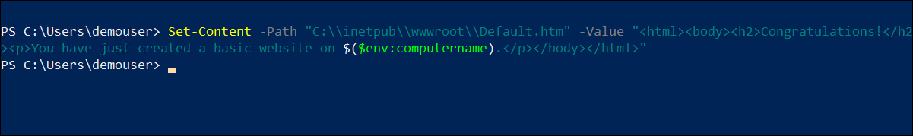

1. After the script completes, return to the **IIS Welcome screen browser tab** and **refresh the screen**.

     >**Note:** In case if you are unable to see the **Congratulations** message, open a new tab and paste the **public IP address** and press **Enter**.

1. You should now see a **Congratulations** message that includes your VM name **DEMOLABVM01**.

    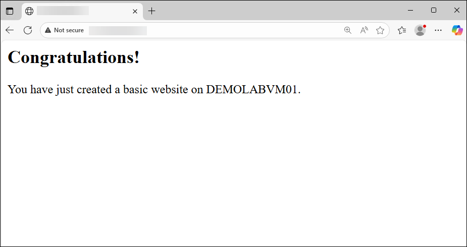

1. Minimize the **RDP** session, navigate back to the your **Lab VM**.    

    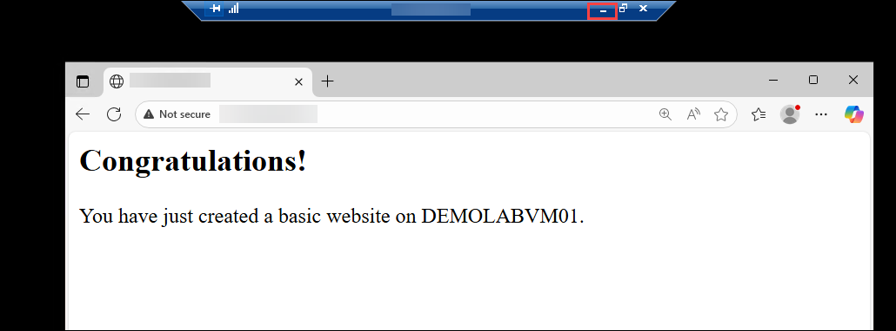

## Summary

In this lab, you have completed the following:

- Updated Inbound security rules.

- Prepared Azure Cloud Shell.

- Connected to the VM.

- Verified Internet Information Services.

- Loaded a web page and monitored the VM.

### You have successfully completed the lab. Now, click on **Next >>** from the lower right corner to proceed on to the next lab.


