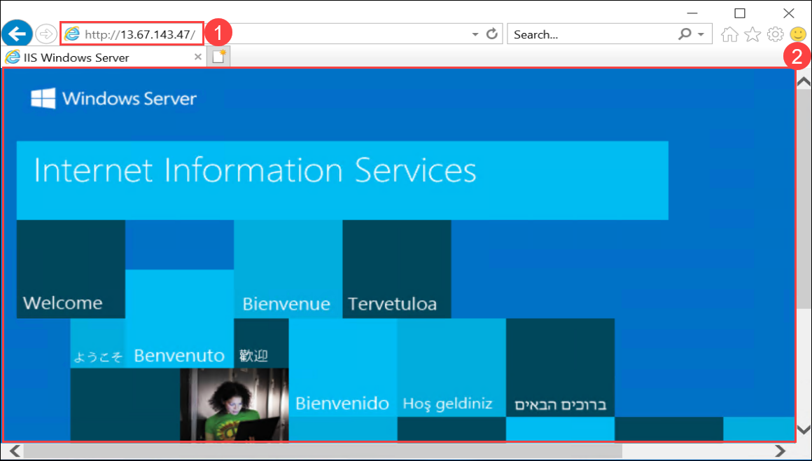

# Lab 06 - Connect to the VM and Install IIS

### Estimated Duration: 45 Minutes

## Lab Scenario

You are a Cloud Administrator for Contoso Ltd., responsible for deploying and configuring application hosting environments in Azure. One of your newly created Windows virtual machines must be set up as a basic web server to host internal and external applications. In this lab, you will update the Network Security Group to allow HTTP traffic on port 80, prepare Azure Cloud Shell for PowerShell access, and connect to the VM via Remote Desktop Protocol (RDP). Once connected, you will install Internet Information Services (IIS), verify that the default website is accessible, and deploy a custom HTML page displaying the VM name. This configuration will enable Contoso to serve web content reliably from the Azure-hosted VM. 

### Objectives

In this lab you will complete the following task:

- Task 1: Update Inbound security rules
- Task 2: Prepare Azure Cloud Shell
- Task 3: Connect to the VM
- Task 4: Verify Internet Information Services
- Task 5: Load a web page and monitor the VM


### Task 1: Update Inbound security rules

In this task, you will create a Inbound security rule that enables HTTP traffic (port 80) from the internet, allowing Azure Cloud Shell or any web client to connect to the VM over port 80.

 1. On the **Network interface blade**, click on **DEMOLABVM01-nsg** Network security group.
 
    
    
    >**Note:** If you are unable to see Network Security Group in Overview, click on **See more**.
 
 2. In the **DEMOLABVM01-nsg** blade, click on the **Inbound security rule (1)** under **Settings**. On **DEMOLABVM01-nsg-Inbound security rules** blade, click **+ Add (2)**.

    
 
 3. On the **Add inbound security rule** blade, provide the following details and leave the rest fields as defaults:
 
     - Set **Destination port ranges** as **80 (1)**.
 
     - In the **Name** field type <copy>**demolabrule (2)**</copy>.
 
     - Click **Add (3)**

       

### Task 2: Prepare Azure Cloud Shell

In this task, you will set up Azure Cloud Shell for the first time by creating and mounting a storage account and file share. This ensures your scripts and files are saved for future Cloud Shell sessions.

 1. In the **Home** of Azure Portal, click on **Virtual machines**.
 
 1. On the **Virtual machines** blade, click on **DEMOLABVM01** virtual machine.

     
 
 1. In the **DEMOLABVM01** virtual machine pane, verify that the status of the VM is **Running (1)**. If the status is still creating, wait until the status changes to Running before completing the remaining steps.  In the **blue ribbon** at the top, click on the **Cloud Shell icon (2)**.

    

    > **Note:** If you are not able to find the Cloud Shell icon, from the top navigation bar, click on the More portal tools icon  and select Cloud shell.

1. On the **Welcome to Azure Cloud Shell** blade, click on **PowerShell**.

   

1. On the **Getting Started** panel, select **Mount storage account (1)** then select the **Storage account subscription (2)** and click **Apply (3)**.

    

    > **Note:** Azure Cloud Shell requires a file share to be mounted to your resource group to persist files used during the session. After initial use, this fileshare will be available for future Cloud shell session.

1. On the **Mount Storage Account** panel, Select **I want to create a storage account (1)** and click **Next (2)**.

     

1. On the **Create storage account** panel, follow the steps below:
   
    - Under **Subsciption (1)**, Select available subscription.
   
    - Under **Resource group** ,Select the one with name **azvmrg-** **(2)**.

    - Under **Region** dropdown, Select **West US** **(3)**.

    - Under **Storage account name**, provide the name as **demolabstorage<inject key="Deployment ID" enableCopy="false"/>** **(4)**.
    
    - Under **File share**, type <copy>**demolab**</copy> **(5)**.
      
    - Click **Create (6)**. 

      

1. Run the following command in Cloudshell to check the status of the created VM.

    ```
    Get-AzVM -Name "DEMOLABVM01"
    ```

        

    >**Note:** After creating the storage account, please minimize the **Azure Cloud Shell window**.

### Task 3: Connect to the VM

In this task, you will connect to the VM using Remote Desktop, log in with the provided credentials, and use PowerShell to install the Web-Server feature. This prepares the VM to host and serve web pages.

1. Go to **azvmrg-<inject key="Deployment ID" enableCopy="false"/>** Resource group and select **DEMOLABVM01** virtual machine.

1. From the **DEMOLABVM01** overview page copy the **Public IP address** of the virtual machine.

    

1. To launch the VM using a remote desktop connection follow the below instructions:  

    - **`For Windows Users:`** On your Jump-VM, click on **start (1)** and search for **Remote desktop (2)**. Then click on **Remote Desktop Connection (3)**.

      

    - On the Remote desktop connection window paste the **Public IP address (1)** of the virtual machine we copied in *Step 2* and click on **Connect (2)**.

      

    - Enter the following credentials and click on **OK (3)** to log in to the RDP session.

      - Username: **demouser** **(1)**
      - Password: **Password.1!!** **(2)**

            

    - Click **Yes** on pop-up.

      

    - **`For Mac users:`** You must first download the **Microsoft Remote Desktop** application from the Mac App Store in order to begin using Microsoft Remote Desktop.

    - Open the **Microsoft Remote Desktop** application.

    - Click the "+" **(1)** icon, and then select Add PC **(2)**.

    - For **PC Name**, enter the **DNS Name of the Virtual Machine**, and then click **Add**. You can leave the remaining settings as defaults.

    - To initiate the connection, click on the three dots **(…)** available on the bottom right of the VM name, and then click on **Connect**.

    - Enter **Username** **(1)** and **Password (2)**, and then click on **Continue (3)**.

    - Click on **Show Certificate** (optional).

    - Click on **Always Trust** to prevent seeing this warning again for the **PC specified** (optional).

    - Click on **Continue.**

    - You are now **connected.**

1. Once inside the RDP session, click on **Start (1)** and type **Windows PowerShell (2)** and select **Windows PowerShell (3)** and choose **Run as a administrator (4)**.

    

1. Run the following commands in Powershell.

     ```
     Install-WindowsFeature -Name Web-Server
     ```

     > **Note:** You have just invoked a PowerShell command to enable the Web-Server feature on the new VM that you just created. Now you will verify the web server is active and install a simple web page.
    
     > 

### Task 4: Verify Internet Information Services

In this task, you will verify that IIS is running on the VM by opening a browser in the connected session, entering the VM’s public IP address, and confirming the IIS Welcome Screen appears.

1. Open the **new browser window** and **resize** it if necessary in the `DEMOLABVM01` Virtual machine.

1. In the **address bar**, paste the **public IP address (1)** of **DEMOLABVM01** that you have copied in `Task 3` and press **Enter**.

1. You should now see the **Windows Server Internet Information Services Welcome Screen (2)**.

    

### Task 5: Load a web page and monitor the VM

In this task, you will replace the IIS default page with a custom HTML page displaying a “Congratulations” message and your VM name, then refresh the browser to confirm the change.

1. Run the following commands in Powershell.

    ```
    Set-Content -Path "C:\\inetpub\\wwwroot\\Default.htm" -Value "<html><body><h2>Congratulations!</h2><p>You have just created a basic website on $($env:computername).</p></body></html>"
    ```
   
    

1. After the script completes, return to the **IIS Welcome screen browser tab** and **refresh the screen**.

     >**Note:** In case if you are unable to see the **Congratulations** message, open a new tab and paste the **public IP address** and press **Enter**.

1. You should now see a **Congratulations** message that includes your VM name **DEMOLABVM01**.

    

> **Congratulations** on completing the task! Now, it's time to validate it. Here are the steps:
> - Hit the Validate button for the corresponding task. If you receive a success message, you can proceed to the next task.
> - If not, carefully read the error message and retry the step, following the instructions in the lab guide. 
> - If you need any assistance, please contact us at cloudlabs-support@spektrasystems.com. We are available 24/7 to help you out.    

<validation step="ac29a4b2-b781-47ed-b706-536023ac7b14" />

    
## Summary

In this hands-on lab, you accessed your Azure VM and set up IIS for web hosting.

### Now, click on **Next** from the page navigation bar at the end of the lab guide page to proceed to the next page

   
