# Lab 06 - Connect to the VM and Install IIS

### Estimated Duration: 45 Minutes

## Overview

Now you will connect to the newly created virtual machine with Azure Cloud Shell and use PowerShell to install the web-server feature and deploy a simple web page. Before installing the web server, you will need to adjust the inbound security rule to allow Azure Cloud Shell to connect to the VM and prepare Cloud Shell for its first use. Cloud Shell machines are temporary and require a new or existing Azure Files share to be mounted as a cloud drive to persist files. On first launch, Cloud Shell prompts you to mount storage for the temporary machines it uses and in this lab, you will create a new storage account for that purpose. This is a one-time step and will be automatically attached for all sessions. A single file share can be mapped and used by both Bash and PowerShell in Cloud Shell. 

### Update Inbound security rules

You will now add an Inbound security rule to allow Azure Cloud Shell to connect to the VM.

 1. On the **Network interface blade**, click on **DEMOLABVM01-nsg** Network security group.
 
    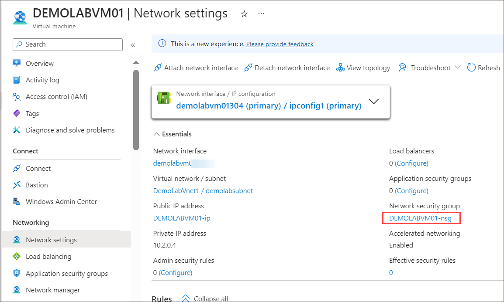
    
    >**Note:** If you are unable to see Network Security Group in Overview, click on **See more**.
 
 2. In the **DEMOLABVM01-nsg** blade, click on the **Inbound security rule (1)** under **Settings**. On **DEMOLABVM01-nsg-Inbound security rules** blade, click **+ Add (2)**.

    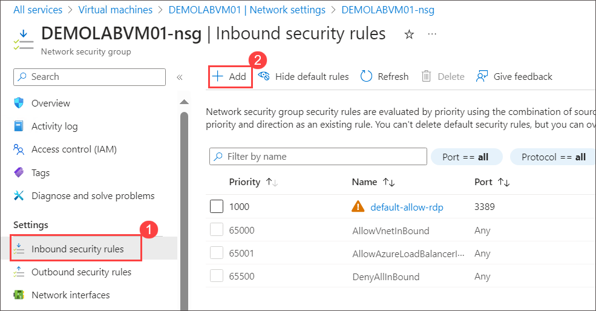
 
 3. On the **Add inbound security rule** blade:
 
     - Set **Destination port ranges** as **80 (1)**
 
     - In the **Name** field type <copy>**demolabrule (2)**</copy>
 
     - Click **Add (3)**

       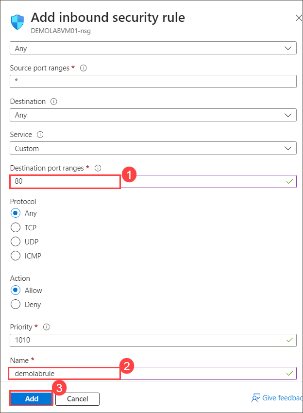

### Prepare Azure Cloud Shell

You will now prepare Azure Cloud Shell for its first use by mounting a storage account.

 4. In the **Home** of Azure Portal, click on **Virtual machines**
 
 5. On the **Virtual machines** blade, click on **DEMOLABVM01** virtual machine.

     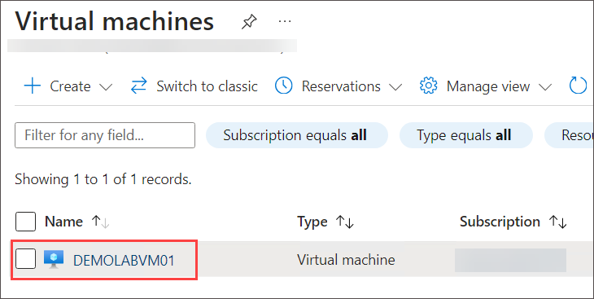
 
 6. In the **DEMOLABVM01** virtual machine pane, verify that the status of the VM is **Running (1)**. If the status is still creating, wait until the status changes to Running before completing the remaining steps.  In the **blue ribbon** at the top, click on the **Cloud Shell icon (2)**.

    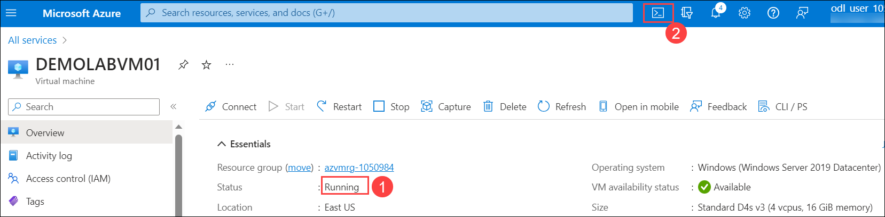

    > **Note:** If you are not able to find the Cloud Shell icon, from the top navigation bar, click on the More portal tools icon  and select Cloud shell

7. On the **Welcome to Azure Cloud Shell** blade, click on **PowerShell**

   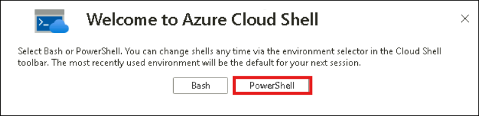

8. On the **Getting Started** panel, select **Mount storage account (1)** then select the **Storage account subscription (2)** and click **Apply (3)**

    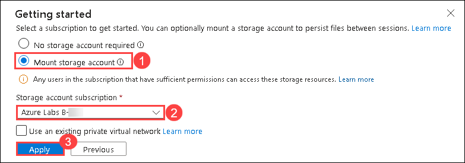

    > **Note:** Azure Cloud Shell requires a file share to be mounted to your resource group to persist files used during the session. After initial use, this fileshare will be available for future Cloud shell session.

9. On the **Mount Storage Account** panel, Select **I want to create a storage account (1)** and click **Next (2)**

     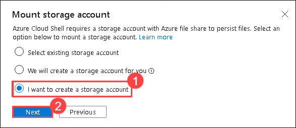

10. On the **Create storage account** panel, follow the steps below:
   
    - Under **Subsciption (1)**, Select available subscription
   
    - Under **Resource group** ,Select the one with name **azvmrg-** **(2)**

    - Under **Region** dropdown, Select **West US** **(3)**

    - Under **Storage account name**, select **Create new** and give the name as **demolabstorage<inject key="Deployment ID" enableCopy="false"/>** **(4)**
    
    - Under **File share**, select **Create new** and type <copy>**demolab**</copy> **(5)**
      
    - Click **Create (6)** 

      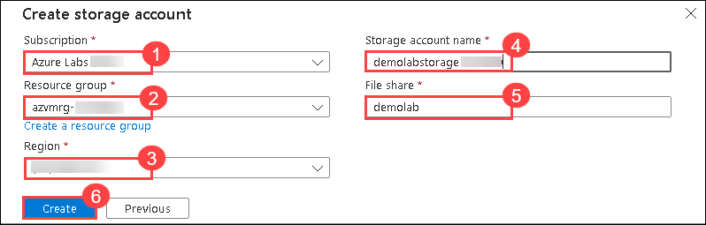

11. Run the following command to check the status of the created VM.

    ```
    Get-AzVM -Name "DEMOLABVM01"
    ```

     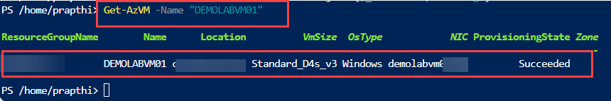    

      >**Note:** After creating the storage account, please minimize the **Azure Cloud Shell window**.

### Connect to the VM

12. Go to **azvmrg-<inject key="Deployment ID" enableCopy="false"/>** Resource group and select **DEMOLABVM01** virtual machine.

13. From the **DEMOLABVM01** overview page copy the **Public IP address** of the virtual machine.

    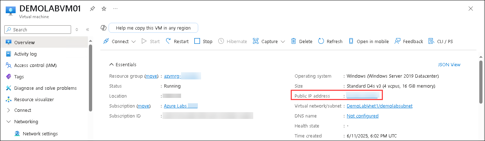

14. On your Jump-VM, click on **start (1)** and search for **Remote desktop (2)**. Then click on **Remote Desktop Connection (3)**.

     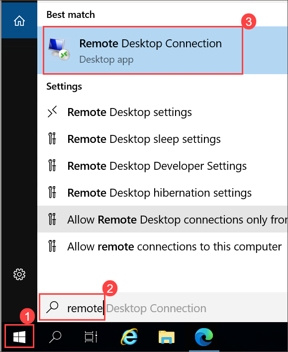

15. On the Remote desktop connection window paste the **Public IP address (1)** of the virtual machine we copied in *Step 12* and click on **Connect (2)**.

     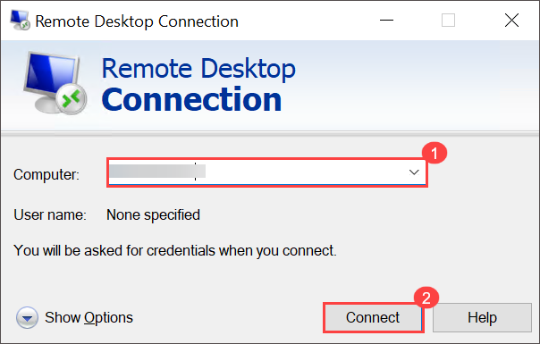

16. Click on **More choices**.

     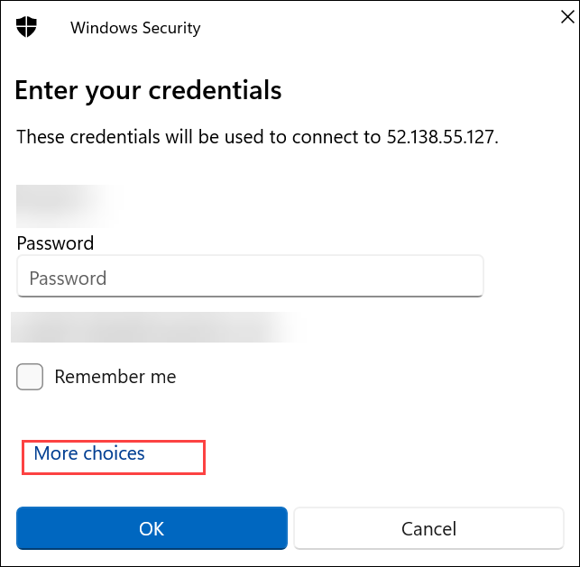

17. Select **Use a different account**.

     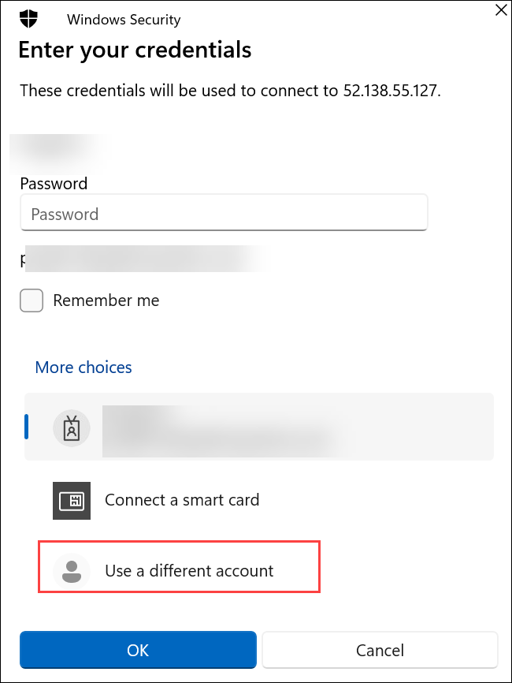

18. Enter the following credentials and click on **OK** to log in to the RDP session.

    - Username: **demouser**
    - Password: **Password.1!!**

19. Click **Yes** on pop-up.

     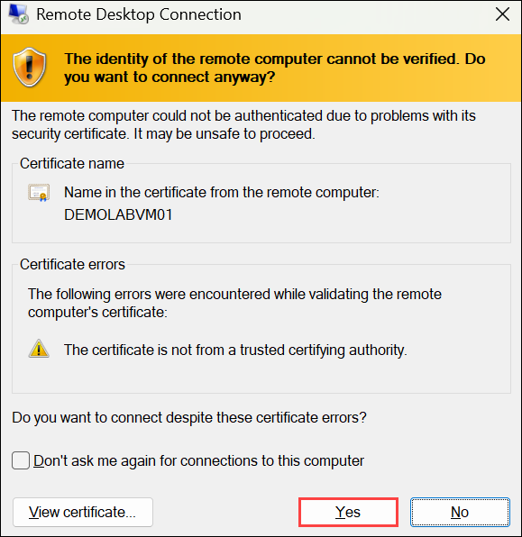

20. Once inside the RDP session, click on **Start** and type **Windows PowerShell (1)** and select **Windows PowerShell (2)** and choose **Run as a administrator (3)**.

    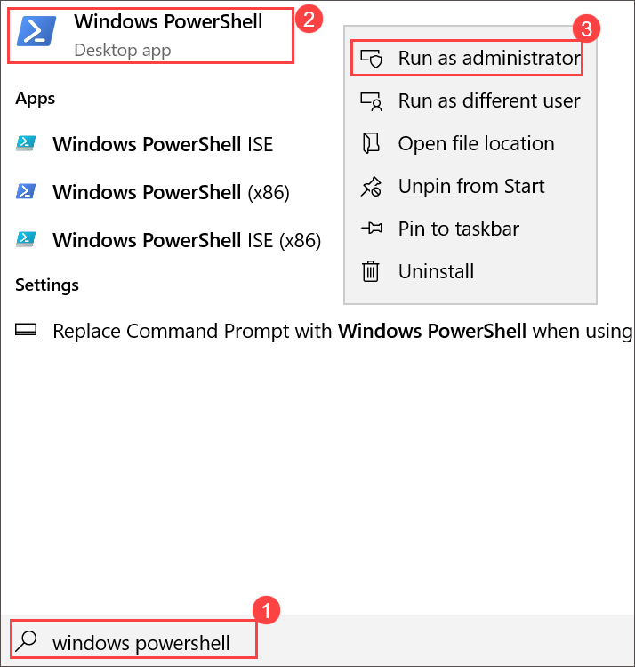

21. Run the following commands in Powershell.

     ```
     Install-WindowsFeature -Name Web-Server
     ```

     > **Note:** You have just invoked a PowerShell command to enable the Web-Server feature on the new VM that you just created. Now you will verify the web server is active and install a simple web page.
    
     > 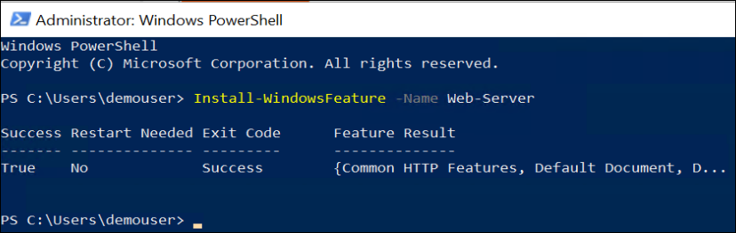

### Verify Internet Information Services

22. After the previous command completes, return to the **Virtual Machine blade** in the overview panel, **copy the Public IP address** as we did in *Step 12*.

23. Open a **new browser window** and **resize** it if necessary in the connected DEMOLABVM01.

24. In the **address bar**, paste the **public IP address** and press **Enter**

25. You should now see the **Windows Server Internet Information Services Welcome Screen**

    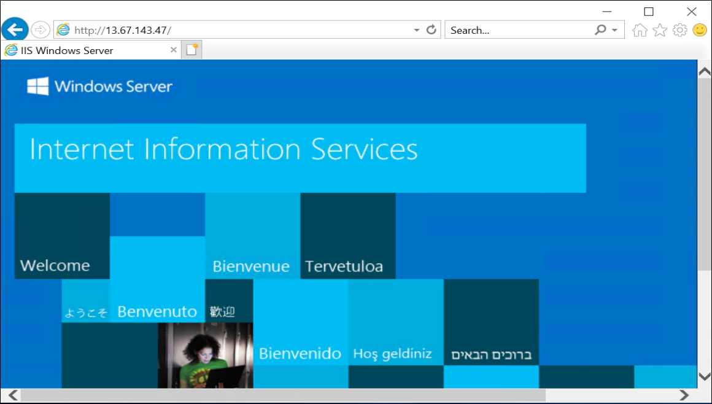

### Load a web page and monitor the VM

26. Run the following commands in Powershell.

     ```
     Set-Content -Path "C:\\inetpub\\wwwroot\\Default.htm" -Value "<html><body><h2>Congratulations!</h2><p>You have just created a basic website on $($env:computername).</p></body></html>"
     ```

27. After the script completes, return to the **IIS Welcome screen browser tab** and **refresh the screen**

     >**Note:** In case if you are unable to see the **Congratulations** message, open a new tab and paste the **public IP address** and press **Enter**.

28. You should now see a **Congratulations** message that includes your VM name **DEMOLABVM01**

    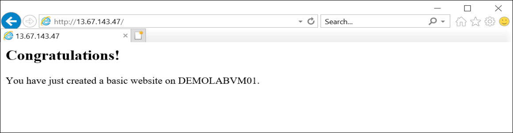

<validation step="ac29a4b2-b781-47ed-b706-536023ac7b14" />

> **Congratulations** on completing the task! Now, it's time to validate it. Here are the steps:
> - If you receive a success message, you can proceed to the next task.
> - If not, carefully read the error message and retry the step, following the instructions in the lab guide. 
> - If you need any assistance, please contact us at cloudlabs-support@spektrasystems.com. We are available 24/7 to help you out.
    
## Summary

In this hands-on lab, you accessed your Azure VM and set up IIS for web hosting.

Now, click on Next from the lower right corner to move on to the next page.

   
