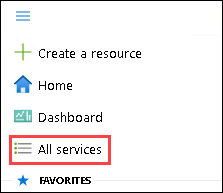
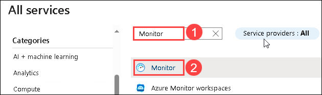
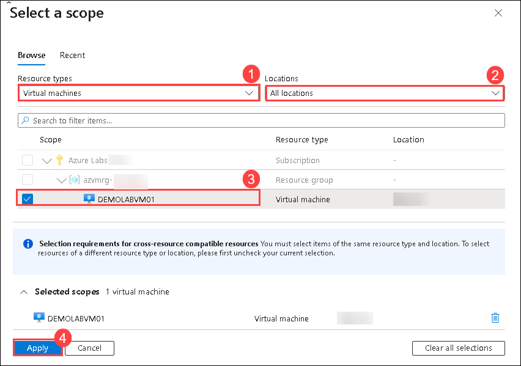
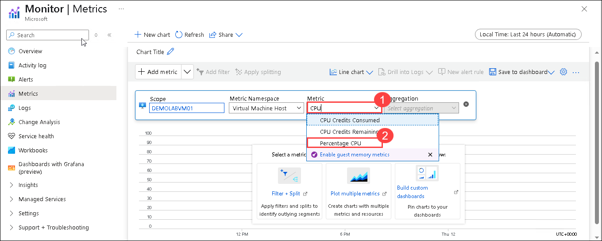
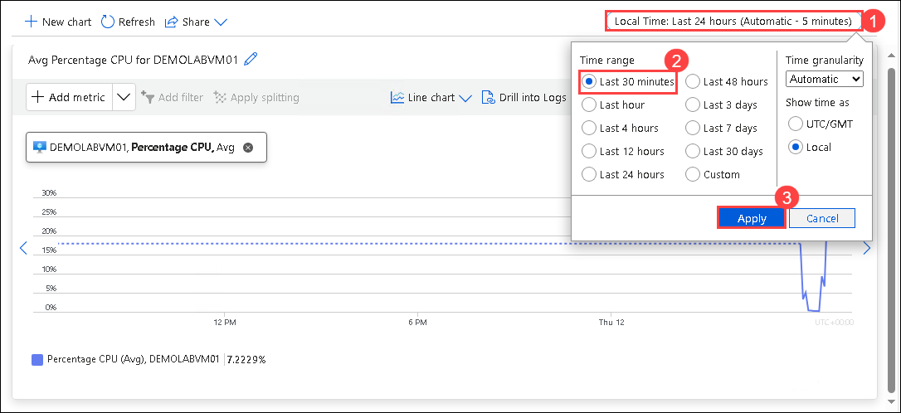

# Lab 07 - Azure Monitor

### Estimated Duration: 35 Minutes

## Overview
 
Now that you have created a Windows Server and configured a website on the server, you will return to the Azure portal and visit the Monitor Center. Azure Monitor provides sophisticated tools for collecting and analyzing telemetry that allow you to maximize the performance and availability of your cloud and on-premises virtual machines, resources, and applications.

### Azure Monitor

1. Return to the **Azure Portal tab** in your browser.

2. Click on the **Hamburger menu (1)** icon at the upper left corner of the Azure portal and click on **All services (2)**.

   

3. On the **All services** blade, search for **Monitor (1)** and select **Monitor (2)**.

   

3. On the **Monitor | Overview** blade, click on **Metrics** in the left menu.

   

4. Click inside the box with **+ Select a scope**.

   

5. In the Select a scope pane, follow the steps below:
 
   - Select **Virtual machines (1)** under Resource types.

   - Select **All locations (2)** under Locations.
    
   - Select <copy>**DEMOLABVM01 (3)** </copy> virtual machine from the results.

   - Click **Apply (4)**

      

6. In the **Metric** box, type <copy>**CPU (1)**</copy> and from drop-down select **Percentage CPU (2)**

    

7. Click on **Last 24 hours (Automatic) (1)** in the right top pane and change the Time range to **Last 30 minutes (2)** and click **Apply (3)**

    

8. Note how the CPU utilization changed during the past 30 minutes. You can now close the Monitor - Metrics blade

    

## Summary

In this hands-on lab, you monitored Azure resources and applications for performance and security insights.

Now, click on Next from the lower right corner to move on to the next page.

