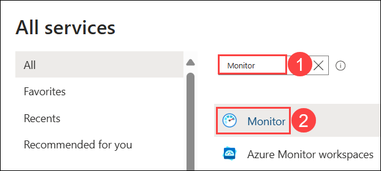
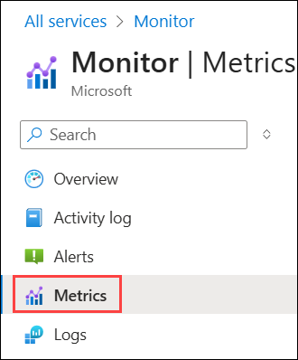
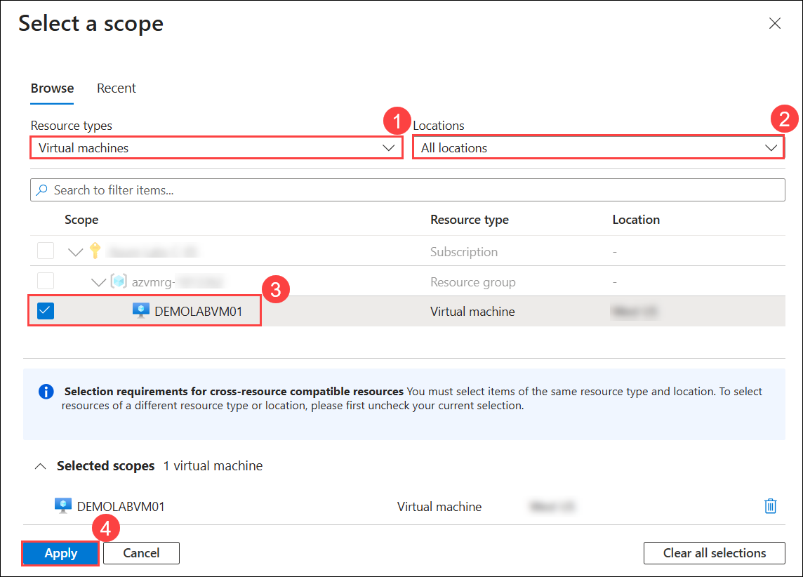
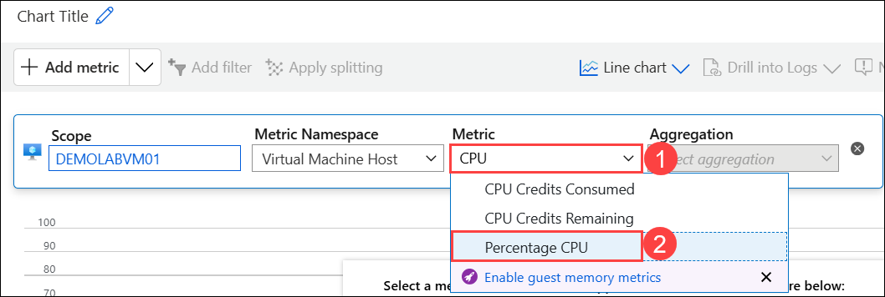
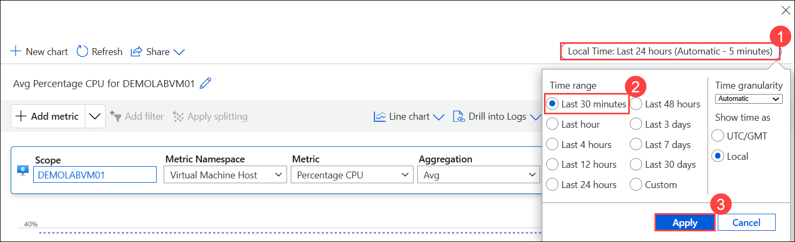
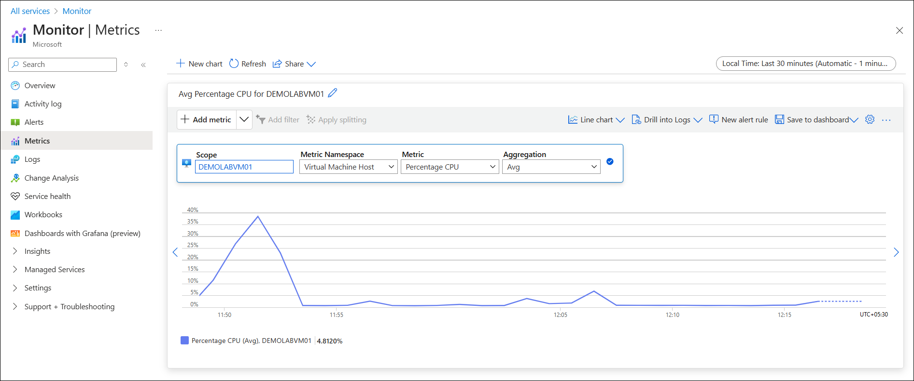

# Lab 07 - Azure Monitor

### Estimated Duration: 35 Minutes

## Overview
 
In this lab, you will configure Azure Monitor to track the performance of a Windows Server virtual machine running in Azure. By collecting and analyzing telemetry data, you will gain insights into system health and resource utilization. Specifically, you will monitor the VM’s CPU usage, adjust the time range to view recent activity, and interpret the results to identify performance trends.

## Lab Objectives

You will be able to complete the following tasks:

- Task 1: Monitor VM CPU Performance with Azure Monitor

## Task 1: Monitor VM CPU Performance with Azure Monitor

In this task, you will use Azure Monitor to track CPU utilization for a specific virtual machine, adjust the time range to the last 30 minutes, and review performance trends to identify potential issues proactively.

1. Navigate back to **Azure Portal** in your **Lab VM**.

   

1. Click on the **Hamburger menu (1)** icon at the upper left corner of the **Azure portal** and click on **All services (2)**.

   

1. On the **All services** blade, search for **Monitor (1)** and select **Monitor (2)** from the results.

   

1. From the left navigation pane, select **Metrics**.

   

1. In the **Select a scope** pane, follow the steps below:
 
   - **Resource types:** Select **Virtual machines (1)** from the drop-down.

   - **Locations:** Select **All locations (2)**.
    
   - **Scope:** Select **DEMOLABVM01 (3)** virtual machine.

   - Click **Apply (4)**.

      

1. In the **Metric** box, type **CPU (1)** and select **Percentage CPU (2)** from the drop-down menu.

    

1. In the top-right pane, click **Local Time: Last 24 hours (Automatic - 5 minutes) (1)**, change the time range to **Last 30 minutes (2)**, and click **Apply (3)**.

    

1. Note how the CPU utilization changed during the past 30 minutes. You can now close the Monitor - Metrics blade.

    

## Summary

In this lab, you have completed the following:

- Monitored VM CPU performance using Azure Monitor.

## You have successfully completed the Hands-on lab.