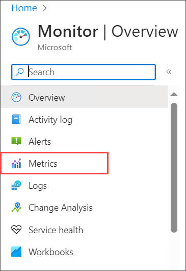
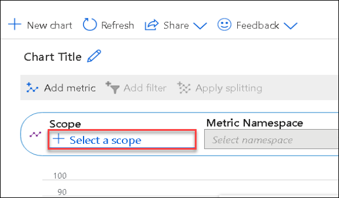
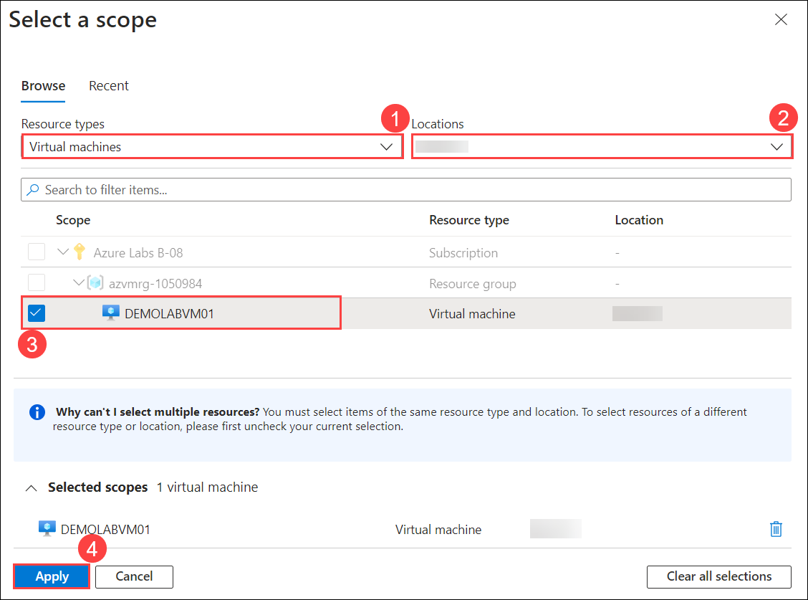
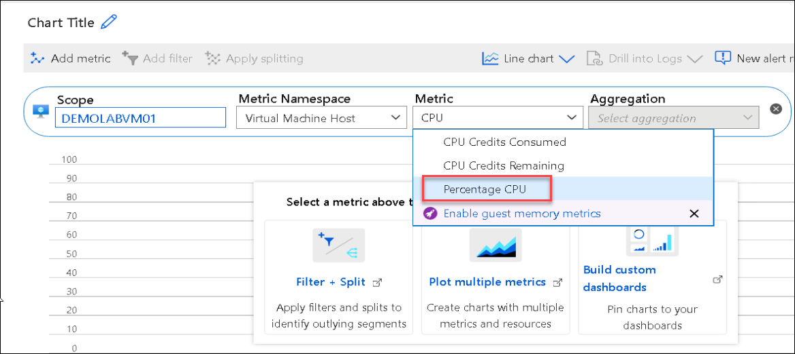
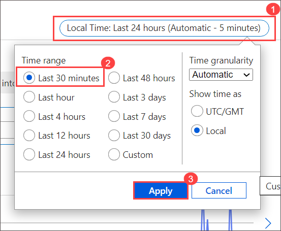
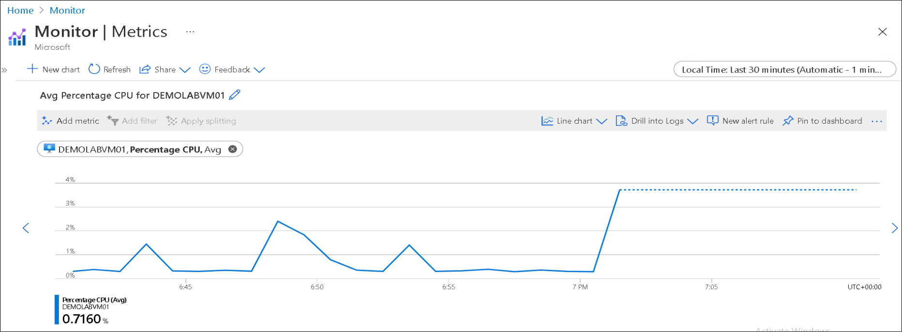

## **Scenario 7 - Azure Monitor**
Now that you have created a Windows Server and configured a website on the server, you will return to the Azure portal and visit the Monitor Center. Azure Monitor provides sophisticated tools for collecting and analyzing telemetry that allow you to maximize the performance and availability of your cloud and on-premises virtual machines, resources, and applications.

1. Return to the **Azure Portal tab** in your browser and **close the Azure Cloud Shell window**

2. Click on the   menu icon at the upper left corner of the Azure portal and click on **Monitor**

3. On the **Monitor - Overview** blade, click on **Metrics** in the left menu.

   

4. Click inside the box with **+Select a scope**.

   

5. In Select a scope pane, follow the below steps:
 
   - Click on the **Resource types** drop down and change the selection to be only **Virtual Machines** under **Multi-resource compatible (preview)**

   - Click **All locations** and change the selection to be only the region you are using to perform the lab.
    
   - Select <copy>**DEMOLABVM01** </copy> virtual machine from the results.

   - Click **Apply**

    

6. In the **Metric** box, type <copy>**CPU**</copy> and select **Percentage CPU**

   

7. On the **Monitor - Metrics** blade, click on **Last 24 hours (Automatic)** in the top pane and change the Time range to **Last 30 minutes** and click **Apply**

   

8. Note how the CPU utilization changed during the past 30 minutes. You can now close the Monitor - Metrics blade

   

 >This completes the lab.

