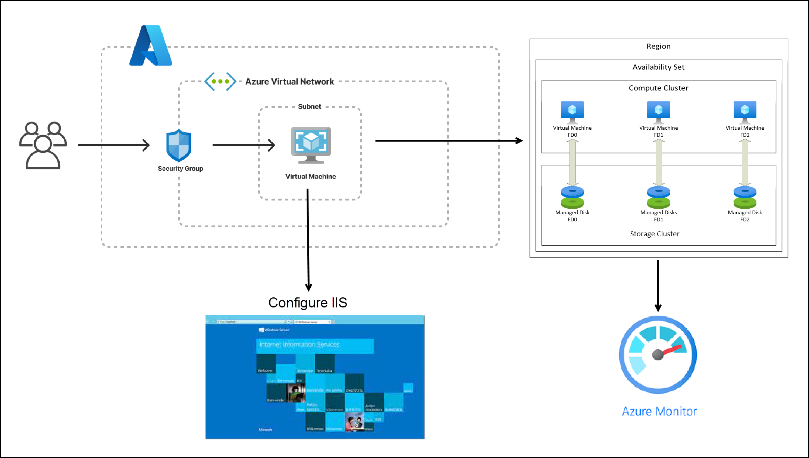
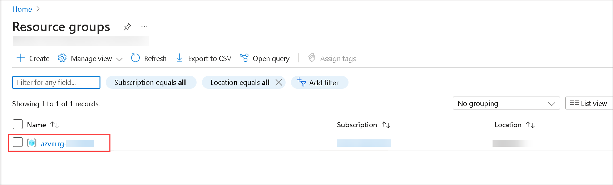

# Azure Virtual Machine and Compute

### Overall Estimated Duration: 240 minutes

## Overview

Microsoft Azure is one of the leading enterprise cloud platforms. Azure launched in 2010 and has quickly matured as many new services are continually being added. One of the first and most popular services offered in Azure is **Virtual Machines**, an IaaS solution.

This lab will walk you through the steps to create and deploy a Windows Server 2019 Datacenter virtual machine. We will also configure a backup of the virtual machine that will be user-accessible for recovery. You will also be able to load a web application in the VM you have just provisioned in Azure.

The lab will include the following exercises:

1. **Building a Virtual Network:** Create a secure and isolated network in Azure to connect and manage cloud resources.

1. **Create an Azure Availability Set:** Configure multiple virtual machines in Azure to ensure high availability and resilience against failures.

1. **Deploy a Virtual Machine:** Provision a virtual machine in Azure with selected operating system and configuration settings.

1. **Backup and Recovery:** Set up backup policies and procedures to protect data and applications in Azure, ensuring business continuity.

1. **Virtual Machine Data Disk and Overview:** Manage and utilize data disks for Azure virtual machines to enhance storage capacity and performance.

1. **Connect to the VM and Install IIS:** Access an Azure virtual machine and install Internet Information Services (IIS) for hosting web applications.

1. **Azure Monitor:** Monitor and analyze the performance, health, and usage of Azure resources and applications for optimization and troubleshooting.

## Objective

Participants in these labs will gain practical experience in Azure cloud infrastructure management. 

- Build secure virtual networks, ensure high availability with Azure Availability Sets, and deploy customized virtual machines supporting various workloads.
- Hands-on activities include implementing robust backup strategies, managing data disks for optimized storage performance, and connecting to VMs to install and configure IIS for web hosting.
- Monitor and optimize Azure resources using Azure Monitor, enhancing performance, availability, and security through metrics, alerts, and diagnostic tools.
- These labs collectively equip participants with essential skills in network configuration, VM deployment, data management, application hosting, and cloud monitoring within the Azure ecosystem.

## Prerequisites 

Participants should have: Basic knowledge and understanding of the following

- **Azure Subscription:** Access to an active Azure subscription to create and manage resources.
- **Fundamental Azure Knowledge:** Understanding of Azure basics like resource groups, Azure portal navigation, and basic networking concepts.
- **Virtualization Awareness:** Familiarity with virtual machines (VMs), including deployment, management, and basic troubleshooting.
- **Operating System Proficiency:** Competence in using Windows and Linux operating systems for VM configuration and management.
- **Networking Basics:** Knowledge of networking principles such as TCP/IP, DNS, and firewall rules, which are essential for configuring virtual networks and connectivity in Azure.

## Architecture

The architecture for this lab involves several key components:

- **Virtual Network:** A logically isolated network in Azure that enables Azure resources to securely communicate with each other, the internet, and on-premises networks.
- **Azure Availability Set:** Ensures high availability of applications by grouping virtual machines (VMs) within a datacenter across fault domains and update domains.
- **Virtual Machine:** Provides computing resources in Azure, allowing users to deploy and manage Windows or Linux VMs in the cloud.
- **Backup and Recovery (Recovery Services Vault):** Provides backup, disaster recovery, and data retention policies for Azure VMs and on-premises computers through centralized management.
- **Virtual Machine Data Disk:** Additional storage attached to Azure VMs for data persistence, offering flexibility in storage type (Standard HDD, Standard SSD, Premium SSD).
- **Connect to the VM and Install IIS:** Access Azure VMs via Remote Desktop Protocol (RDP) or Secure Shell (SSH) and install Internet Information Services (IIS) for hosting web applications.
- **Azure Monitor:** Comprehensive monitoring service that collects and analyzes telemetry data from Azure resources, providing insights into performance, health, and diagnostics.

## Architecture Diagram

## **Getting Started**

1. In the virtual machine (VM) on the left, click on the Azure portal desktop icon or navigate to https://portal.azure.com/ from **Microsoft edge**.

    

1. On the **Sign in to Microsoft Azure** window, you will see the login screen, enter the following username **<inject key="AzureAdUserEmail" />** and Password **<inject key="AzureAdUserPassword" />** and Click on **Sign in**

1. If you see the pop-up  **Stay Signed in?**, click **No**

1. If you see the pop-up **You have free Azure Advisor recommendations!** , close the window to continue the lab. 

1. If a **Welcome to Microsoft Azure** popup window appears, click **Maybe Later** to skip the tour.

1. Now you can see Azure Portal Dashboard, click on **Resource groups** from the Navigate panel to see the resource groups.

    

   >**Note**: Ensure to perform all the lab steps in the RG named **azvmrg-<inject key="Deployment ID" enableCopy="false"/>**

1. Click the Cancel **X** button located at the top right corner of the page to exit from the resource group blade."

These labs collectively introduce participants to key aspects of Azure infrastructure and operations. They begin with establishing foundational elements like virtual networks and availability sets to ensure scalability and resilience. Participants then deploy virtual machines tailored to specific requirements, learn to safeguard their data and configurations through backup and recovery solutions, and optimize performance with managed data disks. Connecting to these virtual machines allows for hands-on practice in setting up web hosting environments with IIS. Finally, participants gain insights into monitoring Azure resources and applications using Azure Monitor, enabling proactive management and troubleshooting to ensure efficient operation in cloud environments.

### Happy Learning!!

