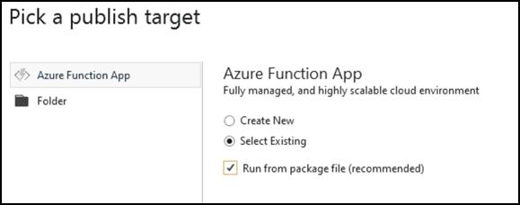

## Publish the Azure Function

Now that the function code is written to modernize our MVC Controllers, we can publish it to Azure to run as a serverless function.

1.	Right-click the **functions-csharp-todo-auth** project in the solution explorer . 

2.	Click the **Publish** option.

3.	Choose to **Select Existing** function, and click to **Run from package file** as recommended

      
   
4.	Click the **Create Profile** and then open the **modernize-xxxx** folder and select the function listed.

5.	Click **Ok**.

6.	After the publish profile has finished generating, click the **Publish** button to publish the function code to the cloud

You can watch the status in the Output window at the bottom of Visual Studio as your app is built, packaged, and deployed to the cloud. Once publishing has completed you should see a message in the output window like:

```
     ======= Publish: 1 succeeeded, 0 failed, 0 skipped =======
```
