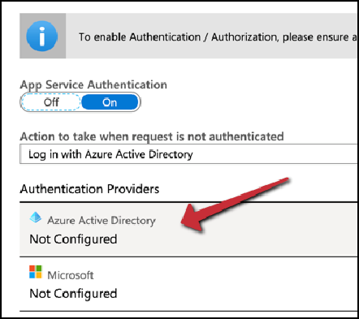
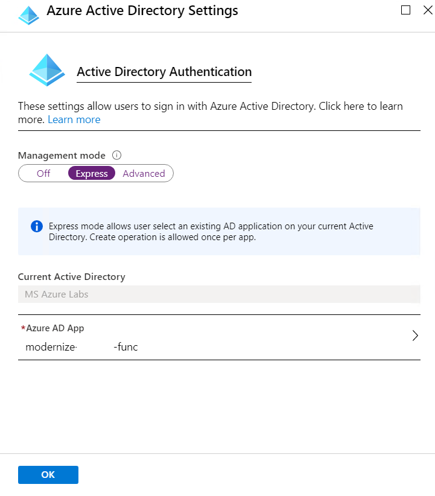
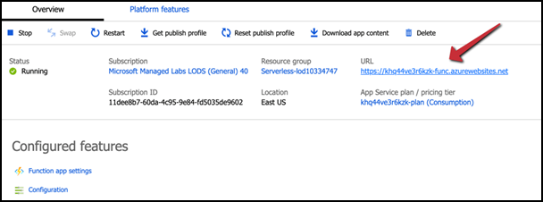

## Adding authentication to the function app

An important aspect for many application is authentication and security. While we have published this app to the cloud, we still want to secure it behind a login screen so that each user only sees their own todo list items. Azure Functions has a feature called "Authentication" that enables you to handle and enforce authentication outside of your function code. Let's finish configuring those settings now.

1. Navigate to the **Azure Portal** 
2. Click on the **Resource group** and select **modernize-XXXX**.
3. Select the **Function App** namely **modernize-xxxx-func** from the list of available resources.
4. Select the **Platform Features** on top of the **Function App** blade and then click on **Authentication/ Authorization**.
5. Enable **ON** in **App Service Authentication** and verify the **Allowed External Redirect URLS's**.
6. Select **Azure Active Directory** under **Aunthentication Providers**.

   
    
7. Choose **Express** to easily create an AAD app and verify the **Azure Active Directory Settings** 
8. Click **Ok** and then **Save** to enable the *Function App with Azure AD Authentication*

    
   
10. Close the Authentication configuration screen
11. Click the **Overview** on top of the **Function App** blade and click **URL** link to attempt to access your function app information.

     
    
 > Copy and paste the Function URL somewhere handy like Notepad in the virtual machine. You will need to know the part of the function before .azurewebsites.net for later in the lab and use it lots.
 
 > (If you get any errors you may need to wait 30 seconds for the AAD application you created to fully register). If everything worked right it should require you log in with your Azure account before loading and rendering a "Your function is running screen."
 
 >Now your function app is protected behind authentication, and our app can use that authentication to surface user-specific data
 
 
