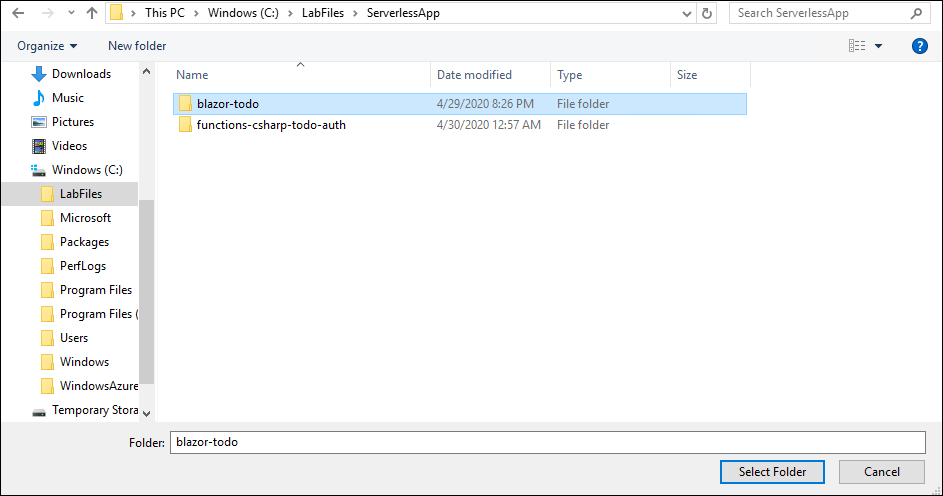
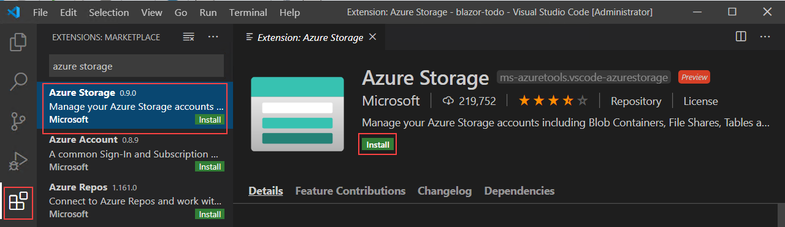
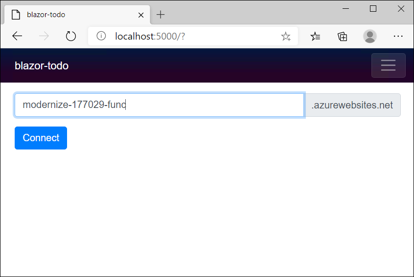
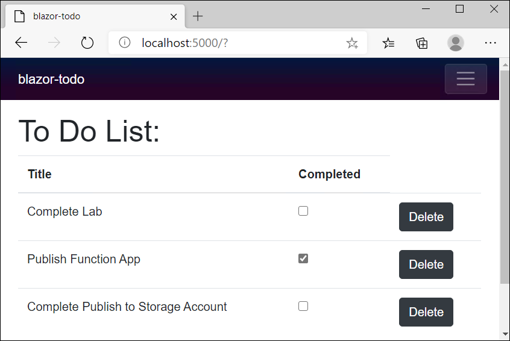
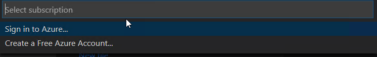
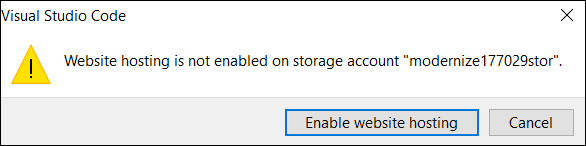
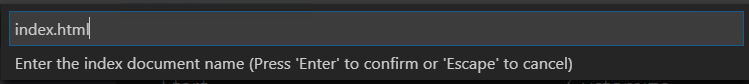
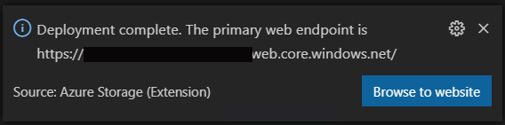

## Building a .NET Core Blazor website
Now that the controllers have been modernized with Azure Functions, Azure CosmosDB, and Authentication, we need to create a website to view and manage our todo items.

```
Depending on time, you can skip straight to the Test on a live site section to test right away.
```

Unlike a traditional website that requires running on a webserver 24/7, Blazor enables you to write static single page applications that can dynamically render on the client browser. These websites can be deployed as static files to a storage account + CDN (Content Delivery Network), and accessible over the internet without needing a web server. This can provide incredibly elastic scale at minimal cost.

1. Close **Visual Studio 2019** if it is still open.

2. On the desktop, double-click to open **Visual Studio Code**.

3. Select **File** and then **Open** Folder.

4. Navigate to **Windows(C)** > **LabFiles** > **ServerlessApp** > **blazer-todo** and click **Select Folder**.               
   
   
   
      > This will open a blazor app that will act as the website.
      
5. Select the **Extensions** icon from the left-hand menu, enter "**Azure Storage**" into the search box, select the **Azure Storage**, and in the Extension: Azure Storage window, and then select Install.

   
      
> Feel free to click around other files in the project to try to get a feel for how a Blazor file is made up and what it is doing (there are only a few files in the project)

### Running the blazor app locally

1. In **Visual Studio Code**, select on the top menu Terminal and then select **New Terminal**. 

2. In the terminal window that appears at the bottom, the console will not come up automatically continue typing "**dotnet run**" and press **Enter**.

     > This will build and start running your blazar app locally on your virtual machine
     
3. After a few moments you should see some URLs listed that you can test like **http://localhost:5000**. 

4. Open a web browser on the virtual machine and go to **http://<span></span>localhost:5000** and enter the name of the **Function App** and then **click Connect**.

   

5. Try to perform the actions available in the blazor app like **Add**, **Remove**, **Complete** and **Delete** items.

    ```Try to perform actions like:
    1. Add Items - Complete Lab, Publish Function App, Complete Publish to Storage Account
    2. Completed Item - Check in Publish Function App
    3. Delete Item - Delete Complete Publish to Storage Account

    ```
    
   

6. Now goto Visual Studio Code and Press **Ctrl+C** to shutdown the application.
     
### Building the Publish Package and Using the Blazor webiste

1. In the terminal window, type "**dotnet publish -c Release**" and press **Enter**.

2. Wait for the Build to succeed and then navigate to **bin**> **Release** > **publish** > **blazor-todo\dist**.

   

3. Right click the **blazor-todo\dist** folder and select **Deploy to Static Website**.

4. Select **Sign in to Azure** and login using you Azure credentials from the **Environment Details** tab or using the credentials details from the **AzureCreds** file on the Desktop.

   

5. Close the browser and open the **Visual Studio Code**, then select the existing **Storage Account** from the menu pane.

   

6. Select **Enable website hosting** from the pop-up saying *Website hosting is not enabled on the storage account* ***modernize-xxxxstor***.

   

7. In the menu pane select the **Index.html** and press enter and again select **Index.html** as error document path and press **Enter**.

   

> This will deploy the package.

8. Click on **Browse to website** which will redirect you to browser.
   
    
   
> Use Microsoft Edge Browser to browse to the website! 

> Note: Website hosting may sometimes take an expected time of 10-15 minutes .

9. You can perform every actions in this website that you have tried in the blazor app locally.

 > Behind the scenes the blazor site is making authenticated calls to your function to interact and store these items in CosmosDB. After refreshing the site and ensuring you log into the same account, you should see the same items preserved.
