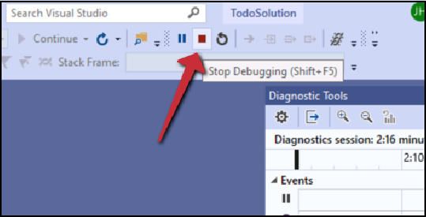

## Investigating the Legacy Todo App
Let's start by looking at the ASP.NET MVC app written in .NET Framework. It's a simple todo app.
1. Open the **LegeacyApp** folder on the desktop
2. Now open the **app** folder and **double-click** to open **TodoSolution.sln**
3. When Visual Studio opens, it will likely ask you to sign into an account. Select to **"Sign out"** of any existing accounts and use your Azure username and password to sign in.

      - **username :**<inject key="AzureAdUserEmail" />
      - **password :**<inject key="AzureAdUserPassword" />
      
4. Select to **Close** the profile window which should open you to the solutions folder
5. Click the **IIS Express** run / debug button on the top tool bar to start the project

      

>After a few moments you should see a web browser open to the legacy app. Note the style of the app. You can create, edit, and delete items on the todo list. Like many MVC apps, each gesture loads a new page. For example, click "Delete" for an item, which will load a page for delete, and let you complete the task.

>You can now close the web browser and then stop the debugging session.
       
### Evaluating code and logic to modernize

Before starting with our serverless app, let's evaluate some of the key places that code lives in this app. An MVC app is made up of 3 pieces: Models, Views, and Controllers. Models represent the data models that are needed. Views are the pages and views that are rendered. Controllers are the operations that connect the Models with the Views and underlying data store.

   1.	Expand the **Controllers** folder in the project Solution Explorer
   2.	Double click to open the **TodoApiController.cs**
