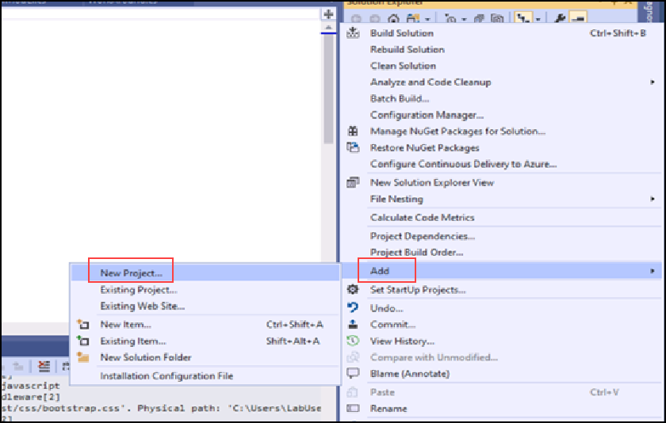

## Creating Serverless Functions
Let's start by moving the business logic from this legacy app to serverless functions. As stated above, the logic from the Controller methods will become Azure Functions (Get, Update, and Delete todo item APIs).

Perform the below steps to add an Azure Function project to this solution:

1.	Right click the Solution **'TodoSolution'** in the Solution Explorer
2.	Select **Add** and then click **New Project**

    

3.	Scroll or search for **Azure Functions** and click **Next**
4.	Give the project a name or leave as default
5.	Click **Create**
6.	Since we will be creating HTTP APIs like the legacy controller, select the **Http Trigger** template, change the **Access Rights** to anonymous, and click **Create**
