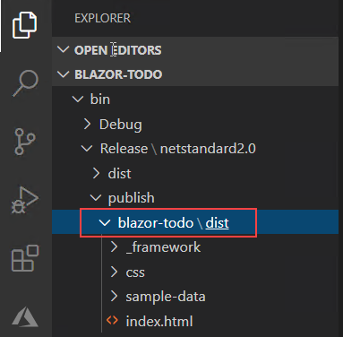

## Todo API Functions

1. In Visual Studio, click **File** then select **Open** and then click **Project/Solution**

    

2. Select the **Desktop**, and navigate to ServerlessApp
3. Then Select app and click on **functions-csharp-todo-auth.sln** and then click **Open**

  ```
  This will open a function app that extends our template from the earlier step with todo list logic.
 ```
    
4. In the Solution Explorer, double-click to open **ToDoFunctions.cs**
   
 > Notice we have different HTTP triggered functions here that map to the same methods we saw in the Controller earlier. 
  There are operatios to get, delete, and update todo items.


5. Click the debug / run button on the top toolbar to run this function locally

You should notice the project will build and then start up the Azure Functions runtime locally in Visual Studio. You can use this for debugging and breakpoints of any function project.

   ```
   Select to Allow Access to any firewall prompts that may appear
  ```
Notice the available functions are listed for testing. This project is already hooked up to a live CosmosDB account. Leave the function project running and open a web browser on the virtual machine to test the GetTodos function at http://localhost:7071/api/todo. You should see some test todo items returned.
 
 >After testing the function, you can close the web browser, close the Azure Functions runtime, and stop the debug session.
